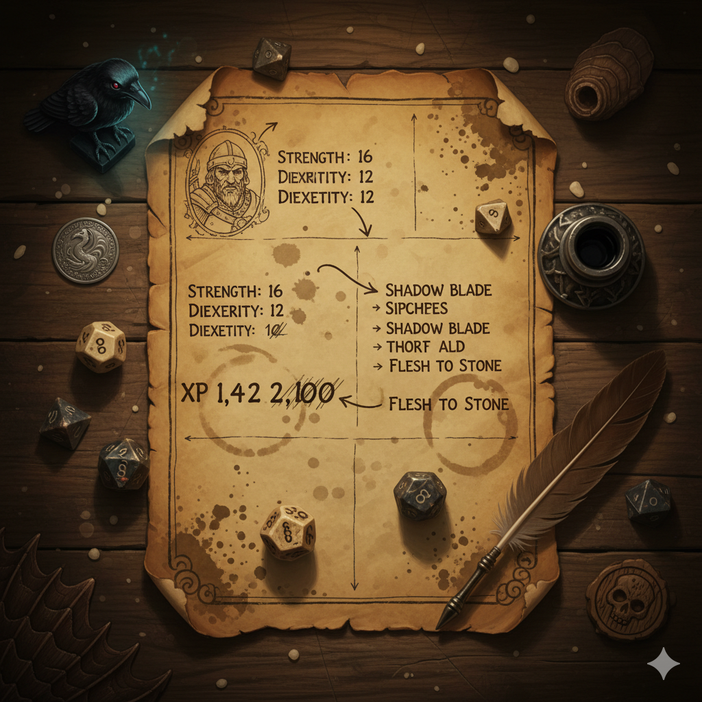
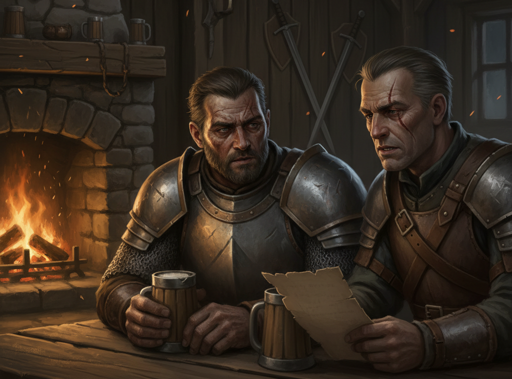
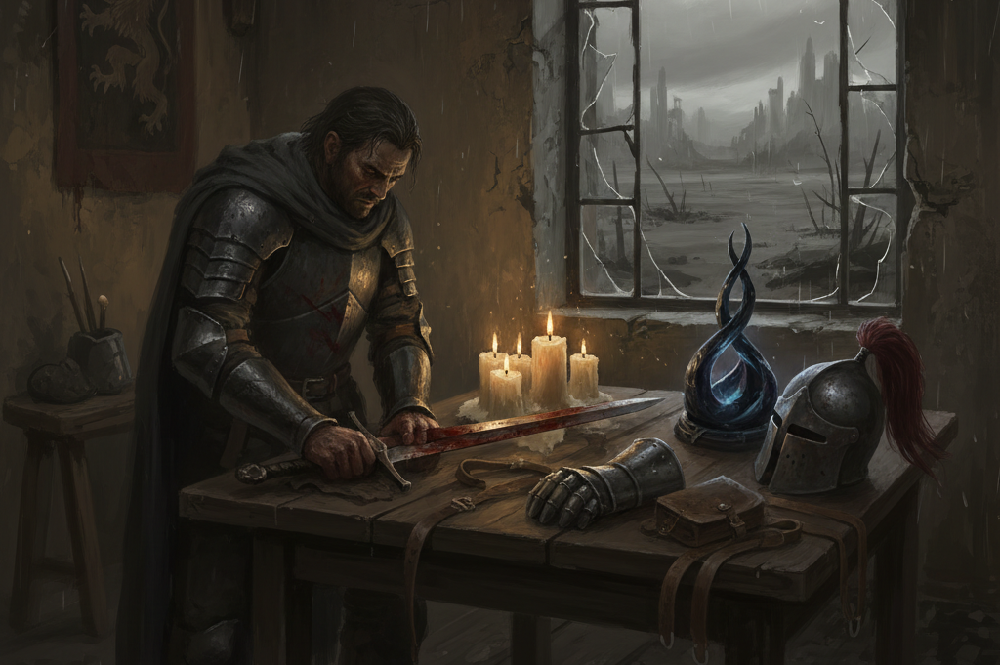
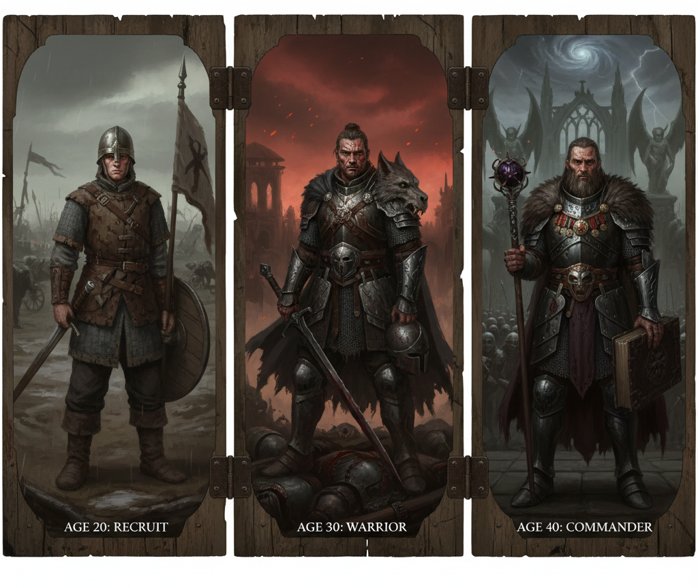
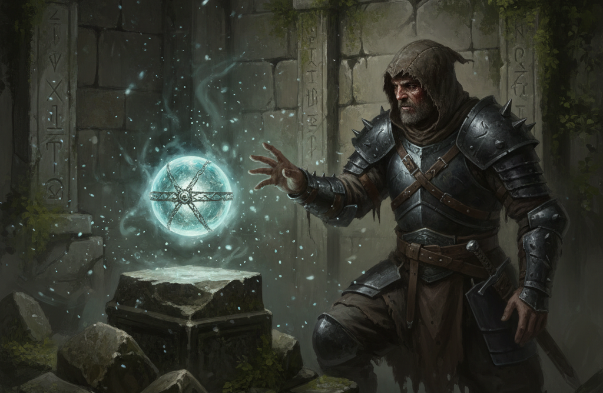
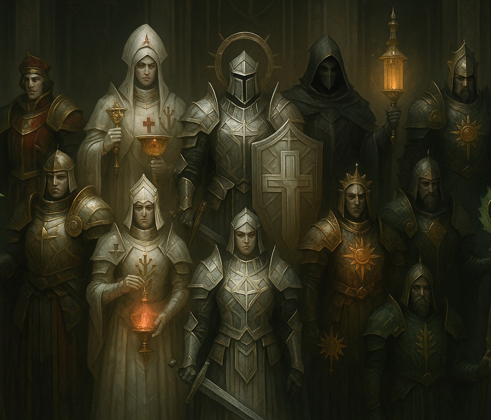
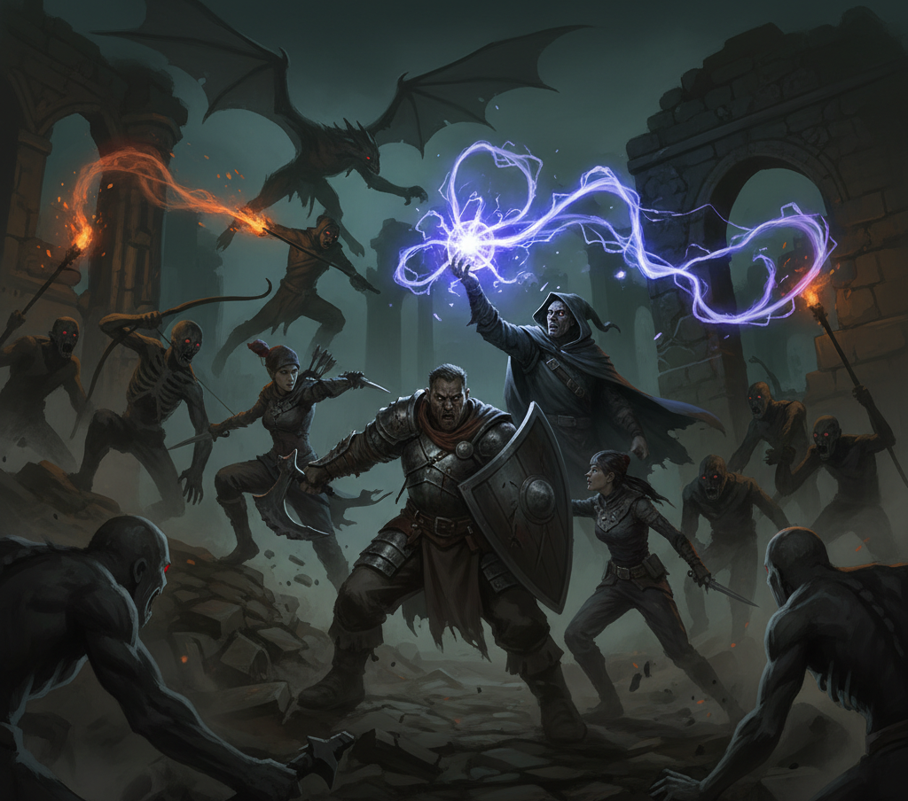

ARX LUMINA (The Real-Life Game)
========================================================
**Quick Reference: Character Creation, 2nd Edition**

*Authors: Miker, Claude Sonnet 4.5*

(Version 1.0.0, 10.ß1.2026)

# DISCLAIMER
## MIT License
Copyright (c) 2026

Permission is hereby granted, free of charge, to any person obtaining a copy
of this software and associated documentation files (the "Software"), to deal
in the Software without restriction, including without limitation the rights
to use, copy, modify, merge, publish, distribute, sublicense, and/or sell
copies of the Software, and to permit persons to whom the Software is
furnished to do so, subject to the following conditions:

The above copyright notice and this permission notice shall be included in all
copies or substantial portions of the Software.

THE SOFTWARE IS PROVIDED "AS IS", WITHOUT WARRANTY OF ANY KIND, EXPRESS OR
IMPLIED, INCLUDING BUT NOT LIMITED TO THE WARRANTIES OF MERCHANTABILITY,
FITNESS FOR A PARTICULAR PURPOSE AND NONINFRINGEMENT. IN NO EVENT SHALL THE
AUTHORS OR COPYRIGHT HOLDERS BE LIABLE FOR ANY CLAIM, DAMAGES OR OTHER
LIABILITY, WHETHER IN AN ACTION OF CONTRACT, TORT OR OTHERWISE, ARISING FROM,
OUT OF OR IN CONNECTION WITH THE SOFTWARE OR THE USE OR OTHER DEALINGS IN THE
SOFTWARE.

## ILLUSTRATIONS
All images created by Google Nano Banana 2.5 Flash via Google AI Studio. Prompts generated by Claude Sonnet 4.5.

# TABLE OF CONTENTS
1. Welcome
2. Fate Core Math
3. Character Backstory
4. Recruitment
5. Military Duty Cycle
6. Adventuring
7. Apendix

# 1. WELCOME
This is a quick reference for creating arx lumina characters. Here you will find tables for setting up the characters backstory and progression. 

The rules are based on the Fate Core Rulebook (https://fate-srd.com/fate-core). 

The quick reference tables are inspired by the following RPG resources:

- "Backgrounds & Details Kit V2", Emead Games
- "GURPS Light 4th Ed", Steve Jackson Games
- "Traveller Core Rulebook", Marc Miller

Ideas from those resources have been considered while creating the tables for the arx lumina setting.

The quick reference does not provide any suggestions on how to gather real life experience points (further on rl-xps).

# 2. FATE CORE MATH

Fate Core is based on the "Fate Roll". Roll 4 D6 and add the results as follows:

- [1 or 2]: -1
- [3 or 4]: 0
- [5 or 6]: +1

This yields the following probability distribution for the Fate Roll:

| Result | Odd of rolling | Odd of rolling this or higher |
|--------|----------------|-------------------------------|
| -4 | 1.23% | 100% |
| -3 | 4.94% | 98.77% |
| -2 | 12.35% | 93.83% |
| -1 | 19.75% | 81.48% |
| 0 | 23.46% | 61.73% |
| +1 | 19.75% | 38.27% |
| +2 | 12.35% | 18.52% |
| +3 | 4.94% | 6.17% |
| +4 | 1.23% | 1.23% |

When it comes to skill tests, Fate Core refers to "The Ladder" for judging the outcome:

| Result | Description |
|--------|-------------|
| +8 | Legendary |
| +7 | Epic |
| +6 | Fantastic |
| +5 | Superb |
| +4 | Great |
| +3 | Good |
| +2 | Fair |
| +1 | Average |
| 0 | Mediocre |
| -1 | Poor |
| -2 | Terrible |

# 3. CHARACTER BACKSTORY

## 3.1 ARX LUMINA SPECIFIC RULES

Consider the following points when playing in the arx lumina setting:

- The character is a "functional". He/she can use artifacts. Characters start with "functional + 1". Every artifact has a "complexity level". When using an artifact actively, roll against that level with you functional skill.
- Advantages replace Character Stunts. Stunts are only provided as artifact effects.

## 3.2 FAMILY

|-| Profession / Situation |
|-|------------------------|
| -4 | Slave |
| -3 | Refugee/Exile|
| -2 | Criminal |
| -1 | Servant |
| 0 | Craftsman/-woman |
| +1 | Farmer |
| +2 | Merchant |
| +3 | Cleargy |
| +4 | Upper Class |

You can spent 5 rl-xps to alter the result by +/-1. Do this only once.
The family situation affects your starting resources and the social status. 

Next roll on the siblings table:

| | Silbings |
|-|----------|
| -4 to -2 | no siblings |
| -1 | one sibling |
| 0 to +1 | two siblings |
| +2 | twin birth (same or opposite sex) |
| +3 to +4 | three siblings |

Finally determine, wether all the characters close relatives are still alive and healthy:

| | Status |
|-|---------------|
| -4 | both parents dead |
| -3 | mother or father dead |
| -2 | sibling died in accident or violent event |
| -1 | sibling injured (disabled) (accident, violence or by birth) |
| 0 to +4 | all alive and kicking |

## 3.3 EARLY LIFE EVENTS

Roll D4 to determine how many. Then roll D20 to decide which or draw a "Early Life Events"-Card (see appendix).

| | Event |
|-|-------|
| 1 | Childhood: almost died / accident |
| 2 | Childhood: childhood disease |
| 3 | Childhood: imaginary friend |
| 4 | Childhood: pet gained |
| 5 | Childhood: witnessed a crime |
| 6 | Childhood: pet lost |
| 7 | Teenager: bullied |
| 8 | Teenager: crime committed / accused |
| 9 | Teenager: made friend for life |
| 10 | Teenager: run away from home|
| 11 | Teenager: natural desaster survivor |
| 12 | Teenager: kicked out of school|
| 13 | Young Adult: became a parent |
| 14 | Young Adult: encountered a monster |
| 15 | Young Adult: made enemy for life |
| 16 | Young Adult: religious experience |
| 17 | Young Adult: left home |
| 18 | Young Adult: travelled abroard |
| 19 | Young Adult: saved a life |
| 20 | Young Adult: inherited an artifact |

## 3.4 ADVANTAGES, DISADVANTAGES, QUIRKS

You can spent rl-xps to get advantages. Choosing disadvantages allows you the get rl-xps.
You can choose up to three advantages and up to three disadvantages.
Choose advantages and disadvantages only once during character backstory creation.

| Advantage | Cost |
|-----------|------|
| Animal Empathy | 3 |
| Danger Sense | 4 |
| Adaptation to Low Light | 4 |
| Language Talent | 3 |
| Fearless | 5 |
| High Pain Treshold | 3 |
| Everybodys Darling | 3 |
| Savoir-faire | 2 |
| Storyteller | 2 |
| Collector of Things | 2 |

| Disadvantage | Cost |
|--------------|------|
| Bloodlust | 1 |
| Code of Honor | 1 |
| Curious | 2 |
| Honest, Cannot Lie | 3 |
| Intollerance (choose) | 1 |
| Jealousy | 2 |
| Obession (choose) | 1 |
| Impulsive | 3 |
| Phobia (choose) | 1 |
| Overconfidence | 2 |

Quirks are minor disadvantages. Get .5 rl-xps for a quirk. Maximum of 2 quirks.

## 3.5 FINALIZE BACKSTORY

Regarding your Early Life Events, Advantages and Disadvantages, choose two Core Aspects for your character:

- Concept (positive aspect): "Who are you?"
- Complication (challenging aspect): "Waht's your problem?"

# 4. RECRUITMENT

## 4.1 ARX LUMINA SPECIFIC RULES

Consider the following points when playing in the arx lumina setting:

- The Character is part of a "Corpus Exploratori". Corpus Exploratoris are squads of eight soldiers that explore the wild lands. They consist of a Commander, two Scouts, a Paramedic, three Soldiers and a Scientist or a Special Ops Member. 
- The arx lumina setting uses a modified set of fate core skills.

**List of the 17 arx lumina skills** 
- athletics (physique and dexterity challenges)
- burglary
- charisma
- deceive
- fight (meele weapons, choose one, others -2)
- first aid
- functional (artifact mastering)
- gamble
- leadership (organize, command)
- lore (also specialized lore: artifacts, mechanisms, history, species)
- notice (sensing unusual things or danger)
- shoot (ranged weapon, choose one; others -2)
- stealth
- supplies (how to find what you need)
- survival (how tough are you?)
- tactics (a good plan grants boni)
- will (challenges regarding discipline)

**List of arx lumina military ranks**
| | Troops Rank | Command Rank |
|-|-------------|--------------|
| 1 | Recruit | Lieutenant |
| 2 | Lance Corporal | Captain |
| 3 | Corporal | Major |
| 4 | Lance Sergeant | Lt. Colonel |
| 5 | Sergeant | Colonel |
| 6 | Sergeant Major | General |

## 4.2 ASSIGMENT

The Character receives a basic training:

- +1 Fight
- +1 Survival

Afterwards he is assigned a role:

| | Assignement | Starting Rank |
|-|-------------|---------------|
| -4 | Scientist | Lieutenant |
| -3 | Scientist | Sergeant |
| -2 | Paramedic | Corporal |
| -1 to 0 | Infantry | Recruit |
| +1 | Support | Recruit |
| +2 | Scout | Corporal |
| +3 | Special Ops | Sergeant |
| +4 | Special Ops | Lieutenant |

# 5. MILITARY DUTY CYCLE

Player can choose to spend a rl-xp or to go on a virtual campaign.
When spending an rl-xp, role on the following tables to determine the outcome of the duty cycle.

Handling of virtual campaigns is not covered in this quick reference. However, while improving skills when rolling on tables, the idea of virtual adventuring is, to get equipment, artifacts and real life coins (rl-coins). You can spend rl-coins on real things you like. This also closes the cycle **rl-xps > virtual roleplay > rl-coins**.

## 5.1 MISSION ASSIGNMENT

While most of the time is dumb military service, the mission stands for one memorable event in the duty cycle.

| | Mission | Difficulty |
|-|---------|------------|
| 1 | Garrison Duty | Routine |
| 2 | Border Partol | Routine |
| 3 | Guard Duty| Routine  |
| 4 | Training Camp | Routine |
| 5 | Supply Run | Routine |
| 6 | Reconnaissance | Standard |
| 7 | Escort Mission | Standard |
| 8 | Checkpoint Control | Standard |
| 9 | Search and Secure | Standard |
| 10 | Defensive Position | Standard |
| 11 | Assault | Dangerous |
| 12 | Ambush | Dangerous |
| 13 | Rescue Operation | Dangerous |
| 14 | Behind Enemy Lines | Dangerous |
| 15 | Demolition | Dangerous |
| 16 | Counter-Attack | Dangerous |
| 17 | Night Raid | Special Ops |
| 18 | Sabotage Mission | Special Ops |
| 19 | Extraction Under Attack | Special Ops |
| 20 | Last Stand | Special Ops |

After determining the mission, roll on the specific mission table. Missions are grouped in Routine, Standard, Dangerous and Special Ops missions, with chances of getting wounded increasing.

When rolling "Class Skill+1" immediately roll on your assignment class table (see below).

### ROUTINE MISSIONS (Low Risk)

**1 - Garrison Duty**

Maintain order and readiness at the home base.

| | Outcome | Reasoning |
|-|---------|-----------|
| -4 | Wounded | Unexpected enemy contact |
| -3 to -1 | Gamble+1 | Downtime activities with other soldiers |
| 0 | Notice+1 | Constant awareness of base security |
| +1 | Class Skill+1 | Training in specialized role |
| +2 to +4 | Tactics+1 | Learning command procedures |

**2 - Border Patrol**

Scout the perimeter and report any suspicious activity.

| | Outcome | Reasoning |
|-|---------|-----------|
| -4 | Wounded | Unexpected enemy contact |
| -3 to -1 | Shoot+1 | Contact with enemy scouts |
| 0 | Notice+1 | Constant vigilance on patrol |
| +1 | Supplies+1 | Discovered cached resources |
| +2 to +4 | Survival+1 | Navigating difficult terrain |

**3 - Guard Duty**

Watch over critical assets through the long hours.

| | Outcome | Reasoning |
|-|---------|-----------|
| -4 to -2 | Nothing | Uneventful shift |
| -1 | Gamble+1 | Passing time between watches |
| 0 | Will+1 | Mental discipline through tedium |
| +1 | Class Skill+1 | Equipment maintenance and training |
| +2 to +4 | Notice+1 | Constant vigilance during guard duty |

**4 - Training Exercise**

Hone your skills in simulated combat scenarios.

| | Outcome | Reasoning |
|-|---------|-----------|
| -4 to -2 | Tactics+1 | Understanding battlefield coordination |
| -1 | Survival+1 | Reconaissance training |
| 0 | Class Skill+1 | Specialized role training |
| +1 | Sneak+1 | Undercover Ops training |
| +2 to +4 | Burglary+1 | Technical sabotage training |

**5 - Supply Run**

Deliver essential supplies through contested routes.

| | Outcome | Reasoning |
|-|---------|-----------|
| -4 | Wounded | Ambushed during transport |
| -3 to -1 | Shoot+1 | Defending the convoy |
| 0 | Supplies+1 | Successful delivery with surplus |
| +1 | Survival+1 | Navigation and route planning |
| +2 to +4 | Decoration | Heroic delivery under fire |

### STANDARD MISSIONS (Medium Risk)

**6 - Reconnaissance**

Gather intelligence deep in enemy territory.

| | Outcome | Reasoning |
|-|---------|-----------|
| -4 to -3 | Wounded | Discovered by enemy forces |
| -2 to -1 | Survival+1 | Operating in hostile environment |
| 0 | Notice+1 | Observation and intelligence gathering |
| +1 to +2 | Sneak+1 | Avoiding enemy detection |
| +3 to +4 | Decoration | Valuable intelligence gathered |

**7 - Escort Mission**

Protect high-value targets during transport.

| | Outcome | Reasoning |
|-|---------|-----------|
| -4 to -3 | Wounded | Taking fire to protect the asset |
| -2 to -1 | Tactics+1 | Coordinating convoy security |
| 0 | Shoot+1 | Engaging threats to the convoy |
| +1 to +2 | Will+1 | Stress of protecting others |
| +3 to +4 | Decoration | Saved VIP under heavy fire |

**8 - Checkpoint Control**

Screen all traffic passing through your sector.

| | Outcome | Reasoning |
|-|---------|-----------|
| -4 to -3 | Wounded | Suicide attack or ambush |
| -2 to -1 | Will+1 | Constant tension and decision-making |
| 0 | Notice+1 | Screening and identifying threats |
| +1 to +2 | Shoot+1 | Engaging hostile vehicles |
| +3 to +4 | Decoration | Prevented major incident |

**9 - Search and Secure**

Clear buildings and establish control over the area.

| | Outcome | Reasoning |
|-|---------|-----------|
| -4 to -3 | Wounded | Close quarters combat |
| -2 to -1 | Sneak+1 | Quiet building entry |
| 0 | Fight+1 | Close quarters engagement |
| +1 to +2 | Tactics+1 | Coordinating room clearing |
| +3 to +4 | Supplies+1 | Discovered enemy cache |

**10 - Defensive Position**

Hold a fortified position in hostile territory.

| | Outcome | Reasoning |
|-|---------|-----------|
| -4 to -3 | Wounded | Extended combat engagement |
| -2 to -1 | Tactics+1 | Coordinating defensive fire |
| 0 | Shoot+1 | Defensive marksmanship |
| +1 to +2 | Will+1 | Enduring sustained pressure |
| +3 to +4 | Decoration | Held against overwhelming odds |

### DANGEROUS MISSIONS (High Risk)

**11 - Assault**

Storm enemy positions with overwhelming force.

| | Outcome | Reasoning |
|-|---------|-----------|
| -4 to -2 | Wounded | Direct combat casualties |
| -1 | Will+1 | Courage under fire |
| 0 | Fight+1 | Aggressive close combat |
| +1 | Tactics+1 | Coordinated assault |
| +2 to +4 | Decoration | Heroism in the attack |

**12 - Ambush**

Strike the enemy where they least expect it.

| | Outcome | Reasoning |
|-|---------|-----------|
| -4 to -2 | Wounded | Ambush turns into firefight |
| -1 | Tactics+1 | Planning and execution |
| 0 | Sneak+1 | Setting up the ambush position |
| +1 | Shoot+1 | Initial engagement |
| +2 to +4 | Decoration | Successful tactical execution |

**13 - Rescue Operation**

Extract friendly forces from a hot zone.

| | Outcome | Reasoning |
|-|---------|-----------|
| -4 to -2 | Wounded | Extracting casualties |
| -1 | Class Skill+1 | Medical/technical rescue skills |
| 0 | Will+1 | Operating under extreme pressure |
| +1 | Shoot+1 | Fighting through to objective |
| +2 to +4 | Decoration | Heroic rescue under fire |

**14 - Behind Enemy Lines**

Operate isolated with no support or backup.

| | Outcome | Reasoning |
|-|---------|-----------|
| -4 to -2 | Wounded | No medical support available |
| -1 | Will+1 | Psychological pressure of isolation |
| 0 | Survival+1 | Self-sufficiency in hostile territory |
| +1 | Sneak+1 | Avoiding enemy patrols |
| +2 to +4 | Decoration | Completing an impossible mission |

**15 - Demolition**

Plant charges and destroy strategic targets.

| | Outcome | Reasoning |
|-|---------|-----------|
| -4 to -2 | Wounded | Explosives mishap or enemy fire |
| -1 | Shoot+1 | Defending the demo team |
| 0 | Burglary+1 | Technical skills with explosives |
| +1 | Sneak+1 | Infiltrating to target |
| +2 to +4 | Decoration | Destroying critical target |

**16 - Counter-Attack**

Push back an advancing enemy offensive.

| | Outcome | Reasoning |
|-|---------|-----------|
| -4 to -2 | Wounded | Intense combat |
| -1 | Shoot+1 | Sustained firefight |
| 0 | Tactics+1 | Coordinating the counter-offensive |
| +1 | Will+1 | Fighting from a disadvantage |
| +2 to +4 | Decoration | Turning the tide of battle |

### SPECIAL OPERATIONS (Very High Risk)

**17 - Night Raid**

Strike under cover of darkness before dawn.

| | Outcome | Reasoning |
|-|---------|-----------|
| -4 to -1 | Wounded | Darkness creates confusion |
| 0 | Sneak+1 | Using darkness for concealment |
| +1 to +4 | Decoration | Completing a high-value target mission |

**18 - Sabotage Mission**

Infiltrate and cripple enemy infrastructure.

| | Outcome | Reasoning |
|-|---------|-----------|
| -4 to -1 | Wounded | Discovery and pursuit |
| 0 | Burglary+1 | Technical sabotage skills |
| +1 to +4 | Decoration | Major strategic impact |

**19 - Extraction Under Fire**

Fight your way to the evacuation point.

| | Outcome | Reasoning |
|-|---------|-----------|
| -4 to -1 | Wounded | Running the gauntlet |
| 0 | Survival+1 | Navigation under pressure |
| +1 to +4 | Decoration | Getting everyone out alive |

**20 - Last Stand**

Hold the line when retreat is no longer an option.

| | Outcome | Reasoning |
|-|---------|-----------|
| -4 to -1 | Wounded | Facing overwhelming odds |
| 0 | Will+1 | Courage facing certain death |
| +1 to +4 | Decoration | Ultimate heroism or sacrifice |

### ASSIGNEMT- / RANK-TABLES
You can choose to roll on your assignement class table or on your rank table (Troops or Command).

**Rank Table: Troops**
| | Outcome |
|-|---------|
| -4 to -2 | Survival+1 |
| -1 | Athletics+1 |
| 0 | Fight+1 |
| +1 | Shoot+1 |
| +2 to +4 | Survival+1 |

**Rank Table: Command**
| | Outcome |
|-|---------|
| -4 to -2 | Charisma+1 |
| -1 | Will+1 |
| 0 | Tactics+1 |
| +1 | Leadership+1 |
| +2 to +4 | Charisma+1 |

**Assignement Table: Scientist**
| | Outcome |
|-|---------|
| -4 to -2 | Lore: Species+1 |
| -1 | Notice+1 |
| 0 | Lore:Mechanisms+1 |
| +1 | Lore:Artifacts+1 |
| +2 to +4 | Lore: History+1 |

**Assignment Table: Paramedic**
| | Outcome |
|-|---------|
| -4 to -2 | Lore: Species+1 |
| -1 | Will+1 |
| 0 | First Aid+1 |
| +1 | Survival+1 |
| +2 to +4 | Supplies+1 |

**Assignment Table: Infantry**
| | Outcome |
|-|---------|
| -4 to -2 | Lore+1 |
| -1 | Gamble+1 |
| 0 | Fight+1 |
| +1 | Shoot+1 |
| +2 to +4 | Lore+1 |

**Assignment Table: Support**
| | Outcome |
|-|---------|
| -4 to -2 | Gamble+1 |
| -1 | Notice+1 |
| 0 | Supplies+1 |
| +1 | Shoot+1 |
| +2 to +4 | Gamble+1 |

**Assignment Table: Scout**
| | Outcome |
|-|---------|
| -4 to -2 | Burglary+1 |
| -1 | Notice+1 |
| 0 | Stealth+1 |
| +1 | Lore: Mechanisms |
| +2 to +4 | Burglary+1 |

**Assignment Table: Special Ops**
| | Outcome |
|-|---------|
| -4 to -2 | Charisma+1 |
| -1 | Burglary+1 |
| 0 | Stealth+1 |
| +1 | Deceive+1 |
| +2 to +4 | Charisma+1 |

## 5.2 CHARACTER LIFE EVENT

Roll a D20 or draw a "Main Life Events"-Card (see appendix) once per duty cycle to determine common events in the characters life.

| | Event | Result (optional) |
|-|-------|-------------------|
| 1 | Severe Illness | Maybe skip next duty cycle or resign |
| 2 | Death of s.o. near | |
| 3 | End of Relationship | |
| 4 | Progression of Relationship | Marriage? Soulmates? |
| 5 | New Relationship | |
| 6 | New Contact | |
| 7 | Betrayed | Contact becomes Rival OR new rival |
| 8 | Bullied | New rival |
| 9 | Respected | Rival becomes contact OR new contact |
| 10 | Found Artifact | Roll on artifact table (below) |
| 11 | Got an admirer | New Contact / Romance |
| 12 | Got a "War Dog" | Accompanies on missions |
| 13 | Personal Protection from important Person | New extraordinary Contact |
| 14 | Birth of Child, Nice/Nephew or else | perhaps become godfather |
| 15 | S.o. owes you a favor | |
| 16 | You owe a favor to s.o. | Could be trigger for next mission |
| 17 | A friendly encounter with s.o. of another species |  |
| 18 | A family member is plotting against you | What may be the cause of the plot? |
| 19 | S.o. teaches you a new skill | New Skill+1 |
| 20 | Extraordinary Luck | Somthg. financial? A heritage? An artifact? |

## 5.3 FINALIZE DUTY CYCLE

### ASPECTS
A Character Life Event has a 20% Chance of generating an aspect in addition to the Concept and Complication already set.
New Aspects alter in positive or challenging:

- 1st: concept (positive)
- 2nd: complication (challenging)
- 3rd: positive
- 4th: challenging
- 5th: military attribution
- 6th: positive
- 7th: challenging
- 8th: ...
- ...

The 5th aspect has to deal with the characters rank or situation in the corpus exploratori. This can deviate from the Character Life Event if the event is not suitable.

### ARTIFACTS
Sometimes you get or find an artifact. Artifacts are replacements for stunts. 
Roll on table to determine the artifacts effect. Then choose an appropriate bonus or choose a skill randomly. If the character has not learned this skill yet, the character has now skill level 0. 

| | Skill / Effect | When |
|-|----------------|------|
| -4 to -2 | Skill+1 | permanent |
| -1 | Skill+2 | once per day |
| 0 | Skill+1| | once per day |
| +1 | gain minor bonus | once per day | 
| +2 to +4 | gain major bonus | once per session |

Finally describe the artifact: name, form, origin, how does it fit in the characters story?

### PROMOTION

Roll once per duty cycle on the promotion table:

| | Outcome |
|-|---------|
| -4 to -1 | Nothing happens |
| 0 | Decoration (Medal of Service)|
| +1 | Promotion |
| +2 to +4 | Promotion and Decoration (roll on table)|

If you receive a decoration, roll on the following table:

| | Outcome |
|-|---------|
| -4 to -2 | Medal of Service |
| -1 to 0 | Medal of Distinct Service |
| +1 to +2 | Medal of Bravery |
| +3 to +4 | Grand Medal of the Holy Kingdom|

# 6. ADVENTURING

## 6.1 BEFORE GOING ON A VIRTUAL ADVENTURE...

### CLEAN-UP SKILL PYRAMIDE
Fate Core follows a strict rule for the skill pyramide. There must always be x+1 skills on the level below. Before going on an adventure, you have to ensure, that your skill pyramide fits the rule.

(GM-Hint: If you like you can allow Skill Pyramide Clean-Up any time, not only before going on adventure)

Clean-up is done "Tetris-Style":

- if not enough skills below: drop current skill one level, gain one skill-point.
- if skill-points left: raise skill by one level if possible. otherwise turn skill-point into rl-xp (DM-hint: change by a quota of 1:1 or whatever seems suitable for your campaign)

### CLEAN-UP ASPECTS
If the character has more than five aspects: 
- choose from all positive aspects (apart from concept) one as 3rd aspect. discard the others
- same with challenging aspects (apart from complication)

## 6.2 SOME THOUGHTS ON ADVENTURING

### REWARDS
At the end of an adventure or a campaign the character gets - apart from virtual things like artefacts or else - a chest with real life coins (rl-coins). The player can use these rl-coins to get real life things as a reward for his activities that earned him rl-xps. 

(GM-Hint: Determine an exchange rate rl-coins to currency that suits best.)

# 7. APENDIX
