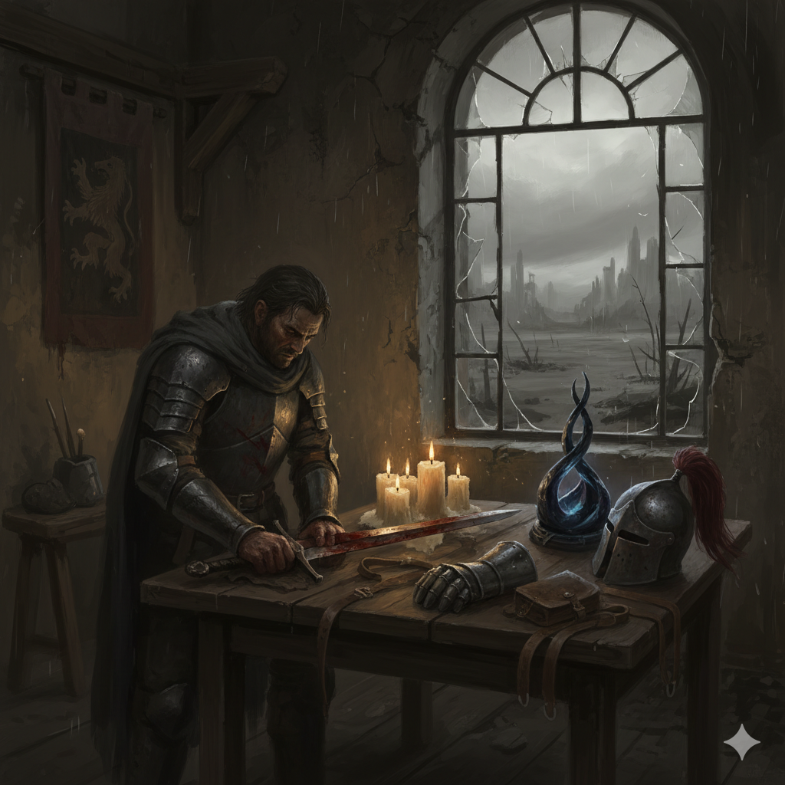
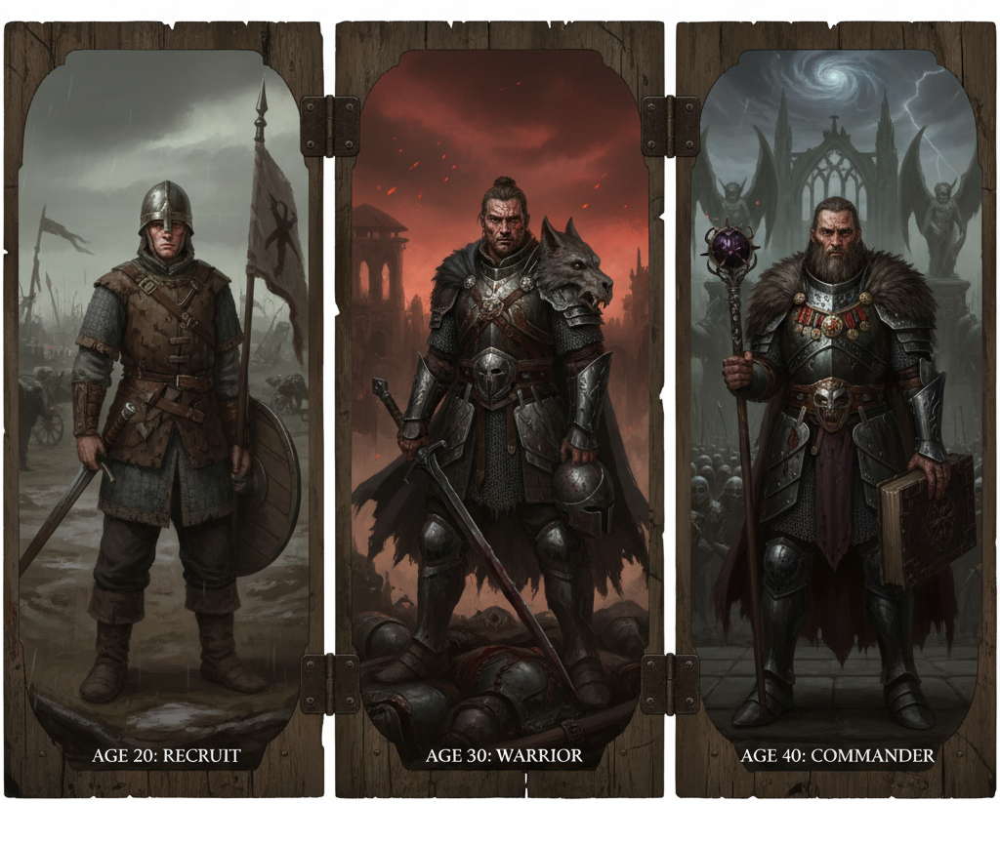
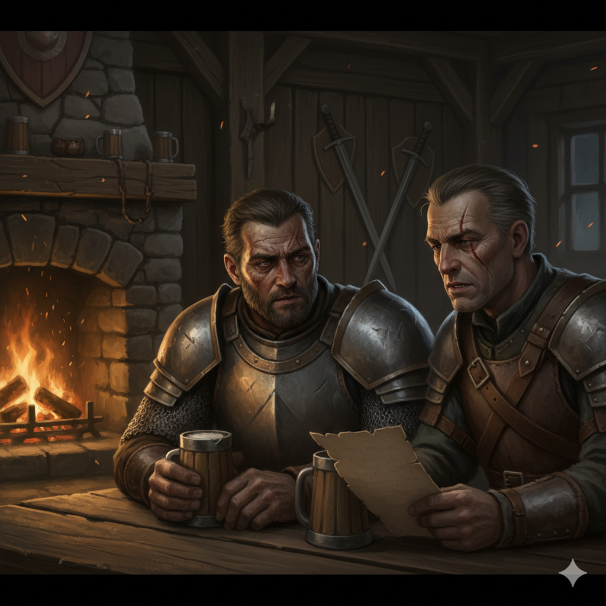
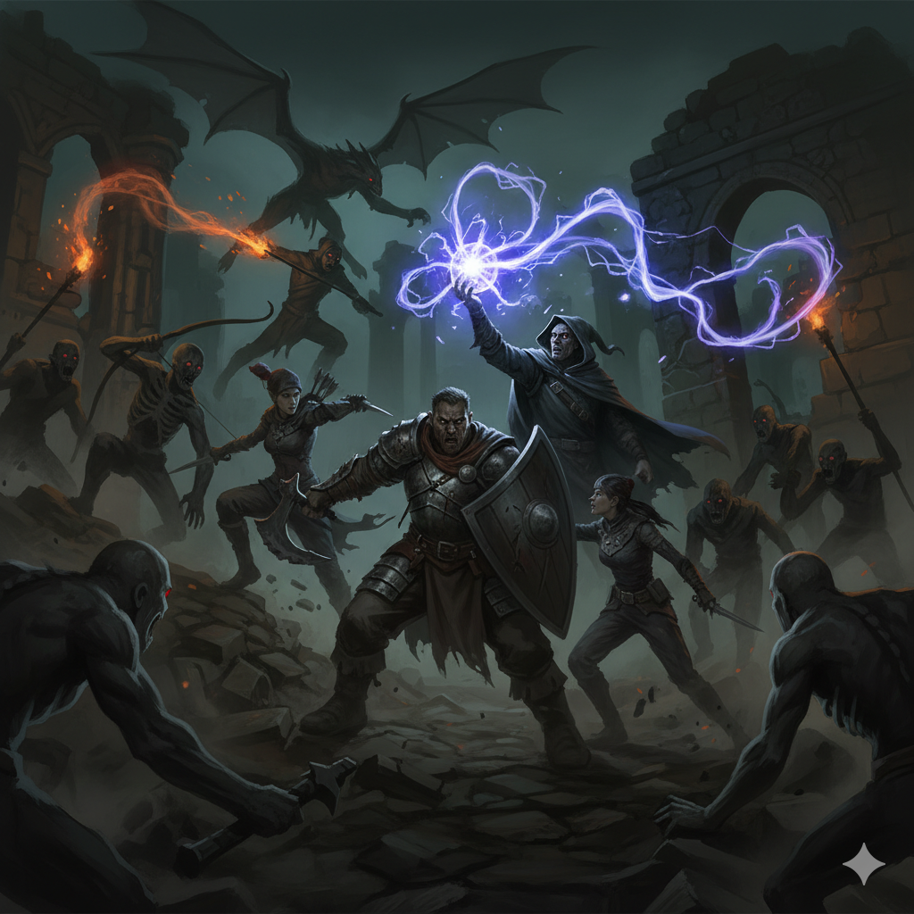
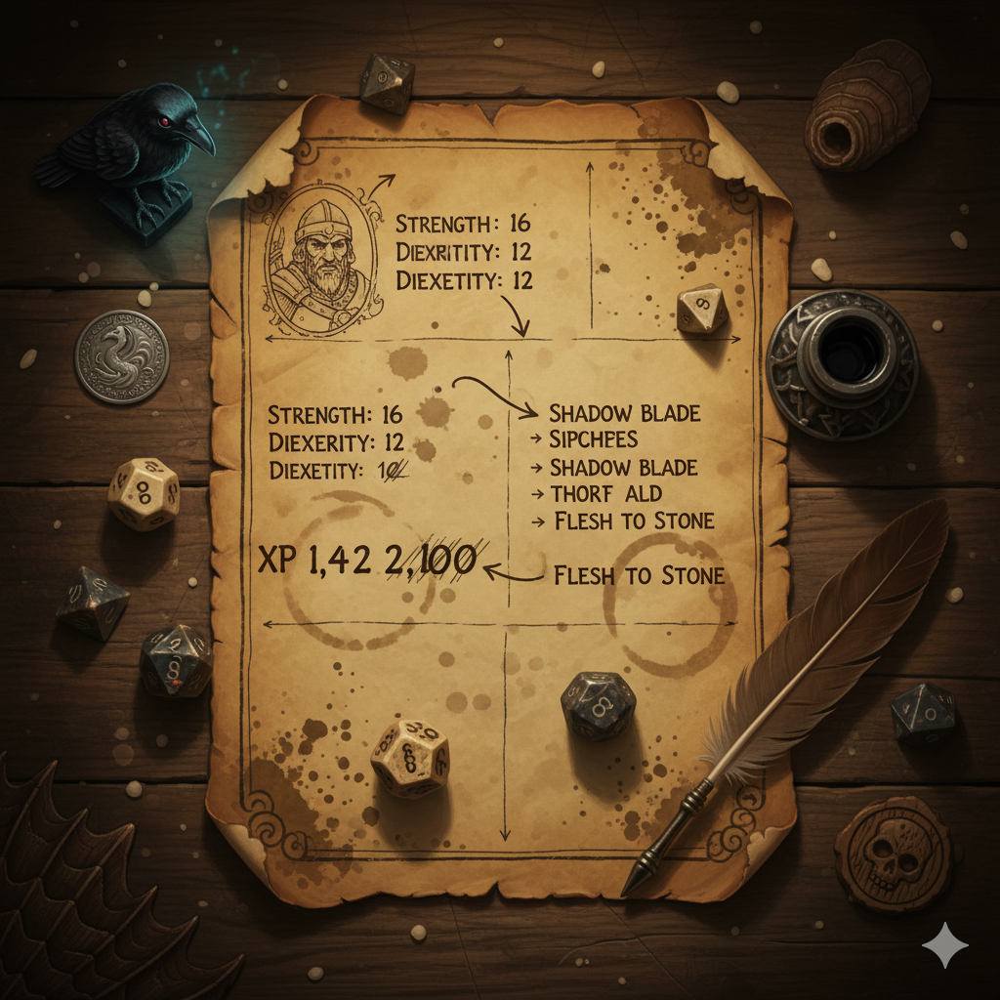

ARX LUMINA (The Real-Life Game)
========================================================
**Core Rulebook, Revised**

*Authors: Miker, Claude Sonnet 4, Claude Sonnet 4.5*



(Version 1.0.1, 21.10.2025)

<div style="page-break-after: always"></div>

# DISCLAIMER
## MIT License
Copyright (c) 2025

Permission is hereby granted, free of charge, to any person obtaining a copy
of this software and associated documentation files (the "Software"), to deal
in the Software without restriction, including without limitation the rights
to use, copy, modify, merge, publish, distribute, sublicense, and/or sell
copies of the Software, and to permit persons to whom the Software is
furnished to do so, subject to the following conditions:

The above copyright notice and this permission notice shall be included in all
copies or substantial portions of the Software.

THE SOFTWARE IS PROVIDED "AS IS", WITHOUT WARRANTY OF ANY KIND, EXPRESS OR
IMPLIED, INCLUDING BUT NOT LIMITED TO THE WARRANTIES OF MERCHANTABILITY,
FITNESS FOR A PARTICULAR PURPOSE AND NONINFRINGEMENT. IN NO EVENT SHALL THE
AUTHORS OR COPYRIGHT HOLDERS BE LIABLE FOR ANY CLAIM, DAMAGES OR OTHER
LIABILITY, WHETHER IN AN ACTION OF CONTRACT, TORT OR OTHERWISE, ARISING FROM,
OUT OF OR IN CONNECTION WITH THE SOFTWARE OR THE USE OR OTHER DEALINGS IN THE
SOFTWARE.

## ILLUSTRATIONS
All images created by Google Nano Banana 2.5 Flash via Google AI Studio. Prompts generated by Claude Sonnet 4.5.

<div style="page-break-after: always"></div>

# TABLE OF CONTENTS
1. Welcome
2. Real Life Acitivities
3. Character Generation
4. Milestone Vignettes (Optional Rule) 
5. Character Progression
6. Adventure Awaits
7. Appendix

<div style="page-break-after: always"></div>

# 1. WELCOME
Welcome to a completely new roleplaying concept: A system that transforms your everyday activities into heroic character development. Imagine cleaning your bathroom could help your virtual character prevail in their next great battle, or tidying up the basement would help them win important allies.

## SOLO FIRST
This system is primarily designed for solo play, where you are the only player working with a Game Master. This eliminates complex balance issues between players at different development stages. 

## AI GAME MASTER
We strongly encourage you to use an AI-powered system like ChatGPT, Gemini or Claude to function as your Game Master. By providing it the Arx Lumina Core Rulebook and the Fate Core System Rules and an idea of how your fantasy world should look like, those narrative language models are more than capable to offer you a motivating and entertaining experience. Additionally we created an "AI Gamemasters Hints" book, optimized for Claude Sonnet but also usable with other AIs. This provides detailed role descriptions and an introduction to the Journey-MCP-Server, which can be use to persist gameplay experience throughout the course of several sessions.

## WHAT YOU NEED
This rulebook covers **Character Generation and Progression** - how to create and develop your character using Real Life activities. For actual gameplay mechanics, you'll need the **Fate Core System rulebook**, which provides:

- Core rules for rolling dice and resolving actions
- Combat and conflict resolution
- Skills and stunts mechanics
- GM guidelines for running adventures

**Fate Core is available at:** https://fate-srd.com (free) or through your local game store.

**Think of it this way:** This rulebook gives you the character. Fate Core gives you the game to play with that character.

What about the world? The Arx Fatalis Real Life Game comes with a fantasy setting described in the **Arx Fatalis Sourcebook**. You can give this grim dark fantasy world a try, although you can play in any setting you can think of, even your favorite movie or show.

## Getting started real quick
Now that you have all the resources required, it is easy to get startet. Choose your favorite AI, upload the rulebooks and start to chat. Tell the AI, what game world you like to play in. And let the AI guide you through the character creation, progression and adventuring. It is the one thing AI is absolutely good at.

<div style="page-break-after: always"></div>

# 2. REAL LIFE ACTIVITIES


## GETTING STARTED
### The Core Idea
The Real Life Game operates on a simple principle: Every productive activity in your real life empowers your character's story.

**During Character Generation**: Your activities fuel dice rolls that shape your character's backstory - their skills, aspects, and artifacts earned through years of career development. Each real-world effort gives you a chance to develop your character's history.

**During Active Play**: Your activities directly translate into Fate Points - the currency of narrative power that lets you perform heroic actions and overcome challenges in your adventures.

In both cases, your real-world discipline and effort directly benefit your character. The system rewards consistency and genuine effort, creating a meaningful connection between your daily life and your character's heroic journey.

### The Motivation Behind It
The Real Life Game solves a fundamental problem: How do you motivate yourself for tedious but necessary everyday tasks?

By linking them to your character and their adventures, even the most mundane activities gain a heroic framework. Cleaning the bathroom becomes a small act of discipline that prepares your character for their next great challenge.

By the way: This system should not replace what you already enjoy doing. If you're already enthusiastically doing sports, you shouldn't use that as your daily challenge. Instead, the system focuses on things that require overcoming resistance - and makes them part of your heroic journey.

**IMPORTANT HEALTH NOTE:**
This system is meant to motivate productive activities, NOT to encourage overwork or exhaustion. Rest, relaxation, and self-care are essential - they don't earn XP because they're already valuable. If you find yourself sacrificing sleep or health to earn XP, you're missing the point. The goal is sustainable motivation, not burnout.

## The Point System
### XP Assignment
Each day you can earn 1-2 Experience Points (XP) through productive activities:
- **1 XP**: You were reasonably active (normal housework, small errands)
- **2 XP**: You were particularly active or really pushed yourself

The evaluation is up to you - you are your own "employer". Honesty is essential, because ultimately you're only cheating yourself if you undermine the system.

**Example Activities**: Cleaning, shopping, walking, decluttering, meeting friends, gardening, repairs - anything that's productive and requires overcoming resistance.

### Choose Your Own World
**The Power of World Choice**: One of the most important decisions is choosing your game world. Instead of playing in a generic fantasy world, you can choose a world that truly excites you:

- **Your Favorite Sci-Fi Universe**: Your cleaning mission becomes purging a hostile base
- **Your Favorite Fantasy Epic**: Court diplomacy instead of inviting friends to dinner
- **Your Favorite Space Opera**: Maintaining your starfighter instead of car repair
- **Your Preferred Superhero Universe**: Superhero training instead of regular workout

The emotional connection to a world you already love makes the difference between "I have to clean" and "I have to purge this enemy hideout". The pseudo-heroism only works if you truly identify with the game world.

**For a quick start:**
Arx Lumina has its own world in mind. If you are into dark fantasy, you can give the Arx Lumina Sourcebook a try.

---

*"Every day is a new chapter in your character's saga. The only question is: What story do you want to tell?"*

<div style="page-break-after: always"></div>

# 3. CHARACTER GENERATION



## OVERVIEW
Character generation combines Real-Life activities with narrative development. Players earn XP through productive activities, then roll for career development spanning 15-25 years.

---

## STEP 1: STARTING CHARACTER

**Initial Setup:**
- Starting age: 20 years
- GM: Discuss backstory with player (motivations, home, family, etc.)
- 2 Core Aspects: One positive (concept; who are you?), one challenging (complication; What's your problem?)
- 1 Stunt (refering to his backstory)
- No skills yet
- No equipment yet

**Go find yourself a job**
GM: Discuss with player what to do for a living. Which occupation to choose.
Tipp: Times are hard. Maybe there is compulsory military service for each male and female at age 20.

---

## STEP 2: CAREER DEVELOPMENT

GM: Player completes Real Life activities and earns XPs. This will be fully managed by player. GM only has to know, how many XPs player achieved since last time and in which general category.

### Real Life → XP → Development Rolls
- 1 Real-Life activity = 1 XP = 1 development roll
- Categorize activity: **Patrol** / **Routine** / **Special Op** (narrative flavor only)
- Target: ~50 rolls = 20 years career = complete character

### Development Table (4dF)
```
-4, -3:  Challenging Aspect
-2, -1:  One year passes (no event)
 0, +1:  Improve Skill
    +2:  Positive Aspect
+3, +4:  Artifact
```

---

## SKILL IMPROVEMENT (0, +1 result)

**GM Process:**
1. Review player's recent activity categories (last 5-10)
2. Suggest 2-3 thematically fitting skills
3. Player chooses one

**Categorization Guide:**
- **Patrol** activities → athletics, combat, perception, survival, driving
- **Routine** activities → crafting, contacts, resources, investigation, charisma
- **Special Op** activities → Any skill, depending on specific activity

**Skill Rules:**
- New skill starts at +1
- OR increase existing skill by +1

**Skill Pyramid:**
- At the end of character generation skill pyramid must be maintained.
- Skills that violate this drop one point and so on until pyramid is valid.
- During generation skills can be increased without limitation. (But keep in mind: You may loose them in the end if pyramid is not valid)

<div style="page-break-after: always"></div>

## ASPECTS (+2, -4/-3 results)

**Creation Process:**
1. GM and player collaborate
2. Base on character's recent activities/experiences
3. Should have narrative depth

**Aspect Limitations**
- Concept and complication already chosen don't change anymore during generation 
- Player gathers positive and challenginge aspects without limitation
- At the end of character generation, player chooses one positive and one negative aspect. Third aspect is chosen randomly
- Aspects not chosen become backstory (narrative only, not mechanical)
- There can be less then three aspects at the end of generation

**Challenging Aspects:**
- Must be taken when rolled
- Have obvious weakness/complication
- Examples: "Too Proud to Give Up", "Owes the Black Market a Favor"
- Can be used positively, but create complications

---

## ARTIFACTS (+3/+4 result)

### Step 1: Determine Skill
- GM rolls 2 random skills from ALL skills (even character doesn't have)
- Player chooses one of the two

### Step 2: Roll Artifact Strength (4dF)
```
-4 to -2: skill+2 (1x per day)
-1 to +1: skill+1 (1x per day)
+2 to +3: skill+2 (1x per day)
     +4:  skill+1 (permanent) OR Stunt
```

**Stunt Option (+4 only):**
- GM offers 3 thematically fitting stunts
- Player chooses one
- Should match artifact's nature
- **Note:** Artifacts with "+4 permanent OR Stunt" give you an additional Stunt beyond your starting 3.

<div style="page-break-after: always"></div>

### Step 3: Describe Artifact
- Name, form, origin
- How does it fit character's story?
- GM and player collaborate

---

## STEP 3: POST-DEVELOPMENT

Character generation ends when...
- skill pyramide is fully stuffed (1x +4, 2x +3, 3x +2, 4x +1)
or
- any time earlier, yielding a younger less skilled character

### Calculate Final Age
- Starting age: 20
- Add 1 year ONLY when "One year passes" is rolled (-2, -1)
- Example: 50 rolls with 16x "one year passes" = age 36 (20 + 16)

### Skills and Aspects
- Maintain valid skill pyramid
- Choose the 3 additional aspects to keep

**Note:** You can redesignate aspects. A positive aspect can become your Complication if it creates interesting tension.

### Stunts
**Every character gets 3 free Stunts:**
- 1 Stunt at character creation (Step 1) - connected to backstory
- 2 additional Stunts after career development (Post-Development)
- OR all 3 can be chosen after career development
- GM and player decide together which Stunts fit best
**What are Stunts?**
Stunts are special abilities that bend the rules or give bonuses in specific situations.

**Starting Stunts:**
- Every character gets 3 free Stunts at the start
- These can be chosen during Character Generation OR during play
- Additional Stunts can be purchased later (reduce Refresh by 1 per Stunt)

**Stunt Examples:**
- **Specialist:** +2 to a skill under specific circumstances
- **Situational:** Use Skill A instead of Skill B in certain situations
- **Once per Session:** Ignore a Consequence or gain a major bonus

**Creating Stunts:**
Work with GM to create Stunts that fit your character concept.
See Fate Core rulebook for detailed Stunt creation rules.

## STRESS & CONSEQUENCES

**Stress Tracks:**
- Characters have two stress tracks: **Physical Stress** and **Mental Stress**
- Base size: 2 boxes each [1] [2]
- Can be extended by Physical and Mental skills
- See Fate Core rulebook for detailed stress mechanics

**Consequences:**
- 1 Light Consequence (-2)
- 1 Moderate Consequence (-4)
- 1 Severe Consequence (-6)
- See Fate Core rulebook for healing times and usage

**Refresh:**
- Starting Refresh: 3 Fate Points
- -1 per additional Stunt (beyond 3 free Stunts)
- Minimum: 1 Fate Point

**Note:** For full Fate Core stress and consequences rules, including how skills affect stress track length and conflict resolution, consult the Fate Core System rulebook.

---

## STATISTICAL EXPECTATIONS (50 rolls)

**Skills:** Full pyramid (1x +4, 2x +3, 3x +2, 4x +1)  
**Aspects:** ~6 positive, ~3 challenging (some replaced during generation)  
**Artifacts:** ~3 items (mostly situational, rarely permanent/stunt)  
**Final Age:** ~36 years old (20 + ~16 "one year passes" results)

---

## QUICK REFERENCE: FATE SKILLS

**Physical:** Athletik, Kämpfen, Kraft, Schießen, Fahren  
**Mental:** Wissen, Nachforschung, Wahrnehmung, Wille  
**Social:** Charisma, Kontakte, Täuschung, Provozieren, Empathie  
**Practical:** Handwerk, Ressourcen, Überleben, Einbruch, Heimlichkeit

---

## GM TIPS

**Skill Suggestions:**
- Look at activity patterns, not individual activities
- Offer variety (don't always suggest Kämpfen)
- Consider character archetype developing

<div style="page-break-after: always"></div>

**Aspect Creation:**
- Start with player's idea
- Add twist or depth together
- Good aspects have two sides

**Artifact Description:**
- Tie to specific career event
- Make it memorable
- Explain why character still has it

**Pacing:**
- Don't rush through 50 rolls in one session
- Spread over multiple weeks
- Enjoy the character emerging organically

---

## EXAMPLE: CHARACTER GENERATION SESSION

**Player:** Sarah creates a guard officer  
**Week 1 Activities:** Groceries (Routine), Gym (Patrol), Cleaning (Routine)  
**XP:** 3 total

**Roll 1:** +1 → Skill improvement  
- Recent: Routine-heavy  
- GM suggests: Ressourcen, Kontakte, Handwerk  
- Player chooses: Ressourcen +1

**Roll 2:** -2 → One year passes  
- Character is now 21 years old (first year passed)
- No other mechanical change

**Roll 3:** +3 → Artifact!  
- GM rolls: Kämpfen, Wissen  
- Player chooses: Kämpfen  
- Strength roll: +2 → Kämpfen+2 (1x per day)  
- Description: "Captain's Ceremonial Sword - awarded for first successful mission defense"

**After 8-10 weeks:** Character complete, ready for first adventure

<div style="page-break-after: always"></div>

# 4. MILESTONE VIGNETTES (Optional Rule)



## CHARACTER GENERATION AS MINI-CAMPAIGN
WHEN: Every 5 years of character age (25, 30, 35, 40+)

**Player Choice: At each milestone, decide:**
- Play vignette (15-30 min scene)
- OR skip and continue rolling

<div style="page-break-after: always"></div>

## VIGNETTE STRUCTURE
1. SETUP: GM frames scene based on:
   • Character's current age
   • Recent rolls (skills, aspects, artifacts gained)
   • Career/background

2. SCENE: Short dramatic moment
   • Simple conflict or choice
   • Defines character in this life phase
   • Low stakes, high character development

3. REWARD: One Soft Reward (narrative only)
   • Useful contact
   • Minor reputation
   • Secret knowledge
   • Favor owed
   • Career advancement (status, not mechanics)
   • Sentimental memento

**Important:** 
Soft rewards have NO mechanical bonuses
They are story hooks and roleplay opportunities.

## MILESTONE THEMES (Suggestions)
AGE 25 - Establishing Yourself
First big success/failure, making a name

AGE 30 - Connections & Consequences
Network building, past catches up

AGE 35 - Crossroads  
Crisis or choice that defines character

AGE 40+ - Legacy
What will you be remembered for?

## EXAMPLE VIGNETTE
Character: Guard Sergeant Marcus, just turned 30
Recent rolls: Gained Kämpfen +3, Artifact (sword), Aspect "Haunted by Past Failure"

GM: "Marcus, you're 30. The Battle of Red Ridge was 5 years ago - your failure still stings. But tonight, at the garrison tavern, someone recognizes you..."

Scene: Old comrade reveals Marcus wasn't responsible for the defeat - orders were sabotaged

Choice: Seek revenge on saboteur OR let it go and move forward?

Marcus chooses: Let it go (growth moment)

Reward: Reputation - "The Sergeant Who Chose Peace" 
(Future NPCs might respect this restraint)

Continue rolling for character development...

<div style="page-break-after: always"></div>

# 5. CHARACTER PROGRESSION



*For use during active campaigns after character generation is complete*

---

## OVERVIEW

Character progression happens through two channels:
1. **Narrative Progression** - Story-driven advancement from quests/campaigns
2. **Continued Real Life Progression** - Ongoing XP earning translates to Fate Points

<div style="page-break-after: always"></div>

## NARRATIVE PROGRESSION

### End of Adventure/Quest

**Choose ONE of the following rewards:**

#### Option A: +1 Skill Point

**Process:**
1. Review the quest/adventure just completed
2. Identify which skills were central to the story
3. GM suggests 2-3 thematically fitting skills
4. Player chooses one
5. Apply +1 to chosen skill

**Rules:**
- New skill starts at +1
- OR increase existing skill by +1
- MUST maintain skill pyramid structure
- Should reflect what character learned/experienced

**Example:**
*"After fighting bandits all week, your Kämpfen improves from +2 to +3"*

#### Option B: Change Aspect
- Swap one Aspect for a new one (except Concept)
- Must narratively fit the quest events
- Old aspect becomes backstory
- Useful when quest significantly changed character perspective

#### Option C: Buy New Stunt**
- Purchase one new Stunt
- Costs 1 Refresh (minimum Refresh: 1)
- Work with GM to create appropriate Stunt
- Should thematically connect to quest experiences
- See Fate Core rulebook for Stunt creation guidelines

---

### End of Campaign

**Major Character Development - Multiple Rewards:**
1. **Choose ANY rewards from "End of Adventure/Quest"** (Skill/Aspect/Stunt)
2. **Aspect Transformation** (Required - choose one type)
3. **Refresh +1** (Automatic)
4. **Concept/Complication Change** (Optional, requires GM approval)
5. **Campaign Reward** (Real Life - discuss with GM)

---

#### Aspect Transformation (Required)

Player must choose ONE of the following:

**PROMOTE** - Make aspect more powerful/specific
```
"Skilled Swordsman" → "One with the Blade"
"I am Charming" → "They Adore Me"
"Quick Thinker" → "Always Three Steps Ahead"
```
*Most common choice - makes existing strength sharper*

**RESOLVE** - Transform Challenging → Positive
```
"Vengeful" → "Learned to Forgive"
"Haunted by Past" → "Wisdom from Experience"
"Too Proud to Back Down" → "Confident Leader"
```
*Only if narratively justified by campaign events*
*Rewards character growth arcs*

**REPLACE** - Exchange aspect for new one
```
Old: "City Guard"
New: "Exiled Wanderer"
```
*Use when campaign fundamentally changed character*
*Old aspect becomes backstory (narrative, not mechanical)*

**MERGE** - Combine 2-3 aspects into Epic Aspect
```
"Ranger" + "Friend of Animals" + "Survivalist"
→ "Master of the Wild" (EPIC)
```
**Epic Aspect Rules:**
- +3 instead of +2 when invoked
- Broader applicability
- Stronger narrative weight
- Maximum 1 Epic Aspect per character
- Use sparingly - these create legendary characters

---

#### Refresh +1
- Refresh increases by +1
- Can immediately purchase new Stunt with increased Refresh
- OR keep higher Refresh for more Fate Points per session

---

#### CONCEPT/COMPLICATION CHANGE (Optional, requires GM approval)

**Rename Concept or Complication:**
- Only if campaign fundamentally changed character identity
- Requires discussion with GM about narrative justification
- Examples:
  - Concept: "Loyal City Guard" → "Betrayed Wanderer" (after being framed)
  - Complication: "Wanted by the Crown" → "Pardoned Hero" (after saving kingdom)

**Note:** Characters evolve naturally through campaigns. This option recognizes major identity shifts.

---

#### Campaign Reward (Real Life)

**Player chooses something from real-life wishlist**

**Guidelines:**
- Discuss with GM what's appropriate
- Consider both financial and narrative weight
- Should feel like earned reward for campaign commitment

**Examples:**
- Book from wishlist
- Gaming accessory
- Weekend activity
- Hobby equipment
- Restaurant visit
- Concert/event tickets

**This closes the loop:**  
Real Life empowers Game → Game rewards Real Life

---

**Example: End of 10-Session Campaign**

**Player chooses:**
1. **Aspect Transformation:** PROMOTE "Defender of Weak" → "Shield of the Innocent"
2. **Skill Advancement:** Kämpfen +3 → +4
3. **Buy New Stunt:** "Inspiring Presence: Once per session, allies in sight gain +1 to their next roll"
4. **Refresh +1:** Increases from 3 to 4 (keeps it for more FP)
5. **Campaign Reward:** New gaming headset (discussed with GM - appropriate for medium campaign)

**Result:** Character is significantly more powerful, has new capabilities, clearer identity, and player is rewarded in real life.

---

## CONTINUED REAL LIFE PROGRESSION

### XP to Fate Points (Weekly System)

**Purpose:** Real-Life activities continue to empower your character through Fate Points during active play.

---

### Weekly Tracking

**Every week:**
1. Count XP earned through Real-Life activities
2. At end of week, convert to Fate Points based on tier
3. XP counter resets to 0
4. Fate Points add to character's current pool

---

### Conversion Tiers

```
═══════════════════════════════════════════════════════════
XP EARNED    │ FATE POINTS GAINED        │ BONUS
═══════════════════════════════════════════════════════════
1-2 XP       │ 1 FP per XP               │ None
             │ (2 FP total max)          │
───────────────────────────────────────────────────────────
3-5 XP       │ 1 FP per XP               │ +1 FP
             │ (3-5 base + 1 bonus)      │
───────────────────────────────────────────────────────────
6+ XP        │ 1 FP per XP               │ +2 FP
             │ (6+ base + 2 bonus)       │ + Small Reward*
═══════════════════════════════════════════════════════════
```

---

### Small In-Game Reward (6+ XP Only)

**Trigger:** Player earned 6 or more XP in one week

**GM Action:** Offer one useful in-game element that fits current quest/situation

**Guidelines:**
- Should feel special (rare, make it memorable)
- Fits current story context
- No mechanical bonuses (narrative/utility only)
- Player earned this by "going the extra mile" in Real Life

**Examples:**

**Useful Contact:**
- Merchant who has that rare ingredient
- Guard who looks the other way
- Scholar with specific knowledge

**Timely Information:**
- Rumor about enemy weakness
- Map fragment showing secret passage
- Warning about upcoming danger

**Convenient Item:**
- Small tool that solves current problem
- Consumable that's currently needed
- Key to locked door they're stuck at

**Social Opportunity:**
- Letter of introduction to important NPC
- Invitation to exclusive event
- Reputation boost in current location

---

### Weekly Conversion Examples

**Week 1: Moderate Activity (4 XP)**
- Base: 4 XP = 4 Fate Points
- Tier Bonus: +1 Fate Point (3-5 XP tier)
- **Total: 5 Fate Points added**

**Week 2: Light Activity (2 XP)**
- Base: 2 XP = 2 Fate Points
- Tier Bonus: None (1-2 XP tier)
- **Total: 2 Fate Points added**

**Week 3: Extra Mile! (7 XP)**
- Base: 7 XP = 7 Fate Points
- Tier Bonus: +2 Fate Points (6+ XP tier)
- In-Game Reward: GM gives contact to helpful blacksmith
- **Total: 9 Fate Points + narrative reward**

<div style="page-break-after: always"></div>

## QUICK REFERENCE: PROGRESSION SUMMARY

```
═══════════════════════════════════════════════════════════
WHEN                  │ REWARD
═══════════════════════════════════════════════════════════
End of Quest          │ +1 Skill (GM suggests, player chooses)
───────────────────────────────────────────────────────────
End of Campaign       │ • Transform 1 Aspect
                      │ • Real-Life Campaign Reward
───────────────────────────────────────────────────────────
Every Week            │ XP → Fate Points (tiered bonuses)
                      │ 6+ XP = bonus + small in-game reward
═══════════════════════════════════════════════════════════
```

---

## GM TIPS: NARRATIVE PROGRESSION

### Skill Advancement

**Do:**
- Connect to quest events directly
- Suggest skills that were actually used
- Reward what player emphasized in play
- Maintain pyramid structure rigorously

**Don't:**
- Advance skills that weren't relevant to quest
- Let players "shop" for any skill they want
- Break pyramid structure "just this once"
- Give multiple skill points for single quest

---

### Aspect Transformation

**Facilitate Discussion:**
- "Which aspect feels like it changed during this campaign?"
- "What did your character learn about themselves?"
- "Which aspect no longer fits who they've become?"

**PROMOTE Is Default:**
- If player unsure, suggest promoting their Concept
- Safer than Resolve/Replace/Merge
- Always narratively justified

**RESOLVE Needs Justification:**
- Campaign must have addressed the Challenging Aspect
- Player should WANT the change
- Makes sense only after character growth arc

**MERGE Is Rare:**
- Save for major, campaign-ending moments
- Should feel legendary, not routine
- Maximum 1 Epic Aspect per character ever

---

### Campaign Rewards (Real Life)

**Setting Expectations:**
- Discuss early what "appropriate" means
- Consider campaign length (3 sessions vs. 20 sessions)
- Financial situation varies - be flexible
- Focus on "treat yourself" not "break the bank"

**Examples by Campaign Length:**
```
Short (3-5 sessions):   Book, game, nice meal
Medium (6-12 sessions): Gaming gear, weekend trip, hobby equipment  
Long (13+ sessions):    Major purchase, special event, significant treat
```

---

## GM TIPS: REAL LIFE PROGRESSION

### Weekly XP Tracking

**Make It Visible:**
- Keep running tally during session
- "You're at 5 XP this week, one more for the bonus!"
- Creates motivation for next week's activities

**Be Honest Arbiter:**
- If player claims unrealistic XP, discuss
- System requires honesty to function
- But don't be harsh - benefit of doubt

**Celebrate Milestones:**
- When player hits 6+ XP: "You went the extra mile!"
- Make small reward feel special, not routine
- Tie it narratively when possible

---

### Small In-Game Rewards

**Quality Over Quantity:**
- 6+ XP should be rare (not every week)
- Make each reward memorable
- Don't just hand out random items

**Narrative Integration:**
- Ideally fits current quest situation
- Player: "We need to find the tomb entrance"
- GM: "Remember that scholar contact from last week? He sends a message with a clue..."

**Avoid Mechanical Power:**
- No weapons with bonuses
- No armor with stats
- No Fate Points on top of the tier bonus
- Keep it narrative/utility focused

**When Stuck:**
- Default: Useful contact in current location
- Always works, always relevant
- Easy to improvise on the spot

---

## BALANCING CONCERNS

### Power Creep Watch

**Skills:**
- One skill per quest = slow, steady growth
- Takes many quests to reach +5
- Pyramid structure naturally limits advancement

**Aspects:**
- Transformation keeps number at ~5
- Epic Aspects are rare (1 max)
- No mechanical "stacking"

**Fate Points:**
- Weekly influx is good - Fate needs spending
- 6+ XP weeks are rare, don't happen constantly
- Small rewards are narrative, not mechanical

**Result:** Steady character growth without runaway power escalation

<div style="page-break-after: always"></div>

## EXAMPLE: FULL CAMPAIGN CYCLE

**Campaign:** "The Siege of Grimhold Fortress" (8 sessions over 8 weeks)

### During Campaign (Weekly)

**Week 1:** 3 XP earned → 4 FP total  
**Week 2:** 2 XP earned → 2 FP  
**Week 3:** 7 XP earned → 9 FP + Reward: Blacksmith contact  
**Week 4:** 4 XP earned → 5 FP  
**Week 5:** 1 XP earned → 1 FP  
**Week 6:** 6 XP earned → 8 FP + Reward: Map of fortress sewers  
**Week 7:** 3 XP earned → 4 FP  
**Week 8:** 5 XP earned → 6 FP  

**Total Fate Points Gained:** 39 FP over campaign  
**Small Rewards:** 2 (blacksmith, map)

---

### Campaign End Rewards

**1. Skill Advancement:**
- Player fought constantly throughout siege
- GM suggests: Kämpfen, Athletik, Wille
- Player chooses: Kämpfen +3 → +4

**2. Aspect Transformation:**
- Player had: "Defender of the Weak"
- Campaign showed character protecting entire fortress
- PROMOTE → "Shield of the Innocent" (broader, more powerful)

**3. Real-Life Campaign Reward:**
- 8-session campaign = medium length
- Player's wishlist: New gaming headset
- GM approves - appropriate for campaign investment
- Player purchases headset!

**Result:**  
Character mechanically stronger, narratively deeper, player rewarded in Real Life for commitment.

---

## TROUBLESHOOTING

**Problem:** "Player wants skill that wasn't used in quest"  
**Solution:** Explain connection between story and advancement. Suggest compromise - related skill they DID use.

**Problem:** "Player has 15 XP in one week (suspicious)"  
**Solution:** Discuss honestly. Remind that system needs integrity. Adjust if clearly inflated.

**Problem:** "Can't think of appropriate small reward for 6+ XP"  
**Solution:** Default: Useful contact. "You meet someone who knows someone..." Always works.

**Problem:** "Player wants to MERGE all aspects into Epic Aspects"  
**Solution:** Hard limit - 1 Epic Aspect maximum. Explain rarity maintains specialness.

**Problem:** "Campaign ended but no obvious Aspect Transformation"  
**Solution:** Default to PROMOTE their Concept. Makes it stronger without complex changes.

---

**Remember:** This system rewards consistent engagement both in-game (quests) and out-of-game (Real Life). Keep it fun, keep it honest, keep it balanced.

<div style="page-break-after: always"></div>

# 6. ADVENTURE AWAITS


*Your character is ready. Now it's time to play!*

---

## OVERVIEW

This rulebook covers **Character Generation and Progression** for Arx Lumina. For actual gameplay - how to run adventures, resolve conflicts, and tell stories - consult the **Fate Core System rulebook**.

Below is a quick reference to the most important Fate Core sections you'll need.

<div style="page-break-after: always"></div>

## CORE GAMEPLAY MECHANICS

### **The Basics (Fate Core Chapter 2)**
- **The Four Actions:** Overcome, Create Advantage, Attack, Defend
- **Rolling Dice:** 4dF + Skill vs. Difficulty or Opposition
- **The Ladder:** From Terrible (-2) to Legendary (+8)
- **Invoking Aspects:** Spend Fate Points for +2 or reroll
- **Compels:** GM offers Fate Point to complicate your life

**→ See Fate Core: "Actions and Outcomes" (p. 132)**

---

### **Aspects and Fate Points (Fate Core Chapter 4)**
- **Using Aspects:** Invoke for bonus, Compel for complications
- **Creating Aspects:** Through "Create Advantage" action
- **Free Invokes:** First use of created aspect is free
- **Aspect Types:** Character, Situation, Consequences, Boosts

**→ See Fate Core: "Aspects and Fate Points" (p. 56)**

---

### **Skills (Fate Core Chapter 5)**
- **Skill List:** 18 default skills (Athletik, Kämpfen, Wissen, etc.)
- **Skill Actions:** What each skill can do
- **Skill Descriptions:** Detailed explanations of each skill
- **Creating New Skills:** Guidelines for custom skills

**→ See Fate Core: "Skills and Stunts" (p. 93)**

---

## RUNNING ADVENTURES

### **Challenges (Fate Core p. 147)**
**When to use:** Complex situations requiring multiple steps
- Series of Overcome actions
- Each roll represents one part of challenge
- Failure creates complications, not instant defeat

**Example:** Researching ancient artifact, navigating treacherous wilderness

---

### **Contests (Fate Core p. 150)**
**When to use:** Two sides competing for same goal
- Series of opposed rolls
- First to 3 victories wins
- Both sides can take action

**Example:** Chase scene, debate, racing to find clue first

---

### **Conflicts (Fate Core p. 152)**
**When to use:** Direct confrontation where harm can occur
- **Initiative:** Highest skill goes first
- **Zones:** Abstract positioning on battlefield
- **Actions:** Attack, Defend, Create Advantage, Overcome
- **Stress & Consequences:** Track damage taken
- **Conceding:** Surrender before being Taken Out (keep some control)

**Example:** Combat, social confrontation, mental battle

**→ See Fate Core: "Challenges, Contests, and Conflicts" (p. 143)**

---

## CONFLICT RESOLUTION QUICK REFERENCE

### **Stress Tracks**
- **Physical Stress [1] [2] [3] [4]** (if Kraft is high)
- **Mental Stress [1] [2] [3] [4]** (if Wille is high)
- Check box equal to damage OR multiple boxes adding up to damage
- Clear all stress after conflict ends

### **Consequences**
- **Light (-2):** Heals after one scene
- **Moderate (-4):** Heals after one session
- **Severe (-6):** Heals after one scenario

### **Taking Consequences**
- Name the consequence (must be descriptive)
- Can be invoked against you (like negative aspect)
- Can absorb stress to stay in fight

### **Being Taken Out**
- Opponent decides what happens to you
- You're out of the conflict completely
- Severe narrative consequences possible

### **Conceding**
- Surrender BEFORE opponent's attack resolves
- You control how you exit
- Gain 1 Fate Point + 1 per Consequence taken
- Better than being Taken Out!

**→ See Fate Core: "Stress and Consequences" (p. 56) and "Conflicts" (p. 152)**

---

## STUNTS REFERENCE

### **What Stunts Do**
- Add +2 to skill in specific situation
- Substitute one skill for another in narrow circumstance
- Create special once-per-session effect
- Represent exceptional training, equipment, or abilities

### **Stunt Examples**
```
"Because I am a [describe specialty], I get +2 when I use [skill] 
to [specific action] when [circumstance]."

"Because I [describe feature], once per session I can [cool thing]."

"Because I have [item/ability], I can use [skill] instead of [skill] 
when [circumstance]."
```

### **Creating Stunts**
Work with your GM to create Stunts that:
- Fit your character concept
- Are narrow enough to be special
- Add interesting options without breaking game
- Cost 1 Refresh each (beyond 3 free)

**→ See Fate Core: "Building Stunts" (p. 89)**

---

## RUNNING THE GAME (FOR GMs)

### **Setting Difficulties (Fate Core p. 133)**
```
+0: Easy - routine tasks under pressure
+2: Fair - slightly challenging
+4: Great - tough but achievable
+6: Fantastic - extremely difficult
+8: Legendary - nearly impossible
```

**GM Tip:** If success/failure are both interesting, roll dice. If not, just succeed.

---

### **Creating NPCs (Fate Core p. 213)**

**Nameless NPCs** (Mooks)
- 1-2 aspects
- 1-2 skills at +2
- 0-1 stress boxes
- No consequences

**Supporting NPCs** (Recurring characters)
- 3 aspects
- 3-5 skills (fair spread)
- 1-2 stress boxes
- 1 consequence (mild)

**Main NPCs** (Major antagonists)
- Full character sheet like PCs
- 5 aspects, full skill pyramid
- Full stress and consequences
- Multiple stunts

**→ See Fate Core: "Creating the Opposition" (p. 213)**

---

### **Running Scenes (Fate Core p. 232)**

**Scene Structure:**
1. **Establish:** Where are we? Who's here? What's happening?
2. **Set Stakes:** What do characters want? What's at risk?
3. **Resolve:** Challenge, Contest, or Conflict?
4. **Conclude:** What changed? What happens next?

**Pacing Tip:** Not every scene needs dice. Save rolls for when outcome matters.

---

## FATE POINT ECONOMY

### **Starting Refresh: 3 FP**
- Begin each session with Refresh amount
- Can carry over more from previous session
- Earn more through Compels during play

### **Earning Fate Points**
- **Accept Compel:** +1 FP when aspect complicates your life
- **Concede Conflict:** +1 FP + 1 per Consequence taken
- **Self-Compel:** Volunteer your aspect for complication, GM awards FP

### **Spending Fate Points**
- **Invoke Aspect:** +2 or reroll (1 FP)
- **Declare Story Detail:** Add minor fact to scene (1 FP)
- **Refuse Compel:** Pay 1 FP to avoid complication (rare!)

**Balance Tip:** Fate Points should flow. Players spend them for awesome moments, earn them back through complications. This creates dynamic stories.

---

## SESSION STRUCTURE

### **Typical Session Flow**

1. **Refresh Fate Points** to starting Refresh
2. **Recap:** What happened last time?
3. **Scene 1:** Set up situation, establish stakes
4. **Scene 2-4:** Build tension, complications arise
5. **Climax:** Major conflict or decision point
6. **Resolution:** Consequences, what changed?
7. **Preview:** Hint at next session's events

### **Between Sessions**
- Clear all stress
- Track Real Life XP for weekly Fate Point conversion
- Note changed aspects, new consequences
- Update character sheet

---

## QUICK START CHECKLIST

**For Players:**
- [ ] Understand the 4 Actions (Overcome, Advantage, Attack, Defend)
- [ ] Know how to invoke your Aspects
- [ ] Understand your Skills and Stunts
- [ ] Track your Stress and Consequences
- [ ] Manage your Fate Points

**For GMs:**
- [ ] Prepare scenes with clear stakes
- [ ] Create interesting NPCs
- [ ] Set appropriate difficulties
- [ ] Compel aspects to create drama
- [ ] Award Fate Points for good roleplay
- [ ] Keep Fate Points flowing

---

## FINAL NOTE

**Fate Core is your gameplay bible.** This rulebook gives you characters and progression. Fate Core gives you everything else:
- How to run adventures
- Detailed combat rules
- Social conflict mechanics
- World-building tools
- GM advice and techniques

**Don't memorize everything.** Learn the basics (4 Actions, rolling dice, using aspects), then reference the rest as needed. Fate is designed to be learned through play.

**→ Get Fate Core at:** https://fate-srd.com or your local game store

---

**Now go forth and adventure in the dark world of Arx Lumina!**

<div style="page-break-after: always"></div>

# 7. APPENDIX

## CHARACTER SHEET TEMPLATE

```
NAME: ________________  AGE: _____
CAREER: ________________
CURRENT OCCUPATION: ________________

=== ASPECTS ===
Concept: ________________
Complication: ________________
________________
________________
________________

=== SKILLS ===
+4: ________________
+3: ________________  ________________
+2: ________________  ________________  ________________
+1: ________  ________  ________  ________

=== ARTIFACTS ===
1. ________________ [skill+X, frequency]
2. ________________ [skill+X, frequency]
3. ________________ [skill+X, frequency]

=== STRESS & CONSEQUENCES ===
Physical Stress: [1] [2] ([ ] [ ] if Kraft high)
Mental Stress: [1] [2] ([ ] [ ] if Wille high)
Light Consequence (-2): ________________
Moderate Consequence (-4): ________________
Severe Consequence (-6): ________________

Refresh: 3 FP
Stunts: _______ / 3 free
```



