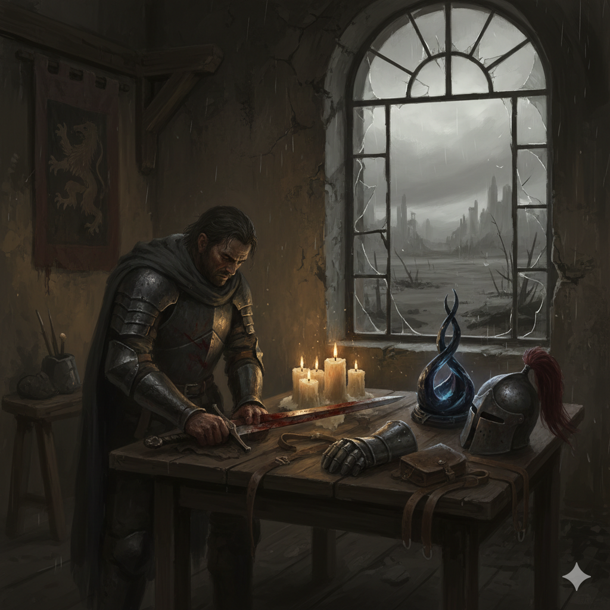
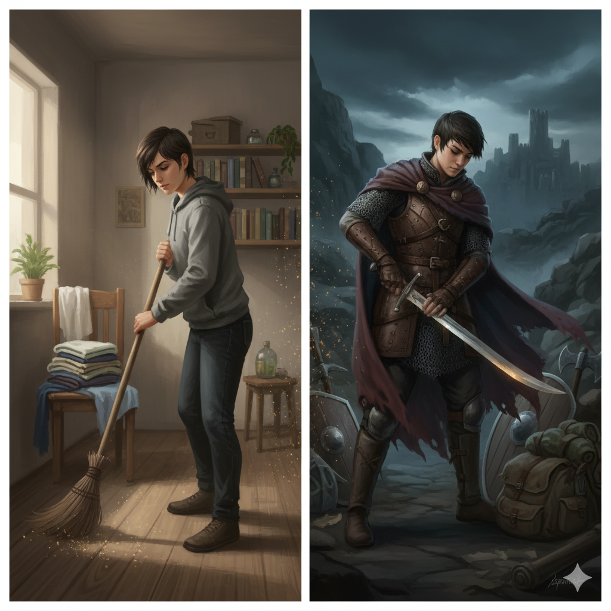
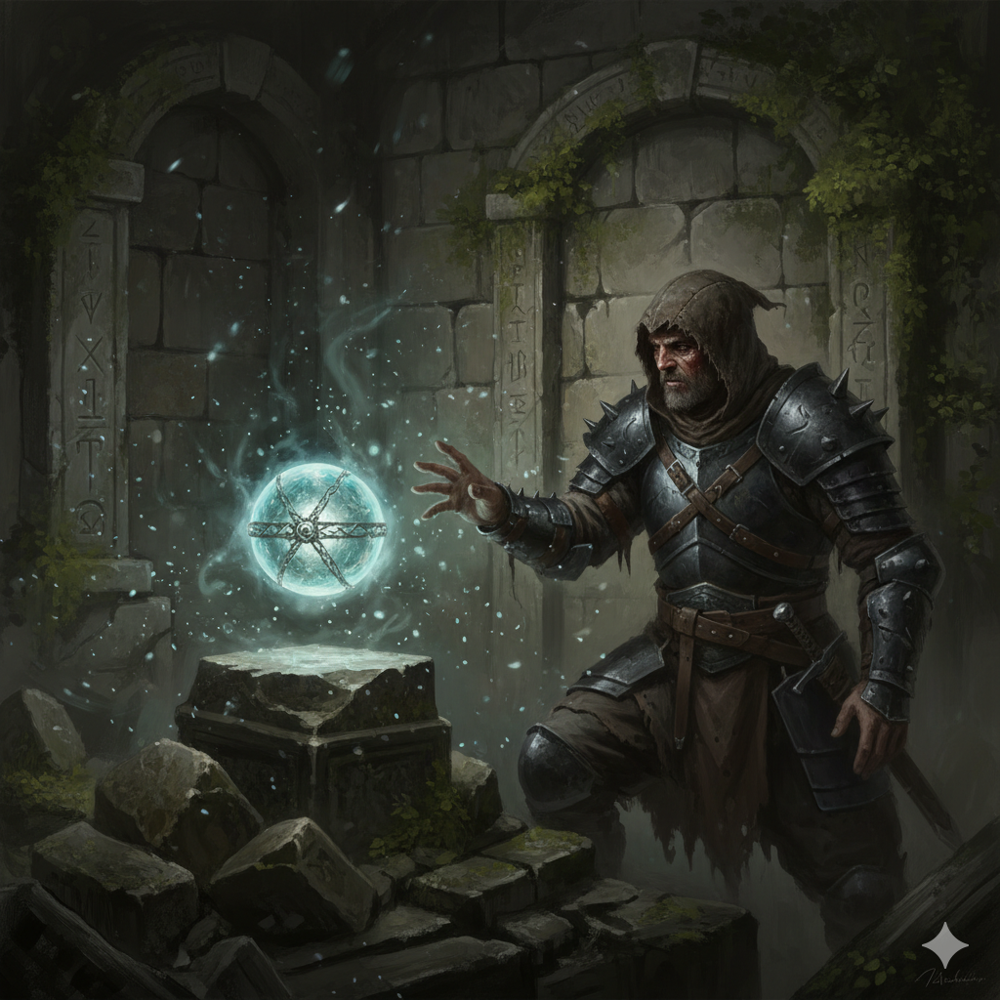

ARX LUMINA (The Real-Life Game)
========================================================
**Real-Life-Gaming Guide, 2nd Edition**

*Authors: Miker, Claude Sonnet 4, Claude Sonnet 4.5*



(Version 1.1.0, 12.01.2026)

<div style="page-break-after: always"></div>

# DISCLAIMER
## MIT License
Copyright (c) 2026

Permission is hereby granted, free of charge, to any person obtaining a copy
of this software and associated documentation files (the "Software"), to deal
in the Software without restriction, including without limitation the rights
to use, copy, modify, merge, publish, distribute, sublicense, and/or sell
copies of the Software, and to permit persons to whom the Software is
furnished to do so, subject to the following conditions:

The above copyright notice and this permission notice shall be included in all
copies or substantial portions of the Software.

THE SOFTWARE IS PROVIDED "AS IS", WITHOUT WARRANTY OF ANY KIND, EXPRESS OR
IMPLIED, INCLUDING BUT NOT LIMITED TO THE WARRANTIES OF MERCHANTABILITY,
FITNESS FOR A PARTICULAR PURPOSE AND NONINFRINGEMENT. IN NO EVENT SHALL THE
AUTHORS OR COPYRIGHT HOLDERS BE LIABLE FOR ANY CLAIM, DAMAGES OR OTHER
LIABILITY, WHETHER IN AN ACTION OF CONTRACT, TORT OR OTHERWISE, ARISING FROM,
OUT OF OR IN CONNECTION WITH THE SOFTWARE OR THE USE OR OTHER DEALINGS IN THE
SOFTWARE.

## ILLUSTRATIONS
All images created by Google Nano Banana 2.5 Flash via Google AI Studio. Prompts generated by Claude Sonnet 4.5.

<div style="page-break-after: always"></div>

# TABLE OF CONTENTS
1. Welcome
2. Real Life Acitivities
3. Adventure Awaits
4. Appendix

<div style="page-break-after: always"></div>

# 1. WELCOME
Welcome to a completely new roleplaying concept: A system that transforms your everyday activities into heroic character development. Imagine cleaning your bathroom could help your virtual character prevail in their next great battle, or tidying up the basement would help them win important allies.

## SOLO FIRST
This system is primarily designed for solo play, where you are the only player working with a Game Master. This eliminates complex balance issues between players at different development stages. 

## AI GAME MASTER
We strongly encourage you to use an AI-powered system like ChatGPT, Gemini or Claude to function as your Game Master. By providing it the Arx Lumina Core Rulebook and the Fate Core System Rules and an idea of how your fantasy world should look like, those narrative language models are more than capable to offer you a motivating and entertaining experience. Additionally we created an "AI Gamemasters Hints" book, optimized for Claude Sonnet but also usable with other AIs. This provides detailed role descriptions and an introduction to the Journey-MCP-Server, which can be use to persist gameplay experience throughout the course of several sessions.

## WHAT YOU NEED
The Real-Life-Gaming Guide (this rulebook) covers **Real Life Acitivites and Adventuring Rules**. The latter are explained briefly and can be found in more detail in the **Fate Core System rulebook**, which provides:

- Core rules for rolling dice and resolving actions
- Combat and conflict resolution
- Skills and stunts mechanics
- GM guidelines for running adventures

**Fate Core is available at:** https://fate-srd.com (free) or through your local game store.

You also need the Character Creation Guide. That guide covers **Character Generation and Progression** - how to create and develop your character using Real Life XPs (rl-xps). 

**Think of it this way:** The "Real-Life-Gaming Guide" gives you the concepts of gaining rl-xps, the "Character Creation Guide gives you the character. Fate Core gives you the game to play with that character.

What about the world? The Arx Lumina Real Life Game comes with a fantasy setting described in the **Arx Lumina Sourcebook**. You can give this grim dark fantasy world a try, although you can play in any setting you can think of, even your favorite movie or show.

## Getting started real quick
Now that you have all the resources required, it is easy to get startet. Choose your favorite AI, upload the rulebooks and start to chat. Tell the AI, what game world you like to play in. And let the AI guide you through the character creation, progression and adventuring. It is the one thing AI is absolutely good at.

<div style="page-break-after: always"></div>

# 2. REAL LIFE ACTIVITIES



## GETTING STARTED
### The Core Idea
The Real Life Game operates on a simple principle: Every productive activity in your real life empowers your character's story.

**During Character Generation**: Your activities fuel dice rolls that shape your character's backstory - their skills, aspects, and artifacts earned through years of career development. Each real-world effort gives you a chance to develop your character's history.

**During Active Play**: Your activities directly translate into Fate Points - the currency of narrative power that lets you perform heroic actions and overcome challenges in your adventures.

In both cases, your real-world discipline and effort directly benefit your character. The system rewards consistency and genuine effort, creating a meaningful connection between your daily life and your character's heroic journey.

### The Motivation Behind It
The Real Life Game solves a fundamental problem: How do you motivate yourself for tedious but necessary everyday tasks?

By linking them to your character and their adventures, even the most mundane activities gain a heroic framework. Cleaning the bathroom becomes a small act of discipline that prepares your character for their next great challenge.

By the way: This system should not replace what you already enjoy doing. If you're already enthusiastically doing sports, you shouldn't use that as your daily challenge. Instead, the system focuses on things that require overcoming resistance - and makes them part of your heroic journey.

**IMPORTANT HEALTH NOTE:**
This system is meant to motivate productive activities, NOT to encourage overwork or exhaustion. Rest, relaxation, and self-care are essential - they don't earn XP because they're already valuable. If you find yourself sacrificing sleep or health to earn XP, you're missing the point. The goal is sustainable motivation, not burnout.

## The Point System
### XP Assignment
Each day you can earn 1-2 Experience Points (XP) through productive activities:
- **1 XP**: You were reasonably active (normal housework, small errands)
- **2 XP**: You were particularly active or really pushed yourself

The evaluation is up to you - you are your own "employer". Honesty is essential, because ultimately you're only cheating yourself if you undermine the system.

**Example Activities**: Cleaning, shopping, walking, decluttering, meeting friends, gardening, repairs - anything that's productive and requires overcoming resistance.

### Choose Your Own World
**The Power of World Choice**: One of the most important decisions is choosing your game world. Instead of playing in a generic fantasy world, you can choose a world that truly excites you:

- **Your Favorite Sci-Fi Universe**: Your cleaning mission becomes purging a hostile base
- **Your Favorite Fantasy Epic**: Court diplomacy instead of inviting friends to dinner
- **Your Favorite Space Opera**: Maintaining your starfighter instead of car repair
- **Your Preferred Superhero Universe**: Superhero training instead of regular workout

The emotional connection to a world you already love makes the difference between "I have to clean" and "I have to purge this enemy hideout". The pseudo-heroism only works if you truly identify with the game world.

**For a quick start:**
Arx Lumina has its own world in mind. If you are into dark fantasy, you can give the Arx Lumina Sourcebook a try.

---

*"Every day is a new chapter in your character's saga. The only question is: What story do you want to tell?"*

<div style="page-break-after: always"></div>

# 3. ADVENTURE AWAITS



*Your character is ready. Now it's time to play!*

---

## OVERVIEW

This rulebook covers **Character Generation and Progression** for Arx Lumina. For actual gameplay - how to run adventures, resolve conflicts, and tell stories - consult the **Fate Core System rulebook**.

Below is a quick reference to the most important Fate Core sections you'll need.

<div style="page-break-after: always"></div>

## CORE GAMEPLAY MECHANICS

### **The Basics (Fate Core Chapter 2)**
- **The Four Actions:** Overcome, Create Advantage, Attack, Defend
- **Rolling Dice:** 4dF + Skill vs. Difficulty or Opposition
- **The Ladder:** From Terrible (-2) to Legendary (+8)
- **Invoking Aspects:** Spend Fate Points for +2 or reroll
- **Compels:** GM offers Fate Point to complicate your life

**→ See Fate Core: "Actions and Outcomes" (p. 132)**

---

### **Aspects and Fate Points (Fate Core Chapter 4)**
- **Using Aspects:** Invoke for bonus, Compel for complications
- **Creating Aspects:** Through "Create Advantage" action
- **Free Invokes:** First use of created aspect is free
- **Aspect Types:** Character, Situation, Consequences, Boosts

**→ See Fate Core: "Aspects and Fate Points" (p. 56)**

---

### **Skills (Fate Core Chapter 5)**
- **Skill List:** 18 default skills (Athletik, Fight, Wissen, etc.)
- **Skill Actions:** What each skill can do
- **Skill Descriptions:** Detailed explanations of each skill
- **Creating New Skills:** Guidelines for custom skills

**→ See Fate Core: "Skills and Stunts" (p. 93)**

---

## RUNNING ADVENTURES

### **Challenges (Fate Core p. 147)**
**When to use:** Complex situations requiring multiple steps
- Series of Overcome actions
- Each roll represents one part of challenge
- Failure creates complications, not instant defeat

**Example:** Researching ancient artifact, navigating treacherous wilderness

---

### **Contests (Fate Core p. 150)**
**When to use:** Two sides competing for same goal
- Series of opposed rolls
- First to 3 victories wins
- Both sides can take action

**Example:** Chase scene, debate, racing to find clue first

---

### **Conflicts (Fate Core p. 152)**
**When to use:** Direct confrontation where harm can occur
- **Initiative:** Highest skill goes first
- **Zones:** Abstract positioning on battlefield
- **Actions:** Attack, Defend, Create Advantage, Overcome
- **Stress & Consequences:** Track damage taken
- **Conceding:** Surrender before being Taken Out (keep some control)

**Example:** Combat, social confrontation, mental battle

**→ See Fate Core: "Challenges, Contests, and Conflicts" (p. 143)**

---

## CONFLICT RESOLUTION QUICK REFERENCE

### **Stress Tracks**
- **Physical Stress [1] [2] [3] [4]** (if Kraft is high)
- **Mental Stress [1] [2] [3] [4]** (if Wille is high)
- Check box equal to damage OR multiple boxes adding up to damage
- Clear all stress after conflict ends

### **Consequences**
- **Light (-2):** Heals after one scene
- **Moderate (-4):** Heals after one session
- **Severe (-6):** Heals after one scenario

### **Taking Consequences**
- Name the consequence (must be descriptive)
- Can be invoked against you (like negative aspect)
- Can absorb stress to stay in fight

### **Being Taken Out**
- Opponent decides what happens to you
- You're out of the conflict completely
- Severe narrative consequences possible

### **Conceding**
- Surrender BEFORE opponent's attack resolves
- You control how you exit
- Gain 1 Fate Point + 1 per Consequence taken
- Better than being Taken Out!

**→ See Fate Core: "Stress and Consequences" (p. 56) and "Conflicts" (p. 152)**

---

## STUNTS REFERENCE

### **What Stunts Do**
- Add +2 to skill in specific situation
- Substitute one skill for another in narrow circumstance
- Create special once-per-session effect
- Represent exceptional training, equipment, or abilities

### **Stunt Examples**
```
"Because I am a [describe specialty], I get +2 when I use [skill] 
to [specific action] when [circumstance]."

"Because I [describe feature], once per session I can [cool thing]."

"Because I have [item/ability], I can use [skill] instead of [skill] 
when [circumstance]."
```

### **Creating Stunts**
Work with your GM to create Stunts that:
- Fit your character concept
- Are narrow enough to be special
- Add interesting options without breaking game
- Cost 1 Refresh each (beyond 3 free)

**→ See Fate Core: "Building Stunts" (p. 89)**

---

## RUNNING THE GAME (FOR GMs)

### **Setting Difficulties (Fate Core p. 133)**
```
+0: Easy - routine tasks under pressure
+2: Fair - slightly challenging
+4: Great - tough but achievable
+6: Fantastic - extremely difficult
+8: Legendary - nearly impossible
```

**GM Tip:** If success/failure are both interesting, roll dice. If not, just succeed.

---

### **Creating NPCs (Fate Core p. 213)**

**Nameless NPCs** (Mooks)
- 1-2 aspects
- 1-2 skills at +2
- 0-1 stress boxes
- No consequences

**Supporting NPCs** (Recurring characters)
- 3 aspects
- 3-5 skills (fair spread)
- 1-2 stress boxes
- 1 consequence (mild)

**Main NPCs** (Major antagonists)
- Full character sheet like PCs
- 5 aspects, full skill pyramid
- Full stress and consequences
- Multiple stunts

**→ See Fate Core: "Creating the Opposition" (p. 213)**

---

### **Running Scenes (Fate Core p. 232)**

**Scene Structure:**
1. **Establish:** Where are we? Who's here? What's happening?
2. **Set Stakes:** What do characters want? What's at risk?
3. **Resolve:** Challenge, Contest, or Conflict?
4. **Conclude:** What changed? What happens next?

**Pacing Tip:** Not every scene needs dice. Save rolls for when outcome matters.

---

## FATE POINT ECONOMY

### **Starting Refresh: 3 FP**
- Begin each session with Refresh amount
- Can carry over more from previous session
- Earn more through Compels during play

### **Earning Fate Points**
- **Accept Compel:** +1 FP when aspect complicates your life
- **Concede Conflict:** +1 FP + 1 per Consequence taken
- **Self-Compel:** Volunteer your aspect for complication, GM awards FP

### **Spending Fate Points**
- **Invoke Aspect:** +2 or reroll (1 FP)
- **Declare Story Detail:** Add minor fact to scene (1 FP)
- **Refuse Compel:** Pay 1 FP to avoid complication (rare!)

**Balance Tip:** Fate Points should flow. Players spend them for awesome moments, earn them back through complications. This creates dynamic stories.

---

## SESSION STRUCTURE

### **Typical Session Flow**

1. **Refresh Fate Points** to starting Refresh
2. **Recap:** What happened last time?
3. **Scene 1:** Set up situation, establish stakes
4. **Scene 2-4:** Build tension, complications arise
5. **Climax:** Major conflict or decision point
6. **Resolution:** Consequences, what changed?
7. **Preview:** Hint at next session's events

### **Between Sessions**
- Clear all stress
- Track Real Life XP for weekly Fate Point conversion
- Note changed aspects, new consequences
- Update character sheet

---

## QUICK START CHECKLIST

**For Players:**
- [ ] Understand the 4 Actions (Overcome, Advantage, Attack, Defend)
- [ ] Know how to invoke your Aspects
- [ ] Understand your Skills and Stunts
- [ ] Track your Stress and Consequences
- [ ] Manage your Fate Points

**For GMs:**
- [ ] Prepare scenes with clear stakes
- [ ] Create interesting NPCs
- [ ] Set appropriate difficulties
- [ ] Compel aspects to create drama
- [ ] Award Fate Points for good roleplay
- [ ] Keep Fate Points flowing

---

## FINAL NOTE

**Fate Core is your gameplay bible.** This rulebook gives you characters and progression. Fate Core gives you everything else:
- How to run adventures
- Detailed combat rules
- Social conflict mechanics
- World-building tools
- GM advice and techniques

**Don't memorize everything.** Learn the basics (4 Actions, rolling dice, using aspects), then reference the rest as needed. Fate is designed to be learned through play.

**→ Get Fate Core at:** https://fate-srd.com or your local game store

---

**Now go forth and adventure in the dark world of Arx Lumina!**

<div style="page-break-after: always"></div>

# 7. APPENDIX

## CHARACTER SHEET TEMPLATE

```
NAME: ________________  AGE: _____
CAREER: ________________
CURRENT OCCUPATION: ________________

=== ASPECTS ===
Concept: ________________
Complication: ________________
________________
________________
________________

=== SKILLS ===
+4: ________________
+3: ________________  ________________
+2: ________________  ________________  ________________
+1: ________  ________  ________  ________

=== ARTIFACTS ===
1. ________________ [skill+X, frequency]
2. ________________ [skill+X, frequency]
3. ________________ [skill+X, frequency]

=== STRESS & CONSEQUENCES ===
Physical Stress: [1] [2] ([ ] [ ] if Kraft high)
Mental Stress: [1] [2] ([ ] [ ] if Wille high)
Light Consequence (-2): ________________
Moderate Consequence (-4): ________________
Severe Consequence (-6): ________________

Refresh: 3 FP
Stunts: _______ / 3 free
```
