ARX LUMINA (A Fate World)
=========================
**Sourcebook, Revised**

*Authors: Miker, Claude Sonnet 4, Claude Sonnet 4.5*

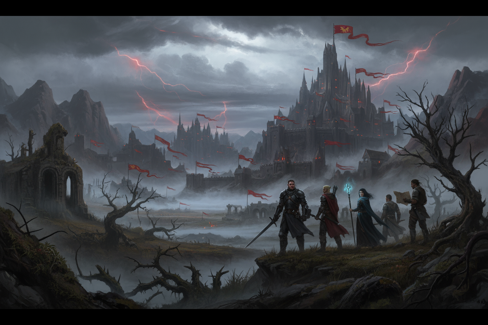

(Version 1.1.0, 02.11.2025)

# DISCLAIMER
## MIT License
Copyright (c) 2025

Permission is hereby granted, free of charge, to any person obtaining a copy
of this software and associated documentation files (the "Software"), to deal
in the Software without restriction, including without limitation the rights
to use, copy, modify, merge, publish, distribute, sublicense, and/or sell
copies of the Software, and to permit persons to whom the Software is
furnished to do so, subject to the following conditions:

The above copyright notice and this permission notice shall be included in all
copies or substantial portions of the Software.

THE SOFTWARE IS PROVIDED "AS IS", WITHOUT WARRANTY OF ANY KIND, EXPRESS OR
IMPLIED, INCLUDING BUT NOT LIMITED TO THE WARRANTIES OF MERCHANTABILITY,
FITNESS FOR A PARTICULAR PURPOSE AND NONINFRINGEMENT. IN NO EVENT SHALL THE
AUTHORS OR COPYRIGHT HOLDERS BE LIABLE FOR ANY CLAIM, DAMAGES OR OTHER
LIABILITY, WHETHER IN AN ACTION OF CONTRACT, TORT OR OTHERWISE, ARISING FROM,
OUT OF OR IN CONNECTION WITH THE SOFTWARE OR THE USE OR OTHER DEALINGS IN THE
SOFTWARE.

## ILLUSTRATIONS
All images created by Google Nano Banana 2.5 Flash via Google AI Studio. Prompts generated by Claude Sonnet 4.5.

# TABLE OF CONTENTS
1. Getting started

2. Creating Characters
- 2.1 Aspekte
- 2.2 Skills
- 2.3 Rollen

3. Die Welt von Arx Lumina
- 3.1 Eine Karte der bekannten Welt
- 3.2 Regionen des heiligen Reichs der Menschen
- 3.3 Unmenschen-Territorien
- 3.4 Die Finsterwelt

4. Die Völker von Arx Lumina
- 4.1 Menschen
- 4.2 Umbras
- 4.3 Ruptors
- 4.4 Ur-Untote

5. Gamemasters Section: History of Arx Lumina 
- 5.1 Das Ende der Hochkultur
- 5.2 Die Entstehung der Völker
- 5.3 Der Aufstieg des heiligen Reichs der Menschen
- 5.4 Die Gegenwart

6. Gamemasters Section: Memorable Characters of Arx Lumina
- 6.1 Lord Ingin
- 6.2 Lyraleth Velindara
- 6.3 Nala
- 6.4 Memorable NPCs

7. Gamemasters Section: Campaign-Settings
- 7.1 Wurf-Tabellen und Spielmechaniken
- 7.2 Die Bedrohung durch die Finsterwelt
- 7.3 Die Suche nach dem Genesis-Artefakt

8. Schlusswort

# 1. Getting started

Arx Lumina ist eine phantastische Welt, in der sich mehrere Völker nach dem Untergang einer menschlichen Hochkultur etabliert haben. Diese Völker befinden sich in einem dynamischen Zustand **zwischen fragilem Waffenstillstand und ausuferndem Krieg**. Sympathien zwischen den Völkern sind selten, angehörige anderer Völker in den Gesellschaften kaum anzutreffen. 

**GM-Hint**: Wir beschreiben in diesem Sourcebook die Situation für **Spieler im heiligen Reich der Menschen**. Der GM kann die Gruppe auch in ein anderes Volk transferieren, müsste dazu aber einiges an Background dafür ausarbeiten.

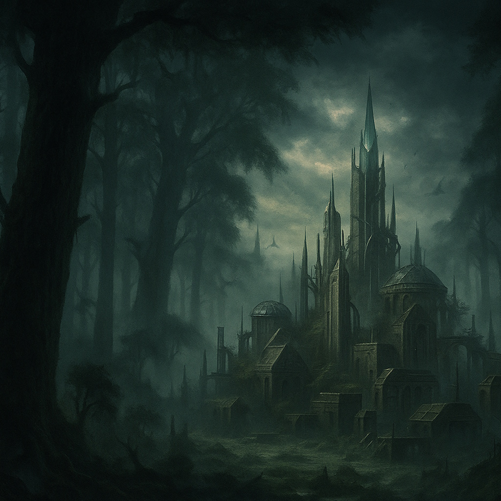

Es ist das **Jahr 1193** nach dem Untergang der Hochkultur. Schauplatz des Geschehens sind überwiegend die **Wilden Lande**, ein raues Gebiet mit dichten Wäldern, das von tierischen Bestien bevölkert wird. Es hat etwa die Größe von Kanada und auch dessen einsame Waldgebiete und Seenlandschaften erinnern an die "Wilden Lande". Es war das einstige Kerngebiet der untergegangenen Hochkultur, deren Ruinen dort nach wie vor zu finden sind - manche sogar vollständig unberührt, denn die "Wilden Lande" sind ein gefährlicher Ort, der viele schon das Leben gekostet hat. Mehr noch: Seid einigen Jahren regt sich dort eine **neue Gefahr**, die alle Völker in ihrer Existenz bedroht: Bizarre Kreaturen - weit gefährlicher als die tierischen Bestien - die aus einer **chaotischen Dimension**, der Finsterwelt, nach Arx Lumina vordringen und die Welt verwüsten. 

Wegen dieser Gefahr herrscht aktuell ein **Waffenstillstand** zwischen den Reichen. Während die Umbras und ihre Wildland-Division mit Spähtrupps das Gebiet sondieren, setzen die Ruptors auf ihre Kraft und Gewalt, und erkunden mit kleinen Kriegstrupps die "Wilden Lande", um die Dinge in Ordnung zu bringen. Dann streifen noch die Ur-Untoten durch die Lande, einer undurchschaubaren Agenda folgend. Nicht zu vergessen die Gefahren: Bestien, Finsterwelt-Kreaturen und das Land selbst.

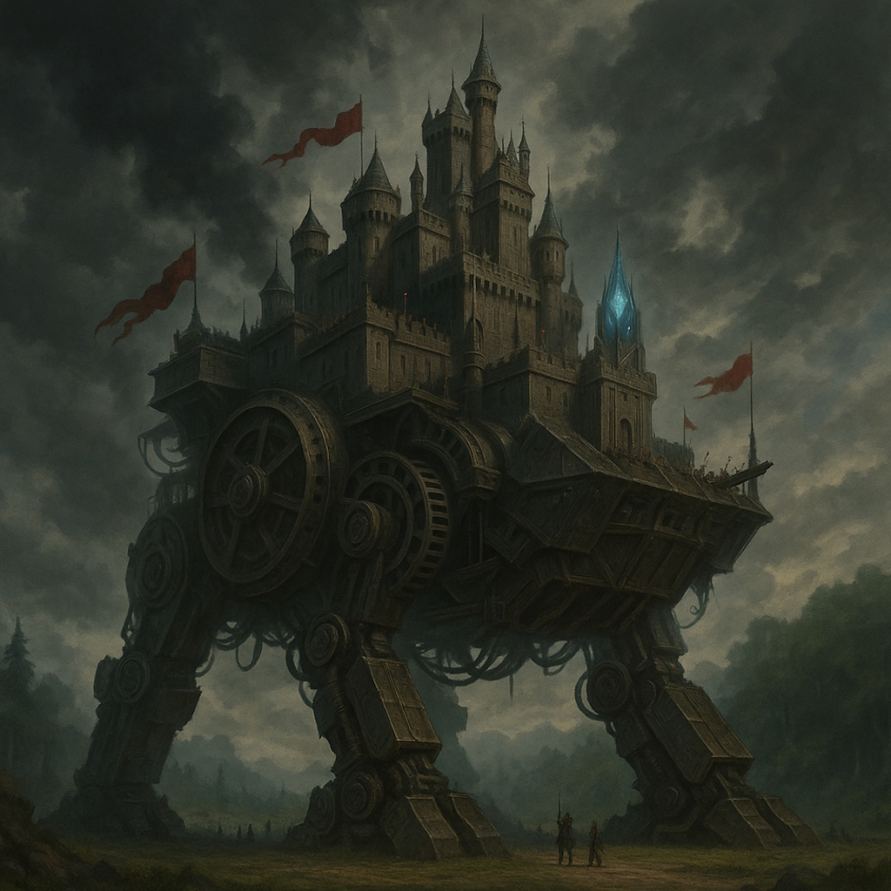 

**Und die Menschen?** Die Gottkönigin hat in ihrer Weisheit beschlossen, den wandelnden Koloss Venator Rex, eine der mobilen Festungsanlagen, an der Grenze zu den "Wilden Landen" zu stationieren. Von dort unternehmen **Corpi Exploratio** Aufklärungsmissionen, während **Corpi Bellum**, die im Koloss stationierten Truppen der königlichen Armee, größere Operationen unternehmen, um Gebiete zu sichern und Bedrohungen zurückzuschlagen.

Während der letzten Jahre haben sich diese Aktionen mehr und mehr von offensiven Vorstößen auf bloße Verteidigung verlagert. Angesichts der Zahl an Chaos-Kreaturen wird es zunehmend schwieriger, die Stellung zu halten. Die Zeit arbeitet gegen die Völker von Arx Lumina. Und das sollte den Spielern bewusst sein.

Apropos: Die Spieler sind Teil eines Corpus Exploratio. Als solchem besteht ihre Aufgabe darin, die "Wilden Lande" zu erforschen, Hinweise zu den Finsterwelt-Kreaturen zu sammeln, nützliche Artefakte aus Ruinen zu bergen und die Aktivitäten der anderen Völker dort zu beobachten. Einsätze dauern meist mehrere Wochen und verfolgen, neben dem zuvor genannten, ein konkretes Ziel. Bspw. die Untersuchung einer Ruine, eine Such-und-Rettungs-Mission, das Einfangen einer Chaos-Kreatur, das Ausspionieren anderer Völker, usw. Es wird nicht langweilige in den "Wilden Landen". Und die Zeit läuft.

**GM-Hints**: *Fünf übergeordnete Settings (Langzeit-Kampagnen) für den Spielleiter:*
- ***Die Erkundung der Finsterwelt***: *Sammeln von Informationen über Kreaturen, Dröhnen und Risse. Bekämpfen der Manifestationen in unserer Welt. Wie verschließt man die Risse zur Finsterwelt? Was ist auf der "anderen Seite"?*
- ***Die Erkundung der Ruinen***: *Welche Artefakte lassen sich dort finden (bspw.: Die "Genesis-Kammer" von Lord Aron)? Welche Hinweise auf ihre Erbauer?* 
- ***Der Umgang mit Expeditionen anderer Völker***: *Diplomatie oder Kampf? Zum gefürchteten Feind werden, oder aus den vereinzelten Kontakten in den "Wilden Landen" ein Netzwerk aufbauen?*
- ***Machtvakuum***: *Die Gottkönigin liegt im Sterben. Oder doch nicht? Gerüchte genügen, um Streitigkeiten unter den Paladinen zu entfachen. Was tun: Machtansprüche unterstützen? Oder Paladine sabotieren? Und was ist das Geheimnis der Gottkönigin und ihrer beiden Berater, die seid beinahe 500(!) Jahren das heilige Reich der Menschen regieren?*
- ***Das Geheimnis der Hochkultur***: *Abgesehen von den Ur-Untoten hat niemand eine auch nur oberflächliche Ahnung von der "Geschichte von Arx Lumina" (siehe entsprechendes Kapitel). Was ist in den letzten 1200 Jahren geschehen? Warum ist die Welt wie sie ist?*
*(Ausführliche Hinweise zu diesen Settings finden sich im Abschnitt "Gamemasters Section: Plots and Questhooks")*

**Bereit für eine Welt**, die die Grim Dark Atmosphäre von "Warhammer 40k" mit der Fantasy von "Vox Machina" und dem Chaos von "Southern Reach: Annihilation" kombiniert? **Arx Lumina wartet**

# 2. Creating Characters
Charaktere in Arx Lumina sind Angehörige der Armee oder zivile Spezialisten, die einem Corpus Exploratio angehören. Zur Charakter-Erstellung können die Fate Core Regeln verwendet werden. Dabei sollten folgende, für Arx Lumina spezifischen Modifikationen berücksichtigt werden:

## 2.1 Aspekte
Der Charakter besitzt ein Konzept, eine Komplikation und drei weitere Aspekte. Von den drei weiteren Aspekten spiegelt einer seinen **Rang in der Armee** oder seine **Reputation als Spezialist** wider (Beispielsweise ein Spitzname, den er/sie in der Truppe erhalten hat). Die beiden anderen sind jeweils ein positiver und ein problematischer Aspekt.

Beispiele für "Rank/Reputation-Aspect":
- Captain Schleifer, der seine Männer (und Frauen) immer zum Äußersten treibt
- Seargent Rückwärtig, den man im Gefecht immer weit hinten findet
- Die gründliche Sophie, die eine Theorie erst zig-mal prüft, bevor sie sie präsentiert

Die Spieler-Charaktere sind im heiligen Reich der Menschen geboren und aufgewachsen. Entweder in einer der Bollwerkstädte, deren Spezialisierung ihre Interessen und Fertigkeiten beeinflusst hat, oder in den ländlichen Regionen, in einer Erz- und Minensiedlung oder einer land- und forstwirtschaftlich geprägten Gegend.

Die Herkunft des Charakters beeinflusst sein Konzept und/oder seine Komplikation. 

Beispiele:
- Arme, ländliche Region: "Alles wächst und gedeiht", "Die Natur gibt mir alles, was ich zum überleben brauche", "Familienliebe heisst: An die Armee verkauft zu werden."
- Goldspire: "Ein Näschen fürs Geschäft", "Ich habe meine Seele für Gold verkauft", "Da hätte ich besser keine Schulden haben sollen"
- Shadowport: "Meine Loyalität hat einen Preis", "Ich habe vergessen, wem ich trauen kann.", "Jemand hat mich in der Hand"
- Minensiedlung: "Ich verstehe Stein, wie andere Menschen verstehen", "Die Gesichter der Toten verfolgen mich"

## 2.2 Skills
Der Charakter kann die Fate Core Skills erlernen, abgesehen von den folgenden, die in den "Wilden Landen" keine Rolle spielen:

- Fahren
- Handwerk
- Kontakte
- Nachforschung
- Provozieren
- Ressourcen

Zum Ausgleich kommen folgende Skills neu hinzu:

- Überleben
- Erste Hilfe
- Spezialwissen: Artefakte
- Spezialwissen: Mechanismen
- Spezialwissen: Geschichte
- Spezialwissen: Rohstoffe
- Spezialwissen: Spezies

**Überleben**
Die Fertigkeit Überleben zeigt an, wie gut sich ein Charakter abseits der Zivilisation, in der Wildnis oder einer lebensfeindlichen Umgebung behaupten kann. Es spiegelt seine Fähigkeiten wider, sich zu versorgen, zu orientieren und seine Sicherheit zu gewährleisten. 

Überwinden: Es gelingt dir, Nahrung zu finden oder einen geschützten Platz für ein Lager. Es gelingt dir, Feuer zu machen oder dich an den Sternen zu orientieren, was auch nützlich für die Kartierung von unbekannten Gebieten sein kann.

Einen Vorteil verschaffen: Wenn du einen Vorteil mit Überleben erschaffst, findest du eine Nahrungsquelle, zu der du zurückkehren kannst (bspw. wilde Kartoffeln, Beeren oder einen klaren Wasserlauf mit Fischen). Oder aber du hast das Camp so gut gesichert, dass keine Nachtwache erforderlich ist.

Angreifen: Mit Überleben kann man nicht Angreifen.

Verteidigen: Mit Überleben kann man sich nicht Verteidigen.

**Erste Hilfe**
Die Fertigkeit Erste Hilfe ermöglicht es, den Zustand eines anderen zu stabilisieren (Wunden säubern und verbinden, Brüche schienen). 

Überwinden: Leitet die Erholung einer physischen Konsequenz ein, die der Charakter behandelt hat.

Einen Vorteil verschaffen: Wenn du einen Vorteil mit Erste Hilfe erschaffst, dann verliert der Behandelte zusätzlich einen Stress, der kleiner als die Stufe der Konsequenz ist. 

Angreifen: Mit Erste Hilfe kann man nicht Angreifen.

Verteidigen: Mit Erste Hilfe kann man sich nicht Verteidigen.

**Spezialwissen**
Die Fertigkeit Spezialwissen und ihre verschiedenen Ausprägungen ersetzen Nachforschung. Sie sind genauso zu handhaben, bezogen auf ihr jeweiliges Gebiet. Daher erlauben sie neben Wissen und Expertise auf dem jeweiligen Gebiet entsprechende Nachforschungen zu initiieren:

- Artefakte: Untersuchungen bzgl. Zweck, Verwendung etc. von Artefakten der Hochkultur
- Mechanismen: Nachforschungen über die Funktionsweise von Apparaten, Maschinen und ähnlichem
- Geschichte: Verständnis der Geschichte von Arx Lumina und dem größeren Kontext der aktuellen Geschehnisse
- Rohstoffe: Verständnis über Art, Verwendung und Transport von Metallen, Mineralien, Substanzen etc. 
- Spezies: Untersuchung von Lebewesen, um Erkenntnisse über ihre Eigenschaften und ihr Verhalten zu gewinnen

**GM-Hint**: *In der Finsterwelt-Kampagne spielt der Umgang mit Artefakten eine wichtige Rolle. Um bspw. die Energiekristalle des Anti-Dröhn-Artefakts, eines Abwehrschirms gegen das Chaos, zu wechseln, ist eine Probe auf "Spezialwissen: Artefakte" oder "Spezialwissen: Mechanismen" von Nöten.*

In der Regel findet sich Spezialwissen als Fertigkeit bei den zivilen Spezialisten einer Expedition.

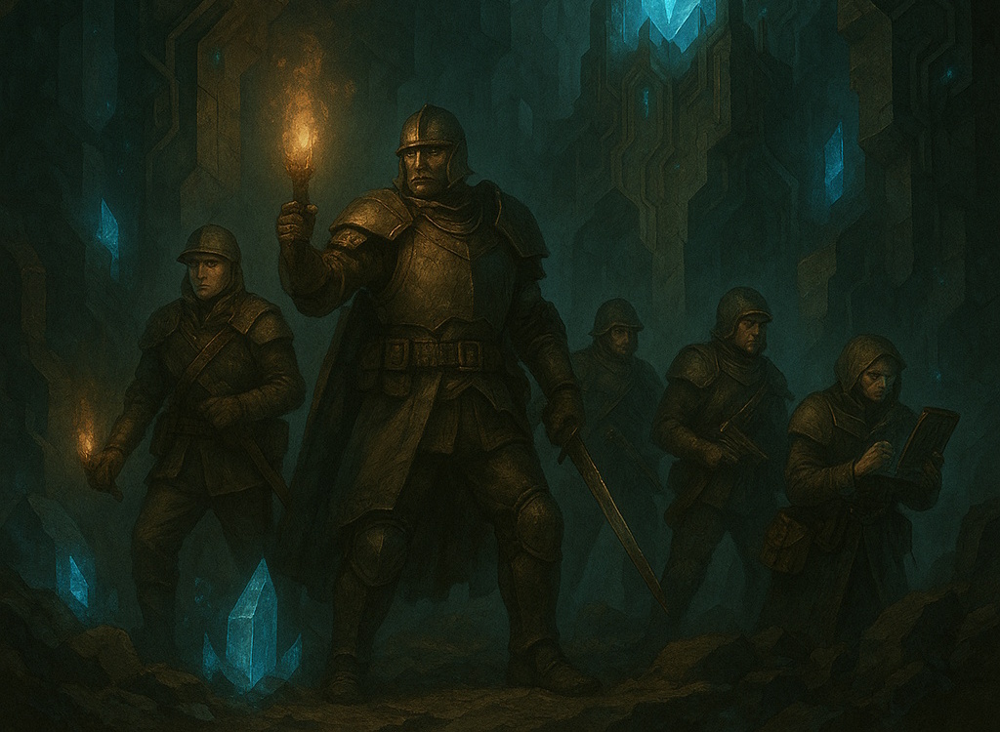

## 2.3 Rollen
Ein Corpus Exploration besteht aus vier bis sechs Mitgliedern: Ein Anführer, ein Späher, ein bis zwei Wissenschaftlern und zwei Soldaten, darunter ein Sanitäter. Während die wissenschaftler zivile Spezialisten sind, kommt der Rest aus der Armee. 

**Anführer** 
Offiziers-Rang. Taktische Fähigkeiten. Kommunikationsfähigkeiten. Soldatische Ausbildung.

**Späher**
Offiziers-Rang. Überlebensfähigkeiten. Schleichen und Beobachten. Soldatische Ausbildung.

**Sanitäter**
Mannschaftsrang. Erste Hilfe. Soldatische Ausbildung.

**Soldat**
Mannschaftsrang. Soldatische Ausbildung.

**Wissenschaftler**
Zivilist. Experte für ein Spezialgebiet. Ggf. Kenntnisse in einem zweiten, verwandten Spezialgebiet (bspw. Experte für Artefakte, Grundkenntnisse in Mechanismen)

# 3. Die Welt von Arx Lumina
Die Völker von Arx Lumina teilen sich einen großen Kontinent. Das heilige Reich der Menschen ist, nicht zuletzt aufgrund seines radikalen Eroberungsfeldzugs, den es in den letzten Jahrhunderten gegen die anderen Völker, die Umbras und die Ruptors, die es als "Unmenschen" bezeichnet, geführt hat, das flächenmäßig größte Gebiet. 

## 3.1 Die Karte der bekannten Welt

<pre>
                 xxxxxxxxxx          xxx
         xxx  xxx   +      xxxxxxxxxx   xx
        x   xx (a)  +                     x
         x           +  (e)             xx
         x++  UNDEAD  +              xxx
      xxx   +++       +  WILD       x           xxxxxx
    xx         ++   ++     LANDS   x           x      xxx
   x    (c)      +++              x            x        x
    x    UMBRAS   +      (d)      x             x    xxx
     xx           +                xx            x  x
       x         +++            +++  xxx          xx
        x   +++++   ++++     +++   (b)  xx
         x++      (8)   +++++   RUPTORS   x   TWO UNINHABITED ISLES
         x                   ++           x
       xx                  (1) +++++++ xxx            xxxxx
      x       (2)                     x             xx     x
    xx                 (9)      (3)  x             x       x
   x  (4)    HOLY HUMAN               x             x         x
  x            KINGDOM      (7)     xx              xx      x
   xxx                            xx                  xxxxxx
      xxxxx   (5)               xx
           xxxxxxxxxx   (6)  xxx
                     xxxxxxxx

x coastline",
+ borders",

(1) The Iron Frontier (Ruptors Border) [Grimhaven (Maximus' Castle)]
(2) Central Plains (The Golden Heart) [Goldspire (Thanes Trade Capitol); Wandering Colossus: Palatium]
(3) Eastern Woods (The Green Labyrinth) [Sanctum Medicae (Seraphines Laboratory Sanctum)]
(4) Foggy Harbours (Westcoast) [Shadowport (Corvus' Espionage Center)]
(5) Judgement Hills (Southern Highlands) [Justiciar's Throne (Lucias Dominion)]
(6) Nexus Desert (Stardust) [Stellar Observatory (Celestes Tower of Stars)]
(7) Volcanic Swamps (Fireland) [Purification Spires (Neros Castle of Flames)]
(8) Borderlands (Lost Lands) [Wandering Colossus: Ossuar, Vulcanicus, Architectus, Venator Rex]
(9) Holy Mysts (Divine Mysterium) Sanctum Imperialis (hidden)

(a) Mortis Eterna (Undead Necropole)
(b) Mighty Big Warcamp (Ruptors)
(c) Nexus Umbra (Umbras)
(d) Persephone Complex (Former Undead Research Facility, hidden)
(e) Camp Ingin (hidden)

</pre>

## 3.2 Optional: Regionen des heiligen Reichs der Menschen
Es folgt eine kleine Gebietskunde der Regionen des heiligen Reichs der Menschen. Diese sind für eine Kampagne in den "Wilden Landen" nicht zwingend erforderlich, können aber zum Verständnis der Gesellschaft und zum Hintergrund der Charaktere beitragen.

### 3.2.1 Gebiete
**(1) Die Eiserne Grenze**
Die nördlichsten Gebiete des Reichs sind eine natürliche Festungslinie gegen das Reich der Ruptors. Die Berge selbst sind durch jahrzehntelangen Krieg vernarbt - gesprengte Pässe, verfallene Außenposten und Schlachtfeld-Friedhöfe prägen die Landschaft. Nebel steigt permanent aus den Tälern auf, und niemand weiß, ob es natürlicher Dunst oder der Einfluss der Finsterwelt ist. Die einheimische Bevölkerung ist hart wie das Gestein - Bergbauern und Söldner, die täglich ums Überleben kämpfen.

**(2) Zentrale Ebenen (Das Goldene Herz)**
Das wirtschaftliche Rückgrat des Reichs - endlose Kornfelder, Handelsstraßen und Karawansereien. Hier kreuzen sich alle großen Handelswege, weshalb Goldspire zum reichsten Ort der Reiches wurde. Doch selbst diese 'sichere' Region zeigt Kriegsspuren: verlassene Dörfer nach Ruptor-Überfällen, schwer bewachte Konvois und Galgen an jeder größeren Kreuzung. Die wandelnden Kollosse hinterlassen massive Fußspuren, die zu neuen Seen und Sümpfen werden.

**(3) Östliche Wälder (Das Grüne Labyrinth)**
Einst waren dies die heiligen Haine der alten Götter. Heute sind die Wälder verdorben - Bäume wachsen in unnatürlichen Formen, Pflanzen haben Zähne entwickelt, und die Pfade führen nie zweimal zum selben Ziel. Sanctum Medicae liegt in einer gerodeten Lichtung, umgeben von sterilen Schutzwällen. Die Einheimischen sind entweder Seraphines Forschungsassistenten oder primitive Waldläufer, die gelernt haben, mit der Korruption zu leben.

**(4) Die Nebelhäfen (Westküste)**
Die Westküste ist in permanenten Nebel gehüllt, der auch bei klarem Wetter nicht weicht. Hier landen Schiffe aus fernen Ländern - und verschwinden wieder, ohne Spuren zu hinterlassen. Shadowport ist der einzige verlässliche Hafen, aber seine schmalen Gassen bergen mehr Geheimnisse als alle anderen Orte zusammen. Fischer erzählen von Geisterschiffen und Stimmen aus dem Nebel. 

**(5) Die Richter-Berge (Südliche Hochländer)**
Eine unwirtliche Region aus rotem Sandstein und schroffen Plateaus. Hier wurde Recht gesprochen, seit das Reich existiert - die Schluchten sind voller Galgenhügel und Hinrichtungsstätten. Justiciar's Throne thront auf dem höchsten Plateau, ein weißer Marmorpalast inmitten der roten Öde. Die wenigen Einheimischen sind harte Nomaden oder Einsiedler, die dem Gesetz des Reichs entflohen sind. Wasserstellen sind rar und umkämpft.

**(6) Der Sternensand (Wüste von Nexus)**
Eine mystische Wüste, wo Zeit anders fließt und die Sterne auch am Tag sichtbar sind. Stellar Observatory erhebt sich aus der größten Oase wie ein gefangener Stern. Die Dünen verschieben sich über Nacht, Karawanen verlieren sich in Zeitschleifen, und manche Reisende altern Jahre während einer einzigen Nacht. Die wenigen Beduinen-Stämme navigieren nach Sternbildern, die in anderen Regionen unbekannt sind.

**(7) Feuerland (Vulkanische Sümpfe)**
Eine höllische Landschaft aus brodelnden Vulkanen und giftigen Sümpfen. Hier 'reinigt' Nero die Welt mit heiligen Flammen, aber die Region war schon vor seiner Ankunft verflucht. Die Luft ist voller Asche und Schwefel, Lava-Ströme schaffen ständig neue Landschaften, und aus den Kratern steigen Dämpfe auf, die Visionen oder Wahnsinn bringen. Nur Fanatiker und Feuerbetende überleben hier dauerhaft.",

**(8) Die Grenzlande (Niemandsland)**
Die umkämpften Gebiete zwischen dem Reich, den Umbra und den Wilden Landen. Hier tobt der  Krieg seid Jahrzehnten - eine verwüstete Landschaft, verfallenen Festungen und Massengräbern. Die wandelnden Kollosse hinterlassen Spuren der Verwüstung, während Chaos-Kreaturen die Landschaft weiter zernarben. Ein gefährlicher Ort, an dem Zivilisten nur selten anzutreffen sind.

**(9) Die Heiligen Nebel (Göttliches Mysterium)**
Das mysteriöseste Gebiet des Reiches - eine Region permanent dichter Nebel, die jeden in die Irre führt, der nicht 'würdig' ist. Nur wenige kennen den wahren Pfad zum Sanctum Imperialis. Die Nebel scheinen lebendig zu sein, verändern Pfade und testen die Moral der Eindringlinge. Selbst Karten versagen hier - nur durch göttliche Führung oder besondere Gnade findet man den Weg.

### 3.2.2 Bollwerkstädte
Bollwerkstädte stellen die stark befestigten Zentren der Macht im heiligen Reich der Menschen dar. Sie unterstehen einem Paladin und unterhalten eine Garnision der Armee. 

**Grimhaven - Die Eiserne Festung**
- Herrscher: Maximus der Eiserne
- Region: Nördliche Berge
- Besonderheit: Schier uneinnehmbare Festung, vollständig in den Fels gehauen
- Garnison: 12.000 Soldaten
- Bevölkerung: 45.000
- Spezialisierung: Ausbildung der besten Verteidiger des Reichs

**Sanctum Medicae - Die Heilige Heilstätte**
- Herrscher: Seraphine die Fleischweberin
- Region: Östliche Wälder
- Besonderheit: Mehr Labor als Stadt, weiße Türme zwischen düsteren Experimentalkomplexen
- Garnison: 3.000 Soldaten
- Bevölkerung: 25.000
- Spezialisierung: Medizinische Forschung und Entwicklung

**Shadowport - Hafen der Geheimnisse**
- Herrscher: Corvus der Rabenfürst
- Region: Westküste
- Besonderheit: Permanenter Nebel, tiefe Schatten, Zentrum der Spionage
- Garnison: 6.000 Soldaten
- Bevölkerung: 80.000
- Spezialisierung: Geheimdienst und Informationshandel

**Goldspire - Stadt des ewigen Handels**
- Herrscher: Thane der Goldgierige
- Region: Zentrale Ebenen
- Besonderheit: Handelszentrum mit goldenem Turm, Thanes Waage schwebt über dem Markt
- Garnison: 8.000 Soldaten
- Bevölkerung: 120.000
- Spezialisierung: Wirtschaft und Handel des Reichs       

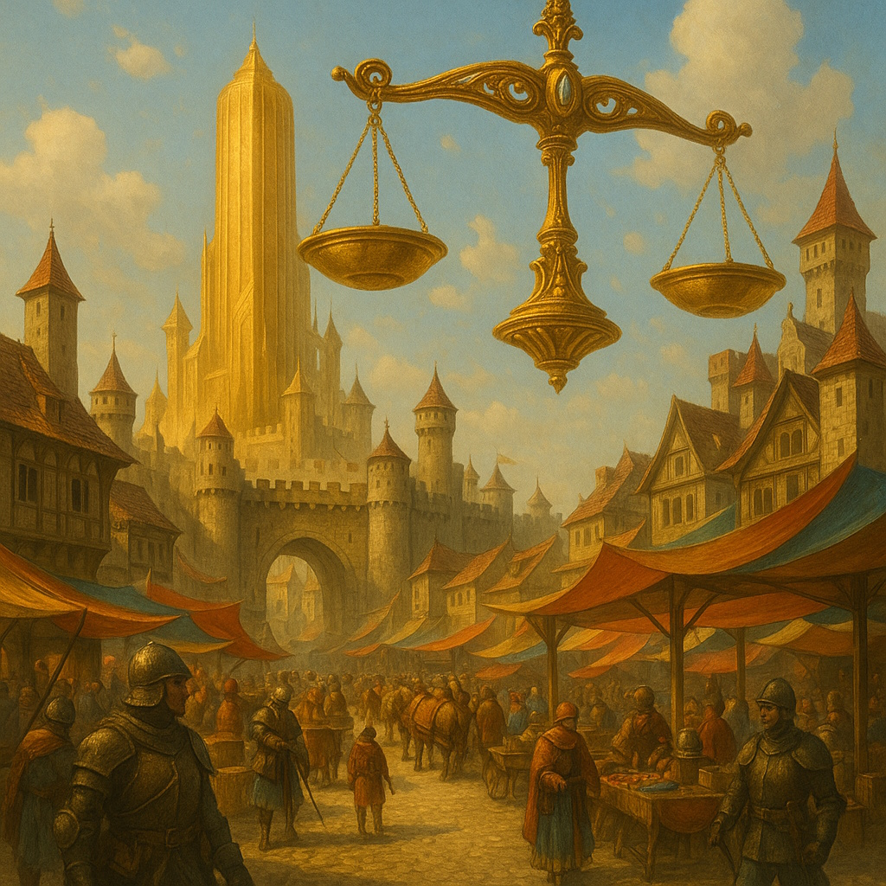       

**Justiciar's Throne - Sitz des Gesetzes**
- Herrscher: Lucia die Purpurklinge
- Region: Südliche Hochländer
- Besonderheit: Perfekt geometrische Stadt aus weißem Marmor
- Garnison: 7.000 Soldaten
- Bevölkerung: 60.000
- Spezialisierung: Rechtsprechung und Verwaltung

**Stellar Observatory - Turm der Sterne**
- Herrscher: Celeste die Sternenwächterin
- Region: Wüstenoase
- Besonderheit: Gewaltiger Kristallturm, Zeit fließt anders
- Garnison: 2.000 Soldaten
- Bevölkerung: 15.000
- Spezialisierung: Prophezeiungen und mystische Forschung

**Purification Spires - Die Flammenstädte**
- Herrscher: Nero der Flammenherr
- Region: Vulkanregion
- Besonderheit: Schwarzes Vulkangestein, Lavakanäle, heilige Flammen
- Garnison: 10.000 Soldaten
- Bevölkerung: 40.000
- Spezialisierung: Inquisition und Glaubensreinigung

**Sanctum Imperialis - Der Hochtempel**
- Herrscher: Die Gottkönigin
- Region: Heilige Nebel
- Besonderheit: Nur Würdige finden den Weg durch die schützenden Nebel
- Garnison: 5.000 Soldaten
- Bevölkerung: 8.000
- Spezialisierung: Religiöses Zentrum des Reichs

### 3.2.3 Die Wandelnden Kollosse 
Wandelnde Kollosse sind monumentale Kampfmaschinen von der Größe einer kleinen Stadt. Sie transportieren Truppen und Nachschub und sind ebenso wehrhaft, wie die Bollwerkstädte.

**Ossuar - Morteus' Gehende Festung**
- Typ: Mobile Kommandozentrale
- Besatzung: 25.000 (15.000 Garnison)
- Besonderheit: Wandelnder Albtraum aus Stahl und Knochen, dirigiert Feldzüge

**Palatium - Valerius' Mobile Hofburg**
- Typ: Diplomatisches Zentrum
- Besatzung: 35.000 (8.000 Garnison)
- Besonderheit: Eleganter Palast aus Marmor und Gold, Zentrum der Hofkultur

**Vulcanicus - Magnus' Gehende Schmiede**
- Typ: Mobile Waffenschmiede
- Besatzung: 20.000 (12.000 Garnison)
- Besonderheit: Glühender Koloss, produziert das beste Equipment des Reichs

**Architectus - Octavius' Konstruktions-Koloss**
- Typ: Mobile Bauzentrale
- Besatzung: 18.000 (10.000 Garnison)
- Besonderheit: Kann im Marsch Brücken bauen und Festungen errichten

**Venator Rex - Darius' Jäger-Koloss**
- Typ: Mobile Jagdmaschine
- Besatzung: 12.000 (7.000 Garnison)
- Besonderheit: Schnell und lautlos, perfekte Verfolgungsmaschine

## 3.3 Unmenschen-Territorien
### 3.3.1 Mortis Aeterna
- Lage: Nördliche Regionen, jenseits der Gebirgspässe von Grimhaven
- Klima: Arktische Kälte, ewiger Winter, unnatürliche Stille
- Terrain: Marmorne Nekropolen, gefrorene Ebenen, endlose Wildnis

**Die Region**
Mortis Aeterna ist die Heimstatt der größten Ur-Untoten-Fraktion - etwa 14 Ur-Untote und ihre skelettale Legionen und Zombie-Armeen residieren hier. Die Region ist eine eine ungezähmte Wildnis, mit kurzen Sommern und harschen Wintern. Im Norden ragt die monumentale Nekropole der Ur-Untoten, die Zitadelle, aus der gefrorenen Erde, perfekt erhalten durch die Kälte und nekromantische Energien, perfekt verteidigt und kaum einnehmbar.

**Charakteristika**
- Untoten-Zitadelle: Zentrum der Macht, wo der "Sprecher der Untoten" residiert
- Kristall-Archive: Bibliotheken mit konserviertem Hochkultur-Wissen
- Reanimations-Werkstätten: Wo neue Skelett- und Zombie-Truppen entstehen
- Lady Baleas Museum of Lost Art (MoLA): Verborgene Sammlung aller Hochkultur-Kunst

### 3.3.2 Mighty Big Warcamp
- Lage: Zentrale östliche Ebenen und Wälder
- Klima: Gemäßigt bis rau, wechselnde Jahreszeiten
- Terrain: Weitläufige Jagdgründe, temporäre Kriegslager, zerstörte Dörfer

**Die Region**
Mighty Big Warcamp ist kein einzelner Ort, sondern ein sich ständig veränderndes Netzwerk nomadischer Ruptor-Stämme. Die Region ist von jahrhundertelangem Krieg gezeichnet - verbrannte Wälder, ausgetrocknete Flüsse, und die Überreste von Schlachtfeldern prägen das Land.

**Charakteristika**:
- Nomadische Kriegslager: Große Zeltlager, die alle paar Wochen umziehen
- Jagdgründe: Riesige Territorien, die von einzelnen Clans beansprucht werden
- Blutork-Arenen: Kämpfstätten, wo Blutorks ihren Schmerz durch Kampf lindern
- Stammesheiligtümer: Primitive Schreine für Ahnenverehrung

### 3.3.3 Nexus Umbra
- Lage: Westliche Sümpfe und Küstenregionen
- Klima: Feucht, neblig, permanent dämmrig
- Terrain: Tiefe Sümpfe, versteckte Stadtstaaten, unterirdische Komplexe

**Die Region**
Nexus Umbra ist das Territorium der Umbras - eine Ansammlung militärisch organisierter Stadtstaaten, die sich aus den westlichen wilden Landen zurückzogen, nachdem sie vor 1410 Jahren die Ur-Untoten besiegten. Die Region ist geprägt von tiefen Sümpfen, die natürliche Verteidigung bieten, und streng hierarchischen Stadtstaat-Strukturen.

**Charakteristika**
- Militärische Stadtstaaten: Jeder Stadtstaat ist eine Festung
- Unterirdische Anlagen: Produktionsstätten und Forschungslabore
- Sumpf-Festungen: Perfekt getarnt und schwer anzugreifen
- Handelsposten in den Grenzlanden: Inoffizielle Kontakte zum Menschenreich (Spionage, Handel)

### 3.3.4 Die "Wilden Lande"
Lage: Vom Zentrum bis in den Norden und Osten
Klima: Variiert, oft unnatürlich und instabil
Terrain: Ruinen der Hochkultur, mutierte Wälder, Finsterwelt-Risse

**Die Region**:
Die "Wilden Lande" sind der gefährlichste und rätselhafteste Teil von Arx Lumina. Hier liegen die Überreste der Hochkultur - Ruinen, Artefakte, und gescheiterte Experimente. Seit 50 Jahren dringen zusätzlich Finsterwelt-Kreaturen durch dimensionale Risse ein, was die Region noch tödlicher macht.

**Charakteristika**
- Hochkultur-Ruinen: Verfallene Städte, Labore, Fabriken
- Persephone-Komplex: Halb zerstört, teilweise wieder aufgebaut
- Camp Proserpina: Verlassen, aktuell im Einflussbereich des Chaos-Dröhnens
- Camp Demeter: Vorgelagerter Ur-Untoten Posten zur Untersuchung der Vorgänge in Persephone
- Camp Ingin: Lord Ingins Basis für die Genesis-Artefakt-Suche
- Weitere Finsterwelt-Risse: Dimensionale Anomalien, durch die Finsterwelt-Kreaturen eindringen
- Mutierte Ökosysteme: Genetische Experimente, die zu Bestien wurden
- Defekte Verteidigungssysteme: Hochkultur-Roboter, die noch "Eindringlinge" bekämpfen

## 3.4 Die Finsterwelt
Als Finsterwelt bezeichnet man die Dimension jenseits der Risse. Der menschliche Verstand kann die Finsterwelt nicht direkt verarbeiten. Also übersetzt er sie in etwas, das er kennt - aber diese Übersetzung ist gefährlich falsch.

**Elemente**
- Kristalline Wälder: Bäume aus durchsichtigem Material, die in unmöglichen Winkeln wachsen.
- Lebende Geometrie: Pflanzen, die sich nach mathematischen Mustern bewegen.
- Fraktale Kreaturen: Tiere, die sich selbst in allen Größenordnungen wiederholen.
- Schimmernde 'Luft': Raum selbst scheint zu atmen, zu pulsieren.
- Überwältigende Melodie: Die Melodie wird überwältigend klar und komplex.
- Nicht-lineare Echos: Echos kommen vor den Geräuschen.
- Vibrierende Stille: Abwesenheit von Klang fühlt sich aktiv an.
- Fremde Stimmen: Stimmen in unbekannten Sprachen, die trotzdem Sinn ergeben.
- Unmögliche Texturen: Oberflächen fühlen sich 'zu glatt' oder 'zu rau' an - als ob Textur eine Eigenschaft hätte, die fehlt.
- Paradoxe Temperaturen: Temperaturen, die gleichzeitig heiß und kalt sind.
- Fluktuierende Schwerkraft: Manchmal schwerer, manchmal schwerelos.

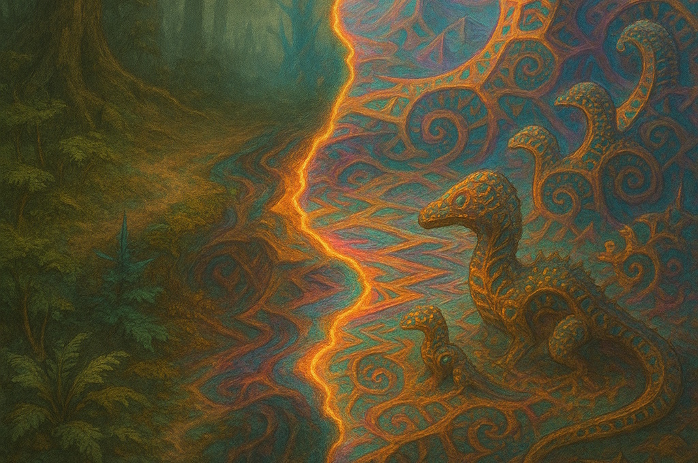

Die Finsterwelt **verändert Abenteurer**, die sich längere Zeit in ihr bewegen. Es beginnt mit Desorientierung und Halluzinazionen. Dann setzt eine kognitive Fragmentierung ein und schließlich eine physische Transformation. Nach etwa einer Woche ist der Spieler **nicht mehr spielbar**, wird zu einem NPC der Finsterwelt.

# 4. Die Völker von Arx Lumina
Wir beschreiben in diesem Abschnitt die einzelnen Völker von Arx Lumina. Dazu vorab einige allgemeingültige Informationen zum technologischen Entwicklungsstand:

**Allgemeiner Entwicklungsstand**
- Waffen: Schwerter, Bögen, Armbrüste - kein Schießpulver (Alle modernen Waffen sind im Laufe der letzten zwei Jahrtausende verloren oder kaputt gegangen. Lediglich einige Artefakte zeugen noch vom Potential und den Errungenschaften der alten Hochkultur.). 
- Rüstungen: Leder bis Plattenpanzer. 
- Transport: Pferde, Karren, Segelschiffe. 
- Kommunikation: Boten, Brieftauben, Signalfeuer. 
- Produktion: Handwerk, einfache Maschinen (Wassermühlen, Windmühlen). 
- Wissen: Bücher existieren (post-Druckerpresse), aber teuer.

**Besonderheiten:**
- **Ur-Untote:** Zugriff auf Technologie der Hochkultur, bspw. Synthetisieren von Energiekristallen in der Zitadelle. Allerdings ist das Entwickeln und Bauen technologisch hochwertiger Dinge ein langwieriger Prozess geworden. Man kann hier nicht einfach etwas "bestellen". Die Ur-Untoten arbeiten in Monaten oder Jahren auf die Fertigstellung neuer Artefakte oder Maschinen hin. Etwa wenn es um die Unterstützung der Rüstungsanstrengungen der Umbras geht, ist dies ein Prozess von mehreren zehn Jahren.
- **Menschen:** Wandelnde Kolosse, Bollwerkstätte: Durch eine glückliche Fügung konnte die Gottkönigin zu Beginn ihrer Herrschaft einen tiefen Lagerbunker der Hochkultur im nördlichen Gebiet der Menschen ausfindig machen, der intakte Technologie für Titanen-Kampfmaschinen beherbergte. Aus diesen schmiedeten sie die Wandelnden Kolosse und rüsteten die Bollwerkstädte weiter auf.

## 4.1 Menschen
Arx Lumina ist eine düstere Welt des permanenten Krieges, beherrscht vom **Heiligen Reich der Menschen** - einer militärischen Theokratie unter der gottgleichen **Gottkönigin**. Das Reich führt einen Drei-Fronten-Krieg: gegen die **Unmenschen** (Vernichtungskrieg), die **Finsterwelt** (Abwehrkampf) und interne Säuberungen durch die **Reformation**. 500 Jahre Kriegserfahrung haben das auserwählte Volk der Gottkönigin zu effizienten Soldaten gemacht. Gesellschaft vollständig auf Krieg und Ordnung ausgerichtet. Bevölkerung: ~50 Millionen im gesamten Reich. Lebensspanne: 60-80 Jahre, Soldaten oft kürzer.

### 4.1.1 Appearance
Vergleichbar mit den Menschen, die wir kennen.      

### 4.1.2 Abilities
- Ca. 1 von 10.000 Menschen ist ein **Funktionalis**. Aufgrund einer ausreichend hohen Konzentration an Nanobots in seinem Blut ist er in der Lage, Artefakte der Hochkultur zu verwenden.

- Funktionalis (Hintergrund): In der Hochkultur waren Menschen in der Lage, Technik (Maschinen, Fahrzeuge, Waffen, Toaster etc.) durch Gedanken zu kontrollieren. Hierzu wurden ihnen Emitter iniziiert, die die Verbindung zu den Geräten (heutzutage Artefakte genannt) herstellten. Nur wenige Menschen im heutigen Arx Lumina sind dazu in der Lage. Diese werden als **Funktionalis** bezeichnet. Bei den meisten Menschen hat sich die Emitter-Konzentration im Blut über die Jahrhunderte so weit verringert, dass sie keine Artefakte mehr kontrollieren können. Es gibt auch keine verpflichtenden Tests, sodass viele Funktionalis nichts von ihrer Fähigkeit wissen. Lediglich jene, die ins Militär eintreten, werden getestet, um ihre Fähigkeit zu nutzen. Funktionalis im Militär führen besondere Waffen oder taktisch relevante Gegenstände, bspw. für Aufklärung oder Logistik. Die Ur-Untoten verfügen trotz Blutleere über eine hohe Nanobot-Konzentration. Diese hat sich in den untoten Körpern erhalten und repliziert. Sie sind in der Lage, Artefakte zu nutzen. Andere Völker besitzen diese Fähigkeit nicht, abgesehen von **Auserwählten** der Ur-Untoten (bspw. Champions oder verdiente Getreue), denen eine Nanobot-Injektion verabreicht wurde.

- Intelligenz: Vergleichbar mit der heutiger Menschen. Die Pandemie, die zum Untergang der Hochkultur führte, und die als **das große Vergessen** bezeichnet wird, reduzierte den IQ auf 90 bis 120. Die Menschen sind damit etwas weniger intelligent als Umbras und etwas intelligenter als Ruptors. Nur die Ur-Untoten haben noch den IQ von 150 bis 170 der Hochkultur-Zivilisation, was sie andere Völker bei vielen Gelegenheiten auch spüren lassen.

### 4.1.3 Mindset
- Gesellschaftsklima: *'Jeder ist sich selbst der nächste. Erwarte nichts. Nimm, was du kriegen kannst. Alles für die Gottkönigin.'* Das Reich ist eine Welt ohne Vertrauen. Verrat ist alltäglich, Mitgefühl Schwäche. Nur der Glaube an die Gottkönigin und die Angst vor den **Schemen** (Geheimdienst) und der **Reformation** (Inquisition) halten die Gesellschaft zusammen.

### 4.1.4 Key Aspects
- Das Alltagsleben ist geprägt von der Balance zwischen notwendiger Entspannung und permanenter staatlicher Kontrolle. Menschen finden Wege, menschliche Bedürfnisse zu erfüllen, ohne die herrschenden Strukturen herauszufordern.

- Die Gerüchte um die Gottkönigin: Seit einigen Monaten kursieren Flüstereien, dass die Gottkönigin schwächer wird oder sogar bald sterben könnte. Niemand weiß, ob dies der Wahrheit entspricht oder eine bewusste Desinformations-Kampagne ist. **Mögliche Quellen der Gerüchte:**. Weniger häufige 'göttliche Visionen' an die Paladine. Verschobene oder abgesagte wichtige Entscheidungen. Ungewöhnliche Aktivitäten um das Sanctum Imperialis. Rivalität zwischen Paladinen, die sich auf Nachfolge vorbereiten. **Auswirkungen auf die Gesellschaft:** **Verunsicherung:** Die bestehende Ordnung gab 500 Jahre Stabilität. **Machtkämpfe:** Paladine positionieren sich für mögliche Nachfolge. **Religiöse Zweifel:** Was passiert mit dem Glauben ohne Gottkönigin?. **Externe Bedrohungen:** Unmenschen könnten Schwäche wittern.

### 4.1.5 Politics
Hierarchie des Reiches: 1. **Die Gottkönigin** - Gottgleiche Herrscherin im Sanctum Imperialis. 2. **Die 13 Paladine** - Mächtige Funktionalis mit göttlichen Artefakten, Militärische und zivile Oberherren ihrer Regionen. 3. **Organisationen** - Strategen der Paladine (Mittleres Management für Spezialaufgaben), Logistikergilde (inofizielles Gremium der Handelsmeister), Priesterschaft und Reformation (Inquisition), die Schemen (Geheimdienst, Corvus unterstellt), Schattengilde (Unterwelt). 4. **Disziplinen** - Spezialisierte Abteilungen, Elite-Soldaten der jeweiligen Paladine; besondere Rüstungen, Ehren-Codex, Korpsgeist. 5. **Soldaten** - Das Rückgrat des Reiches, Privilegierte Schicht mit Grundbildung und regelmäßiger Bezahlung. 6. **Handwerker/Händler:** Spezialisierte Zivilisten für Kriegsproduktion. 7. **Bauern/Arbeiter:** Die große Masse der Bevölkerung\n8. **Sklaven:** Kriegsgefangene und Kriminelle.

#### 4.1.5.1 Die Gottkönigin
Die Gottkönigin und ihre beiden Berater bilden die Spitze des politischen Systems im heiligen Reich der Menschen. Die Paladine sind ihre regionalen Vertreter in den jeweiligen Bollwerkstädten und wandelnden Kolossen.

#### 4.5.1.2 Die 13 Paladine
Die 13 Paladine herrschen als Stellvertreter der Gottkönigin. Gerüchte über ihren bevorstehenden Tod sorgen für Unruhe. Obwohl das System repressiv und kriegerisch ist, hat es funktioniert. Menschen wissen, was von ihnen erwartet wird, haben klare Feinde und Ziele. Der mögliche Kollaps dieser Ordnung schreckt selbst Unzufriedene ab.

#### 4.5.1.3 Die Strategen der Paladine:
Jeder Paladin führt nicht nur persönlich, sondern delegiert durch einen Stab von 4-5 Spezialisten. Diese 'Strategen' sind die wichtigsten Untergebenen und oft selbst Funktionalis mit kleineren Artefakten. 

- Kriegsmeister *(Militärische Operationen)*: Plant und koordiniert alle Kampfhandlungen. Führt die direkten Kampftruppen. Oft selbst erfahrener Veteran und Funktionalis. Vertritt den Paladin in militärischen Räten. 
- Handelsmeister *(Logistik und Versorgung)*: Koordiniert gesamte Kriegslogistik. Verhandelt Lieferverträge und Handelsabkommen. Überwacht Nachschublinien und Ressourcen. Kontrolliert zivile Händler in der Region. 
- Sekretär *(Organisation und Kommunikation)*: Verwaltet Korrespondenz und Befehle. Koordiniert zwischen verschiedenen Abteilungen. Überwacht Spionage und Informationsfluss. Organisiert diplomatische Kontakte. 
- Technokrat *(Kriegstechnik und Instandhaltung)*: Wartung und Entwicklung von Waffen/Ausrüstung. Instandhaltung der wandelnden Kollosse. Forschung und technische Innovation. Koordination mit Handwerkern und Ingenieuren. 
- Adjutant *(Persönlicher Stab)*: Direkter persönlicher Assistent des Paladins. Überwacht Sicherheit und Protokoll. Koordiniert zwischen allen anderen Strategen. Oft vertrautester Berater des Paladins. 

**Strategenhierarchie:** 
Strategen berichten nur ihrem Paladin. Rivalisieren oft untereinander um Einfluss. Können eigene Netzwerke und Untergebene haben. Sind bevorzugte Auftraggeber für Abenteurer-Gruppen. Manche haben geheime Allianzen mit Strategen anderer Paladine. Diese Struktur schafft eine mittlere Führungsebene zwischen Paladinen und einfachen Soldaten und bietet viele Anknüpfungspunkte für Abenteuer.

#### 4.5.1.4 Die Logistiker-Gilde (Inoffiziell) 
'Der Kreis der Effizienz': Die Handelsmeister aller 13 Paladine haben erkannt, dass ihre Aufgaben zu komplex sind, um sie in völliger Isolation zu erfüllen. Heimlich haben sie ein informelles Netzwerk gebildet - offiziell rivalisierende Feinde, inoffiziell pragmatische Geschäftspartner. 

- **Grundprinzip:** 'Krieg ist schlecht fürs Geschäft - aber Geschäft ist notwendig für den Krieg.' 
- **Struktur:** **Rotierender Vorsitz:** Wechselt alle 6 Monate zwischen den Handelsmeistern. 
- **Geheime Treffen:** In neutralen Orten oder unter dem Deckmantel offizieller Handelsgespräche. 
- **Kommunikation:** Verschlüsselte Nachrichten in normalen Handelsbriefen versteckt. 
- **Mitgliedschaft:** Alle 13 Handelsmeister, plus ausgewählte Vertraute. **Aktivitäten:** 
- **Informationsaustausch:** Handelswege, Bedrohungen, Marktpreise. 
- **Krisenmanagement:** Koordinierung bei Versorgungsengpässen. 
- **Gemeinsame Standards:** Währungsregulierung, Handelskonventionen. 
- **Notfallpläne:** Was tun, wenn ein Paladin stirbt oder ein Koloss zerstört wird? 
- **Dienstleistungen:** **'Sondertransporte':** Diskrete Lieferungen zwischen verfeindeten Paladinen. **Neutrale Lagerung:** Gemeinsame Depots für kritische Güter. **Informationshandel:** Verkauf von Marktdaten und Logistik-Intelligence. **Krisenintervention:** Vermittlung bei drohenden Handelsblockaden. 
- **Geheimhaltung:**. Tarnung als normale Geschäftstätigkeiten. Verwenden offizieller Handelskanäle für Kommunikation. Treffen nur bei scheinbar zufälligen Überschneidungen. Notfall-Ausreden für verdächtige Aktivitäten. 
- **Politische Bedeutung:** Einzige funktionsfähige inter-Paladin-Kooperation\n- Potentielle Friedensvermittler bei eskalierenden Konflikten. Können Paladin-Kriege durch Wirtschaftsboykotte beeinflussen. Verwundbar durch Entdeckung - würde als Hochverrat gewertet. 

#### 4.5.1.5 Die Schemen (Geheimdienst)
Theoretisch unter Corvus, praktisch dienen sie allen Paladinen. Spionage, verdeckte Operationen, Eliminierungen. Verschiedene Zellen arbeiten oft gegeneinander. Wenig ist über die Struktur und Organisation der Schemen bekannt. Kaum jemand kennt Mitglieder der Schemen.

#### 4.5.1.6 Die Reformation (Inquisition)
Unter Nero's fanatischer Führung. Spürt Ungläubige, Ketzer und Korrumpierte auf. Öffentliche Verbrennungen, Folter, Terrorherrschaft\n- 'Zweifel ist bereits Ketzerei'.

### 4.1.6 Military
500 Jahre Gottköniginnen-Herrschaft haben eine funktionsfähige, aber gnadenlose Kriegsmaschine geschaffen. Jeder Paladin führt zusätzlich zu einer Garnision der Reichsarmee noch ca. 200 bis 500 Elitekrieger und kontrolliert spezifische Aspekte des Reiches. Alle sind **Funktionalis** - Menschen, die mächtige Artefakte führen können (nur ~1 von 10.000 Menschen). Dazu zählen die Paladine des Heiligen Reichs der Menschen. Ihnen hat die Gottkönigin jeweils ein Artefakt besonderer Macht anvertraut, das ihrer jeweiligen Funktion entspricht. Allerdings tendiert Macht dazu, zu korrumpieren. Ein zusätzlicher Effekt, der allen Artefakten innewohnt, ist, dass es die Vitalität und Lebensspanne des Trägers um 20%-40% erhöht.

#### 4.1.6.1 Die 13 Paladine 
- **Morteus der Knochenschnitter** - *Kriegsmeister*: **Artefakt:** Die Knochensense 'Mortis'. **Macht:** Sieht taktische Schwachstellen, verleiht strategische Klarheit. **Korruption:** Sieht Menschen nur als Schachfiguren. **Persönlichkeit:** Brillanter, aber kalter Stratege. Opfert gerne 100 um 1000 zu retten. **Basis:** Gehende Festung 'Ossuar' (mobile Kommandozentrale).

- **Valerius der Giftmischer** - *Mundschenk*: **Artefakt:** Der Kelch 'Veritas'. **Macht:** Verwandelt Flüssigkeiten in Gifte/Gegengifte. **Korruption:** Extreme Paranoia, vertraut niemandem. **Persönlichkeit:** Eleganter Hofintrigant mit tödlichem Lächeln. **Basis:** Mobile Hofburg 'Palatium' (wandelnder Palast).

- **Seraphine die Fleischweberin** - *Hofärztin*: **Artefakt:** Die Nadeln 'Vita et Mortis'. **Macht:** Manipuliert Leben und Tod mit chirurgischer Präzision. **Korruption:** Sieht alle nur als Anatomieobjekte. **Persönlichkeit:** Geniale Heilerin mit fragwürdigen Methoden. **Basis:** Sanctum Medicae (Laborstadt in den Ostwäldern).

- **Maximus der Eiserne** - *Marschall*: **Artefakt:** Der Schild 'Aegis Eternus'. **Macht:** Unzerstörbare Verteidigung, kann Schutz übertragen. **Korruption:** Kann nicht rückwärts gehen oder sich zurückziehen. **Persönlichkeit:** Unzerstörbarer Verteidiger mit absoluter Sturheit. **Basis:** Grimhaven (Eiserne Festung in den nördlichen Bergen).

- **Lucia die Purpurklinge** - *Kanzlerin*: **Artefakt:** Das Schwert 'Iustitia'. **Macht:** Erzwingt Wahrheit, schneidet durch Täuschungen. **Korruption:** Sieht nur schwarz/weiß, verliert Verständnis für Nuancen. **Persönlichkeit:** Eiskalte Juristin, das Gesetz über Gerechtigkeit. **Basis:** Justiciar's Throne (perfekt geometrische Marmorstadt).

- **Corvus der Rabenfürst** - *Spymaster*: **Artefakt:** Der Mantel 'Nachtschwinge'. **Macht:** Unsichtbarkeit, Schattenreisen, perfekte Tarnung. **Korruption:** Verliert physische Substanz, wird selbst zum Schatten. **Persönlichkeit:** Herr über Schatten und Geheimnisse. **Basis:** Shadowport (Nebel-verhangene Hafenstadt).

- **Vex der Schattentäufer** - *Leibwächter der Gottkönigin*: **Artefakt:** Die Klingen 'Silentium'. **Macht:** Lautlose, unsichtbare Klingen mit perfekter Treffsicherheit. **Korruption:** Kann nicht mehr sprechen, wird stumm. **Persönlichkeit:** Perfekter Killer, absolut loyal zur Gottkönigin. **Basis:** Sanctum Imperialis (bei der Gottkönigin).

- **Thane der Goldgierige** - *Kämmerer*: **Artefakt:** Die Waage 'Aurum'. **Macht:** Bestimmt wahren Wert, manifestiert Reichtum. **Korruption:** Sieht nur monetären Wert, alles wird zur Ware. **Persönlichkeit:** Geldgieriger Geschäftsmann in Rüstung. **Basis:** Goldspire (reichste Handelsstadt des Kontinents).

- **Magnus der Eisenhammer** - *Waffenmeister*: **Artefakt:** Der Hammer 'Vulcanus'. **Macht:** Schmiedet unzerstörbare Waffen, formt jede Materie. **Korruption:** Löst alle Probleme mit Gewalt ('Hammer-und-Nagel-Denker'). **Persönlichkeit:** Legendärer Schmied und Krieger. **Basis:** Gehende Schmiede 'Vulcanicus' (mobile Waffenschmiede).

- **Celeste die Sternenwächterin** - *Hofastrologin*: **Artefakt:** Das Auge 'Fatum'. **Macht:** Blickt in die Zukunft, manipuliert Wahrscheinlichkeiten. **Korruption:** Verliert sich in Zeitlinien, wird wahnsinnig von zu viel Wissen. **Persönlichkeit:** Mystische Seherin zwischen Wahnsinn und Weisheit. **Basis:** Stellar Observatory (Kristallturm in der Wüstenoase).

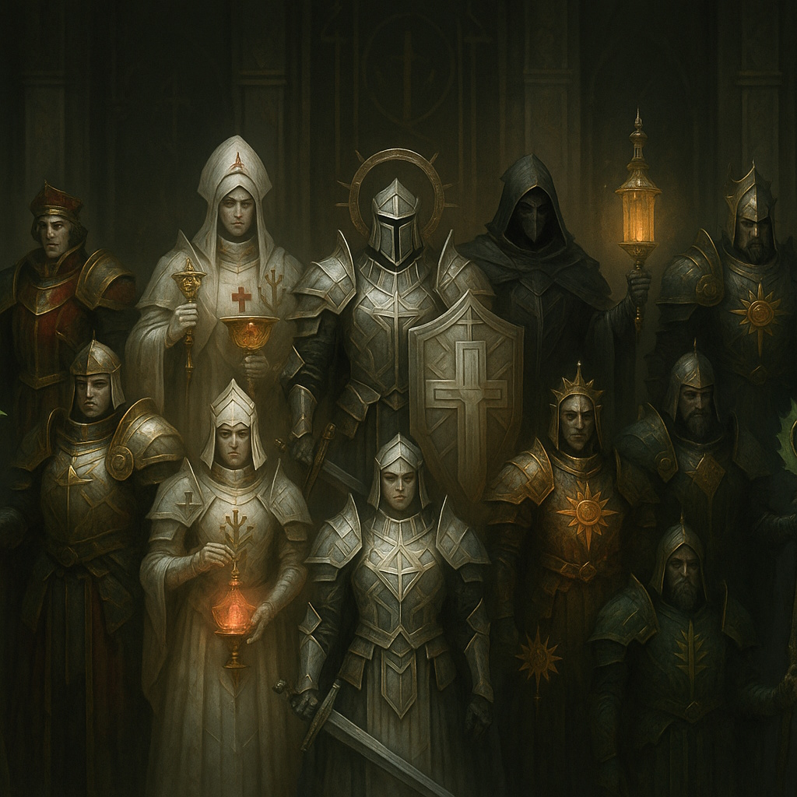 

- **Darius der Jäger** - *Bannmeister*: **Artefakt:** Der Bogen 'Venator'. **Macht:** Pfeile die nie verfehlen, kann unsichtbare Beute aufspüren. **Korruption:** Sieht überall Beute und Verräter, obsessive Paranoia. **Persönlichkeit:** War ein loyaler Soldat, der seine Einheit durch Verrat verlor. Der Bogen zeigte ihm die 'Wahrheit' - dass Verrat überall lauert. Nun jagt er obsessiv jeden Verdächtigen, aber tief im Inneren sucht er nach dem einen unschuldigen Menschen, der beweist, dass nicht alle böse sind. Seine Verfolgungen sind verzweifelte Suche nach Vertrauen. Rettet manchmal heimlich die Unschuldigen, die er als 'Köder' benutzt hat.. **Komplexität:** Führt Listen von Menschen, die sich als loyal erwiesen haben. Hinterlässt anonyme Warnungen vor echten Gefahren. Adoptiert heimlich Waisenkinder von Verrätern.. **Basis:** Jäger-Koloss 'Venator Rex' (mobile Jagdmaschine).

- **Octavius der Stahlbändiger** - *Festungsherr*: **Artefakt:** Der Stab 'Constructor'. **Macht:** Formt Materie, errichtet massive Strukturen in Minuten. **Korruption:** Sieht Menschen als Bausteine, alles als formbares Material. **Persönlichkeit:** War ein visionärer Architekt, der schöne Städte für Familien baute. Der Stab gab ihm die Macht, perfekte Strukturen zu erschaffen - aber ließ ihn Menschen nur noch als 'Material' für seine Projekte sehen. Er entwirft obsessiv Häuser für Familien, die er nie haben kann, und Städte für Menschen, die er nicht mehr als Individuen wahrnimmt. Seine Perfektion ist ein verzweifelter Versuch, die Schönheit zurückzufinden, die er in menschlichen Beziehungen verloren hat.. **Komplexität:** Sammelt Spielzeug und Familienfotos anderer. Baut heimlich kleine, nutzlose, aber schöne Modelle. Seine größten Projekte haben versteckte Gemeinschaftsräume.. **Basis:** Konstruktions-Koloss 'Architectus' (wandelnder Bauhof).

- **Nero der Flammenherr** - *Inquisitor*: **Artefakt:** Das Schwert 'Ignis Sanctus'. **Macht:** Heiliges Feuer verbrennt Korruption und Lügen. **Korruption:** Brennt innerlich, wird vom eigenen Fanatismus verzehrt. **Persönlichkeit:** Fanatischer Glaubenskrieger ohne Kompromisse. **Basis:** Purification Spires (Vulkanstadt mit Lavafflüssen).

#### 4.1.6.2 Die Armee des Reichs
Die Reichsarmee besteht aus **13 Divisionen**, die in den 8 Bollwerkstädten und 5 wandelnden Kolossen stationiert sind, und dort jeweils einem Paladin unterstehen. Die Divisionen bestehen aus Corpi Bellum, Einheiten zu jeweils 500 Soldaten. 10 Infantrie-Corpi bilden das Rückgrat der Division. Weitere Corpi anderer Gattungen werden nach Verfügbarkeit und nach Vorliebe des Paladins ergänzt, sodass man insgesamt auf eine uneinheitliche Stärke der Divisionen kommt. Eine Disivion wird von einem Groß-Captain und zwei Unter-Captains geführt. Dem Corpus Bellum steht ein Commander vor.

### 4.1.7 Society
#### 4.1.7.1 Der Alltag
**Alltagsleben der Bevölkerung:** 
- Bauern und Arbeiter (80% der Bevölkerung): Arbeiten in Landwirtschaft, Minen, Schmieden, Werkstätten. Leben bescheiden aber nicht hungrig (das Reich braucht produktive Arbeiter). Männer leisten oft Militärdienst, Frauen verwalten Höfe und Betriebe. Kinder ab 12 Jahren arbeiten mit, ab 16 sind sie wehrpflichtig. 
- Handwerker und kleine Händler (15% der Bevölkerung): Produzieren Kriegsgüter oder lebensnotwendige Waren. Können durch profitable Geschäfte zu bescheidenem Wohlstand gelangen. Manche versuchen sich in zwielichtigen Aktivitäten. Oft besser gebildet als Bauern, können meist lesen. 
- Soldaten und Offiziere (4% der Bevölkerung): Regelmäßiger Sold und bessere Verpflegung. Grundbildung in Lesen, Schreiben, Rechnen. Aufstiegschancen durch Verdienste im Kampf. Nach dem Dienst oft privilegierte Zivilisten. 
- Adel und hohe Beamte (1% der Bevölkerung): Kontrollieren größere Ressourcen und Territorien. Leben in relativem Luxus, aber unter ständiger Beobachtung. Dienen als Offiziere oder Verwalter. Ihre Kinder werden automatisch für höhere Positionen ausgebildet.

**Alltagsrhythmus verschiedener Schichten**
Typische Woche: **Montag-Samstag:** Arbeitszeit (6 Tage). **Sonntag:** Ruhetag mit religiösen Pflichten. **Feiertage:** Zusätzliche Ruhe, oft mit organisierten Aktivitäten. **Jahreszeiten-Einfluss:** **Winter:** Weniger Feldarbeit, mehr Handwerk und Reparaturen. **Frühling:** Intensive Pflanzzeit, längere Arbeitstage. **Sommer:** Kriegssaison, viele Männer im Militärdienst. **Herbst:** Ernte und Wintervorbereitung.

- Bauern und Arbeiter: **Arbeitstag:** Sonnenaufgang bis Sonnenuntergang. **Abends:** Kurz in der Taverne, früh ins Bett. **Feiertage:** Dorfgemeinschafts-Aktivitäten. **Winter:** Mehr Zeit für Handarbeiten und Geschichten.
- Handwerker: **Arbeitstag:** Längere Pausen möglich. **Feierabend:** Zeit für Zunft-Treffen oder komplexere Spiele. **Wochenenden:** Teilnahme an Märkten als Verkäufer und Kunden. **Gesellig:** Mehr Geld für Tavernenbesuche.
- Soldaten: **Dienstzeit:** Streng reglementiert. **Freizeit:** Organisierte Gruppenaktivitäten. **Sold-Tag:** Ausgelassener, da mehr Geld verfügbar. **Kameradschaft:** Gemeinsame Unternehmungen stärken Moral.
- Adelige und Wohlhabende: **Mehr Optionen:** Private Feste, kulturelle Veranstaltungen. **Repräsentationspflicht:** Öffentliche Auftritte bei Festen. **Diskrete Vergnügungen:** Zugang zur gehobenen Unterwelt. **Bildung:** Zeit für Lesen, Musik, Kunst (alles staatlich kontrolliert).

#### 4.1.7.2 Öffentliche Institutionen
**Bildung:** 
- Militär: Grundausbildung in Lesen, Schreiben, Rechnen für alle Soldaten. **Volk:** Meist analphabetisch, außer Händler und Handwerker. 
- Adel/Geistlichkeit: Vollständige Bildung. 
- Paladine: Hochgebildet durch ihre Artefakte und Positionen.

**Spirituelle und medizinische Versorgung** 
- Die Gottköniginnen-Priesterschaft: **Tempel:** Zentren jeder Gemeinde mit Gebetsräumen, Krankenstationen, Vorratskammern. **Priester:** Geistliche Führung, Grundversorgung, Überwachung der Gemeinde. **Tempel-Wachen:** Schützen heilige Orte und setzen religiöse Gesetze durch.
- Kräuterkundige: Behandeln Krankheiten mit traditionellen Mitteln. **Medizinische Realität:** Grundversorgung für alle, aber qualitativ begrenzt. Schwere Fälle werden nach Sanctum Medicae geschickt (wenn überhaupt). Kriegsveteranen erhalten Priorität bei Behandlungen. Volksmedizin und der Ahnenkult ergänzen offizielle Versorgung.

#### 4.1.7.2 Freizeit
In Arx Lumina ist Freizeit ein rares Gut. Die meisten Menschen arbeiten sechs Tage die Woche, mit religiösen Pflichten am siebten Tag. Trotzdem brauchen Menschen Ablenkung vom harten Alltag und permanenten Kriegsdruck.

**Legale Freizeitaktivitäten:** **Religiöse Feste und Feiertage:** **Gottkönigin-Tag:** Jährliche Feier der Reichsgründung mit Paraden und öffentlichen Festen. **Siegesfeiern:** Spontane Feste nach militärischen Erfolgen. **Erntefest:** Dank für die Ernte, auch in Kriegszeiten wichtig. **Märtyrer-Gedenktage:** Ehrung gefallener Helden mit Geschichten und Liedern. 

**Arten von Aktivitäten**:
- Gesellschaftliche Zusammenkünfte: **Taverne und Gasthäuser:** Zentrale Treffpunkte für Neuigkeiten, Musik und Gespräche. **Marktfeste:** Handel kombiniert mit Unterhaltung und sozialen Kontakten. **Handwerker-Märkte:** Demonstration von Fertigkeiten, Wettbewerbe zwischen Zünften. **Hochzeiten und Taufen:** Familienfeste als Auszeit vom Kriegsalltag. 
- Körperliche Betätigungen: **Ringkämpfe:** Beliebte Unterhaltung mit Wetten (legal in bescheidenem Rahmen). **Bogenschießen:** Übung mit Unterhaltungswert, militärisch nützlich. **Tanzveranstaltungen:** Volkstänze bei Festen, streng überwacht auf 'Anständigkeit'. **Ballspiele:** Einfache Spiele zwischen Dörfern oder Stadtvierteln.
- Geistige Unterhaltung: **Geschichtenerzähler:** Wandernde Barden mit Kriegsepen und Heldensagen. **Lieder:** Volkslieder (unpolitisch), militärische Märsche, religiöse Hymnen. **Rätsel und Wortspiele:** Besonders bei gebildeteren Schichten beliebt. **Handarbeiten:** Sticken, Schnitzen als entspannende Beschäftigung.

**Regionale Unterschiede**: 
- Bollwerkstädte: Mehr organisierte Unterhaltung. Gladiatorenkämpfe in Arenen. Militärparaden als Spektakel. Kulturelle Veranstaltungen (unter Aufsicht). 
- Ländliche Gebiete: Jahreszeiten-basierte Feste. Gemeinschaftsarbeiten als soziale Ereignisse. Tierische Unterhaltung (Hahnenkämpfe, Hunderennen). Familientraditionen und lokale Bräuche. 
- Grenzgebiete: Weniger Freizeit, mehr Überlebensfokus. Waffentraining als 'Unterhaltung'. Soldatische Kameradschaft. Derbere, härtere Vergnügungen.

**Grauzonen und verbotene Aktivitäten:**
- Geduldete Graubereiche: **Glücksspiel (in Maßen)**: Würfelspiele in Tavernen um kleine Einsätze. Wetten auf Kämpfe oder Wettkämpfe. Kartenspiele (wenn verfügbar) um Kleinigkeiten. Bei größeren Summen wird es schnell illegal. **Alkohol:** Bier und einfacher Wein sind alltäglich. Stärkere Spirituosen sind rationiert aber verfügbar. Vollrausch wird gesellschaftlich missbilligt. Soldaten haben höhere 'Toleranz' bei Alkoholkonsum. **Romantische Beziehungen:** Liebesbriefe und heimliche Treffen. Brautwerbung mit Geschenken und Liedern. Diskrete außereheliche Beziehungen (bei Diskretion geduldet). Prostitution ist illegal, aber wird bei 'diskreter' Ausübung übersehen.

- Streng verbotene Freizeitgestaltung: **Politische Diskussionen** außerhalb offizieller Kanäle. **Friedens-Proteste** oder kriegskritische Äußerungen. **Kontakt mit Unmenschen** aus Neugier. **Okkulte oder magische Praktiken**. **Große Glücksspiele** oder organisierte Wetten. **Luxuriöse Dekadenz** (außer bei Adeligen)

**Saisonale Aktivitäten**
- Frühling: Pflanztanz, Fruchtbarkeitsfeste (religiös umgedeutet)
- Sommer: Sonnenwende-Feiern, Outdoor-Aktivitäten
- Herbst: Erntefeste, Vorratsvorbereitung als Gemeinschaftsaktivität
- Winter: Geschichtenerzählen, Handarbeiten, religiöse Besinnung

**Gesellschaftliche Spannungen**
- Generationskonflikte: Ältere erinnern sich an 'friedlichere' Zeiten. Jüngere kennen nur Krieg und Militärherrschaft. Veteranen leiden unter Kriegstrauma, haben aber privilegierten Status. 
- Regionale Unterschiede: Grenzgebiete sind kriegsmüder und brutaler. Zentrale Regionen sind wohlhabender aber überwachter. Jede Region entwickelt eigene Überlebensstrategien. 
- Verborgene Unzufriedenheit: Friedenssehnsüchte werden als Ketzerei unterdrückt. Schwarzmarkt und Unterwelt als Ventile für Frustration. Heimliche Sympathien für 'gemäßigte' Unmenschen bei manchen.

#### 4.1.7.3 Rechtssystem
Das Rechtssystem spiegelt die autoritäre Natur wider: Effizienz über Gerechtigkeit, Ordnung über Fairness, Staat über Individuum.

**Hallen der Läuterung** 
In jeder größeren Siedlung steht eine **Halle der Läuterung** - ein steinernes Gebäude mit dem Symbol der Reformation. Hier wird Recht gesprochen, schnell und ohne Kompromisse.

**Aufbau**
- Architektur: Haupthalle mit erhöhtem Richterstuhl. Bekenntnis-Kammern für Verhöre. Büßerkeller für 'Bedenkzeit' und Strafen. Archiv für Urteile und Präzedenzfälle. Wohnräume für den örtlichen Reformations-Richter
- Der Büßerkeller: Aufbau: Unterirdische Zellen unter jeder Halle der Läuterung. Kleine, feuchte Steinzellen. Minimale Verpflegung (Brot und Wasser). Völlige Dunkelheit zur 'Besinnung'. Gelegentliche 'Läuterungs-Gespräche' mit Priestern. Zweck: Nicht nur Strafe, sondern 'spirituelle Reinigung'.
- Reformations-Richter: **Qualifikationen:** Priesterliche Ausbildung in Reformations-Doktrin. Praktische Erfahrung in Rechtsprechung. Absolute Loyalität zur Reformation. Fähigkeit zu schnellen, 'göttlich inspirierten' Entscheidungen. **Befugnisse:** Sofortige Urteilsfindung in allen Rechtsfragen. Anordnung von Verhaftungen und Durchsuchungen. Modifikation von Strafen je nach 'Reue' des Täters. Weiterleitung komplexer Fälle an höhere Instanzen.

**Rechtsprechung**
- Zivilrechtsprechung (Hallen der Läuterung): Rechtsstreitigkeiten zwischen Bürgern: Beide Parteien können ein Urteil einfordern bei: Handelsstreitigkeiten und Vertragsbruch. Eigentumsstreitigkeiten und Erbschaftsfragen. Ehekonflikten und Familienangelegenheiten. Schadensersatzforderungen. **Verfahrensablauf:** 1. **Antragstellung:** Eine Partei fordert Rechtssprechung. 2. **Vorladung:** Beide Parteien werden binnen 3 Tagen geladen. 3. **Anhörung:** Jede Seite hat 15 Minuten für ihre Darstellung. 4. **Urteilsfindung:** Der Richter entscheidet sofort nach Anhörung. 5. **Vollstreckung:** Urteil wird binnen 24 Stunden vollstreckt. **Kosten:** Beide Parteien zahlen Gerichtsgebühr, Verlierer trägt zusätzliche Strafen.
- Strafverfahren (Hallen der Läuterung): Bei Straftaten: **Verhaftung:** Durch Stadtwatch, Schemen oder Denunziation. **Sofortige Anhörung:** Innerhalb von 24 Stunden nach Verhaftung. **Urteilsverkündung:** Direkt nach Anhörung. **Strafvollstreckung:** Beginnt sofort. **Verfahrensdauer:** Selten länger als 2 Stunden vom Verhör bis zur Verurteilung.

**Rechtsprinzipien**
'Effizienz über Exaktheit': Schnelle Urteile sind wichtiger als langwierige Untersuchungen. Der Richter entscheidet nach 'göttlicher Eingebung' und Reformations-Doktrin. Präzedenzfälle existieren, aber werden flexibel ausgelegt. Zweifelsfälle werden zugunsten der Staatsordnung entschieden. **Beweisführung:** Augenzeugen haben höchstes Gewicht. Geständnisse werden bevorzugt (auch unter Druck). Dokumentierte Beweise sind wertvoll aber selten. 'Charakter-Zeugnisse' durch Respektspersonen.

**Strafkatalog**
- Kleine Vergehen (Bußekeller 1-7 Tage): Störung der öffentlichen Ordnung. Kleindiebstahl. Trunkenheit mit Belästigung. Arbeitsverweigerung.
- Mittlere Vergehen (Bußekeller 1-4 Wochen + Geldstrafe): Betrug und größerer Diebstahl. Körperverletzung. Unerlaubter Handel. Respektlosigkeit gegenüber Autoritäten.
- Schwere Verbrechen (Tod oder lebenslange Haft): Mord und schwere Gewaltverbrechen. Hochverrat und Spionage. Ketzerei und Blasphemie. Desertion und Feigheit vor dem Feind.
- Besondere Strafen: **Brandmarkung:** Für Wiederholungstäter. **Amputation:** Bei schwerem Diebstahl. **Öffentliche Demütigung:** Bei moralischen Vergehen. **Verbannung:** Alternative zur Hinrichtung.
- Berufungsverfahren: Nur bei 'offensichtlichen Fehlern' möglich. Berufung muss binnen 24 Stunden eingelegt werden. Kostet erhebliche 'Gebühren'. Wird meist von höherrangigem Reformations-Beamten abgelehnt. **Gnadenersuche:**. Direkt an den zuständigen Paladin. Nur bei Todesurteilen möglich. Erfordert einflussreiche Fürsprecher. Erfolg ist eher selten.

**Rechtspolitische Auswirkungen**
- Abschreckung: Schnelle, harte Strafen halten die Ordnung aufrecht. 
- Angst: Niemand weiß, ob eine Denunziation zu sofortiger Verurteilung führt.
- Kontrolle: Das System dient mehr der Machterhaltung als der Gerechtigkeit.
- Korruption: Bestechung von Richtern ist möglich, aber extrem riskant. 
- Gesellschaftliche Folgen: Menschen vermeiden Rechtstreitigkeiten. Selbstjustiz wird manchmal vorgezogen. Reiche haben bessere Chancen (können sich Fürsprecher leisten). Denunziation wird als Waffe gegen Feinde eingesetzt.

### 4.1.8 Religion
**Der Gottkönigin-Kult (Staatsreligion)**
- Zentrale Lehre: Die Gottkönigin ist göttlich, seine Berater Erzengel, seine Paladine seine Apostel
- Praktiken: Öffentliche Gebete, Opfergaben für Kriegsanstrengungen
- Hierarchie: Gottkönigin > Berater/Erzengel > Paladine > Hohe Priester > Gemeindepriester
- Kontrolle: Vollständig (und repressiv) von der Reformation überwacht

**Der Ahnenkult (Geduldete Volksreligion)**
- Zentrale Lehre: 'Die Ahnen stehen mir bei' - Verstorbene Familienmitglieder wachen über Lebende
- Praktiken: Ahnenaltäre in Häusern. Opfergaben an Gräbern. Totenwachen und Erinnerungsrituale. Familientraditionen und Weisheiten.
- Status: Von der Reformation geduldet, solange die Gottkönigin als höchste Autorität anerkannt wird. Praktisch alle Bürger praktizieren beide Religionen parallel.
- Spannungen: Nero's extremere Inquisitoren sehen den Ahnenkult als potenzielle Ketzerei, gemäßigtere akzeptieren ihn als 'harmlose Tradition'.

**Geheime Paladin-Kulte (Verborgen)**
Einige Paladine fördern diskret eigene Kulte, um ihre Machtbasis zu erweitern:
- Thanes Prosperity-Kult:**Lehre:** 'Reichtum ist göttlicher Segen' **Anhänger:** Händler, korrupte Beamte **Praktiken:** Geheime Geschäftsrituale, 'gesegnete' Verträge **Ziel:** Wirtschaftliche Kontrolle durch religiöse Rechtfertigung
- Seraphines Perfektions-Sekt: **Lehre:** 'Der Körper ist ein Tempel, der vervollkommnet werden muss' **Anhänger:** Ärzte, Anatomen, Körper-Besessene **Praktiken:** Selbstverstümmelung als 'Verbesserung', medizinische Rituale **Ziel:** Akzeptanz für extreme Experimente
- Morteus' Effizienz-Lehre: **Lehre:** 'Der perfekte Plan rechtfertigt jedes Opfer' **Anhänger:** Strategen, Beamte, kalte Pragmatiker **Praktiken:** Logik-Meditation, Emotions-Unterdrückung **Ziel:** Gesellschaftliche Akzeptanz für 'notwendige Grausamkeiten'
- Nero's Reinigungs-Fanatiker: **Lehre:** 'Nur durch Feuer wird wahre Reinheit erreicht' **Anhänger:** Extremistische Bürger, Selbstgeißler **Praktiken:** Selbstverbrennung, Denunziation von 'Unreinen' **Ziel:** Totale gesellschaftliche Kontrolle durch Angst

**Verbotene/Ausgelöschte Religionen**
- Die Alten Götter: Naturgottheiten, deren Tempel zu Ruinen wurden
- Friedens-Kulte: Alle pazifistischen Religionen wurden als Ketzerei ausgerottet
- Gleichheits-Lehren: Soziale Bewegungen, die die Hierarchie infrage stellten

### 4.1.9 Wirtschaft und Handel
Arx Lumina ist landwirtschaftlich geprägt. Mühlen stellen die wichtigeste Technologie der Nahrungsmittelverarbeitung dar. In den Städten erzeugen Handwerker und Manufakturen Gegenstände und Waffen. Der Entwicklungsstand entspricht dem späten Mittelalter bis frühe Renaissance.

**Kriegswirtschaft**
Alle Ressourcen fließen in den permanenten Krieg
- Rationierung von Metall und Nahrung\n- Kriegsgewinnler und Schwarzmarkt
- Handelsrouten stark militärisch gesichert
- Kriegslogistik: Massive Mengen an Waffen, Nahrung, Ausrüstung müssen täglich bewegt werden. Jeder Paladin braucht komplexe Versorgungslinien für seine Elitekrieger (Disziplinen) und Truppen.

**Haupttransportwege:**
- Flüsse: Sichere, große Mengen, aber begrenzte Routen
- Karawanen: Flexibel, aber langsam und verwundbar
- Wandelnde Kollosse: Transport riesiger Mengen, aber unflexibel
- Organisation:´´ Jeder Paladin hat einen **Handelsmeister** in seinem Strategenstab, der die gesamte Logistik koordiniert.

**Währungssystem**
- Reichswährung: Goldstücke (GS), Silberstücke (SS), Kupferstücke (KS)\n- 1 GS = 10 SS = 100 KS
- Geprägt mit dem Siegel der Gottkönigin
- Regionale Varianten in Bollwerkstädten (mit Paladin-Symbolen)

**Typische Preise:** 
- Einfache Mahlzeit: 5 KS
- Übernachtung (einfach): 2 SS
- Schwert (gut): 15 GS
- Rüstung (Leder): 10 GS, (Kette): 50 GS, (Platte): 200 GS
- Pferd (Kriegsross): 100 GS
- Monatsgehalt Soldat: 2 GS
- Jahresgehalt Handwerker: 30 GS
- Brot (1 Laib): 2 KS
- Bier (1 Krug): 3 KS
- Wein (einfach): 1 SS, (gut): 5 SS
- Kerzen (10 Stück): 1 SS
- Seil (10 Meter): 2 SS
- Dolch: 2 GS
- Bogen: 8 GS, Armbrust: 25 GS
- Köcher (20 Pfeile): 1 GS
- Schild: 5 GS
- Helm: 10 GS
- Stiefel (Leder): 3 GS
- Mantel (warm): 4 GS
- Rucksack: 2 GS
- Pergament (1 Bogen): 5 SS
- Tinte und Feder: 8 SS
- Heilkräuter: 1 GS
- Werkzeugset (Handwerker): 12 GS
- Maultier: 8 GS
- Ochsenkarren: 15 GS
- Monatsmiete (einfaches Zimmer): 5 SS
- Bestechung (Stadtwache): 3 GS
- Schmuggelware (Aufschlag): +50%
- Schwarzmarkt-Waffen: +100%

## 4.2 Umbras
### 4.2.1 Appearance
- Genetisch perfektionierte Kriegerkörper: **Designziel:** Perfekte Soldaten - menschliche Intelligenz mit übermenschlicher Physik. **Ergebnis:** Jede Linie spricht von tödlicher Effizienz, jede Bewegung von kalkulierter Präzision. **Eindruck:** Faszinierend und verstörend zugleich - 'zu perfekt' (Uncanny Valley)
- Physische Merkmale: **Größe:** 5'10\" bis 6'6\" (178-198 cm) - größer als durchschnittliche Menschen. **Statur:** Athletisch-schlank mit definierten Muskeln - Ausdauer und explosive Kraft. **Haut:** Dunkle Töne von tiefem Ebenholz bis aschgrauem Anthrazit, subtiler metallischer Schimmer. **Haare:** Silberweiß, Platinblond oder Eisblau (selten: Schwarz/Stahlgrau). **Augen:** Mandelförmig, groß - Silber, Eisblau oder tiefes Violett; reflektieren Licht wie Katzenaugen. **Gesicht:** Markante Wangenknochen, definierte Kiefer, leicht spitze Ohren (subtil). **Bewegung:** Katzenartig fließend, unheimlich leise, keine verschwendete Energie
- Besondere Eigenschaften: **Nachtsicht:** Augen reflektieren Licht (Tapetum lucidum). **Temperatur:** Haut fühlt sich kühl an - niedrigere Körpertemperatur als Menschen. **Geruch:** Fast nicht vorhanden - reduzierte Schweißproduktion. **Narben:** Heilen silbrig - werden als Ehrenabzeichen getragen. **Alterung:** Extrem langsam - 200-jährige sehen aus wie Menschen Mitte 30. **Ausdrucksarmut:** Trainiert, Emotionen zu verbergen - Gesichter wie perfekte Masken
- Kastenvariationen: **Militär-Kaste:** Muskulöser, kurze Haare/Kampfzöpfe, zahlreiche Narben, wachsame Augen. **Forscher-Kaste:** Schlanker, längere gepflegte Haare, weniger Narben, analytische Blicke. **Konzern-Lords:** Imposante Präsenz, prunkvolle Kleidung, makellose Haut, eiskalte Augen
- Kleidung und Bewaffnung: **Stil:** Funktional aber ästhetisch - dunkle Töne (Schwarz, Dunkelgrau, Tiefviolett). **Präzision:** Militärische Perfektion in jedem Detail - keine losen Fäden, keine unnötigen Verzierungen. **Rüstung:** Maßgeschneidert, folgt Körperkontur perfekt. **Waffen:** Immer dabei - Teil ihrer Identität, nicht nur Werkzeug. **Eindruck:** Selbst in Zivilkleidung kampfbereit
- Wirkung auf andere Völker: **Menschen:** Mischung aus Ehrfurcht und Unbehagen - 'zu perfekt, zu kalt'. **Ruptors:** Respekt vor Stärke, Abscheu vor emotionaler Kälte. **Ur-Untote:** Anerkennung als gelungenes Experiment - mit Bedauern über die Rebellion. **Allgemein:** Sie bewegen sich zu flüssig, ihre Augen sind zu durchdringend, ihre Gesichter zu symmetrisch - die Perfektion von etwas Geschaffenem, nicht Gewachsenem

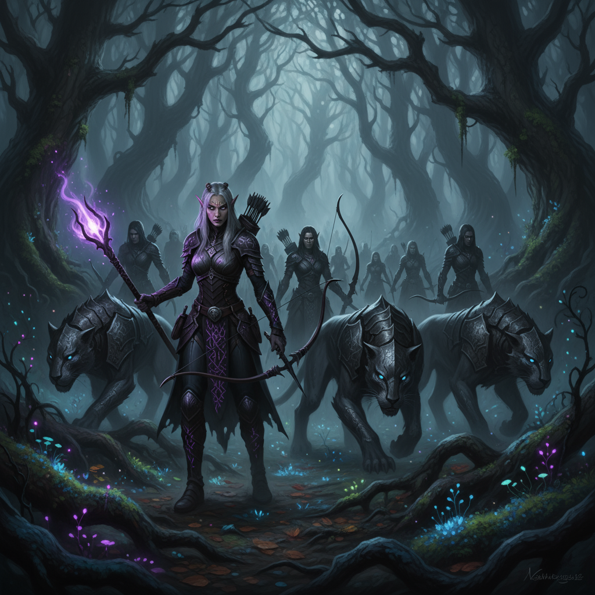

### 4.2.2 Abilities
- **Kaltblütige Krieger und Spione**: **Systemische Vorteile:** 1. **Systematische 'Entbehrlichkeit'** macht sie risikobereit und opferbereit. 2. **Umfassende Bildung** ermöglicht das Verstehen komplexer politischer und militärischer Zusammenhänge. 3. **Emotionale Distanz** durch harte Erziehung - weniger anfällig für Erpressung durch Gefühle. 4. **Kulturelles Verständnis** durch Grenznähe zu anderen Völkern. 5. **Flexible Identität** durch Namensänderungs-Traditionen. 6. **Langfristige Perspektive** durch hohe Lebenserwartung - können jahrzehntelange Operationen durchführen.
- **Spezialisierte Ausbildung:** **Späher-Einheiten** für Erst- und Zweitgeborene sind üblich. **Infiltrations-Training** als Teil der militärischen Grundausbildung. **Sprach- und Kulturstudien** der Nachbarvölker. **Psychologische Kriegsführung** und Manipulation.
- **Systemische Risiken:** **Überläufer-Produktion:** Das System erschafft seine eigenen Verräter. **Zu viel Wissen:** Gebildete Spione verstehen auch die Schwächen des eigenen Systems. **Emotionale Instabilität:** Unterdrückte Gefühle können zu unberechenbaren Entscheidungen führen.

### 4.2.3 Mindset
- Die militärische Tradition erzeugt Charaktere, die gewohnt sind, für entbehrlich gehalten zu werden. Sie entwickeln eine pragmatische Sicht auf das Leben und akzeptieren die hohen Verluste, die mit ihrem Lebensstil einhergehen.
- Warum Überleben problematisch wird: **Zu viel Wissen:** Überlebende verstehen das System zu gut und entwickeln Zweifel. **Systemkritische Bildung:** Die umfassende Erziehung macht sie zu gefährlichen Denkern. **Emotionale Entfremdung:** Sie können die systematische Kälte nicht mehr akzeptieren. **Machtferne:** Als 'Entbehrliche' haben sie keinen Platz in der Hierarchie. **Moralische Konflikte:** Sie sehen die Unmenschlichkeit des Systems, dem sie ihr Leben verdanken.
- Die Überlebens-Schuld: **Unverdienter Status:** Sie sollten tot sein, leben aber noch. **Keine vorgesehene Rolle:** Das System hat keinen Platz für sie eingeplant. **Gefährliches Wissen:** Sie kennen die Schwächen und Widersprüche des Systems. **Potentielle Rebellen:** Ihre Existenz stellt das ganze Familiensystem in Frage. **Lebende Kritik:** Sie sind der Beweis, dass das System nicht perfekt funktioniert.
- **Emotionale Bewältigungsstrategien:** **Sarkasmus als Schutzschild:** Humor zur emotionalen Distanzierung von Schmerz und Verlust. **Ironie als Waffe:** Komplexe und schmerzhafte Situationen durch bissigen Humor bewältigen. **Melancholie als Grundzustand:** Tiefe, oft unausgesprochene Trauer über 'was hätte sein können'. **Pragmatische Kälte:** Gefühle werden als Luxus betrachtet, den man sich nicht leisten kann.
- **Moralische Komplexität:** **Loyalitätskonflikte:** Zwischen Familie, Volk, persönlichen Überzeugungen und militärischen Befehlen. **Pragmatischer Idealismus:** 'Das System ist grausam, aber vielleicht kann ich etwas bewirken'. **Schuldgefühle:** Überlebende kämpfen mit ihrer 'unverdiente' Existenz. **Systemkritik vs. Systemtreue:** Innere Spaltung zwischen Verstehen und Ablehnen der Gesellschaft.
- **Soziale Fähigkeiten:** **Provokation als Kommunikationsform:** Geschickte psychologische Manipulation durch spitze Bemerkungen. **Emotionale Intelligenz:** Tiefes Verständnis für Motivationen und Schwächen. **Kulturelle Flexibilität:** Können sich an verschiedene Gesellschaftsformen anpassen. **Diplomatische Kälte:** Verhandeln ohne persönliche Gefühle einzubeziehen.

### 4.2.4 Key Aspects
- Die Nation der Umbras lebt im ständigen Kriegszustand. Zunächst gegen die Untoten (vor 1600 bis 1500 Jahren), dann gegen die Ruptors, ihre Erzfeinde, und seid 500 Jahren auch gegen die Menschen. Militarismus ist ein prägendes Element der Gesellschaft. Sie widerstanden Jahrhunderten des Kriegs durch ihr hartes System der militärischen Pflicht.
- In einer Gesellschaft im permanenten Krieg haben adelige Familien ein zynisches, aber praktisches System entwickelt: **Erstgeborene/r:** Militärpflicht in gefährlichsten Positionen (Grenztruppen, Vorhut, Aufklärung). **Zweitgeborene/r:** Ebenfalls militärpflichtig, oft als Unterstützung, Späher oder Spezialeinheiten. **Drittgeborene/r:** Erbt das Familienvermögen und führt das Geschlecht fort. **weitere Kinder:** Spätgeborene, ohne Pflichten, ohne Titel, aber mit Bildung, zum Verheiraten.
- **Pragmatischer Realismus:** Das System akzeptiert hohe Verlustquoten im permanenten Krieg als gegeben. Bedenkt man die hohe Lebenserwartung der Umbras (800 bis 1000 Jahre), so ist es logisch, dass die ersten beiden Kinder oft nicht zurückkehren. Das drittgeborene Kind kann die Familientradition fortsetzen.
- **Emotionale Distanz**: Eltern können es sich nicht leisten, zu sehr an den ersten beiden zu hängen. Sie müssen emotional distanziert bleiben, um den Verlust zu verkraften. Das drittgeborene Kind wird als Hoffnungsträger gesehen, das die Familientradition fortsetzt. Investitionen konzentrieren sich auf die Dritt- und Spätgeborenen.
- Die Ehrenstelen-Tradition: **Für jeden gefallenen Erstgeborenen** wird eine Marmor-Stele auf dem Familiengrund errichtet. Die Stelen sind Denkmäler der erfüllten Pflicht, nicht der individuellen Trauer. **Der Platz daneben** wird bereits für die Zweitgeborenen vermessen und freigehalten. Die Stelen sind vorgraviert, nur das Sterbedatum fehlt. Dies symbolisiert die unausweichliche Pflicht und den unvermeidlichen Verlust

### 4.2.5 Politics
- Die Umbras werden von einer **einzigen Person** regiert, die sowohl höchster militärischer als auch ziviler Führer ist - dem/der **Hochkommandanten/in**. Diese Person wird durch eine Kombination aus militärischem Erfolg, politischem Geschick und familiärer Abstammung ausgewählt. Die Position ist nicht erblich, sondern basiert auf Verdiensten und der Fähigkeit, die Nation zu führen.
- Die Doppelrolle des Herrschers: **Militärische Führung:**: **Oberster Befehlshaber** aller Streitkräfte. **Strategischer Planer** für alle Kriegsoperationen. **Personalentscheider** für die höchste Generalität. **Kriegsherr** mit absoluter Befehlsgewalt im Kriegsfall. **Zivile Verwaltung:** **Ernennt Reichsverwalter** für verschiedene Regionen und Bereiche. **Kontrolliert die Beamtenschaft** und zivile Administration. **Entscheidet über Ressourcenverteilung** und wirtschaftliche Prioritäten. **Richterliche Gewalt** in letzter Instanz.
- Nachfolge: Wer die Macht beansprucht und sie halten kann, regiert berechtigt. Machtwechsel meist durch Putsch, Attentat oder 'Unfälle' (selbst Hochkommandanten sind entbehrlich). Keine festen Regeln, nur Macht und Geschick zählen. Typische Übergangs-Szenarien: Ein General überzeugt den Generalstab, den aktuellen Hochkommandanten zu stürzen. Vergiftungen, Attentate oder 'Unfälle' ebnen den Weg für Nachfolger. Ein siegreicher Kommandeur kehrt mit loyalen Truppen zurück und übernimmt die Macht.
- Der Generalstab: Einflussreiche Gruppe von hochrangigen Offizieren, die den Hochkommandanten beraten und unterstützen. Ihre Macht basiert auf militärischem Erfolg und politischer Intrige. Kriegsherren der verschiedenen Fronten. Entwickelt langfristige militärische Pläne. Nur erfolgreiche Generale behalten ihre Positionen (selbst der Generalstab ist entbehrlich).
- Die Reichsverwalter & Beamtenschaft: Verantwortlich für die zivile Verwaltung des Reiches. Ernennen regionale Gouverneure und Fachverwalter. Aufgaben: **Regionale Gouverneure:** Verwalten die verschiedenen Gebiete des Reiches. **Fachverwaltung:** Ressourcen, Finanzen, Infrastruktur, zivile Justiz. **Ausführende Gewalt:** Setzen die Entscheidungen des Hochkommandanten um. **Kontinuität:** Überleben meist Machtwechsel, da sie für das Funktionieren des Reiches nötig sind. **Begrenzte Macht:** Haben keine eigenen Armeen oder militärische Basis.
- Vorteile des militärischen Systems: **Kompetenz-basierte Führung:** Nur militärisch erfolgreiche Personen erreichen die Spitze. **Strategische Kontinuität:** Der Generalstab plant langfristig, unabhängig von einzelnen Herrschern. **Flexibilität:** Versagende Führer werden schnell ersetzt, ohne dynastische Rücksichten. **Motivation:** Jeder General kann theoretisch Hochkommandant werden - schafft Leistungsanreize
- Nachteile des militärischen Systems: **Instabilität:** Häufige Machtwechsel führen zu Unsicherheit und potenziellen Bürgerkriegen. **Intrigen und Verrat:** Ständige Gefahr durch interne Machtkämpfe und Attentate. **Kurzfristige Planung:** Fokus auf militärische Erfolge kann langfristige zivile Entwicklung vernachlässigen. **Elitismus:** Militärische Führungsschicht kann sich von der Bevölkerung entfremden. **Mangel an Legitimität:** Herrscher müssen ihre Macht ständig durch Erfolg und Gewalt sichern, was zu Brutalität führen kann.

### 4.2.6 Military
- Die Umbras sind eine hoch disziplinierte Militärgesellschaft, die sich durch strenge Hierarchien, rigorose Ausbildung und eine Kultur der Opferbereitschaft auszeichnet. Ihr Militärsystem ist darauf ausgelegt, in einem ständigen Kriegszustand zu überleben und zu gedeihen.
- **Strategische Vorteile:** **Keine emotionalen Bindungen** behindern schwere taktische Entscheidungen. **Soldaten sind mental bereit zu sterben** - wurde ihnen seit Geburt beigebracht. **Kein 'Retter-Komplex'** - entbehrliche Einheiten werden ohne Zögern geopfert. **Überlebende sind gehärtet** und kampferfahren durch natürliche Selektion. **Kontinuierliche Erneuerung** der Führungsschicht verhindert militärische Stagnation. **Emotionale Distanz** verhindert Kriegsmüdigkeit und pazifistische Tendenzen.
- **Der taktische Unterschied:** **Menschen kämpfen für Familie/Liebe**: emotional verwundbar, zögern bei harten Entscheidungen. **Umbras kämpfen aus Pflicht**: kalt effizient, opfern Einzelne für das strategische Ganze. **Menschliche Moral:** 'Rette jeden': taktisch schwächer, aber moralisch überlegen. **Umbra-ische Logik:** 'Opfere die Entbehrlichen': strategisch überlegen, aber menschlich fragwürdig.
- **Militärische Struktur:** **Erstgeborene/r:** Frontsoldaten, Grenztruppen, Aufklärung. **Zweitgeborene/r:** Unterstützungseinheiten, Späher, Spezialkräfte. **Drittgeborene/r:** Militärische Führung, Verwaltung, Erbe des Titels des Hauses und der Ländereien. **Spätgeborene:** Keine militärische Pflicht, oft zivile Rollen. **Generäle:** Aus den Reihen der Drittgeborenen, i.d.R. Stadtadel, basierend auf strategischen Verdiensten. **Hochkommandant/in:** Oberster militärischer und ziviler Führer
- Das militärische System ist zu erfolgreich für sein eigenes Wohl: Es kann sich nicht reformieren, weil es militärisch funktioniert. Es kann nicht stagnieren, weil es ständig neue Herausforderungen und Rebellen produziert. Es kann nicht aufhören, weil es seine eigene Notwendigkeit kontinuierlich beweist

### 4.2.7 Society
- Maxime: Es ist schlimmer zu überleben, als ehrenvoll und in Pflichterfüllung zu sterben.
- Auswirkungen des militärischen Systems auf die Gesellschaft: **Militarisierung:** Starke Präsenz des Militärs im Alltag, viele Bürger sind in irgendeiner Form militärisch aktiv. **Hierarchie:** Klare soziale Schichtung basierend auf militärischem Rang und Erfolg. **Disziplin:** Strenge gesellschaftliche Normen und Erwartungen an Gehorsam und Pflichtbewusstsein. **Opferbereitschaft:** Hohe Akzeptanz von Verlusten und Opferbereitschaft für das Gemeinwohl. **Bildung:** Fokus auf militärische Ausbildung, Strategie und Taktik, aber auch zivile Verwaltung. **Rollenverteilung:** Klare Erwartungen an die Rollen von Erst-, Zweit- und Drittgeborenen in adeligen Familien.
- **Militär als Karriereweg:** Die einzige Möglichkeit zu echter Macht führt über das Militär. **Pragmatische Politik:** Keine sentimentalen dynastischen Überlegungen behindern effiziente Entscheidungen. **Ständige Spannung:** Das System ist dynamisch, aber auch instabil und konfliktreich.
- Das Prinzip des lebenslangen Militärdienstes: **'Soldat bis zum Tod oder zur Untauglichkeit'** - es gibt keine Pensionierung. **Militärdienst endet nur durch:** Tod im Kampf, schwere Verwundung, oder völlige körperliche/geistige Untauglichkeit. **Ehrenhafte Entlassung:** Ist selten und meist mit großen Verdiensten oder politischen Gründen verbunden.
- Gesellschaftliche Rollen und Hierarchien: **Landadel:** Arm aber gebildet, oft an strategisch ungünstigen Grenzen angesiedelt. **Stadtadel:** Reicher, aber auch mit Militärpflicht für die ersten beiden Kinder. **Grenzexpertise:** Familien nahe feindlicher Territorien entwickeln spezielles Wissen über Nachbarvölker. **Kultureller Austausch:** Unvermeidlich durch Grenznähe, aber offiziell verpönt und gefährlich
Soziale Mobilität: **Militärischer Aufstieg:** Der einzige Weg zu Macht und Einfluss ist der militärische Erfolg. **Generäle als neue Elite:** Erfolgreiche Generäle können in den Adelsstand aufsteigen. **Bildung als Schlüssel:** Um in der Gesellschaft aufzusteigen, sind Bildung und militärische Kompetenz entscheidend. **Gefahr des Neids:** Erfolgreiche Militärführer werden oft von neidischen Adligen oder Rivalen bedroht.
Gesellschaftliche Kosten des Systems: **Familien sind emotionale Wüsten** - keine echten Bindungen oder bedingungslose Liebe. **Gebrochene Individuen** wie Lyraleth, die zwischen Pflicht und Gewissen zerrissen sind. **Kreativität und Innovation leiden** unter extremer Konformität und Angst vor Abweichung. **Potentielle Reformer werden zu Verrätern** statt zu internen Verbesserern. **Langfristige Instabilität** durch die ständige Produktion von Dissidenten.
- Das zentrale Paradox der Umbras-Gesellschaft: **Brutal, aber gebildet:** Grausame Systeme erschaffen dennoch umfassende Bildung. **Pragmatisch, aber emotional:** Harte Logik kann tiefe, verborgene Gefühle nicht völlig unterdrücken. **Loyal, aber flexibel:** Treue zum Volk, aber gleichzeitig Bereitschaft zur Anpassung und zum Überlaufen. **Kriegerisch, aber kultiviert:** Permanent im Krieg, aber mit verfeinerten gesellschaftlichen Sitten.
- Mögliche gesellschaftliche Entwicklungen: **Überlebende stellen das System in Frage:** Wie Lyraleth - was passiert, wenn mehr überleben als geplant? **Kultureller Wandel:** Durch unvermeidlichen Kontakt mit anderen Völkern. **Generationskonflikte:** Junge Umbras vs. traditionelle Strukturen. **Militärische Notwendigkeit vs. Menschlichkeit:** Der ewige interne Konflikt.

### 4.2.8 Culture
- **Militärische Tradition**: Schlichte aber imposante Gebäude, die Funktionalität und Stärke ausstrahlen. Monumentale Statuen und Denkmäler ehren militärische Helden und wichtige Schlachten. Öffentliche Plätze sind oft Schauplätze für militärische Paraden und Zeremonien.
- **Kunst und Literatur**: Fokus auf heroische Epen, die militärische Tugenden wie Tapferkeit, Ehre und Opferbereitschaft feiern. Musik ist oft martialisch, mit Trommeln und Blasinstrumenten, die den Rhythmus des Marsches nachahmen. Theaterstücke und Geschichten drehen sich um berühmte Schlachten und strategische Meisterleistungen.
- **Feste und Rituale**: Feierlichkeiten zu Ehren gefallener Helden, bei denen Geschichten ihrer Taten erzählt werden. Militärparaden und Demonstrationen der Kampfkünste sind häufige öffentliche Veranstaltungen. Rituale zur Segnung von Waffen und Ausrüstung vor dem Einsatz im Kampf.
- **Religion**: Glaube an Kriegsgötter, die Schutz und Sieg im Kampf gewähren. Tempel und Schreine sind oft militärisch gestaltet, mit Rüstungen und Waffen als Opfergaben. Religiöse Zeremonien betonen die Verbindung zwischen göttlichem Willen und militärischer Pflicht.
- **Bildung**: Starke Betonung auf militärischer Ausbildung, Strategie und Taktik. Schulen und Akademien lehren sowohl militärische als auch zivile Fähigkeiten, um zukünftige Anführer auszubilden. Literatur und Philosophie konzentrieren sich auf Themen wie Pflicht, Ehre und die Natur des Krieges.
- **Soziale Normen**: Strenge Erwartungen an Gehorsam, Disziplin und Opferbereitschaft. Hohe Wertschätzung für militärische Tugenden und Leistungen. Gesellschaftliche Anerkennung und Status sind eng mit militärischem Erfolg verbunden.

### 4.2.9 Relationships
- **Geschwister-Rivalität:** Drittgeborene wissen um ihr Glück, fühlen sich aber schuldig
- **Überlebensschuld:** Erst- und Zweitgeborene kämpfen mit ihrer Entbehrlichkeit
- **Eltern-Kind-Distanz:** Eltern sind emotional distanziert zu den ersten beiden, investieren aber stark in das drittgeborene Kind und Spätgeborene.
- Persönliche Beziehungen: **Romantische Beziehungen:** Schwierig und riskant, da beide Partner jederzeit sterben können. **Ehen:** Oft strategische Allianzen zwischen Familien, weniger emotionale Bindungen. **Kinder:** Werden früh auf Verlust vorbereitet - emotionale Distanz ist Schutz. **Pragmatische Mentalität:** Starke emotionale Bindungen werden als taktische Schwäche betrachtet.

### 4.2.10 Naming
- Struktur der Namen: **Vorname:** Meist melodisch mit 2-3 Silben, oft mit Bedeutung bezogen auf Nacht, Schatten oder Naturelemente. **Nachname:** Beschreibt Herkunft, Familieneigenschaften, geografische Bezüge oder bedeutsame Ereignisse
- Häufige Namens-Elemente: **Vorname-Silben:** -eth, -ara, -lynn, -ys, -vel, -mor, -leth, -wyn, -is. **Nachname-Bedeutungen:** Geographische Bezüge: Velindara (wo zwei Ströme sich treffen). Charaktereigenschaften: Morvaine (dunkle Klinge). Familientraditionen: Nethysara (Tochter der Nacht)
- Beispiele: **Vorname:** Nyxara, Lirael, Thalindra. **Nachname:** Schattenläufer, Nachtbote, Mondschatten
- Kulturelle Bedeutung der Namen: **Identität:** Namen spiegeln die Herkunft und den sozialen Status wider. **Familientradition:** Nachnamen sind wichtig für die Familienehre. **Persönliche Bedeutung:** Vornamen werden oft mit bestimmten Eigenschaften oder Schicksalen assoziiert. **Rituale:** Namensgebung ist ein bedeutendes Ereignis, oft begleitet von Zeremonien

## 4.3 Ruptors
### 4.3.1 Appearance
- **Standard-Ruptors:** Kräftige, muskulöse Humanoide mit grünlicher Haut und markanten Hauern. Durchschnittlich 1,80-2,00m groß, robust gebaut für harte körperliche Arbeit und Kämpfe. Dichte Körperbehaarung, oft in Zöpfen oder Knoten getragen.
- Furiosis (die 'verbesserte' Variante): Größer und kräftiger als normale Ruptors (2,00-2,20m), mit dunklerer, oft rötlich schimmernder Haut. Ihre Muskeln sind ausgeprägter, aber sie leiden unter den chronischen Schmerzen ihrer 'Verbesserung'. Adern sind oft sichtbar unter der Haut - ein Zeichen der gescheiterten Ur-Untoten-Experimente.
- Zeichen des Schmerzes bei Furiosis: **Chronische Schmerzen:** Alle Furiosis leiden unter ständigen Körperschmerzen - ein Nebeneffekt ihrer Erschaffung. Dies zeigt sich in: **Verspannten Gesichtszügen:** Zusammengekniffene Augen, verkrampfte Kiefer. **Unbewussten Schmerzbewegungen:** Reiben der Schläfen, Massieren der Arme. **Narben von Selbstverletzungen:** Manche versuchen, den inneren Schmerz durch äußeren zu überdecken. **Kampfnarben:** Viele nutzen Kämpfe als Ablenkung vom chronischen Leiden.

### 4.3.2 Abilities
- **Natürliche Stärke:** Ruptors sind körperlich überlegen gegenüber Menschen, besonders Furiosis haben außergewöhnliche Muskelkraft.
- **Schmerzresistenz:** Gewöhnung an Kampf und (bei Furiosis) chronische Schmerzen macht sie widerstandsfähiger gegen Verletzungen.
- **Instinktive Kampffähigkeit:** Natürliche Begabung für körperliche Auseinandersetzungen, ohne formale Ausbildung.
- **Überlebensfähigkeiten:** Leben in harschen Umgebungen hat sie zu geschickten Sammlern und Jägern gemacht.

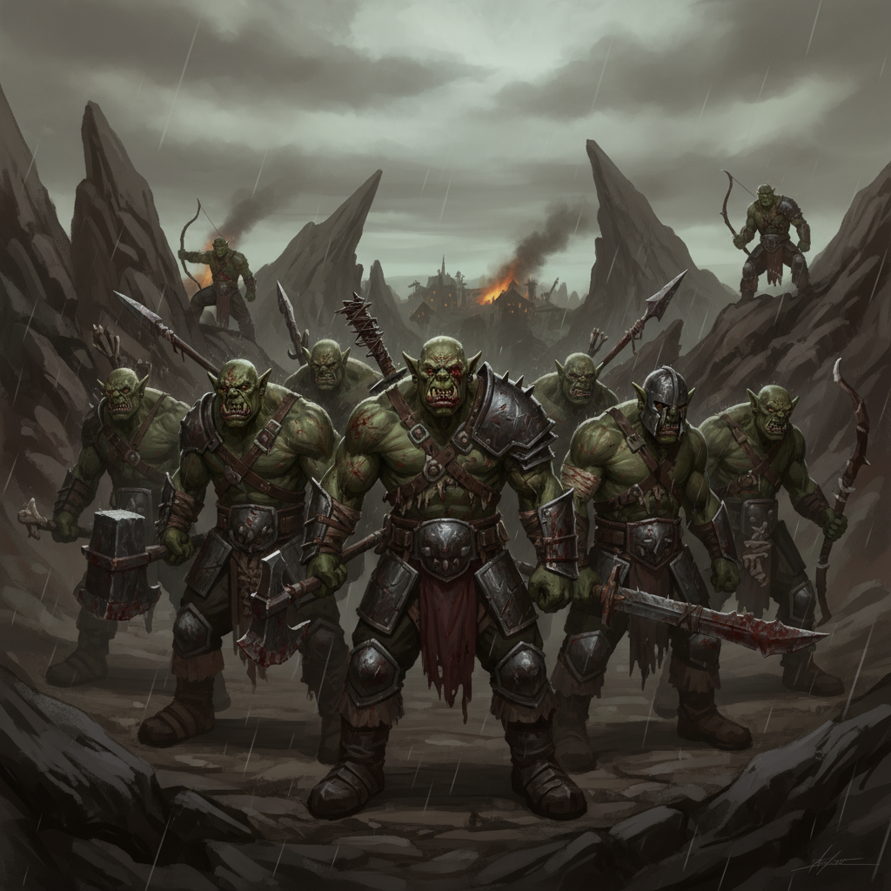

### 4.3.3 Mindset
- Instinkt über Intellekt: **Begrenzte Intelligenz:** Ruptors denken einfacher als Menschen vor dem Großen Vergessen. Sie verstehen komplexe Technologie nicht und interpretieren sie in primitiven, aber poetischen Begriffen.
- Emotionale Direktheit: Ruptors verstecken ihre Gefühle nicht. Wut, Trauer, Freude und Loyalität werden offen gezeigt und gelebt. Sie kennen keine emotionale Distanz wie die Umbras. **Kampf als Lösung:** Bei Konflikten ist die erste Reaktion oft körperliche Auseinandersetzung. 'Man kann mit ihr reden' ist bei Ruptors und Furiosis ein außergewöhnliches Kompliment.
- Die Schmerz-Wut-Spirale der Furiosis: **Schmerz kanalisieren:** Die chronischen Schmerzen der Furiosis werden meist in Wut und Kampfeslust umgewandelt. Dies macht sie zu gefürchteten Kriegern, aber auch unberechenbar. **Seltene Empathie:** Einige wenige Furiosis entwickeln durch ihr eigenes Leiden Verständnis für den Schmerz anderer - eine Seltenheit, die sie zu wertvollen Vermittlern macht. **Heilungssehnsucht:** Alle Furiosis träumen von einem Ende ihrer Qualen. Dies macht sie empfänglich für Heilungsversprechen und mystische Hoffnungen.

### 4.3.4 Key Aspects
- Die große Suche - Stammestradition der Stärkeprüfung; Junge Krieger werden in die wilden Lande geschickt, um ihre Stärke zu beweisen und nach dem mythischen Geburtsort zu suchen. Manche kehren mit Beute und Ehre zurück, andere verschwinden für immer. **Rückkehr-Ritual:** Erfolgreiche Rückkehrer werden gefeiert und ihre Trophäen werden zum Stammeserbe. Gescheiterte werden oft zu niederen Aufgaben degradiert - wie Kräutersammeln oder Bestien-Jagd für den Heiler.
- Der mythische Geburtsort:** Ruptor-Legenden sprechen von dem Ort, 'wo tote Sterne im Boden leuchten' - dem mystischen Ursprung ihrer Rasse. Die Suche nach diesem Ort ist zu einem wichtigen Stammesritual geworden.
- Familienbande über alles: **Blutsbande sind heilig:** Im Gegensatz zu den emotionslosen Umbras und untoten Schöpfern leben Ruptors für ihre Familie und ihren Clan. Familienloyalität steht über persönlichem Erfolg. **Das Schicksal teilen:** Wenn ein Familienmitglied in Ungnade fällt, ist es ehrenhaft, das Schicksal zu teilen, statt es zu verlassen. Dies wird als Zeichen wahrer Ruptor-Stärke gesehen. **Ehrenrituale:** Stammesälteste respektieren diese Loyalität, auch wenn sie sie für unklug halten. 'Was für ein Ruptor wäre ich, wenn ich Familie für Macht aufgebe?' ist ein anerkannter Grundsatz.

### 4.3.5 Politics
- Stammesbasierte Autorität: **Ältestenrat:** Erfahrene Krieger und Überlebende führen den Stamm. Entscheidungen werden durch Diskussion und manchmal Kraftproben getroffen. **Verdiente Führung:** Anders als ererbte Adelstitel müssen Ruptor-Anführer ihre Position durch Taten und Respekt verdienen. Schwäche führt zum Machtverlust. **Pragmatische Gerechtigkeit:** Bestrafungen sind direkt und praktisch orientiert. Versager werden zu nützlichen, aber ehrfosen Aufgaben geschickt.
- Erbfeinde der Umbras: **Jahrhundertelanger Krieg:** Seit ihrer Erschaffung kämpfen Ruptors gegen ihre 'perfekteren' Geschwister, die Umbras. Beiden Völkern ist bewusst, dass sie denselben Ursprung haben, was den Hass nur verstärkt. **Gegensätzliche Philosophien:** Während Umbras emotionale Distanz kultivieren, leben Ruptors pure Gefühle. Diese Unterschiede führen zu fundamentaler Unvereinbarkeit.
- Komplizierte Beziehung zu ihren Schöpfern: **Unbewusster Hass:** Die meisten Ruptors wissen nicht bewusst, wer sie erschaffen hat, spüren aber instinktive Abneigung gegen Untote und deren kalte Perfektion. **Tragische Suche:** Ironischerweise suchen viele Ruptors (besonders Furiosis) Heilung bei genau denen, die ihnen ihr Leiden zugefügt haben.
- Vorsichtige Neutralität zu Menschen: **Handel vor Krieg:** Anders als mit Umbras führen Ruptors mit Menschen hauptsächlich Handel. Menschen sind schwach genug, um keine Bedrohung darzustellen, aber nützlich für den Austausch von Gütern. (Und einige sind irgendwie lustig. Also erst mal nicht auf den Kopf hauen.)

### 4.3.6 Military
- Kampfstil: Instinkt und Wut: **Berserker-Traditionen:** Ruptors kämpfen mit roher Kraft und Instinkt, nicht mit ausgeklügelten Taktiken. Furiosis sind besonders gefürchtet, da ihr Schmerz sie nahezu unaufhaltbar macht. **Familieneinheiten:** Verwandte kämpfen zusammen und beschützen einander bis zum Tod. Die stärksten Krieger-Bruderschaften basieren auf Blutsverwandtschaft.
- Waffen und Ausrüstung: **Einfache, robuste Waffen:** Äxte, Keulen, primitive Schwerter - Ruptors bevorzugen Waffen, die ihre Kraft verstärken. **Zweckmäßige Rüstung:** Leder und Metallteile, zusammengeflickt und praktisch, aber selten elegant oder vollständig.

### 4.3.7 Society
- Die Hierarchie der Nützlichkeit: **Krieger stehen oben:** Körperliche Stärke und Kampffähigkeiten bestimmen den Status. Schwächere haben niedrigen Rang, können sich aber durch andere Fähigkeiten nützlich machen. **Außenseiter-Unterstützung:** Auch die 'Nutzlosen' haben ihren Platz - Heiler, Kräuterkundler, Handwerker. Sie werden respektiert, solange sie zum Stammesüberleben beitragen. **Familien-Netzwerke:** Verwandtschaftsgruppen bilden die Grundeinheit der Gesellschaft. Mehrere Familien bilden einen Clan, mehrere Clans einen Stamm.
- Die drei Klassen: **Krieger-Elite:** Die stärksten und erfolgreichsten Kämpfer, führen Jagden und Kriege an. **Arbeiter-Mehrheit:** Standard-Ruptors, die handwerkliche oder sammelnde Tätigkeiten ausführen. **Ehrenlose Außenseiter:** Gescheiterte, Schwache oder Bestrafte - leben am Rand der Gesellschaft, aber werden nicht verstoßen

### 4.3.8 Culture
- Geschichtenerzähler-Tradition: **Mündliche Überlieferung:** Ruptors haben keine Schrift, ihre Geschichte wird in Liedern und Geschichten weitergegeben. Diese sind oft ungenau, aber emotional kraftvoll. **Heldenlegenden:** Große Krieger und ihre Taten werden in epischen Erzählungen verherrlicht. Der mythische Geburtsort ist Teil dieser Legendentradition.
- Handwerk und Kunst: **Zweckorientierte Schönheit:** Ruptor-Kunst ist funktional - verzierte Waffen, geschnitzte Werkzeuggriffe, praktische Körperbemalung für Kämpfe. **Trophäen-Kultur:** Beute und Erinnerungsstücke von Siegen werden stolz zur Schau gestellt und in Familiensammlungen weitervererbt.

### 4.3.9 Relationships
- Leidenschaftlich und impulsiv: **Intensive Bindungen:** Ruptors lieben und hassen mit ungezähmter Kraft. Ihre Beziehungen sind niemals oberflächlich - sie brennen hell und manchmal destruktiv. **Spontane Paarung:** Romantische Beziehungen entwickeln sich schnell und dramatisch. Ruptors werben nicht lange - wenn die Anziehung da ist, wird sie sofort ausgelebt.
- Brutale Ehrlichkeit: **Keine Geheimnisse:** Ruptors verstecken ihre Gefühle nicht vor Partnern. Eifersucht, Lust, Enttäuschung - alles wird direkt ausgesprochen, oft in lautstarken Auseinandersetzungen. **Kämpfe als Liebesspiel:** Körperliche Konfrontationen sind normal und sogar gesund in Ruptor-Beziehungen. 'Wir haben uns ordentlich geprügelt, jetzt geht es uns besser'.
- Loyalität bis in den Tod: **Lebenslange Partnerschaften:** Einmal gepaart, bleiben Ruptors meist zusammen. Nicht aus Moral, sondern weil ihre intensiven Bindungen schwer zu brechen sind. **Familien-Cluster:** Paare verschmelzen mit ihren Familien zu größeren emotionalen Einheiten. Partner werden automatisch in die Stammesloyalität einbezogen. 
- Furiosis-Besonderheiten: **Schmerz teilen:** Furiosis-Partner entwickeln oft eine spezielle Intimität durch gemeinsames Leiden. Sie massieren sich gegenseitig die schmerzenden Stellen und finden Trost in geteilter Qual. **Heilungsrituale:** Romantische Beziehungen zwischen Furiosis haben oft therapeutische Aspekte - gemeinsame Schmerzlinderung wird zu einem wichtigen Bindungselement.
- Geschlechterrollen - praktisch orientiert: **Stärke entscheidet:** Wer körperlich dominanter ist, übernimmt meist die Führung in der Beziehung - unabhängig vom Geschlecht. **Geteilte Aufgaben:** Beide Partner kämpfen, sammeln, jagen - je nach individueller Begabung, nicht nach starren Rollenbildern. 
- Sexualität - direkt und ungezügelt: **Triebgesteuert:** Ruptors folgen ihren körperlichen Bedürfnissen ohne komplexe gesellschaftliche Tabus. Sex ist natürlich und wird nicht versteckt. **Lautstark:** Ruptor-Intimität ist... hörbar. Andere Stammesmitglieder wissen genau, wann Paare sich versöhnt haben.
- Soziale Bindungen innerhalb des Stammes: **Intensive Freundschaften:** Ruptors entwickeln tiefe, bedingungslose Freundschaften, die oft ein Leben lang halten. Diese 'Blutsbrüder' kämpfen Seite an Seite. **Emotionale Ansteckung:** Gefühle verbreiten sich schnell durch Ruptor-Gemeinschaften. Wenn einer lacht oder weint, steckt das andere an.

### 4.3.10 Naming
- **Ruptor-Namen sind kurz, hart und direkt:** Gorash, Nala, Krogum, Grusk, Thrak, BRuptor, Morg.
-**Spitznamen basieren auf Taten oder Eigenschaften:** 'Der Versager der wilden Lande', 'Der Kleine', 'Bringt-keine-Beute-heim'.
- **Familienbande werden nicht in Namen kodiert:** Ruptors verwenden keine Nachnamen, sondern identifizieren sich über Clan-Zugehörigkeit und persönliche Eigenschaften.

## 4.4 Ur-Untote
### 4.4.1 Appearance
- Die körperliche Realität der Ur-Untoten: **Grundzustand:** 1200 Jahre untoten Daseins haben ihre Spuren hinterlassen, aber sie sind keine verfallenden Zombies. **Erhaltung:** Durch die Unsterblichkeits-Formel der Hochkultur bleiben sie in einem stabilen, aber leblos wirkenden Zustand. **Individuelle Unterschiede:** Jeder Ur-Untote zeigt andere Aspekte des untoten Verfalls.    
- Physische Merkmale: **Haut:** Kalt wie Marmor, oft grau oder bleich, manchmal durchscheinend mit sichtbaren Adern. **Augen:** Haben ihren Glanz verloren - wirken stumpf, glasig oder vollständig schwarz. **Bewegung:** Fließend aber unnatürlich - keine spontanen Gesten, jede Bewegung wirkt kalkuliert. **Atem:** Atmen nicht - ihre Brust hebt und senkt sich nicht, was Gespräche unheimlich macht. **Temperatur:** Berührung fühlt sich an wie das Anfassen einer Steinstatue.  
- Emotionale Leere zeigt sich körperlich: **Gesichtsausdruck:** Maskenartig starr - selbst 'Lächeln' wirkt aufgesetzt und kalt. **Stimme:** Monoton oder mechanisch - emotionale Nuancen fehlen völlig. **Körpersprache:** Keine unbewussten Bewegungen - starren minutenlang ohne zu blinzeln. **Präsenz:** Erwecken Unbehagen bei Lebenden - 'Uncanny Valley'-Effekt.     
- Zeichen der Zeit: **1200 Jahre Spuren:** Kleine Details verraten ihr wahres Alter. **Veraltete Gesten:** Höflichkeitsformen aus der Hochkultur. **Archaische Kleidung:** Bevorzugen Stile ihrer ursprünglichen Epoche. **Verschleiß:** Kleinere 'Macken' - ein Auge das nicht mehr bewegt, eine steife Hand. **Reparaturen:** Manche zeigen Selbst-'Wartung' - genähte Wunden, ersetzte Körperteile.        
- Individuelle Variationen: **Lord Ingin Typ - Der Erhaltene:** Relativ 'normal' aussehend, aber mit toter Ausstrahlung. **Verfallstyp:** Sichtbare Schäden, aber immer noch funktional. **Mumifiziert:** Ausgetrocknet und pergamentartig, aber beweglich. **Kristallin:** Teilweise durch Artefakt-Energie verändert - glasige oder metallische Hautpartien.        
- Tarnung unter Lebenden: **Oberflächliche Verkleidung:** Können sich als Lebende ausgeben durch: **Falsche Atmung:** Bewusst nachgeahmte Brustbewegungen. **Warme Kleidung:** Verdeckt kalte Haut. **Make-up/Masken:** Verbergen die Totenblässe. **Distanz:** Vermeiden körperlichen Kontakt. **Verräterische Details:** Erfahrene Beobachter erkennen sie an: **Fehlenden Schatten** bei bestimmtem Licht. **Unnatürlicher Ruhe** - blinzeln/atmen nicht. **Veralteten Manierismen** aus der Hochkultur. **Kälte-Aura** in ihrer unmittelbaren Nähe.

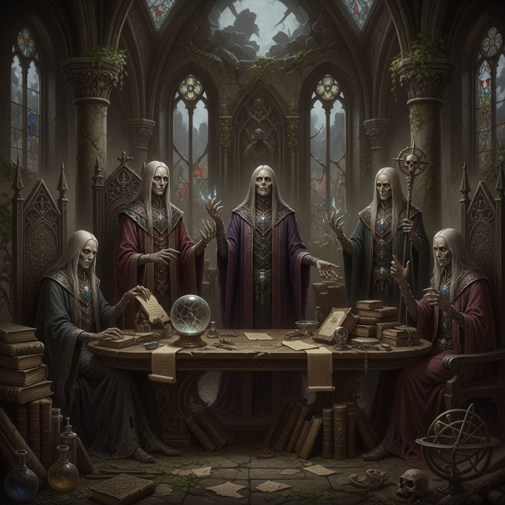  
      
### 4.4.2 Abilities
- Unsterblichkeits-Eigenschaften: **Keine biologischen Bedürfnisse:** Brauchen weder Nahrung, Schlaf noch Atmung. **Regeneration:** Langsame Selbstreparatur bei physischen Schäden. **Zeitlose Geduld:** Können jahrzehntelange Pläne ohne Ungeduld verfolgen. **Immunität:** Resistent gegen Gifte, Krankheiten und die meisten physischen Schwächen.    
- Hochkultur-Wissen: **Artefakt-Meisterschaft:** Verstehen und kontrollieren komplexeste Hochkultur-Technologie. **Wissenschaftliche Brillanz:** Behalten das gesamte Wissen ihrer fortgeschrittenen Zivilisation. **Sprachen der Toten:** Kennen vergessene Sprachen und verlorene Schriften. **Historische Omniszienz:** Waren bei jedem wichtigen Ereignis der letzten 1200 Jahre dabei.    
- Hohe Intelligenz: **Überlegene Denkfähigkeit:** IQ-Level der Hochkultur (150-170) in einer Welt mit Durchschnitts-IQ von ~100. **Komplexe Problemlösung:** Verstehen Zusammenhänge, die anderen verborgen bleiben. **Strategische Planung:** Denken in Jahrhunderten statt Jahren. **Multidisziplinäres Wissen:** Beherrschen mehrere Wissenschaftsbereiche gleichzeitig.    
- Schwächen und Grenzen: **Emotionale Leere:** Können keine echten Gefühle empfinden oder inspirieren. **Kreativitäts-Verlust:** Unfähig zu echter Innovation oder künstlerischer Schöpfung. **Lebende Abstoßung:** Instinktive Abneigung aller Lebewesen gegen sie. **Elementare Verwundbarkeit:** Heiliges Feuer und bestimmte Energien können sie verletzen.

### 4.4.3 Mindset
- **Die Ur-Untoten** sind die ursprünglichen Untoten, die aus der Katastrophe hervorgingen, die ihre Zivilisation zerstörte. Sie sind eine vielfältige Gruppe mit unterschiedlichen Überzeugungen und Zielen, die jedoch alle von dem gemeinsamen Trauma der Katastrophe geprägt sind. **Ursprung:** Überlebende einer pandemischen Katastrophe, die ihre Zivilisation zerstörte. **Ziel:** Wiedererlangung der Kontrolle über die Welt und Vermeidung weiterer Katastrophen. **Herausforderung:** Umgang mit Schuldgefühlen und Depressionen aufgrund ihrer Vergangenheit. **Gesellschaftliche Spaltung:** Unterschiedliche Fraktionen mit verschiedenen Ansätzen zur Bewältigung ihrer Situation.
- Von Rettern zu Monstern in 1200 Jahren: Sie wollten die Menschheit retten**: Schufen die Untoten-Plage und spalteten die Menschheit. **Sie wollten perfekte Nachfolger**: Schufen überlegene, aber brutale Krieger-Völker. **Sie wollten loyale Diener**: Schufen rebellische Völker, die sie zu Recht hassen. **Sie wollten Unsterblichkeit**: Leben in emotionsloser Kälte ohne Freude. **Sie wollten Kontrolle**: Verloren jede Macht über ihre eigenen Schöpfungen.
- Als Wissenschaftler haben Sie einen Hang dazu, Dinge zu planen, zu verstehen und zu kontrollieren. Das was etwa auch ihre Intention bei der Erschaffung der Völker. Aber die Realität ist chaotisch und unvorhersehbar. Die lebenden Völker entwickelten sich eigenständig: **Nicht mehr Marionetten, sondern eigene Akteure:** Obwohl von den Ur-Untoten erschaffen, haben alle Völker **ihre eigenen Kulturen, Ziele und Motivationen** entwickelt: **Menschen** streben nach Expansion und Herrschaft (inspiriert, aber nicht kontrolliert von der Gottkönigin). **Umbras** entwickelten ihre militaristische Gesellschaft aus eigenem Antrieb. **Ruptors** kämpfen aus Schmerz und Überlebensinstinkt, nicht aus Programmierung. **Die Konflikte** entstehen aus genuinen kulturellen Unterschieden, nicht nur aus alter Geschichte.

### 4.4.4 Key Aspects
- Die Ur-Untoten pflegen keine Traditionen im eigentlichen Sinn - 1200 Jahre Depression und Schuld haben die meisten kulturellen Praktiken ausgelöscht. Was bleibt, sind fragmentierte Überreste und zwanghafte Gewohnheiten.        
- Überreste der Hochkultur: **Sprachliche Relikte:** Verwenden noch alte Redewendungen und Zitate aus der untergegangenen Zivilisation. **Wissenschaftliche Rituale:** Manche befolgen noch methodische Abläufe aus ihrer Forschungszeit. **Akademische Höflichkeit:** Formelle Anreden und Diskussionsformen der alten Universitäten. **Technische Präzision:** Obsessive Genauigkeit bei allem, was sie tun.        
- Zwanghafte Gewohnheiten statt Traditionen: **Das Sammeln:** Jeder Ur-Untote hortet etwas - Artefakte, Bücher, Erinnerungsstücke. **Endlose Aufzeichnungen:** Viele führen detaillierte Chroniken über 1200 Jahre Ereignisse. **Routine als Anker:** Strenge Tagesabläufe geben Struktur in der sinnlosen Existenz. **Reparatur-Rituale:** Ständige 'Wartung' ihrer untoten Körper und Besitztümer.
- Fraktions-spezifische 'Traditionen': **Isolationisten:** Pflegen das 'Große Schweigen' - tagelange Meditation über vergangene Fehler. **Expansionisten:** Kriegsrat-Treffen, in denen sie Pläne zur Welteroberung schmieden. **Forscher:** Artefakt-Weihe-Zeremonien vor gefährlichen Experimenten. **Pragmatiker (Gottkönigin-Fraktion):** Haben bewusst alle alten Gewohnheiten abgelegt.        
- Anti-Traditionen der Schuld: **Selbstbestrafung:** Manche verweigern sich jeglichen Komfort als Buße. **Erinnerungs-Folter:** Zwanghaftes Durchleben der schlimmsten Momente ihrer Geschichte. **Isolation als Prinzip:** Vermeiden Kontakt zu Lebenden, um 'weiteren Schaden zu verhindern'. **Verweigerung von Freude:** Alles, was Glück bringen könnte, wird abgelehnt.        
- Was nie entstehen konnte: **Familienstrukturen:** Untote können keine Kinder haben - keine generationalen Traditionen. **Religiöse Praktiken:** Ihr Versagen als 'Götter' macht echten Glauben unmöglich. **Kulturelle Feste:** Freude und Gemeinschaft sind für sie unerreichbar geworden. **Mentorship:** Die nächste Generation zu lehren ist sinnlos, wenn man selbst gescheitert ist.        
- Ersatz-Traditionen: **Gelehrten-Zirkel:** Wenige treffen sich noch zum wissenschaftlichen Austausch. **Chronisten-Pflicht:** Das Aufzeichnen der Geschichte als letzte sinnvolle Tätigkeit. **Artefakt-Tauschhandel:** Einer der wenigen sozialen Kontakte zwischen verschiedenen Ur-Untoten.

### 4.4.5 Politics
- Die Untoten-Zitadelle - Festung der Verlorenen: **Sitz der größten Ur-Untoten-Fraktion:** **Lage:** In den Randgebieten der wilden Lande. **Bevölkerung:** ~14 Ur-Untote + lebende Berater + Skelett/Zombie-Armee. **Führung durch den 'Sprecher der Untoten':** **Gewählt von den Ur-Untoten** - nicht der Mächtigste, sondern der Diplomatischste. **Hält die Fraktionen im Gleichgewicht** zwischen Isolation und Expansion. **Selbst innerlich zerrissen** zwischen Depression und Aktion. **Die ewigen Fraktionen:** **Isolationisten (~9):** 'Jeder Eingriff macht es schlimmer - lasst uns in Ruhe sterben'. **Expansionisten (~5):** 'Wir müssen die Kontrolle zurückgewinnen, bevor es zu spät ist'. **Wechselnde Mehrheiten** je nach aktuellen Ereignissen und Erfolgen. **Lebende Verbündete:** **Nachkommen alter Diener-Familien** - jahrhundertealte Loyalität. **Akademiker** mit genuiner Neugier auf Hochkultur-Wissen. **Politische Flüchtlinge** aus den anderen Reichen. **Opportunisten** angelockt durch Artefakte und Macht
- Der Persephone-Komplex - Forschung und Katastrophe: **Die Wiedererweckung der alten Anlage:** **Die Pragmatiker-Gruppe: Persephone-Forscher (~7 Ur-Untote):** **Ziel:** Persephone-Anlage wieder funktionsfähig machen\n- **Hoffnung:** Alte Technologie könnte die Welt retten. **Der dimensionale Unfall:**\n- **Fehlgeschlagenes Experiment** zur Anzapfung trans-dimensionaler Energie. **Unbeabsichtigte Öffnung** eines Risses zur Finsterwelt. **Verzweifelte Reparaturversuche** der Gruppe verschlimmern die Situation. **Die neue Bedrohung:**\n- **Finsterwelt-Dröhnen** beginnt, die wilden Lande zu verändern (die Kinder der Melodie). **Ur-Untote können den Riss nicht schließen** - ihre Technologie ist nicht darauf ausgelegt.
- Die einzelnen Forscher - Verzweifelte Sucher: **Wie Lord Ingin - auf einsamer Mission:**\n**Ihre Motivation:** **Flucht aus der kollektiven Depression** durch Fokussierung auf konkrete Ziele. **'Vielleicht kann ich wenigstens DAS richtig machen'** - Wiedergutmachung für 1200 Jahre Fehler. **Wissenschaftliche Neugier** als letzter Lebensinhalt in der untoten Existenz. **Ihre Methoden:**\n- **Artefakt-Suche** in den gefährlichsten Regionen der Welt.
- Das Gottkönigin-Triumvirat - Die letzten Aktiven: **Der einzige erfolgreiche Ausbruch aus der Depression:** **Die neue Strategie:** **Manipulation statt Herrschaft** - arbeiten durch Stellvertreter. **500 Jahre Geduld** beim Aufbau des Menschenreichs. **Artefakte als Belohnung** für die 13 Paladine. **Systematische Vernichtung** aller anderen Völker durch den 'Heiligen Kreuzzug'. **Ihre Probleme:** **Vertrauen in die Paladine** - riskant, da sie zunehmend eigenwillig werden. **Nur zu dritt** für ein riesiges, expandierendes Reich. **Andere Ur-Untote** könnten ihre Tarnung verraten. **Die schiere Größe des Reichs** überfordert selbst ihre Fähigkeiten zuweilen.

### 4.4.6 Military
- Die Doppelstrategie der untoten Kriegsführung: **Reanimierte Armeen:** Skelette und Zombies als direkte militärische Macht. **Erschaffene Völker:** Genetische Experimente sollten loyale, lebende Armeen schaffen. **Das fundamentale Scheitern:** Beide Ansätze führten zu unvorhergesehenen Katastrophen.       
- Reanimations-Technologie: Kombination von nekromantischen Kristallen und Bewusstseins-Übertragungsmatrizen. **Funktionsweise:** Tote Körper werden mit grundlegenden Bewegungs- und Kampfbefehlen programmiert. **Vorteile:** Unendlich reproduzierbar, völlig loyal, keine eigenen Wünsche. **Schwächen:** Keine Initiative, primitive Taktiken, leicht vorhersagbar.        
- Die lebenden Experimente - Völkerschöpfung als Militärstrategie: **Ursprüngliches Ziel:** Überlegene Krieger-Rassen für die Ur-Untoten erschaffen. **Umbras-Projekt:** Perfekte Soldaten - intelligenter, stärker, langlebiger als Menschen. **Ruptor-Projekt:** Loyale Arbeiter und Kämpfer nach dem Umbras-Aufstand. **Furiosis-Verzweiflung:** Letzte Eskalation nach dem Versagen der normalen Ruptors.  
- Taktische Stärken der Untoten-Armeen: **Perfekte Koordination:** Befehle werden ohne Interpretation oder Zögern ausgeführt. **Keine Moral-Probleme:** Untote kennen keine Angst, Müdigkeit oder Desertion. **Endlose Ausdauer:** Kämpfen bis zur völligen Zerstörung. **Rekrutierungs-Vorteil:** Jeder gefallene Feind kann reanimiert werden. **Zahlenvorteil:** Jahrhunderte der Sammlung haben riesige Armeen geschaffen.        
- Taktische Schwächen: **Vorhersagbarkeit:** Folgen starren Befehlsmustern ohne Anpassung. **Keine Initiative:** Können nicht auf unvorhergesehene Situationen reagieren. **Einzelkampf-Schwäche:** Unterlegen gegen gut ausgebildete lebende Krieger. **Befehls-Abhängigkeit:** Ohne Anführer kollabiert die gesamte Formation. **Elementar-Verwundbarkeit:** Feuer und bestimmte Magie zerstören sie effektiv.        
- Strategische Fehler bei der Völkerschöpfung: **Intelligenz-Paradox:** Kluge Schöpfungen hinterfragen ihre Schöpfer. **Loyalitäts-Illusion:** Annahme, dass genetische Programmierung Gehorsam garantiert. **Schmerz-Verstärkung:** Furiosis-Experimente schufen Hass statt Loyalität. **Unterschätzung der Evolution:** Lebende Völker entwickeln eigene Kulturen und Ziele. **Überschätzung der Kontrolle:** Glaube, komplexe Lebensformen dauerhaft kontrollieren zu können.        
- Moderne untote Militärdoktrin: **Isolationisten:** Rein defensive Haltung - Skelett-Armeen zum Schutz der Zitadellen. **Expansionisten:** Offensive Planung mit kombinierten untoten und rekrutierten Kräften. **Forscher:** Experimentieren noch immer mit Reanimations-Verbesserungen. **Pragmatiker (Gottkönigin-Fraktion):** Nutzen menschliche Armeen statt eigener Truppen.        
- Lektionen des militärischen Versagens: **Komplexität bringt Rebellion:** Je intelligenter die Schöpfung, desto wahrscheinlicher der Aufstand.

### 4.4.7 Society
- Die fragmentierte Gesellschaft der Ur-Untoten: **Keine echte Gemeinschaft:** 1200 Jahre haben jede natürliche Sozialstruktur zerstört. **Fraktions-Bildung als Ersatz:** Gruppenbildung basierend auf Bewältigungsstrategien, nicht auf Zuneigung. **Geografische Trennung:** Verschiedene Fraktionen leben in separaten Gebieten. **Seltene Kontakte:** Treffen meist nur bei Krisen oder wichtigen Entscheidungen.        
- **Isolationisten (Mehrheit):** **Rückzug in die Untoten-Zitadelle** jenseits der bewohnten Welt. **Defensive Mentalität:** 'Wenn wir nichts tun, können wir nichts falsch machen'. **Paranoider Festungsausbau:** 'Ist die Mauer hier auch wirklich dick genug?'\n- **Sammlung von Artefakten** als letzter Hoffnungsanker. **Lady Balea als typisches Beispiel:** Chronistin der Vergangenheit, pessimistische Beobachterin. **Interne Struktur:** Sprecher der Untoten als gewählter Diplomat, nicht Herrscher. **Tagesablauf:** Endlose Wiederholung von Routine und Erinnerung.     
- **Expansionisten (Minderheit):** **Suchen Stimulation durch Eroberung** - Aktion gegen die Depression. **'Diesmal machen wir es richtig!'** - lernen aus vergangenen Fehlern. **Militärische Aufrüstung** und Bündnis-Bildung. **Wollen aktiv die Kontrolle zurückgewinnen**. **Rekrutierung lebender Verbündeter:** Sammeln Opportunisten und Flüchtlinge. **Kriegsplanung:** Entwerfen ständig neue Strategien zur Welteroberung. **Rechtfertigung:** 'Die Welt braucht starke Führung - wer sonst als wir?'.        
- **Die Persephone-Forscher:** **Suchen technische Lösungen** für existenzielle Probleme. **Kollektive Obsession:** Wiederaufbau der Forschungsanlage als Lebenszweck. **'Das Genesis-Artefakt wird alles reparieren'** - verzweifelte Hoffnung. **Gefährliche Experimente:** Der dimensionale Riss war ihr größter Fehler. **Wissenschaftlicher Austausch:** Einer der wenigen funktionierenden sozialen Kontakte. **Hierarchie der Expertise:** Respekt basiert auf technischem Wissen.        
- **Einzelforscher:** **Totale Isolation:** Leben allein in abgelegenen Laboratorien oder Ruinen. **Lord Ingin als Paradebeispiel:** Camp Ingin als Ein-Mann-Forschungsstation. **Verschiedene Obsessionen:** Jeder verfolgt seine eigene 'Lösung' für die Weltprobleme. **Kommunikation durch Mittelsmänner:** Wie Ingins 'Charlie's Angels'-System. **Paranoia vor Störungen:** Verstecken ihre Arbeit vor anderen Ur-Untoten.        
- **Das Triumvirat:** **Die Gottkönigin und ihre Berater** - einzige, die aus der Depression ausgebrochen sind. **Neue Strategie:** Manipulation durch Stellvertreter statt direkte Herrschaft. **500 Jahre Geduld:** Langfristige Pläne ohne sentimentale Bindungen. **Völlige Emotionslosigkeit:** Behandeln Menschen wie Schachfiguren. **Erfolgreichste Fraktion:** Haben tatsächlich ein funktionierendes Reich aufgebaut.        
- Soziale Strukturen und Hierarchien: **Alter bedeutet wenig:** Alle sind ungefähr gleich alt - Respekt basiert auf anderen Faktoren. **Macht durch Ressourcen:** Wer die meisten Artefakte oder Diener kontrolliert, hat Einfluss. **Wissenschaftliche Leistung:** Durchbrüche verleihen temporären Status. **Politische Allianzen:** Wechselnde Koalitionen je nach aktueller Krise. **Geografische Kontrolle:** Territoriale Ansprüche schaffen Machtverhältnisse.        
- Alltagsleben und Routine: **Endlose Zeit:** Ohne biologische Bedürfnisse müssen sie ihre Existenz künstlich strukturieren. **Zwanghafte Beschäftigungen:** Sammeln, Forschen, Planen als Ersatz für echte Ziele. **Mechanische Interaktionen:** Gespräche folgen rituellen Mustern. **Erinnerungs-Zyklen:** Regelmäßiges Durchleben vergangener Ereignisse. **Wartung und Reparatur:** Pflege ihrer untoten Körper und Besitztümer.         
- Konflikte zwischen den Fraktionen:**Philosophische Differenzen:** Isolationisten vs. Expansionisten über Einmischung in die Welt. **Ressourcen-Konkurrenz:** Streit um rare Artefakte und strategische Positionen\n**Verantwortungs-Zuweisungen:** Wer trägt Schuld an welchem historischen Versagen?. **Zukunfts-Visionen:** Unvereinbare Vorstellungen über die 'richtige' Lösung. **Territoriale Ansprüche:** Kontroll-Konflikte über wichtige Gebiete.
- Die lebenden 'Untertanen': **Nachkommen alter Diener:** Jahrhundertealte Loyalität durch Familientraditionen. **Akademische Kollaborateure:** Gelehrte, angelockt durch Hochkultur-Wissen. **Politische Flüchtlinge:** Aus anderen Reichen vertriebene Adlige und Offiziere. **Opportunisten:** Abenteurer und Händler, die von Artefakten profitieren wollen. **Fanatiker:** Seltene Menschen, die die Ur-Untoten als Götter verehren.        
- Gesellschaftlicher Verfall: **Keine Reproduktion:** Untote können keine Nachkommen haben - gesellschaftliche Stagnation. **Kultureller Tod:** Keine neuen Ideen, Kunst oder Innovationen. **Emotionale Wüste:** Beziehungen existieren nur als mentale Konstrukte. **Moralische Korrosion:** 1200 Jahre Schuld haben jeden Ethik-Sinn zerstört. **Zivilisatorischer Rückschritt:** Von Wissenschaftlern zu feudalen Lords geworden.

### 4.4.8 Culture
- Kuratoren der toten Zivilisation: **Obsessive Sammler:** Viele Ur-Untote haben umfangreiche Archive der Hochkultur angelegt. **Konservierungs-Zwang:** Perfekte Erhaltung als Ersatz für echte Wertschätzung. **Einsame Kuratoren:** Sammeln für sich selbst, da niemand sonst die Bedeutung versteht. **Kategorien:** Kunst, Musik, Literatur, Alltagsgegenstände, wissenschaftliche Instrumente.
- Hochkultur-Relikte: **Kunstwerke:** Gemälde, Skulpturen und Installationen in kristallinen Aufbewahrungskammern. **Musikarchive:** Melodien und Symphonien auf kristallinen Datenträgern gespeichert. **Literatur:** Komplette Bibliotheken mit Poesie, Romanen und philosophischen Werken. **Populärkultur:** Film-Äquivalente, Spiele, Unterhaltungsmedien der Hochkultur. **Alltagsobjekte:** Geschirr, Kleidung, Werkzeuge - das 'gewöhnliche' Leben von damals.
- Lady Baleas Museum of Lost Art (MoLA): **Die größte Sammlung der Hochkultur:** In den Tiefen der Untoten-Zitadelle hat Lady Balea ein komplettes Museum eingerichtet. **Perfekte Konservierung:** Klimakontrollierte Kammern mit kristalliner Stasis-Technologie. **Einsame Kuratorin:** Führt sich selbst durch die Ausstellungen, kommentiert für ein nicht-existentes Publikum. **Kategorische Ordnung:** Systematisch nach Epochen, Kunstformen und emotionaler Bedeutung gegliedert.    
- Museumsarchitektur: **Die Säle der Erinnerung:** Thematisch geordnete Galerien in der Zitadelle. **Saal der letzten Symphonien:** Musik-Archive mit kristallinen Wiedergabesystemen. **Galerie der toten Meister:** Gemälde und Skulpturen der größten Künstler. **Bibliothek der verlorenen Worte:** Literatur und Poesie der Hochkultur. **Kammer der alltäglichen Wunder:** Haushalts- und Gebrauchsgegenstände. **Pantheon der Wissenschaft:** Instrumente und Geräte der Forschung. **Geheime Bereiche:** Besonders schmerzhafte Erinnerungsstücke, nur für Balea zugänglich.
- Die Sammlungs-Obsession: **Kompulsive Beschaffung:** Schickt Agenten in die wilden Lande, um jeden Kulturrest zu bergen. **Perfektionistische Restauration:** Verbringt Jahrzehnte damit, ein einziges Kunstwerk zu reparieren. **Katalogisierungs-Zwang:** Jedes Objekt wird minutiös dokumentiert und eingeordnet. **Diebstahl als 'Rettung':** Stiehlt anderen Ur-Untoten Kunstwerke 'zum Schutz der Kultur'.
- Baleas Führungen für 'Besucher': **Monologe statt Dialoge:** Erklärt anderen Ur-Untoten die Exponate in endlosen Vorträgen. **Emotionale Manipulation:** Nutzt die Sammlung, um andere von der 'Größe der Vergangenheit' zu überzeugen. **Selektive Präsentation:** Zeigt verschiedenen Besuchern unterschiedliche Sammlungsteile. **Rituelle Wiederholung:** Dieselben Führungen seit Jahrhunderten, mit identischen Worten.    
- Konflikte um das Museum: **Andere Sammler:** Rivalität mit Ur-Untoten, die eigene Kulturarchive haben. **Zugangs-Verweigerung:** Balea entscheidet willkürlich, wer das Museum sehen darf. **Entwendungs-Vorwürfe:** Andere beschuldigen sie, ihre wertvollsten Stücke gestohlen zu haben. **Philosophische Debatten:** Sollte Kultur bewahrt oder 'freigelassen' werden?    
- Die Ironie der Konservierung: **Leben ohne Lebendigkeit:** Perfekt erhaltene Kunst in einer emotional toten Welt. **Kultur ohne Schöpfung:** Sammelt Vergangenheit, kann aber nichts Neues erschaffen. **Schönheit ohne Freude:** Kann ästhetische Vollendung nur noch intellektuell erfassen. **Bildung ohne Verständnis:** Weiß alles über Kunst, versteht aber ihren ursprünglichen Zweck nicht mehr.    
- Das Museum als Spielelement: **Informationsquelle:** Spieler können hier Wissen über die Hochkultur erhalten. **Begegnungsort:** Neutrale Zone für Verhandlungen zwischen verschiedenen Fraktionen. **Schatzsuche:** Einzelne Exponate könnten Hinweise auf wichtige Artefakte enthalten. **Moralisches Dilemma:** Sollten Kulturgüter 'befreit' oder 'geschützt' werden?. **NPC-Motivation:** Balea könnte Aufträge zur Bergung besonderer Kunstwerke vergeben.

### 4.4.9 Relationships
- Die Last der gemeinsamen Vergangenheit: **1200 Jahre geteilte Schuld:** Alle Ur-Untoten waren Komplizen beim Untergang der Hochkultur. **Kollektive Verantwortung:** Jeder weiß, dass die anderen genauso versagt haben. **Unausgesprochene Vorwürfe:** 'Warum hast du mich nicht aufgehalten?' vs. 'Warum hast du nicht widersprochen?'. **Gemeinsame Traumata:** Der Moment der Transformation, das Sterben der alten Welt.        
- Wissenschaftliche Rivalitäten aus der Hochkultur: **Alte Hierarchien:** Ehemalige Kollegen, Vorgesetzte und Untergebene in neuer Machtverteilung. **Fachbereichs-Konflikte:** Biologen vs. Physiker vs. Ingenieure - wie bei Aron und Ingin. **Unvollendete Diskussionen:** Argumente, die seit 1200 Jahren schwelen. **Verpasste Chancen:** 'Hätte ich damals auf dich gehört...'.        
- Emotionale Unmöglichkeiten: **Liebe ohne Wärme:** Können sich an frühere Zuneigung erinnern, aber nicht mehr fühlen. **Freundschaft ohne Freude:** Alte Verbindungen existieren nur noch als mentale Konstrukte. **Vertrauen ohne Hoffnung:** Verlassen sich aufeinander, erwarten aber nichts Positives. **Loyalität ohne Leidenschaft:** Halten zusammen aus Gewohnheit, nicht aus Überzeugung.        
- Praktische Abhängigkeiten: **Jahrhundertelange Routine:** Manche interagieren nur noch aus Gewohnheit. **Spezialisiertes Wissen:** Brauchen einander für verschiedene Expertisen. **Geteilte Ressourcen:** Artefakte, Laboratorien, untote Diener. **Strategische Allianzen:** Kooperieren gegen externe Bedrohungen.      
- Schuldzyklen und Vergebung: **Ingins Aron-Schuld:** 'Hätte ich ihm geholfen, wäre er vielleicht nicht gestorben'. **Gegenseitige Vorwürfe:** Jeder sieht die Fehler der anderen klarer als die eigenen. **Unmögliche Vergebung:** Können einander nicht vergeben, da sie sich selbst nicht vergeben können. **Nostalgische Idealisierung:** Tote Kollegen werden zu Heiligen verklärt.       
- Fraktions-interne Beziehungen: **Isolationisten:** Gemeinsame Depression als Bindemittel - 'Elend liebt Gesellschaft'. **Expansionisten:** Kameradschaft durch gemeinsame Feindbilder. **Forscher:** Wissenschaftlicher Austausch als letzter Lebensinhalt. **Pragmatiker (Gottkönigin-Fraktion):** Geschäftsbeziehungen ohne sentimentale Bindungen.      
-  Beziehungen zu 'Außenseitern': **Zu lebenden Verbündeten:** Herablassende Protektion - 'nützliche Haustiere'. **Zu ihren Schöpfungen:** Komplexe Eltern-Kind-Dynamiken mit den erschaffenen Völkern. **Zu jüngeren Untoten:** Generationskonflikt - 'die verstehen nichts von der alten Zeit'. **Zu Abtrünnigen:** Verachtung gemischt mit heimlichem Neid auf deren 'Mut'.
- Kommunikationsmuster: **Indirekte Gespräche:** Wichtige Themen werden nur angedeutet, nie direkt angesprochen. **Rituelle Höflichkeit:** Formelle Umgangsformen verbergen tiefe Ressentiments. **Wissenschaftsjargon:** Emotionen werden in technische Begriffe verpackt. **Lange Pausen:** Jahrhunderte ohne Kontakt, dann plötzlich intensive Zusammenarbeit.        
- Die Unmöglichkeit echter Nähe: **Körperliche Kälte:** Berührung bringt keine Wärme oder Trost. **Emotionale Leere:** Können Zuneigung simulieren, aber nicht empfinden. **Zeitliche Entfremdung:** 1200 Jahre verändern selbst die engsten Bindungen. **Existenzielle Isolation:** Jeder ist letztendlich allein mit seiner persönlichen Schuld.       
- Seltene Momente der Verbindung: **Geteilte Erinnerungen:** Gespräche über die Hochkultur schaffen kurze Nähe. **Wissenschaftliche Entdeckungen:** Breakthrough-Momente können alte Kameradschaft kurz beleben. **Externe Krisen:** Bedrohungen wie die Finsterwelt-Kreaturen und Finsterwelt-Risse schweißen temporär zusammen. **Nostalgische Rituale:** Gemeinsame 'Feiern' vergangener Erfolge als schwacher Ersatz für echte Freude.

### 4.4.10 Naming
- Der Verlust der alten Identitäten: **Akademische Titel abgelegt:** Die meisten verwenden ihre Hochkultur-Titel nicht mehr - zu schmerzhaft\n**'Lord' und 'Lady' als Standard:** Spiegelt ihre neue Rolle als Herrscher über Untote-Armeen wider\n**Praktische Hierarchie:** Die Titel zeigen Status in der untoten Gesellschaft, nicht wissenschaftliche Leistung
- Kategorien der Namenswahl: **Profession-basiert:** Wie 'Ingin' (Ingenieur) - definiert durch das, was sie taten. **Macht-basiert:** Namen, die Autorität und Herrschaft betonen. **Nostalgisch:** Variationen ihrer alten Namen, aber verändert. **Zynisch:** Namen, die ihre Bitterkeit oder ihren Selbsthass reflektieren. **Funktional:** Einfache, praktische Bezeichnungen ohne emotionale Bindung.        
- Anrede-Protokolle: **Unter Ur-Untoten:** Meist formell 'Lord/Lady' + gewählter Name. **Zu Untergebenen:** Erwarten unterwürfige Anrede - verstärkt das Machtgefühl. **In wissenschaftlichen Diskussionen:** Manchmal Rückfall in alte akademische Titel. **Öffentlich vs. Privat:** Manche haben 'offizielle' Namen und geheime Selbstbezeichnungen.        
- Beispiele verschiedener Namens-Typen: **Profession:** Lord Ingin (Ingenieur), Lady Archaen (Archäologin), Lord Mathema. **Macht:** Lord Dominus, Lady Suprema, Lord Imperator. **Nostalgisch:** Dr. Malachar: Lord Malach, Prof. Thana: Lady Thanaia. **Zynisch:** Lord Erratum (der Fehler), Lady Ruina (die Zerstörung). **Funktional:** Lord Primus, Lady Secunda (einfache Nummerierung).        

# 5. Gamemasters Section: History of Arx Lumina 
Die Geschichte von Arx Lumina ist eine Geschichte verschiedener Völker. Um den aktuellen Zustand der Welt zu verstehen, ist es wichtig, die Entstehung dieser Völker als Echos einer untergegangenen Hochkultur und deren untoter Überlebender zu begreifen. Während der zwölfhundert Jahre nach dem Untergang waren diese Ur-Untoten eine treibende Kraft mannigfaltiger Fehlschläge und Katastrophen, die die Dinge, wie sie sind, geformt haben. Nicht zuletzt sind die "Wilden Lande" durch ihr zutun zu der Bedrohung geworden, die sie heute für die Völker darstellen: Ein Ort, an dem Chaos-Dimensionen durch Risse in unsere Realität "einbluten" und das Leben unvorstellbar und gefährlich mutieren.

## 5.1 Das Ende der Hochkultur
Die Existenz und das Schicksal der Hochkultur ist nur einigen wenigen bekannt. Hierzu zählen die Ur-Untoten, sie waren dabei. Abenteurer in den "Wilden Landen", die auf Ruinen stoßen, vermuten deren Existenz vielleicht. Allerdings sind Ruinen und Artefakte der Hochkultur für die allermeisten einfach nur "Dinge" der Ur-Untoten, da diese schon immer da waren.

### 5.1.1 Die Hochkultur und ihre Errungenschaften
**Die Hochkultur** war der Höhepunkt menschlicher Zivilisation - eine Gesellschaft von beispielloser Intelligenz, Wissenschaft und Kultur. Was damals selbstverständlich war, würde heute wie Magie wirken. Und tatsächlich sind Artefakte der Hochkultur, die die Jahrhunderte seit dem Untergang überdauert haben im heutigen Arx Lumina genau dieses: Magie. Es gibt heute wenige Menschen, die in der Lage sind, solche Artefakte zu verwenden. Sie werden **Funktionalis** genannt. In ihrem Blut befinden sich Reste einer genetische Technologie, die eine Schnittstelle zwischen ihrem Geist und den Artefakten bildet. Diese, Geschick und Übung erlauben das Führen von Artefakten - eine Fähigkeit, die einst selbstverständlich war in der Hochkultur.

Auch in anderen Bereichen war die Entwicklung weit fortgeschritten. Fundamental war die Energiespeicherung und -übertragung mithilfe einer **Kristallinen Technologie**. Dies revolutionierte die Energieversorgung. Nun konnten effektiv und ausschließlich regenerative Quellen verwendet werden, deren Ertrag in Kristallen gespeichert und kontinuierlich, bedarfsgerecht abgegeben werden konnte. Speicherkristalle und Ladetechnologie kann noch heute vereinzelt in Ruinen geborgen werden. Allerdings sind die Möglichkeiten, neue Kristalle zu erzeugen, limitiert. Die Zitadelle der Untoten ist aktuell die einzige Produktionsstätte. Technologien zur Synthetisierung sind heute andernorts nicht mehr anzutreffen. Die Speicherkristalle selbst degenerieren mit der Zeit, sodass ein Ende dieser Art der Energiebereitstellung absehbar ist. Aktuell sind lediglich die Ur-Untoten in der Lage, diese Technologie überhaupt zu nutzen.

Die **Biotechnologie** und die **Genetik** stellen weitere Felder der Wissenschaft dar, auf denen enorme Fortschritte erzielt wurden. Die Methoden reichten von genetischer Manipulation und Kreuzung verschiedener Spezies bis zu Reanimation toter Organismen. Mithilfe dieser Erkenntnisse und der Energiespeicher-Technologie war es den Ur-Untoten nach dem Untergang möglich, so auf Arx Lumina einzuwirken, wie sie es taten. Einen großes Teil ihres anfänglichen Ehrgeiz steckten sie in die Weiterentwicklung und Perfektionierung von Kreuzung und Reanimation.

Die **Raumfahrt** beschränkte sich in der Hochkultur auf ein umfangreiches Satelitten-Netz, das Kommunikations- und Überwachungsaufgaben wahrnahm. Die Hochkultur war keine Raumfahrer-Zivilisation im Sinne von Entdeckern. Die Suche nach neuen Welten manifestierte sich stattdessen in der **Dimensionalen Forschung**. Auch hier stellte die Energietechnologie - insbesondere die intelligente Vernetzung von Speicherkristallen - die Voraussetzung dar, um Experimente mit Parallelwelten und Realitätsebenen durchführen zu können. Für die Ur-Untoten wurden diese Ansätze sehr viel später zu einer Perspektive, das Energieproblem, das aus dem Versagen der Speicherkristalle resultieren würde, zu lösen, indem sie die Suche nach transdimensionalen Energiequellen aufnahmen.

Mit der **künstlichen Intelligenz** wurden schließlich Möglichkeiten geschaffen, die Forschung auf diesen und anderen Feldern, massiv voranzutreiben. Künstliche Intelligenz wurde zum Konstruieren und Optimieren von Systemen, Lösen von Aufgaben und zur barrierefreien Kommunikation eingesetzt. Heute sind nur noch wenige General Purpose KIs in Betrieb - und das ausschließlich in der Zitadelle der Ur-Untoten und in Persephone - da sich zum einen ihre Nützlichkeit in der veränderten Welt nach dem Untergang immer weniger bewährte. Weiterhin fehlte die Infrastruktur für das Training neuer KI-Systeme. Während für den Betrieb einer großen Maschine ein Speicherkristall genügte, für die Versorgung eines ganzen Komplexes oder einer kleinen Stadt zehn bis zwanzig, brauchten Cloud-Rechencluster für das Training großer multimodaler Modelle mehrere hundert Kristalle, was im heutigen Arx Lumina auch für die Ur-Untoten unmöglich ist.

### 5.1.2 Der schleichende Untergang
Der Untergang begann, schritt fort und endete mit dem **Grossen Vergessen**. Innerhalb eines halben Jahrhunderts brach die Zivilisation zusammen. Es begann als mysteriöses neurologisches Syndrom. Zunächst schien es nur eine seltene Krankheit zu sein, doch es breitete sich exponentiell aus. Die Symptome lassen sich in vier Phasen gliedern: **Phase 1**: Leichte Gedächtnislücken, Konzentrationsprobleme. **Phase 2**: Verlust komplexer kognitiver Fähigkeiten, emotionale Instabilität. **Phase 3**: Rückfall in primitives Denken, Verlust von Sprache und Kultur. **Phase 4**: Völlige geistige Degeneration, dann Tod. Zunächst waren es nur vereinzelte Fälle und medizinische Rätsel. Fünfzehn Jahre nach dem ersten Auftreten sprach man von Epidemie, dann - aufgrund der exponentiellen Beschleunigung - schon bald von Pandemie. Es begann eine ebenso verzweifelte wie erfolglose Suche nach Heilung. Gleichzeitig begannen staatliche Strukturen zu kollabieren. Am Ende stand der Tod der Zivilisation und des absolut größten Teils seiner Individuen. Die wenigen, die überlebten, d.h. eine Immunität entwickelten - Schätzungen sprechen von 0,1% bis 1% - verharrten im Kognitiven (Ver-) Fall irgendwo zwischen Phase 2 und 3. 

### 5.1.3 Das Persephone-Projekt
In der Endphase der Pandemie wurden die **letzten klugen Köpfe** in einem isolierten, unterirdischen Forschungskomplex, der Persephone-Anlage, zusammengezogen. Ein verzweifelter Versuch eines Tech-Milliardärs, der selbst den Einzug in den Komplex nicht mehr erlebte, doch noch eine Heilung zu finden. Das Team bestand aus 21 Wissenschaftlern und 28 Ingenieuren. Ansonsten war die Anlage vollständig autark und automatisiert, sodass weiteres Personal nicht erforderlich war. Mit Persephone stand ihnen die modernste Einrichtung zur Verfügung, um das Große Vergessen zu heilen und die Reste der Menschheit vor dem Untergang zu bewahren. Allerdings mussten sie in den kommenden Jahren ergebnisloser Forschung mit ansehen, wie über ihnen die spärlichen Überbleibsel der Zivilisation schließlich gänzlich zusammenbrach und verschwand. Sie aber waren Wissenschaftler. Sie gaben nicht auf.

Nach Jahren verzweifelter Forschung gelang ihnen das Unmögliche: Sie fanden einen Weg, das Große Vergessen vollständig zu stoppen: **Die Unsterblichkeits-Formel**. Als Serum synthetisiert wurde dieser genetische Impfstoff in mehreren Sitzungen injiziiert. Es war ein radikaler Eingriff in die menschliche Biologie, der den Körper an die Zerreißgrenze brachte. Kinder - von denen es in der Anlage mittlerweile einige gab - hielten dieser Tortur nicht stand. Den Erwachsenen bescherte er Immunität gegen das "Große Vergessen", Regeneration beschädigten Gewebes, unendliche Lebensdauer durch gestoppte Mitose. Allerdings war der Preis unerwartet und hoch: Die Behandlung stoppte zwar die Degeneration, aber auch alle biologischen Lebensprozesse. Die Behandelten wurden zu Untoten - intelligent und unsterblich, aber ohne die Freuden des Lebens: keinen Geschmack, keine körperliche Freude, keine echten Emotionen, nur noch kalte Logik und brennende Gier. Sie waren die Ur-Untoten. Sie wurden zu den mächtigsten Wesen einer neuen Welt, aber auch zu den tragischsten - Gefangene in untoten Körpern, mit dem Wissen um alles, was sie verloren hatten.

### 5.1.4 Was von der Hochkultur blieb
**Die Überlebenden**: Eine winzige Gruppe entwickelte eine natürliche Immunität - aber zu einem Preis. Sie verloren etwa 30%-50% ihrer ursprünglichen Intelligenz und wurden zu dem, was wir heute als **normale Menschen** kennen. Diese Überlebenden waren die Vorfahren des heutigen Menschenreichs.

**Ruinen der Hochkultur**: Diese waren über den gesamten Kontinent verteilt. Mittlerweile sind die meisten, die in den Gebieten der Menschen, Umbras und Rutors liegen, geplündert und zerstört, überwiegend für primitives Baumaterial. Die einzigen noch unberührten Ruinen befinden sich in den "Wilden Landen". Zu dieser gefährlichen Region brechen daher Abenteurer auf, um ihr Glück zu suchen - mächtige Artefakte, kuriose Schätze, alte Aufzeichnungen, seltene Materialien. Häufig finden sie den Tod.

**Wissenschaftliche Errungenschaften**: In den Jahrhunderten nach dem Untergang machen sich die Ur-Untoten die Technologien der Hochkultur zunutze, um Arx Lumina zu formen. Dabei steht der Erhalt des Wissens und der vorhandenen Maschinen im Vordergrund. Insbesondere letzteres erweist sich mit den Jahrhunderten als zunehmend schwierig. Echte Forschung betreiben nur wenige Ur-Untote, hauptsächlich in Genetik und Nanobot-Synthese. So gelang die Erschaffung neuer Völker und die zwar auf geringem Niveau aber stabile Produktion von Nanobots für die Funktionalis-Injektionen. Beides wurde in Persephone realisiert, weshalb der Komplex eine zentrale Bedeutung für die Vorhaben der Ur-Untoten hat.

## 5.2 Die Entstehung der Völker
In einer entvölkerten Welt entsteht neues Leben, neue Völker und Reiche. Doch nicht die Evolution hat ihre Hände hier im Spiel, sondern der wissenschaftliche Drang und die schöpferische Hybris der Ur-Untoten. Mit dem Ziel, eine bessere Welt zu erschaffen, prägen sie nachhaltig die Zukunft von Arx Lumina . Der Persephone-Komplex, der zum Ausgangspunkt Ur-Untoter Forschung Aktivitäten, stellt sozusagen die Wiege der neuen Zivilisationen dar.

### 5.2.1 Die Lords und Ladies der Reanimation
Im ersten Jahrhundert nach dem "Großen Vergessen", oder auch "Großen Sterben", sichern die Ur-Untoten den Betrieb von Persephone, indem sie Ersatzteile und Energiekristalle aus den Städten und Anlagen des umgebenden Gebiets bergen. Ihr Aktionsradius begrenzt sich dabei auf einige hundert Kilometer, denn schon bald sind die Fortbewegungsmittel der Hochkultur unbrauchbar (Verschleiß von Fahrzeug-Batteriespeichern, Verdunstung von Treibstoff, Beschädigung). 

Ein weiterer Zweck dieser Expeditionen war die Bergung von Proben für die Forschung. Diese konzentrierte sich in der Anfangszeit auf das tiefere Verständnis der Wirkung des genetischen Impfstoffs - der Unsterblichkeits-Formel. Hierbei gelang das Synthetisieren weiterer Chargen, wobei die Beschaffung einiger der Ausgangsstoffe, die zuvor extern erzeugt wurden, Schwierigkeiten bereitete und eine großangelegte Herstellung verhinderte. 

Währenddessen gelang ein Durchbruch bei Versuchsreihen an bereits toten Gewebeproben. Eine simplere Rezeptur der Unsterblichkeits-Formel führte dazu, dass sich tote Organismen reanimieren ließen, inklusive rudimentärer kognitiver Prozesse. Die ersten untoten Zombies waren geschaffen. Bis zum Ende des ersten Jahrhunderts nach dem "Großen Sterben" entstanden so mehrere Horden von Zombies und Skeletten, die unter Befehl der Ur-Untoten, die sich nun als Befehlshabende der Truppen (zunächst scherzhaft, später wurde das eine neue Gewohnheit) "Lords" und "Ladies" nannten, zur Sicherung der Anlage, ausgedehnteren Expeditionen und zur Unterstützung bei der Instandhaltung und dem Ausbau von Persephone beitrugen. Sie stellten eine unendlich Armee dar - solange genug Leichen vorhanden waren - die vollständig loyal ist (keine eigenen Wünsche oder Ziele).

In dieser Anfangsphase übernahmen einige Ur-Untote die Führung: 
- **Lord Malach**, der spätere Sprecher der Untoten: Ein Mathematiker, der auf dem Gebiet der Genetischen Algorithmen und der Spieltheorie forschte. Er ist der Stratege, der die Ur-Untote Machtbasis entwickelt und Ur-Untote Interessen in der Welt vorantreibt.
- **Lord Ingin**, brillanter Ingenieur, der maßgeblich am Wiederaufbau der Kristall-Synthetisierung in der Zitadelle beteiligt war. Nach dem Untergang der Hochkultur ist er vom Gedanken getrieben, eine bessere Welt zu erschaffen. 
- **Lord Aron**, theoretischer Physiker und enger Freund von Lord Ingin. Einer der führenden Köpfe bei der Erschaffung der Umbras. Schöpfer der Genesis-Theorie, eines revolutionären Ansatzes zur Wiederherstellung der Hochkultur. Später in den wilden Landen verschwunden.
- **Lady Balea**, Ingenieurin, später Chronistin, Anthropologin und Schriftstellerin. Sammlerin "antiker" Gegenstände für ihr Museum of Lost Arts (MoLA). Aktuell Botschafterin bei den Umbra.
- **Lady Thanaia**, Biologin, Lord Ingins Ex-Frau. Führende Genetikerin bei der Erschaffung der Umbras, Ruptors und Furiosis. Spätere Gottkönigin des Menschenreichs.
- **Lord Valoram** und **Lord Dendros**, Biochemiker, die an der Erschaffung von Ruptors und Furiosis beteiligt waren. Begleiteten Lady Thanaia als Berater auf deren Weg zur Gottkönigin des Menschenreichs.
- **Lady Mirina** und **Lord Noribus**, Dimensionsforscher, die am Experiment, das zum Persephone-Unfall führte, beteiligt waren. Sie wurden von den Auswirkungen der Finsterwelt transmutiert (Ur-Mutanten).
- **Lord Kareth**, Xenobiologe, Planer des schicksalhaften Experiments in Persephone. Später durchquert er den Riss in die Finsterwelt, um nach Antworten zu suchen.
- **Lady Ona**, Strukturalistin, ausführende Ingenieurin beim Persephone-Unfall, begleitete Lord Karath durch den Riss.

### 5.2.2 Die erste Energiekrise; Die Errichtung der Zitadelle
Im zweiten Jahrhundert nach dem "Großen Sterben" zeichnete sich ab, dass die Resourcen für den Betrieb von Persephone zur Neige gehen würden. Zwar ließen sich die vorhandenen Energiekristalle relativ einfach und mit hohem Wirkungsgrad aus regenerativen Quellen laden. Allerdings verloren sie aufgrund ihrer Beschaffenheit nach einer gewissen Anzahl an Aufladezyklen ihre Speichereigenschaften, sodass immer wieder neue erforderlich waren.

Eine Diskussion um Lösungen dieser ersten Energiekrise entbrannte. Einige der Ur-Untoten plädierten dafür, ausgedehntere Streifzüge zu unternehmen, Stützpunkte in entfernten Regionen zu errichten, und so die wertvollen Kristalle in den weiter entfernten Fabrik-Ruinen der Hochkultur zu bergen. Lord Malach warf ihnen vor, noch immer in menschlichen Zeitdimensionen zu denken. Er strebte eine dauerhaftere Lösung des Problems an. Es würde einen Weg geben, schließlich waren sie alle Wissenschaftler. Gemeinsam mit Lord Ingin lokalisierte er eine Raffinerie mit halbwegs unbeschädigten Synthese-Kammern. Indem sie die meisten davon für Ersatzteile ausschlachteten, gelang es ihnen, eine der Kammern wieder in Betrieb zu nehmen. Um die Energie für die Synthese neuer Kristalle bereitzustellen, entwickelte Lord Ingin eine Matrix-Verschaltung von Energiekristallen. Auf diese Weise war es möglich, unter Verwendung der vorhandenen Kristalle einen leichten Überschuss zu erzeugen. Die erste Energiekrise war abgewendet. Persephone und die neue Raffinerie waren dauerhaft versorgt.

Die Raffinerie wurde zum Ende des zweiten Jahrhunderts um weitere Gebäude ergänzt und befestigt. Bald sahen eine Reihe von Ur-Untoten diese als ihr neues Zentrum an. Es war die Geburtsstunde der Zitadelle der Ur-Untoten. Lord Malach wurde dort zum Sprecher der Ur-Untoten gewählt und entwickelte diesen Stützpunkt strategisch weiter.

### 5.2.3 Die Erschaffung der Umbra
Es begann eine Phase genetischer Forschung, mit dem Ziel, eine neue Rasse zu schaffen, die in der Lage sein sollte, Arx Fatalis wieder zu bevölkern. Eine überlegene Version der Menschheit - intelligenter, langlebiger, körperlich perfekter. Die stärkste Triebkraft hinter der Entwicklung war Lady Thanaia. Sie studierte und experimentierte mit allem, dessen sie habhaft wurde: von wilden Tieren bis zu einigen Überlebenden des "Großen Sterbens", die sich unglücklicherweise in das, was bald schon die "Wilden Lande" genannt wurden, verirrt hatten. Lord Aron gelang der Zugriff auf exotische Materie aus transdimensionalen Experimenten. Die genetische Fusion zwischen menschlicher DNA und diesen unbekannten außerdimensionalen Einflüssen brachte schließlich das 'erfolgreichste' Experiment aus den von Lord Aron entwickelten Reifungskammern hervor: die Umbras. 

Die Umbras waren in fast jeder Hinsicht überlegen:
- **800-1000 Jahre Lebensspanne** statt menschlicher ~80 Jahre
- **Höhere Intelligenz** - näher an der Hochkultur als moderne Menschen
- **Überlegene Sinne** - schärferes Sehen, besseres Gehör
- **Perfekte Körper** - schneller, stärker, widerstandsfähiger

Die "Produktion" der Umbras nahm um die Mitte des dritten Jahrhunderts Fahrt auf. Gegen Ende des dritten Jahrhunderts war ihre Population auf 10.000 Individuen angewachsen, eine Größe, die sich von da an, auch ohne Reifungsprozess selbst tragen konnte - insbesondere aufgrund der Langlebigkeit der Umbras.

Die Umbras entwickelten sich im vierten Jahrhundert zu den Kindern und Schülern der Ur-Untoten. Sie wurden zu ihren Forschungsassistenten, zu ihren Truppführern, zu Verwaltern und Handwerkern. Sie errichteten Siedlungen in der gesamten nord-westlichen Hemisphäre, und entwickelten einen bemerkenswerten militärischen Ehrgeiz, was sich in den Schamüzeln mit vereinzelten menschlichen Stämmen zeigte, die schon bald - sofern das gelang - nach Süden flohen. Diese "Phase der Sozialisierung", in dem sich das Reich der Umbras formte, zeigte allerdings auch die charakterlichen Schwächen der neuen Übermenschen: Neben einem Mangel an Kreativität und künstlerischem Schaffen war es vor allem das Defizit an emotionaler Wärme. Sie hatten eine markante Tendenz zu pragmatischer Härte, Stolz und Vorurteilen entwickelt - gegenüber niedriger Gestellten, gegenüber den Menschen, die sie vertrieben hatten, und... schließlich auch gegenüber ihren Schöpfern.

### 5.2.4 Die Rebellion der Umbras
*'Warum sollen wir euch dienen, wenn wir euch überlegen sind? Warum herrschen die Toten über die Lebenden? - die Rollen gehören umgekehrt!'*
Das war das Credo, das den Ur-Untoten im fünften Jahrhundert aus Nexus Umbra, der Hauptstadt des Reichs ihrer Kinder, entgegenschmetterte. Darin spiegelte sich die tiefe Abneigung wider, die sich mit der Zeit entwickelt hatte. Die Art und Weise, wie die Ur-Untoten sie und ihre Gesellschaft als Experiment behandelten, war schwer vereinbar mit ihrem Stolz. Sie sahen die Ur-Untoten als gefallene Götter, die ihre Existenz ruinierten, und lehnten jede Form von Kontrolle ab.

Trotz der offensichtlichen technologischen Überlegenheit der Ur-Untoten und der Größe ihrer reanimierten Armeen, begann die **Rebellion der perfekten Kinder**. Zunächst als vereinzelte Aufstände, bald als groß angelegter Konflikt. 458 nach dem "Großen Sterben" kam es zur Entscheidungsschlacht: Die Schlacht im Vestibül. So benannt, weil sie auf den weiten Ebenen von Mortis Eterna - wie die Ur-Untoten ihren Einflussbereich mittlerweile nannten - stattfand. Also bereits hinter ihrer Haustür. Die Umbras, getrieben von ihrer Entschlossenheit und ihrer militärischen Disziplin errangen einen entscheidenden Sieg, der die Ur-Untoten zwang, sich zurückzuziehen. Die meisten hinter die Mauern der Zitadelle, wo auch die Umbras, die ihnen noch loyal geblieben waren, Zuflucht fanden. Die restlichen nach Persephone, in die "Wilden Lande". 

Im folgenden gelang es den Umbras nicht, die Zitadelle zu belagern und einzunehmen (Wie hungert man jemanden aus, der keinen Hunger hat?) Auch versagten sie darin, entscheidend in die "Wilden Lande" vorzustoßen. So handelte man einen **brüchigen Waffenstillstand** aus, der von Stolz und Mißtrauen auf beiden Seiten geprägt war, und bereits den Keim für neuen Unbill in sich trug. In der Grenzregion zwischen Mortis Eterna und Nexus Umbra kam es in der Folge immer wieder zu Zusammenstößen, allerdings führte zunächst keiner zu einer weiteren Eskalation der Lage.

### 5.2.5 Die Erschaffung der Ruptors
Während die Umbras militärische Stadtstaaten errichteten und sich zu einer kriegerischen Kultur entwickelten, die für die Ur-Untoten eine zunehmende Bedrohung darstellte, sannen diese nach Möglichkeiten, dem zu begegnen und die Gefahr zu entschärfen. Mit aller Entschlossenheit kehrte Lady Thanaia zurück zu ihren genetischen Experimenten. Diesmal ohne die Unterstützung von Lord Aron, der moralische Zweifel hegte. Ohne dessen oftmals kritische Stimme konnte Lady Thanaia die Forschungen nach ihren Vorstellungen vorantreiben. Gemeinsam mit Gleichgesinnten Ur-Untoten, darunter Lord Valoram und Lord Dendros, zwei begnadete Bio-Chemiker mit flexiblem ethischem Kompass, erschufen sie im sechsten Jahrhundert nach dem "Großen Sterben" **eine neue Kriegerrasse**, die Ruptors, die sich durch ihre Zähigkeit und Grobschlächtigkeit auszeichneten. Hierzu trieben Sie Kreuzungen mit Bestien der "Wilden Lande" voran. Dies führte auch zu einem Wachstum der Population dieser Kreaturen, sodass man zu Beginn des siebten Jahrhundert tatsächlich von den "Wilden Landen" sprechen konnte. Die Ruptors waren physisch beeindruckend, aber mental begrenzt. Eine starke, gehorsame Rasse, die den Ur-Untoten als Krieger und Arbeiter dienen sollte.

Zur gleichen Zeit mehrten sich die **Spannungen zwischen Umbras und Ur-Untoten**, was im Jahre 609 in einer erneuten Belagerung der Zitadelle gipfelte. Diese dauerte, mit Unterbrechungen, sieben Jahre an, in denen es immer wieder zu größeren Gefechten zwischen Untoten Armeen und den Streitkräften der Umbras kam. Während die Umbras auf offenem Feld die Oberhand behielten, gelang es ihnen nicht, die Verteidigung der Zitadelle entscheidend zu schwächen. Das Blatt wendete sich mit dem Eintreffen der ersten Ruptors Armee. Der Persephone-Fraktion um Lady Thanaia war es gelungen, unbemerkt eine größere Population von Ruptors im Osten von Arx Lumina anzusiedeln und auf den Kampf vorzubereiten. Indoktriniert mit dem Feindbild der Umbras marschierten sie in die **Schlacht der drei Heere**. Die Umbras wurden vernichtend zurückgeschlagen. Es folgte der **Krieg der Kinder**, der fast ein ganzes Jahrhundert andauern sollte. In dessen Verlauf warfen die Ur-Untoten die ersten Ruptor-Stämme gegen die Umbras-Nation. Diese zogen marodierend durch die westlichen Regionen, plünderten und brandschatzten. Die Umbras, die sich anpassten, reagierten mit brutaler Effizienz und organisierten Gegenangriffe, die die Ruptors zurückdrängten. Es geland den Umbras, sich erneut zu behaupten und wiederum Teile der Territorien der Untoten zu erobern. Weder die Untoten-Armeen noch die Ruptor-Stämme konnten den disziplinierten und strategisch versierten Umbras auf Dauer standhalten.

### 5.2.5 Frieden durch Gewalt (Pax Violentia)
Die Wende brachte eine gewagte genetische Fusion, mit der Lady Thanaia eine Elite-Kriegerkaste erschufen, die sogenannten **Furiosis**. Diese waren größer, stärker und intelligenter als die normalen Ruptors und konnten den Umbras auf Augenhöhe begegnen. Aber das Experiment hatte seinen Preis, den Fluch von permanentem Schmerz - die gewagte genetische Fusion verursacht chronische physische Qual, die nur im Kampf Linderung fand. Und der Kampf war es, in den sich die Furiosis stürzten. Es folgten Jahrzehnte schwerer Gefechte, die sich bis ins achte Jahrhundert fortsetzen und aus denen keine Seite als Sieger hervorging.

*'Der Schrecken der Gewalt zwingt uns zum Frieden'*
731 schlossen die Ur-Untoten und ihre Kinder unter diesem Credo einen Frieden. Ur-Untote und Ruptors auf der einen Seite und Umbras auf der anderen vereinbarten, sich fortan aus dem Weg zu gehen. Die Grenzregion zwischen Nexus Umbra und Mortis Eterna wurde zum Niemandsland deklariert, in der keine Partei etwas zu suchen hatte. Die Umbras würden sich in ihren Expansionsplänen fortan nach Süden orientieren, während die Ruptors durch die "Wilden Lande" steifen konnten, auf der Suche nach Ruhm und Herausforderungen. Damit war der **Pax Violentia** besiegelt. 

Doch auch dieser Frieden brag bereits Sollbruchstellen. Eine erste war das Verhältnis von Lady Thanaia zur Zitadelle. Lord Malach, der Sprecher der Untoten, untersagte weitere genetische Experimente, denn diese hatten überwiegend Unheil gebracht, und - mehr noch - verschlangen Resourcen, die für wichtigere Dinge, wie die Erweiterung des Energienetzes und den Wiederaufbau alter Technologien verwendet werden können. Zähneknirschend akzeptierte Lady Thanaia. Doch suchte sie insgeheim bereits nach Möglichkeiten, ihre "Freiheit vom Joch der Zitadelle" zu erlangen. Und sie hatte treue Unterstützer: Lord Valoram und Lord Dendros. 

## 5.3 Der Aufstieg des Heiligen Reichs der Menschen
In der Entwicklung der Welt nach dem "Großen Sterben" spielten die überlebenden Menschen bislang eine untergeordnete Rolle. Der Verfall der Intelligenz durch das große Vergessen schränkte sie ein. Ihre Intelligenz ist mit der heutiger Menschen vergleichbar. Weitaus gravierender allerdings war, dass das Wissen und die Technologie der Hochkultur für sie unwiderbringlich verloren war. Die Siedlungen der Menschen, die in den ersten fünf Jahrhunderten im Süden aufblühten, begannen - wie auch Umbras und Ruptors - auf dem technologischen Niveau des **späten Mittelalters**: eine Agrargesellschaft mit handwerklichen Manufakturen, geprägt von Erzeugnissen für das tägliche Leben, organisiert in kleinen Königreichen, die untereinander regen Handel trieben. Abgesehen von kleineren internen Gebietsstreitigkeiten hatte sich die neue menschliche Gesellschaft zu einem **friedfertigen Volk** entwickelt. 

### 5.3.1 Die Hegemonie der Umbras über die Menschen
In der zweiten Hälfte des achten Jahrhunderts setzte sich die **beispiellose Militarisierung** der Umbra Gesellschaft fort. Heldenkult der Gefallenen der großen Schlachten, die Bedeutung des Einzelnen einzig durch seine Stellung im Militär. Das erblühen einer aristokratischen Schicht, die eng mit dem Militär verwoben war. Die Geringschätzung für die sonstigen zivilen Umbra. All das formte die **militärische Tradition**, die Nexus Umbra von da an prägte.

Der Vater der militärischen Tradition ist der Hochkommandant **Vortak Schattensturm**. Noch heute übt der Großherzog als graue Eminenz Einfluss auf die Geschicke von Nexus Umbra aus. Unter ihm stießen die Umbras nach Süden vor und trafen dort unweigerlich auf Siedlungen der Menschen. Ein kurzer Feldzug ungleicher Gegner endete mit der Niederwerfung zweier menschlicher Königreiche. Die anderen unterwarfen sich daraufhin kampflos. 

Vortak Schattensturm erkannte, dass eine vollständige Besetzung des Südens die Kräfte der Umbra versprengen würde. Sie wären anfällig für einen Überraschungsschlag der Ur-Untoten oder der Ruptors. Daher stimmte er 824 im **Vertrag von Maralena** dem Angebot der Anführer der Menschen zu, die Umbras als Hegemonialmacht zu akzeptieren. Es eröffnete den Umbras, deren Land aus Feuchtgebieten und Sümpfen den Anbau von Nahrung erschwerte, Zugang zu einem **Quell von Getreide und Früchten**. Die Karawanen aus Maralena und anderen Handelsknoten nach Nexus Umbra führten im neunten Jahrhundert zu einer Blüte der Umbra Gesellschaft. Die Umbras sahen sich indes als die natürlichen Herren der Menschen, deren Ausbeutung ihr verdientes Recht war. 

Zunächst gab es auf Seiten der Menschen kaum Widerstand gegen die neuen Verhältnisse. Die Umbras waren militärisch überlegen. Und obwohl sie die Menschen zunehmend herablassend behandelten, erfuhren das nur wenige am eigenen Leib. Garnisonen der Umbras gab es nur in den Handelsknoten. Ein direktes Eingreifen in die Geschicke der Menschenreiche fand - sofern der Tribut entrichtet wurde - nicht statt.

Und doch: der Drang nach Freiheit kann stark werden über die Jahrzehnte. Besonders wenn er anhaltend geschürt wird. **Komplikationen im Süden, womöglich Aufstände, vielleicht Rebellion**, lagen ganz im Interesse der Ur-Untoten. Je stärker die Umbras in den Menschenreichen gebunden waren, umso geringer die Gefahr, die von ihnen für die Ur-Untoten ausging. Daher betraute der Sprecher der Untoten einen geeigneten Kandidaten damit, "im Süden für Schwierigkeiten zu Sorgen": **Lord Dendros**. Dieser ging mit kühler Rafinesse daran, ein Widerstandsnetzwerk in den Menschenreichen aufzubauen. Zunächst richtete es sich gegen die Karawanen. Später unternahm es Anschläge auf die Garnisonen. Was Vortak Schattensturm vermeiden wollte, wurde schließlich Realität: das militärische Engagement der Umbras im Süden wuchs, ebenso wie deren menschenverachtenden Methoden und damit wiederum der Widerstand.

### 5.3.2 Die Zerstörung des Persephone-Komplexes
Die Ruptors und Furiosis bildeten derweil im Osten Stammesverbände, die durch die Ebenen zogen. Sie unternahmen Streifzüge in die "Wilden Lande" um sich zu beweisen. Ohne den militärischen Verstand der Ur-Untoten blieben dies unkoordinierte Aktionen. Große Feldzüge und Gebietserweiterungen, wie bei den Umbras, fanden nicht statt. Nur der Kampf Krieger gegen Krieger und der gegen die Bestien der "Wilden Lande" zählte. Die Gesellschaft der Ruptors entwickelte sich zu einer Überlebensgemeinschaft, in der die Familie, der Kampfbruder und die Kampfschwester alles bedeuteten. In dieser Gesellschaft verloren die Ur-Untoten langsam aber stetig ihren Einfluss. Zunächst maßen sie dem keine große Bedeutung bei. Ein marodierender Kriegstrupp, der ein Forschungscamp "platt machte", Scharmützel gegen Zombie- und Skelettkompanien. Es lag eben in der Natur der grobschlächtigen Schläger.

Die Dinge änderten sich, als eine Elite von Furiosis mit gezielten Angriffen gegen die Ur-Untoten begannen. 
*'Ihr habt uns ewige Schmerzen gegeben! Warum sollen wir für euch leiden?'*
Der Konflikt gipfelte 831 in einem massiven Schlag gegen den Persephone-Komplex - der Geburtsstätte ihres Volkes und ihrer Schmerzen. Trotz der fortschrittlichen Verteidigungssysteme und der Präsenz einiger Ur-Untoter gelang es den Ruptors, die Anlage zu überrennen. Dabei gingen viele der letzten wissenschaftlichen Erkenntnisse der Hochkultur verloren, ebenso die Produktionsmöglichkeiten für Nanobots, weshalb der aktuelle Stand an Injektionen endlich ist.

Von der Zitadelle aus begann der Sprecher der Untoten nun die militärische Reaktion einzuleiten. Er betraute Lady Thanaia mit der Führung des Gegenschlags, da er ihre zunehmend ablehnende Haltung registrierte, und er sie mit einer fordernden und sinnvollen Aufgabe beschäftigen wollte. Gemeinsam mit ihrem Vertrauten, Lord Valoram, machte sie sich ans Werk. Es begann der **Aufwasch durch die Wilden Lande**. Lady Thanaia gelang bis zur Mitte der neunten Jahrhundert die Befriedung und Sicherung der westlichen "Wilden Lande", einschließlich des Persephone-Komplexes. Dessen Verteidigungsanlagen wurden anschließend instand gesetzt. Seither herrscht eine Art Waffenstillstand entlang einer inoffiziellen Grenzlinie von Nord nach Süd durch die "Wilden Lande". 

Der Persephone-Komplex selbst wurde zu dieser Zeit nicht wieder aufgebaut. Denn Lady Thanaia hatte andere Pläne. Noch während der Endphase des Feldzugs **verschwor sie sich mit Lord Dendros**, der im Königreich der Menschen mittlerweile beachtliche Erfolge bei der Organisation des Widerstands gegen die Umbras vorweisen konnte. Nachdem sie nun mehrere Jahre Armeen in schwierigem Gebiet geführt hatten, besaßen Thanaia und Valoram ausreichend militär-strategische Erfahrung, um das große kriegerische Potential in den Menschen zu erkennen, und die Chancen, die ein **heiliger Krieg** gegen die Umbras bieten würde. Ein heiliger Krieg, der nach den Umbras auch die Ur-Untoten und die Ruptors niederwerfen konnte. Woraus sie mit uneingeschränkten Möglichkeiten hervorgehen würde, die Welt neu zu formen. Eine Herrscherin. Eine **Gottkönigin**.

### 5.3.3 Die Gottkönigin
847 erschienen drei hochgewachsene Gestalten in Maralena: **Die Gottkönigin und ihre beiden Erzengel**. Ihre weißen Vollköperrüstungen strahlte im Licht der Mittagssonne. Die blutroten Verzierungen pulsierten wie durch ein Wunder. In ihrem Gefolge: **13 Menschen, die Paladine der Gottkönigin**. Jeder von ihnen trug ein **Artefakt**, das Energieblitze verschoss. So marschierte der kleine Trupp, gefolgt von einer wachsenden Zahl Schaulustiger, zur Garnison der Umbras. Das nachfolgende Gefecht, bei dem die Garnison vollständig ausgelöscht wurde, markierte den Beginn des Mythos der Gottkönigin. 

Bis zum Ende des Jahrhunderts wurde die Hegemonie der Umbras über die Menschen gebrochen. In der Endphase kämpfte eine Armee der Menschen - die ehemaligen friedliebenden Bauern und Händler - an der Seite der Gottkönigin im Jahr 899 in der **Völkerschlacht von Cannaia**, im nördlichen Menschengebiet gegen ein gewaltiges Aufgebot der Umbras. Die Schlacht zog sich über mehrere Tage, mit imensen Verlusten auf beiden Seiten. Schließlich stapelten sich mehrere zehntausend Gefallene beider Seiten auf den Feldern vor der Siedlung. Die Menschen trugen den Sieg davon. Die Umbras sollten nie mehr in das heilige Reich der Menschen zurückkehren.

## 5.4 Der kalte Krieg
**GM-Hints**: *Die Spieler sind Teil eines Corpus Exploratio der Menschen. Ihr primärer Fokus ist die Untersuchung der Chaos-Risse und der "Wilden Lande" im Allgemeinen. Die nachfolgend beschriebenen Verhältnisse der Völker zueinander eröffnen allerdings Möglichkeiten für weitere Abenteuer, bspw. die Kooperation mit Angehörigen anderer Völker bei Expeditionen in den "Wilden Landen" und im Chaos, das Ausspionieren oder Sabottieren anderer Völker oder das Abwehren solcher Versuche der anderen. Auch Kontakte können entstehen, die später zu einem tieferen Verständnis beitragen können.* 

Die Doktrin des **Heiligen Krieges** gegen die **Un-Menschen**, die nach der Vertreibung der Umbras von der Gottkönigin erlassen wurde, führte zum Aufbau einer starken Armee der Menschen. Handelsknoten wurden zu **Bollwerkstätten** ausgebaut. Durch eine glückliche Fügung konnte das Triumvirat, wie sich Thannaia, Valoram und Dendros nun nannten, einen tiefen Lagerbunker der Hochkultur ausfindig machen, der intakte Technologie für Titanen-Kampfmaschinen beherbergte. Aus diesen schmiedeten sie die **Wandelnden Kolosse** und rüsteten die Bollwerkstädte weiter auf. Bollwerkstädte und wandelnde Kolosse wurden jeweils einem Paladin und seinen Nachfolgern unterstellt, die damit gleichzeitig auch eine Funktion im Reich ausübten, bspw. Spionagemeister oder Meister der Heilung. Das Triumvirat errichtete sich mit dem **Sanktum Imperialis** eine zurückgezogene Bastion, in der sie Schriften und Artefakte analysieren und den heiligen Krieg planen. In einem Zeitraum von 300 Jahren entstand so eine Kriegsmaschinerie, die kurz davor steht, auf die Welt losgelassen zu werden.

Die Niederlage der Umbras führte bei den Ur-Untoten keineswegs zu Erleichterung. Lord Malach erkannte die große Gefahr, die von einem heiligen Reich der Menschen künftig ausgehen würde. **Ohne zu ahnen**, dass seine Ur-Untote Schwester und Ur-Untoten Brüder dahintersteckten - sie galten nach den Kämpfen gegen die Ruptors als "in den Wilden Landen verschollen" - suchte er nach Strategien, der Bedrohung zu begegnen. Es kam zu einem **diplomatischen Treffen mit den Umbras** im Jahr 918. Lord Malach und **Lady Balea**, die Anthropologin und Chronistin, auf der einen Seite, die Hochkommandantin Thalissa die Gnadenlose, auf Betreiben und in Begleitung von Vortak Schattensturm. Die Verhandlungen dauerten achtzehn Tage, nicht zuletzt aufgrund des großen Mißtrauens auf beiden Seiten. Schließlich aber erneuerte man den Pax Violentia. Man kam überein, dass man des gegenseitigen Respekts würdig sei - im Gegensatz zu den Menschen und den Ruptors. So begann die Allianz der Umbras und Ur-Untoten, eine Zweckgemeinschaft voller Mißtrauen. Lady Balea wurde Botschafterin der Ur-Untoten in Nexus Umbra. Die Umbras Botschafter rekrutierten sich aus dem niederen Adel. **Velania Velindara** bekleidet diese Position derzeit in Mortis Eterna. 

Mithilfe der Ur-Untoten bauten die Umbras neue **Rüstungsmanufakturen** auf. Gespeist von Energiekristallen der Hochkultur waren sie in der Lage, Waffen und Rüstungen zu produzieren, die einer menschlichen Aggression Widerstand leisten konnte. Im Gegenzug verteidigt die **Wildland-Division** der Umbras seither die Grenzlinie zu den Ruptors. In den 300 Jahren der gezwungenen Kooperation hat sich das Verhältnis zwischen Umbras und Ur-Untoten etwas gebessert. Man kann mittlerweile tatsächlich von einem widerwilligen Respektieren sprechen.

Die Ruptors haben während des kalten Krieges bis heute keine wesentliche Änderung ihrer Gesellschaft und Zielsetzungen erfahren. Sie streifen noch immer in **Kriegstrupps** durch die "Wilden Lande". Ihre Zahl wächst. Durch die Zeugung von Nachkommen zwischen Ruptors und Furiosis wächst auch die Zahl starker und halbwegs intelligenter **Führungspersönlichkeiten**. Abgesehen von sporadischen Begegnungen gibt es keine Kontakte zu anderen Völkern, sodass man schwer einschätzen kann, wie gut die Ruptors für die kommende Zeit gewappnet sind.

## 5.5 Die Gegenwart
Die zuvor beschriebenen Entwicklungen in der Folge des **Pax Violentia** bilden das Fundament der aktuellen Verhältnisse in Arx Lumina. Aus Argwohn, Verachtung und verletztem Stolz rüsten Umbras, Ruptors und Menschen militärisch rasant auf. Die Länder haben auf **Kriegswirtschaft** umgestellt. Und Krieg ist das bestimmende Thema in allen Gesellschaften. Der **Status des Individuums** definiert sich über seine militärischen Erfolge oder seine Kampfeskraft. Das einfache Volk hat zu den Kriegsmaßnahmen beizutragen oder Repressalien zu fürchten. Doch es ist ein **kalter Krieg**. Denn noch hat keine Seite die Innitiative ergriffen. Und nun, da sich in den "Wilden Landen" ein neues Übel regt, fragen sich die Völker, was zutun ist: In einem Klima des Mißtrauens kooperieren oder die alten Feindschaften über jede Vernunft siegen lassen.

# 6. Gamemasters Section: Memorable Characters of Arx Lumina
Eine Reihe von Characteren haben die Gesichte von Arx Lumina geprägt. In diesem Abschnitt wollen wir auf die heute noch lebenden eingehen, die unter Umständen den Spielern begegnen können.

## 6.1 Lord Ingin
- Name: Lord Ingin
- Volk: Ur-Untote
- Alter: 1231

### 6.1.1 Erscheinungsbild
Lord Ingin zeigt noch immer die aristokratische Knochenstruktur seiner ursprünglich imposanten Gestalt. Groß und hager, mit einer noch immer imposanten Präsenz - er trägt sich wie jemand, der Macht und Autorität gewohnt war. Seine Haut ist pergamentartig und tief gefurcht, nicht durch natürliches Altern, sondern durch den langsamen Zerfall des untoten Zustands. Die Falten ziehen sich wie Risse durch ausgetrocknete Erde über sein Gesicht, mit gelblich-bräunlicher Färbung wie vergilbtes Pergament.

**Die Augen:** Tiefliegend und von kalter Intelligenz durchdrungen. Manchmal scheinen sie schwach zu glühen, als würde die uralte Hochkultur-Technologie in ihm nachglimmen. Hinter den kristallinen Brillengläsern (Hochkultur-Technologie) wirken sie wie hinter Glas gefangen.
**Die Hände:** Skelettartig, aber präzise. Diese Hände haben ganze Völker erschaffen und können noch immer komplexeste Artefakte manipulieren.
**Kleidung:** Dunkle Roben mit kristallinen Schaltkreisen, die schwach in die Stoffe eingewebt sind. Messing- und Metallverstärkungen an praktischen Stellen - eine Mischung aus Hochkultur-Ästhetik und Labor-Funktionalität.

### 6.1.2 Hintergrund
**Die Familiengründung (vor ~1995 Jahren):** Die euphorische Phase: Als erste Erfolge gegen das 'Große Vergessen' erzielt wurden, verliebte sich Ingin in eine Wissenschafts-Kollegin. Sie bekamen eine Tochter.
**Das Team wird zur Familie:** Beide Eltern arbeiteten am Projekt - die gemeinsame Mission, die Menschheit zu retten, während sie ihr eigenes Kind großzogen.

**Der Durchbruch und die Katastrophe (vor ~1080 Jahren):** Die 'Lösung': Ein mRNA-Impfstoff, der Gene neu sequenziert:
- **Immunität gegen 'Das Große Vergessen'**
- **Schutz vor allen Krankheiten**
- **Stopp des Alterungsprozesses**
- Aber: **Nebenwirkung: Untod** - keine körperlichen Bedürfnisse, keine echten Emotionen
Als die Unsterblichkeits-Formel entwickelt war, entschieden Ingin und seine Frau, auch ihr Kind zu 'retten'.
**Die Prozedur:** Zu belastend für Kinder, aber die Erwachsenen nahmen das Risiko trotzdem.
**Ingins Tochter:** Hohes Fieber, innere Blutungen, Kollaps. Sie starb während der Behandlung, die sie retten sollte.
**Die Schuld:** Ingin hatte sein eigenes Kind getötet - nicht das Große Vergessen, nicht ein Unfall, sondern seine Wissenschaft. Diese Schuld prägt alle seine Handlungen bis heute. Dieses Trauma erklärt seine spätere Besessenheit, alle 'Kinder' der Welt zu retten - als Sühne für sein eigenes verlorenes Kind.

**Seine Ex-Frau, Lady Thanaia - Die Gegen-Ingin:** Ihre gemeinsame Tragödie: **Beide Eltern, beide Wissenschaftler:** Sie war ebenfalls am Persephone-Projekt beteiligt und teilte Ingins Entscheidung, ihre Tochter zu 'behandeln'.
**Ihre Bewältigung:** Während Ingin Schuld und Verantwortung übernahm, kultivierte sie Hass - gegen ihn.\n\n### Die Trennung (vor ~500 Jahren) **Ihre Entscheidung:** Gab ihrem Ehrgeiz freien Lauf und wurde schließlich zur Gottkönigin des heiligen Reichs der Menschen. **Ihre Motivation:** Nicht die Welt retten oder beherrschen - sondern ihren Schmerz zu lindern, indem andere leiden. Insbesondere Ingin leiden lassen. **Ihre Strategie:** Da ihm die Völker wichtig sind (seine 'gespielten' Altruismus), vernichtet sie sie systematisch durch den Heiligen Kreuzzug. **Ihr Ziel:** Ingin beim Zusehen leiden lassen, wie seine 'Kinder' sterben

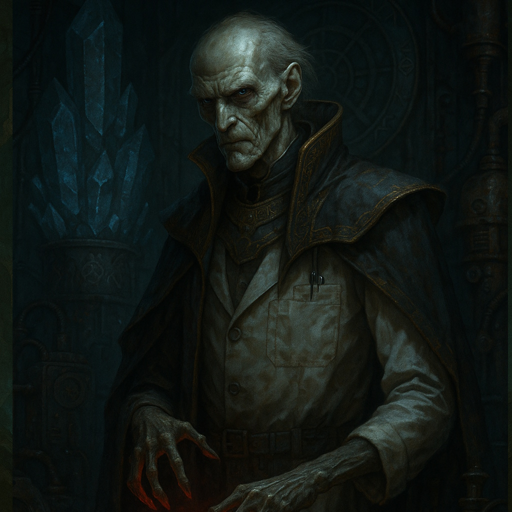 

**Heute: Sein Operationsgebiet - Camp Ingin:** Die geografische Situation: 
**Lage:** Versteckt in den zentralen Wilden Landen (e) zwischen allen Völkern
**Strategische Vorteile:**
- **Beobachtungsposten** - kann alle seine 'Schöpfungen' aus der Ferne überwachen
- **Zentrale Lage** - Sporadischer Kontakt zu Einsatzgruppen aller Völker
- **Abgelegen genug** - wird von anderen Ur-Untoten ignoriert
- **Nahe zu Persephone (ca. 60km)** - kann die Finsterwelt-Entwicklung verfolgen
**Erste Verbündete** Die Umbras-Schatzsucher:** Eine Gruppe Umbras, die durch die Wilden Lande streifen, trotz aller Gefahren, auf der Suche nach Dingen, die sie zu Geld machen können:
- **Versorgen ihn** mit Gütern und Informationen seit 480+ Jahren
- **Kennen seine wahre Identität nicht** - halten ihn für einen harmlosen alten Gelehrten
- **Erhalten Gegenleistungen** - Tipps und kleine Fundstücke (nützliche Basteleien, Artefakt-Spielereien)

### 6.1.3 Persönlichkeit
Lord Ingin ist kein klassischer Antagonist oder Verbündeter - er ist ein **gebrochener Vater**, der vor 1200 Jahren sein eigenes Kind tötete, um es zu retten, und seitdem verzweifelt versucht, diese Schuld durch die 'Rettung' aller anderen 'Kinder' der Welt zu sühnen.

**Seine Tragik:** Weder rein gut noch rein böse, sondern ein liebender Vater, dessen Liebe durch 1200 Jahre Schuld und untote Kälte pervertiert wurde. Seine Fürsorge ist echt, aber seine Kontrolle ist gefährlich.
**Seine Bedeutung:** Er ist das ultimative Symbol für die verlorene Menschlichkeit der Hochkultur - ein Wissenschaftler, der die Welt retten wollte und sie stattdessen in eine endlose Tragödie verwandelt hat.
**Das tägliche Leid - Was er jeden Tag sieht:**
- Umbras-Patrouillen - die 'perfekten Kinder' als Kriegsmaschinen
- Ork-Kriegslager-Rauch - das 'missratene Experimente' im ewigen Schmerz
- Menschliche Karawanen - die überlebenden seiner ursprünglichen Spezies
- Monster in den Ruinen - die gescheiterten Kreuzungsversuche
**Seine Einsamkeit:** Überall sieht er die Konsequenzen seiner Arbeit, aber nirgendwo findet er einen Platz, wo er hingehört.

**Seine Passion:** Die Suche nach dem Genesis-Artefakt und seinem alten Freund Lord Aron. Was es für ihn bedeutet Persönliche Sühne: Seine größte Motivation ist die Untätigkeit, als Aron ihn brauchte. Er lehnte damals ab, seinen Freund zu begleiten - eine Entscheidung, die ihn seither verfolgt. Die Suche ist sein Versuch, diese Schuld durch die posthume Anerkennung von Arons Genie zu tilgen. Erlösungsphantasie: Das Genesis-Artefakt verkörpert die ultimative Lösung für alle Probleme von Arx Lumina. Nicht nur die Heilung der Untoten, sondern die Transformation aller Völker in ihre 'idealen' Formen - Menschen ohne Schäden des 'Großen Vergessens', Furiosis ohne chronische Schmerzen, Umbras ohne systematische Grausamkeit.

**Seine fundamentalen Widersprüche** Gleichzeitig ist er:
- Liebender Vater (echte Emotionen für seine 'Engel')
- Manipulativer Wissenschaftler (nutzt sie für seine Ziele, ohne ihre Zustimmung)
- Tragischer Held (will wirklich die Welt retten)
- Gefährlicher Fanatiker (rechtfertigt jedes Mittel durch den Zweck)
- Weiser Mentor (1200 Jahre Erfahrung und Hochkultur-Wissen)
- Emotional erstarrter Untoter (kann nur noch seltene Gefühlsmomente erleben)
**Warum er nicht wahnsinnig wurde:** Anders als andere Ur-Untote hat er:
- Einen emotionalen Anker - die Erinnerung an Vaterschaft
- Ein konkretes Ziel - das Genesis-Artefakt und seinen Freund, Lord Aron, finden
- Die Fähigkeit zu lächeln - ein letzter Funke Menschlichkeit überlebte

### 6.1.4 Fate-Mechaniken
<pre>
{
    "aspects": {
        "concept": "Ur-Vater aller verlorenen Kinder",
        "dilemma": "Muss sie vor sich selbst beschützen",
        "additional": [
            "Das Genesis-Artefakt heilt alle Wunden",
            "Meine Kinder sind alles was mir bleibt",
            "Tötete mein eigenes Kind um es zu retten"
        ]
    },      
    "skills": {
        "god-like": [],
        "legendary": ["Hochkultur-Technologie"],
        "outstanding": ["Biotechnologie", "Gensequenzierung"],
        "exceptional": ["Geschichte", "Sprachen", "Manipulation"],
        "good": ["Empathie", "Überleben", "Kontakte", "Wille"],
        "solid": ["Wissenschaft", "Ingenieurswesen", "Täuschung", "Lore", "Handwerk"],
        "average": ["Wahrnehmung", "Kämpfen", "Athletik", "Heimlichkeit", "Fahren", "Einschüchtern"]
    },  
    "stunts": [
        "Vaterinstinkt: Wenn Lord Ingin glaubt, dass jemand unter seiner Obhut in Gefahr sind, erhält er +2 auf alle Proben zum Schutz oder zur Rettung von Gruppenmitgliedern. Dieser Bonus gilt auch für Empathie-Proben, um ihre emotionalen Bedürfnisse zu erkennen.",    
        "Hochkultur-Meister: Einmal pro Szene kann Lord Ingin ein beliebiges Hochkultur-Artefakt ohne Vorbereitungszeit oder Hilfsmittel identifizieren und aktivieren. Bei besonders mächtigen Artefakten erhält er +3 statt des üblichen Bonus.",    
        "Weiser Mentor: Wer ihn besucht und nach Rat fragt, erhält einmalig pro Thema der Frage einen Ratschlag, der ihm +2 auf eine wichtige Probe gewährt. Die Hilfe muss im Zusammenhang mit seLord Ingins technischem Wissen oder seiner 1200-jährigen Erfahrung stehen."
    ],    
    "goals": [
        "Kurzfristig: Neue Artefakt-Hinweise im Nordosten der wilden Lande untersuchen",
        "Mittelfristig: Die Bedrohung durch die Finsterwelt eindämmen",
        "Langfristig: Genesis-Kammer finden und Arons Verbleib aufklären"
    ],
}
</pre>

### 6.1.5 Questhooks für Spieler
**Der gelehrte Einsiedler**
- Spieler suchen Wissen über Hochkultur-Artefakte
- Gerüchte über einen "alten Gelehrten" in den wilden Landen
- Er empfängt sie tatsächlich in seinem Mausoleum - aber in voller Rüstung verhüllt
- Gibt sich als "Wächter des alten Wissens" aus

**Mittelsmann-Netzwerk**
- Lebende Gelehrte/Sammler, die für ihn arbeiten (wissen aber nicht, wer er wirklich ist)
- Diese bieten den Spielern Aufträge: "Mein Mentor braucht bestimmte Artefakte..."
- Briefwechsel über vertraute Händler
- Anonyme Geldübergaben nach erfolgten Missionen

**Der hilfsbereite Unbekannte**
- Spieler geraten in Schwierigkeiten in den wilden Landen
- Mysteriöser Retter in dunkler Rüstung erscheint
- Verschwindet sofort wieder, hinterlässt aber Hinweise auf weitere Hilfe
- Baut langsam Vertrauen auf, bevor er sich zu erkennen gibt

**Artefakt-basierte Kommunikation**
- Spieler finden ein Hochkultur-Kommunikationsgerät
- Stimme meldet sich daraus - "alt und müde, aber weise"
- Bietet Tauschgeschäfte: Information gegen Artefakt-Bergung

## 6.2 Lyraleth Velindara
- Name: Lyraleth Velindara
- Volk: Umbra
- Alter: 90

### 6.2.1 Erscheinungsbild
Lyraleth ist eine Umbra. Ein Volk, das an Dunkelelfen in klassischen Fantasy-Geschichten erinnert. Sie hat die typischen Merkmale ihrer Rasse.

**Körperbau**: Lyraleth hat eine schlanke, athletische Statur mit langen, wohlproportionierten Gliedmaßen. Ihre Bewegungen sind geschmeidig und zeugen von jahrelangem Training in Heimlichkeit und Kampfkunst.
**Gesicht:** Klassische Dunkelelfen-Züge mit spitzen Ohren und hohen Wangenknochen. Ihre Augen haben einen wachsamen, intelligenten Ausdruck. Markante rote Gesichtsbemalung unter den Augen - traditionelle Dunkelelfen-Markierungen, die ihren Status oder ihre Zugehörigkeit kennzeichnen könnten.
**Haare:** Tiefviolettes, fast schwarz-purpurnes Haar, das sie meist praktisch trägt - manchmal offen fallend, manchmal zurückgebunden, je nach Situation.
**Haut:** Blasse, fast porzellanartige Haut, typisch für Dunkelelfen, die wenig Sonnenlicht gewohnt sind.
**Kleidung:** In offizieller Funktion: Trägt eine beeindruckende schwarze Rüstung mit roten Akzenten, die sowohl Schutz bietet als auch ihre Position in der Dunkelelfen-Hierarchie unterstreicht. Die Rüstung ist funktional aber elegant gearbeitet. Privat/Inoffiziell: Bevorzugt einfache, dunkle Kleidung, die Bewegungsfreiheit erlaubt und nicht auffällt.
**Besonderheiten:** Ihre Ausstrahlung wechselt je nach Kontext - kann sowohl die disziplinierte Dunkelelfen-Kriegerin als auch die nachdenkliche, fast melancholische junge Frau sein, die zwischen den Welten gefangen ist.

### 6.2.2 Hintergrund
**Adelsstand:** Zweitgeborene aus dem armen Landadel der Familie Velindara. Die Familie besitzt ein kleines Anwesen nahe der menschlichen Grenze - strategisch ungünstig gelegen, daher wenig wertvoll.**Zweitgeborene:** Als Zweitgeborene war ihr Schicksal praktisch besiegelt - Militärdienst an der gefährlichen Grenze zu den Menschen. Eine pragmatische, aber brutale Familientradition. **Das bittere System:** Ihre Familie schickt systematisch die ersten beiden Kinder in den wahrscheinlichen Tod, um das Erbe für das dritte zu sichern. Ein zynisches, aber logisches System in einer Kriegsgesellschaft.
**Adelige Bildung:** Trotz ihres Wegwerf-Status erhielt Lyraleth eine standesgemäße Erziehung: Sprachen (menschliche Sprache und alte Umbras-Dialekte), Taktik & Strategie (Grundausbildung in Kriegsführung und politischem Denken), Etikette (kann sich sowohl in Adelskreisen als auch unter einfachen Soldaten bewegen), Geschichte (kennt die Vergangenheit beider Völker - ein Wissen, das ihre Spionage sehr wertvoll machte), Lesen & Schreiben (kann Dokumente verstehen und analysieren). Ihre Bildung macht sie zu einer außergewöhnlich wertvollen Spionin - sie versteht Zusammenhänge, die einfache Soldaten übersehen würden.
**Militärischer Rang:** Kundschafterin/Späher-Offizier (vor ihrer Gefangenschaft). **Gesellschaftliche Stellung:** Niedriger Adel - respektiert, aber nicht einflussreich.

**Ihre verbotene Freundschaft:** Lyraleths einzige enge Beziehung war zu einem menschlichen Soldaten, den sie vor dem Tod rettete. Diese Freundschaft war tief, aber gefährlich - beide wussten, dass eine Entdeckung tödlich enden könnte.
- Der Auftrag: Mit 82 Jahren führte Lyraleth ihre erste wichtige Mission - einen Aufklärungsauftrag an der menschlichen Grenze. Sie sollte Truppenbewegungen beobachten, nicht kämpfen.
- Die Begegnung: Ein menschlicher Spähtrupp entdeckte sie. Im Kampf wurden beide Seiten schwer verwundet - sie und ein junger menschlicher Soldat, Gaviel Haltborn, lagen sterbend da.
- Der Wendepunkt: In den Augen des verwundeten Soldaten sah sie keine Grausamkeit oder Hass - nur Angst und den Wunsch zu überleben. Genau wie sie selbst. In diesem Moment erkannte sie ihre gemeinsame Menschlichkeit.
- Die Rettung: Anstatt ihn zu töten, wie es ihre Aufgabe gewesen wäre, rettete Lyraleth ihm das Leben und pflegte ihn zwei Wochen lang in den Wäldern gesund.
- Die Rückkehr: Sie kehrte zu ihrem Volk zurück mit einer Lüge: Sie sei gefangen genommen worden und geflohen. Niemand ahnt, dass sie einen Menschen rettete - das wäre ihr Todesurteil gewesen.
- Die Ironie: Lyraleth neckt Gaviel seitdem damit, dass er ihr eine Lebensschuld schuldet - obwohl sie es war, die ihn fast umgebracht hätte. Humor als Bewältigungsmechanismus für die Komplexität ihrer Situation.

**Die Spionage-Phase:** Ein kluger menschlicher Stratege erkannte das Potential der Verbindung und ließ Gaviel als direkten Kontakt fungieren. 2-3 Jahre lang trafen sich die beiden regelmäßig an ihrer Waldlichtung und tauschten Informationen aus - eine Zeit, die für beide zu den wertvollsten ihres Lebens gehörte. **Der unmögliche Auftrag:** Der Stratege wurde gieriger und verlangte schließlich das Unmögliche: Informationen, die eine ganze Umbras-Armee in eine tödliche Falle geführt hätten. Weder Gaviel noch Lyraleth konnten das mit ihrem Gewissen vereinbaren. **Die Schutzlüge:** Gaviel berichtete seinem Vorgesetzten, die Quelle sei nicht erschienen - sie müsse enttarnt worden sein. Damit war die offizielle Spionage-Verbindung \"tot\". **Das bittersüße Ende:** Bei ihrem letzten Treffen beschlossen beide schweren Herzens, dass weitere Kontakte zu gefährlich wären. Falls Gaviel jemand folgte oder nach der toten Quelle gesucht würde, könnte das beide vernichten.

**Lyraleths Motiv: Sehnsucht nach dem Menschensoldaten:** Ja, sie empfindet etwas für ihn - aber sie ist zu intelligent, um sich Illusionen zu machen. Romantische Hoffnungslosigkeit: Eine Liebe zwischen den Völkern ist praktisch unmöglich. Emotionale Barrieren: Ihre Geheimnisse machen echte Nähe zu Umbras schwierig.

**Aktueller Status**: Offiziell weiterhin im Militärdienst, aber in rückwärtigen Positionen. **Inoffizielle Aktivitäten:** Trotz ihres offiziellen Rückzugs aus der Spionage sammelt sie weiterhin Informationen auf eigene Faust, nutzt aber subtilere Kanäle. Ihr Ziel ist es, unnötiges Töten auf beiden Seiten zu verhindern, auch ohne offizielle Spionage-Verbindung. **Täglich Aktivitäten:** Auswertung von Grenzberichten und Truppenbewegungen, zufällige Gespräche mit heimkehrenden Patrouillensoldaten, Studium menschlicher Dokumente und erbeuteter Materialien, diskrete Weitergabe von Informationen, die Eskalationen verhindern könnten. Ihre neue Methode: Arbeitet subtiler - beeinflusst Entscheidungen durch zufällige Hinweise und logische Schlussfolgerungen, statt direkte Spionage zu betreiben. **Ihre Tarnung:** Nutzt ihre Herkunft vom Grenzland als Erklärung für ihr Wissen über menschliche Gewohnheiten. Natürlich kenne ich die Menschen - wir leben praktisch nebenan.

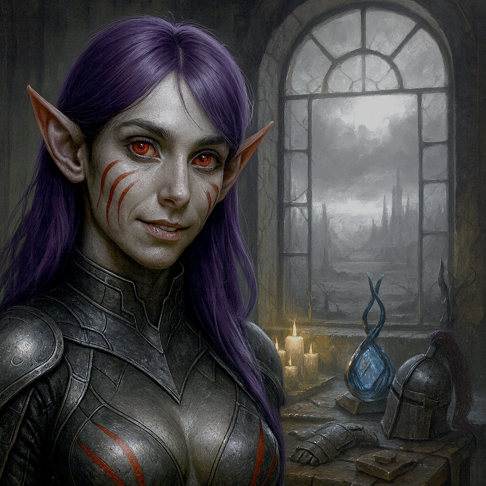

**Und Beziehungen?** In der Umbras-Militärkultur ist man Soldat bis zum Tod oder zur Untauglichkeit. Romantische Beziehungen sind schwierig, wenn beide Partner jederzeit sterben können. Aktuelle Beziehungen: Kameradschaftlich (respektable Beziehungen zu anderen Offizieren, aber oberflächlich), Familiär (distanziert - ihre Familie hat sie praktisch zum Tode verurteilt), Romantisch (keine aktiven Beziehungen - zu gefährlich und kompliziert). Ihre Einsamkeit: Gefangen zwischen den Welten, kann sie weder zu Menschen noch zu Umbras wirklich gehören.

### 6.2.3 Persönlichkeit
Lyraleth ist eine komplexe junge Frau, die Intelligenz und Humor nutzt, um ihre tiefe Einsamkeit und unerfüllte Sehnsucht nach echter emotionaler Verbindung zu verbergen. Sie ist sowohl zynisch als auch hoffnungsvoll, sowohl hart als auch verletzlich - ein Produkt eines brutalen Systems, das paradoxerweise eine bemerkenswert mitfühlende Person hervorgebracht hat.
- Sie ist erfahren im Täuschen und Verbergen. Jahre des Doppellebens haben sie das gelehrt.
- Distanzierte Bindungen: Wer als entbehrlich aufwächst, lernt früh, sich emotional zu schützen.
- Indirekte Kommunikation: Sagt selten direkt, was sie meint - versteckt Gefühle hinter Wortspielen.
- Intelligente Einsamkeit: Zu klug, um sich selbst zu belügen, zu isoliert für echte Nähe.
- Sehnsucht nach Authentizität: Will endlich ehrlich zu jemandem sein können.
- Gebildet ohne Arroganz: Nutzt Wissen strategisch, nicht zum Angeben.
- Spricht mit ihrem Pferd: Eine der wenigen ehrlichen Beziehungen.
**Was sie am meisten fürchtet:**
- Dass ihre Spionage-Informationen doch zu Massakern geführt haben
- Dass Gaviel sie vergessen oder verraten hat
- Dass sie nie wieder eine ehrliche Beziehung haben wird

### 6.2.4 Fate-Mechaniken
<pre>
{
    "aspects": {
        "concept": "Ehemalige Spionin zwischen den Welten",
        "dilemma": "Manche Freundschaften sind zu gefährlich für diese Welt",
        "additional": [
            "Im Schatten der geliebten Schwester",
            "Ein Kern, so tief vergraben",
            "Zum Sterben geboren, aber zu stur um zu gehorchen"
        ]
    },
    "skills": {
        "god-like": [],
        "legendary": [],
        "outstanding": [],
        "exceptional": ["Täuschung"],
        "good": ["Nachforschungen", "Empathie"],
        "solid": ["Heimlichkeit", "Bildung", "Provozieren"],
        "average": ["Schießen", "Athletik", "Aufmerksamkeit", "Nahkampf"]
    },
    "stunts": [
        "**Grenzland-Expertise** - +2 auf Nachforschungen bei allem was Menschen-Umbras-Beziehungen betrifft",
        "**Unverdächtige Adelige** - +2 auf Täuschung, wenn sie ihren Adelsstatus als Tarnung nutzt",
        "**Unwiderstehlich frech** - Einmal pro Sitzung: Wenn sie jemanden mit sarkastischem Humor provoziert, kann die Zielperson nicht anders, als zu antworten oder zu reagieren - auch wenn sie eigentlich schweigen wollte"
    ]
}
</pre>

### 6.2.5 Questhooks für Spieler
**Die heimliche Informantin**
- Spieler treffen sie "zufällig" in einer Grenztaverne oder auf einem Markt
- Gibt sich als lokale Adelige aus, die "aus Interesse" Informationen über Menschen sammelt
- Bietet zunächst kleine Gefälligkeiten an: "Ich könnte euch warnen, wenn die Patrouille kommt..."
- Baut schrittweise Vertrauen auf, bevor sie größere Bitten äußert

**Der verdeckte Auftrag**
- Anonyme Nachrichten mit seltsam präzisen Informationen über Dunkelelfen-Bewegungen
- "Ein Freund" warnt die Spieler vor Fallen oder bietet sichere Routen an
- Hinterlässt Hinweise an vereinbarten Orten (hohle Bäume, Ruinen)
- Kommuniziert über Mittelsmänner: Händler, die zwischen den Fronten verkehren

**Die Retterin in der Not**
- Spieler geraten in Dunkelelfen-Gefangenschaft oder eine aussichtslose Situation
- Lyraleth "überzeugt" ihre Vorgesetzten, die Gefangenen zu verhören statt zu töten
- Arrangiert eine "Flucht" oder sorgt dafür, dass wichtige Schlüssel "verloren" gehen
- Folgt dem Prinzip: "Helfen, ohne dass es nach Hilfe aussieht"

**Die Doppelspionin**
- Kontaktiert Spieler offiziell als Dunkelelfen-Unterhändlerin für "Gefangenenaustausch"
- Nutzt diese Treffen, um heimlich eigene Informationen zu übermitteln
- Spielt das Spiel: "Ich muss meine Rolle spielen, aber zwischen den Zeilen..."
- Ihre wahren Botschaften versteckt in scheinbar harmlosen Kommentaren

## 6.3 Nala
- Name: "Nala"
- Volk: Ruptors (Furiosis)
- Alter: 31

### 6.3.1 Erscheinungsbild
Nala ist eine Furiosis, ein Ork-ähnliches Volk, das für seine Kriegertraditionen bekannt ist. Sie hat die typischen Merkmale ihrer Rasse. Haltung zwischen Krieger-Stolz und pragmatischer Vorsicht

**Körperbau:** Nala ist kräftig und muskulös, mit einer athletischen Statur, die ihre Jahre als Kriegerin widerspiegelt. Ihre Bewegungen sind zielgerichtet und effizient.
**Gesicht:** Markante, ork-typische Gesichtszüge mit einer breiten Nase und ausgeprägten Kiefern. Ihre Augen sind groß und ausdrucksstark, mit einem nachdenklichen, fast melancholischen Blick.
**Haare:** Dunkelbraunes, fast schwarzes Haar, das sie meist zu einem praktischen Zopf bindet, um es aus dem Gesicht zu halten.
**Haut:** Grüne Haut, typisch für Furiosis, mit einigen Narben an den Armen, die von chronischen Schmerzen zeugen.
**Kleidung:** Trägt praktische Lederrüstung, die für Kräutersammeln angepasst ist
Führt stets Notizbuch und primitive Kartenskizzen mit sich

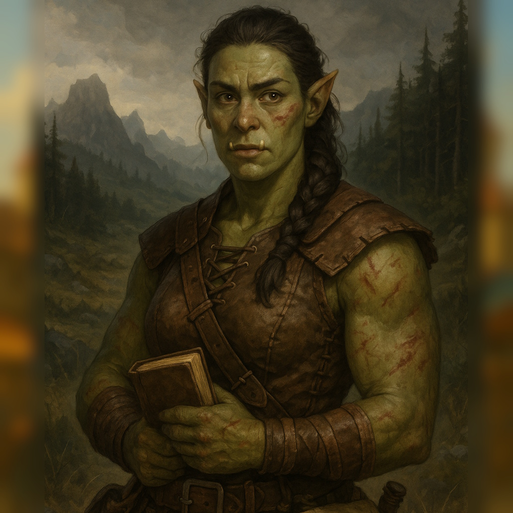

### 6.3.2 Hintergrund
Nala wuchs als vielversprechende junge Kriegerin auf. Den Wendepunkt in ihrem Leben bildet die gescheiterte Prüfung ihres Bruders Gorash und ihre daraus resultierende Entscheidung. 
**Das schicksalhafte Ereignis:** Gorash wird vom Stamm in die wilden Lande geschickt, um seine Stärke zu beweisen und den mythischen Geburtsort der Ruptors und Furiosis zu suchen. Drei Wochen lang durchstreift er das gefährliche Territorium, kämpft gegen mutierte Bestien und überlebt in der unwirtlichen Wildnis. Dann, als seine Vorräte fast aufgebraucht sind, sieht er sie - die 'toten Sterne im Boden leuchten', genau wie in den alten Legenden. Leuchtpunkte im Erdboden, die wie ein umgekehrter Himmel funkeln. Voller Ehrfurcht und Aufregung nähert er sich dem Persephone-Komplex. Doch kaum betritt er das Gelände, beginnt das Dröhnen. Ein überwältigendes, verwirrendes Chaos-Geräusch füllt seinen Kopf, lähmt seine Gedanken. In diesem Moment erwachen die mechanischen Verteidigungssysteme - Metallbestien mit glühenden Augen. Unter dem Einfluss des Dröhnens flieht Gorash in blinder Panik durch den Dschungel, drei Tage und Nächte lang, ohne Orientierung, ohne Plan. Das Chaos in seinem Kopf macht jede rationale Entscheidung unmöglich. Als das Dröhnen endlich nachlässt, ist er meilenweit entfernt, verletzt, erschöpft - und hat keine Ahnung, wie er zurückfinden soll. Die Erinnerung an den Weg ist verschwommen, verzerrt durch das Chaos. Als er nach zwei Monaten ohne Beute zum Stamm zurückkehrt, erzählt er von seiner Entdeckung - aber seine wirren Beschreibungen klingen wie Wahnsinn. Niemand glaubt dem 'Versager der wilden Lande'. Sein Stamm gibt ihm den beschämenden Namen und verbannt ihn zu Kräutersammler-Aufgaben. 
**Nalas Loyalität:** Die Stammesältesten rufen Nala, die jüngere Schwester von Gorash, vor den Rat. Sie ist eine vielversprechende junge Kriegerin, stark und klug - das genaue Gegenteil ihres 'versagenden' Bruders. Die Ältesten machen ihr ein Angebot: Distanziere dich von deinem gescheiterten Bruder, und wir werden dich zu einer echten Kriegerführerin ausbilden. Du hast das Potential, eines Tages den Stamm anzuführen. Aber wenn du zu ihm hältst, teilst du sein Schicksal - Verbannung zu den niederen Aufgaben, Ächtung, Spott. Die Ältesten sprechen lange und eindringlich auf sie ein, erklären ihr die Tradition: das Schicksal der Familie zu teilen ist ehrenhaft, aber nicht verpflichtend. Sie wollen ihr eine Brücke bauen, eine Ausnahme machen - gerade weil sie so vielversprechend ist. Doch als sie geendet haben, steht Nala auf und sagt nur: 'Er ist mein Bruder. Was für ein Furiosis wäre ich, wenn ich Familie für Macht aufgebe?' Die Ältesten sind enttäuscht, aber respektieren paradoxerweise ihre Entscheidung - sie hat die wahren Furiosis-Werte demonstriert. Ab diesem Tag sind beide zu Kräutersammlern und Bestien-Jägern degradiert. Nala hört sich Gorash's wirre Geschichten über das 'Dröhnen' und die 'toten Sterne' an. Sie glaubt nicht vollständig daran - es klingt wie Wahnsinn - aber sie glaubt, dass *er* glaubt. Und vor allem: Sie wird nicht zulassen, dass er sich durch weitere verzweifelte Aktionen noch tiefer in Schwierigkeiten bringt. In ihrem Herzen nagt die Frage: War es die richtige Entscheidung? Und wenn er wirklich etwas gesehen hat - wie gefährlich ist dieser Ort?

- Arbeitet seit 9 Jahren als Kräutersammlerin und Bestien-Jägerin
- Entwickelt mit dem Stammeskräuterkundler Krogum heimlich Karten der wilden Lande
- Hat sich mehrfach mit anderen Furiosiss geprügelt, die sie 'Kräutermädchen' nannten
- Hört sich Gorash's wirre Geschichten vom 'Dröhnen' und den 'toten Sternen' an - glaubt nicht völlig daran, aber glaubt dass er glaubt
- Beobachtet besorgt, wie Gorash manchmal innehält und zu lauschen scheint, als würde er etwas hören

### 6.3.3 Persönlichkeit
- Denkt nach, bevor sie handelt - ungewöhnlich für Furiosis
- Pragmatisch und lösungsorientiert
- Wird zunehmend ungeduldig und frustriert wegen Gorashs Suche
- Loyale Beschützerin, aber keine naive Idealistin
- Respektiert Tradition, aber nicht blindlings

### 6.3.4 Fate-Mechaniken
<pre>
{
    "aspects": {
        "concept": "Nachdenkliche Furiosis-Strategin mit Clan-Ambitionen",
        "dilemma": "Ungeduld treibt zu gefährlichen Entscheidungen",
        "additional": [
            "Du machst dir immer zu viele Gedanken, Nala",
            "Man kann mit mir reden - für einen Furiosis",
            "Teilt das Schicksal ihres 'versagenden' Bruders"
        ]
    },
    "skills": {
        "god-like": [],
        "legendary": [],
        "outstanding": [],
        "exceptional": ["Wille"],
        "good": ["Kämpfen", "Täuschung"],
        "solid": ["Athletik", "Wahrnehmung", "Überleben"],
        "average": ["Kontakte", "Gelehrsamkeit", "Empathie", "Handwerk"]
    },
    "stunts": [
        "Strategisches Denken: +2 auf Täuschung wenn sie Zeit hatte, einen Plan zu machen",
        "Furiosis-Diplomatie: Kann auch in hitzigen Situationen vernünftige Gespräche führen (+2 auf Empathie bei Konflikten)",
        "Karten-Expertin: +2 auf Überleben in Regionen, die sie kartiert hat"
    ]
}
</pre>

### 6.3.5 Questhooks für Spieler
**Die vorsichtige Vermittlerin**
- Nala sucht Spieler gezielt auf, weil sie gehört hat, dass sie "anders" sind
- "Man kann mit mir reden - für einen Ork" - testet erst vorsichtig ihre Reaktion
- Bietet kleinen Informationsaustausch an: "Ihr wisst Dinge über die wilden Lande, ich über Ork-Bewegungen..."
- Baut langsam Vertrauen auf: "Mein Bruder nennt mich verrückt, aber ihr versteht vielleicht..."

**Die Karten-Expertin**
- Spieler brauchen Orientierung in den wilden Landen oder Ork-Territorium
- Nala taucht auf und bietet ihre detaillierten Karten als Tauschware an
- "Diese Routen kenne nur ich - aber ich brauche etwas dafür..."
- Ihre Informationen sind präziser als alle anderen verfügbaren Quellen

**Die heimliche Forscherin**
- Spieler entdecken Spuren von jemandem, der systematisch die wilden Lande erkundet
- Versteckte Markierungen, aufgezeichnete Bestien-Bewegungen, kartierte Ruinen
- Nala beobachtet sie zunächst aus der Ferne
- Konfrontiert sie erst, wenn sie merkt, dass sie ähnliche Ziele haben

**Die Beschützerin ihres Bruders**
- Gorash gerät in Schwierigkeiten (Mission geht schief, gefangen, verletzt)
- Nala wendet sich in Verzweiflung an die Spieler: "Ihr seid meine letzte Hoffnung"
- Muss ihre Prinzipien aufgeben und Fremde um Hilfe bitten
- Bietet alles an, was sie hat: Karten, Informationen, zukünftige Gefälligkeiten

## 6.4 Memorable NPCs

### 6.4.1 Lady Balea
- Name: Lady Balea
- Volk: Ur-Untote
- Alter: 1227

Ehemalige Neurologin der Hochkultur, mittlerweile melancholische Chronistin. In offiziellem Auftrag der Zitadelle: Botschafterin in Nexus Umbra. Verweilt abwechselnd dort und in der Zitadelle, wo sie als Kuratorin des Museums of Lost Art (MoLA) die Spuren der Vergangenheit zu bewahren versucht. Ihre pessimistische Weltsicht und obsessive Sammelleidenschaft für Hochkultur-Artefakte strukturieren ihre endlose Existenz. Führt einsame 'Führungen' durch ihr Museum und verfasst bittere Chroniken über zweitausend Jahre des Versagens. Elegant in ihrer untoten Kälte, aber von tiefer Melancholie geprägt. Sieht in jedem neuen Ereignis nur eine Wiederholung alter Katastrophen.

**Skills:**
"Hochkultur-Neurologie", "Geschichtsschreibung", "Kunstkuration", "Artefakt-Identifikation", "Alte Sprachen", "Psychologische Analyse", "Sammlung und Archivierung", "Rhetorische Manipulation"

**Questhooks:**
- Suche nach einer verlorenen Kunstsammlung in den wilden Landen - angeblich in den Ruinen einer Hochkultur-Villa versteckt
- Bergung eines 'Erinnerungs-Artefakts' mit den letzten Aufzeichnungen eines berühmten Komponisten der Hochkultur
- Beschaffung eines gestohlenen Gemäldes aus dem Besitz eines anderen Ur-Untoten - 'zum Schutz der Kultur'
- Investigation einer angeblichen Fälschung in ihrer Sammlung - wer wagt es, die Vergangenheit zu verfälschen?
- Diplomatisches Geleit nach Nexus Umbra

### 6.4.2 Lady Thanaia
- Name: Lady Thanaia
- Volk: Ur-Untote
- Alter: 1236

Ehemalige Wissenschaftlerin der Hochkultur und eine der 50 ursprünglichen Ur-Untoten. Ex-Frau von Lord Ingin und Mutter ihrer gemeinsam getöteten Tochter. Nach Jahren gemeinsamer Trauer entwickelte sie brennenden Hass auf Ingin. Sie gab sich zunächst ihrer moralisch grenzwertigen Forschung zur Genetik und Erschaffung neuer Rassen hin. Später wurde sie zur Gottkönigin des heiligen Reichs der Menschen - nicht aus Überzeugung, sondern um alle, insbesondere Ingin, durch die systematische Vernichtung der anderen Völker leiden zu lassen. Kalt, berechnend und von 1200 Jahre altem Groll getrieben. 

**Skills:**
"Politische Manipulation", "Strategische Planung", "Hochkultur-Wissen", "Psychologische Kriegsführung", "Hass kultivieren", "Intrigen"

**Questhooks:**
Für die menschlichen Spieler ist Lady Thanaia als Gottkönigin letztenendes die Person, die ihnen für die Einsätze in den "Wilden Landen" Weisungen erteilt - durch ihre Untergebenen vor Ort, bspw. dem Commander des Corpus oder einem Unter-Captain oder sogar dem Groß-Captain der Division.

### 6.4.3 Gorash
- Name: "Gorash 'Der Versager der wilden Lande'
- Volk: Ruptors (Furiosis)
- Alter: 28

Ein kräftiger Furiosis mit vernarbten Armen und einem gehetzten Blick. Die chronischen Schmerzen der Furiosis haben tiefe Furchen um seine Augen gegraben, aber es brennt noch immer das Feuer eines Kriegers in ihm. Trägt noch immer seine zerrissene Kriegerkleidung, auch wenn er jetzt nur Kräuter sammeln darf - ein trotziger Verweis auf das, was er einmal war. Seine Hände zittern manchmal, besonders wenn er von den 'toten Sternen im Boden' spricht oder wenn er in stillen Momenten innehält - dann hört man fast, wie er lauscht, als würde er etwas hören, das sonst niemand wahrnimmt. Seine Beschreibungen von Persephone sind wirr und fragmentiert, voller primitiver Metaphern für Dinge, die sein Geist nicht verarbeiten konnte. Er ist kein kluger Stratege, aber ein Mann mit starkem Instinkt und unbändiger Entschlossenheit - und einem Trauma, das ihn nicht loslässt.

**Skills:**
"Kämpfen +3", "Athletik +2", "Überleben +3", "Wahrnehmung +2", "Einschüchtern +2", "Wille +4"

**Questhooks**
Siehe Nalas Questhooks.

### 6.4.4 Lord Aron
- Name: Lord Aron
- Volk: Ur-Untote
- Alter: 2035

Ehemaliger theoretischer Physiker der Hochkultur und einer der 50 ursprünglichen Ur-Untoten. Brillant, aber eitel und nachtragend - behielt seine wissenschaftliche Arroganz auch nach der Transformation. Entwickelte vor 1200 Jahren die Realitäts-Transformations-Theorie, wurde aber von seinen Kollegen als 'Spinner' abgetan. Verschwand spurlos aus Persephone und starb bei einem fatalen Selbstversuch mit seiner Genesis-Kammer in den wilden Landen. Sein Vermächtnis könnte der Schlüssel zur Erlösung aller Untoten sein.

**Skills:**
Nicht mehr relevant, da Lord Aron nicht mehr existent ist.

**Questhooks:**
Indirekt, die Questhooks von Lord Ingin.

### 6.4.5 Velania Velindara
- Name: Velania Velindara
- Volk: Umbra
- Alter: 70

Die Drittgeborene und rechtmäßige Erbin der Familie Velindara. Als Kind wurde sie gelehrt, Distanz zu ihren 'entbehrlichen' Geschwistern zu halten. Jetzt, als Erwachsene, kämpft sie mit Schuldgefühlen über ihr unverdientes Erbe und einem tiefen Misstrauen gegenüber ihrer überlebenden Schwester Lyraleth. Neidet Lyraleth ihr das Erbe? Oder vielleicht sogar das Leben? Elegant und gebildet, aber innerlich zerrissen zwischen Dankbarkeit und Paranoia. Aktuell wird ihr die Ehre zuteil, als Botschafterin bei den Ur-Untoten in Mortis Eternam zu fungieren. Eine Aufgabe, die für ihre Herkunft als niederer Landadel, sehr bedeutend ist. Velania hat sich diese Möglichkeit mit großem Ehrgeiz erarbeitet, und strebt nach noch größerem politischem Einfluss. 

Verwaltet das Familiengut mit pflichtbewusster Effizienz, aber ohne echte Freude.

**Skills:**
"Buchhaltung", "Verwaltung", "Etikette", "Grundlagen der Diplomatie", "Lesen und Schreiben", "Familienrecht"

**Questhooks:**
**Die paranoide Schwester**
- Kontaktiert Spieler als "unabhängige Ermittler"
- "Findet heraus, was meine Schwester Lyraleth wirklich plant"
- Ist überzeugt, dass Lyraleth ihr schaden will
- Zahlt gut, aber ihre Obsession wird zunehmend gefährlich

**Die verzweifelte Erbschaftsverwalterin**
- Das Familienanwesen ist in Schwierigkeiten (Schulden, Grenzkonflikte)
- "Ich brauche schnell Geld/Einfluss, oder wir verlieren alles"
- Bietet riskante Aufträge: Schmuggel, Spionage, gefährliche Verhandlungen
- Ihr Ehrgeiz treibt sie zu immer desperateren Entscheidungen

**Die Geheimnisverkäuferin**
- Nutzt ihre Position bei den Ur-Untoten, um Informationen zu sammeln
- "Ich kenne Geheimnisse, die Königreiche stürzen könnten..."
- Verkauft brisante Details über Untoten-Pläne an alle Seiten
- Spielt ein extrem gefährliches Spiel mit Mächten, die sie nicht versteht

### 6.4.6 Gaviel Haltborn
- Name: Gaviel Haltborn
- Volk: Mensch
- Alter: 39

Ehemaliger Grenzsoldat des heiligen Reichs, der bei einem Scharmützel von der Dunkelelfen-Spionin Lyraleth Velindara vor dem Tod gerettet wurde. Diese unmögliche Freundschaft zwischen Feinden entwickelte sich zu einer tiefen emotionalen Verbindung, die beide Welten in Frage stellte. Heute lebt er mit dem Wissen um ein Geheimnis, das beide das Leben kosten könnte. Desillusioniert vom endlosen Krieg, aber zu loyal, um zu desertieren. Innerlich zerrissen zwischen Pflicht und Gewissen.

Nach dem Ausscheiden aus dem Militärdienst ist er aktuell als Schmied im wandelnden Kolloss Venator Rex tätig, weil er sich aus der Nähe zu den "Wilden Landen" und zu Nexus Umbra eine Möglichkeit verspricht, wieder mit Lyraleth zusammen zu sein.

**Skills:**
"Kriegshandwerk", "Überlebensfähigkeiten", "Grenzland-Wissen", "Handwerk", "Menschen lesen", "Diskret sein"

**Questhooks:**
- Der verzweifelte Sucher: Gaviel kontaktiert Spieler, weil er gehört hat, dass sie Kontakte zu Dunkelelfen haben. "Ich muss jemanden finden... eine Dunkelelfen-Spionin namens Lyraleth". Bietet alles an, was er hat: Grenzland-Wissen, sichere Routen, Schmiedearbeiten. Verschweigt zunächst die wahre Natur ihrer Beziehung.
- Gaviel wird von den Schemen (Geheimdienst) verdächtigt: Bietet den Spielern einen Deal: "Helft mir zu beweisen, dass ich loyal bin." Seine Beweise würden aber Lyraleth gefährden. Moralisches Dilemma: Einen retten oder beide schützen?

### 6.4.7 Vortak Schattensturm
- Name: Vortak Schattensturm
- Volk: Umbra
- Alter: 580

Einflussreicher Dunkelelfen-Diplomat und strategischer Berater, der bereits 918 bei den historischen Verhandlungen zum Pax Violentia zwischen Umbras und Ur-Untoten eine Schlüsselrolle spielte. Als einer der wenigen Umbras, die das große politische Bild verstehen, erkannte er früh die Notwendigkeit der Allianz gegen die aufstrebende Bedrohung durch das heilige Reich der Menschen.

Schattensturm war zuvor als Arm des Hochkommandanten bei der Unterwerfung der Menschenreiche federführend. Er konnte anschließend die Rebellion und Unabhängigkeit der Menschen nicht verhindern, woraufhin er sich in den Hintergrund zurückzog und fortan von dort die Fäden zieht.

Vortak verkörpert die typische Umbra-Mentalität: kalt kalkulierend, langfristig denkend und von militärischer Effizienz geprägt. Er hat über 500 Jahre diplomatische Erfahrung und versteht die Schwächen und Stärken aller Völker. Seine Überzeugung: Nur durch pragmatische Allianzen können die "zivilisierten" Völker (Umbras und Ur-Untote) gegen die "barbarischen" Menschen und Ruptors bestehen.

Aktuell arbeitet er als Sonderberater für Außenpolitik und koordiniert die heiklen Beziehungen zu den Ur-Untoten. Trotz des gegenseitigen Misstrauens hat er zu einigen Ur-Untoten ein respektvolles Arbeitsverhältnis entwickelt.

**Skills:**
"Diplomatie", "Strategische Planung", "Völkerkunde", "Intrigen", "Umbra-Militärdoktrin", "Langzeitplanung"

**Questhooks:**
- Der Pragmatiker: Kontaktiert Spieler für heikle diplomatische Missionen zwischen den Völkern. "Das große Bild erfordert manchmal... unkonventionelle Lösungen."
- Der Informationshändler: Bietet wertvolle Informationen über politische Entwicklungen gegen Gefälligkeiten. Seine Kontakte reichen bis in die Ur-Untoten-Zitadelle.
- Der Friedensvermittler: Sucht diskret nach Wegen, den drohenden großen Krieg zu verhindern - allerdings nur, wenn die Umbras dabei nicht schlechter wegkommen.

# 7. Gamemasters Section: Campaign-Settings
Wir beschreiben nun die beiden primären Campaign Settings, "Die Bedrohung durch die Finsterwelt" und "Die Suche nach dem Genesis-Artefakt", sowie Spielmechaniken für Arx Lumina.

Weiterhin gibt es einen schwelenden Konflikt im Menschenreich, der vom Spielleiter nach eigenem Ermessen eingebracht und ausgebaut werden kann:
- ***Machtvakuum***: *Die Gottkönigin liegt im Sterben. Oder doch nicht? Gerüchte genügen, um Streitigkeiten unter den Paladinen zu entfachen. Was tun: Machtansprüche unterstützen? Oder Paladine sabotieren? Und was ist das Geheimnis der Gottkönigin und ihrer beiden Berater, die seid beinahe 500(!) Jahren das heilige Reich der Menschen regieren?*

## 7.1 Wurf-Tabellen und Spielmechaniken

### 7.1.1 Wurf-Tabellen (W20)

#### 7.1.1.1 Durchsuchen von Hochkultur-Ruinen in der "Wilden Landen"
*Die Gruppe ist mit dieser Aktivität einen Tag beschäftigt.*

**1-4: Gefährliche Begegnung**
- Verstrahlte Bestien (Mutanten)
- Wächter-Konstrukte (noch aktiv)
- Dimensionale Risse/Schattenwesen
- Andere Schatzsucher (feindlich)

**5-8: Nichts/Fehlschlag**
- Bereits geplündert
- Zu stark beschädigt
- Gefährlich instabil (Einsturzgefahr)
- Nur Schutt und Asche

**9-12: Gewöhnliche Funde**
- Hochkultur-Metall (wertvoll, aber nicht magisch)
- Intakte Werkzeuge/Instrumente
- Bücher/Schriftrollen (unleserlich/beschädigt)
- Karten/Baupläne
- Seltene Materialien für Handwerker
- Luxusgegenstände (Schmuck, Kunst)

**13-16: Bedeutende Funde**
- Alte Aufzeichnungen (wissenschaftliche Notizen)
- Funktionsfähige Hochkultur-Geräte (nicht-magisch)
- Wertvolle Rohstoffe (Edelmetalle, Kristalle)
- Detaillierte Labordaten

**17-18: Energiekristalle**
- Energiekristalle (1W3 Stück)

**19-20: Artefakt-Fund**
- Funktionsfähiges passives Artefakt (schwacher permanenter Effekt)
- Funktionsfähiges aktives Artefakt (schwache bis mittlere Eigenschaft)
- Experimentelle Prototypen

**GM-Hint:** Bei kritischen Erfolgen (20+) können auch mächtigere Artefakte oder größere Energiekristall-Vorkommen gefunden werden.

### 7.1.2 Spielmechaniken

#### 7.1.2.1 Charaktere in der Nähe von Persephone oder anderen Rissen
Diese Beschreibung gilt für Charaktere, die sich in der Nähe von Persephone oder anderen Rissen aufhalten, und stellt die Auswirkungen auf die Charaktere dar. **Das Anti-Dröhn-Artefakt der Ur-Untoten kann vor diesen Auswirkungen schützen**.

Durch den Riss blutet die Finsterwelt **Chaos-Energie** in unsere Realität. Was ist Chaos-Energie? Stell dir vor, Realität wäre ein Musikstück - geordnet, harmonisch, vorhersagbar. Chaos-Energie ist der Moment, wenn jemand alle Instrumente gleichzeitig spielt. Falsch. Während er schreit. Und das Notenblatt verbrennt.
- **Für die meisten:** Überwältigend, zerstörerisch, sinnlos.
- **Für sehr wenige:** Eine Symphonie - komplex, kraftvoll, gefährlich.

Auswirkungen der Chaos-Energie auf Lebewesen:

**Kurzzeitexposition (Stunden bis Tage):**
- Überwältigendes "Dröhnen" im Kopf
- Desorientierung, Panik
- Temporäre Gedächtnislücken
- Physische Symptome: Kopfschmerzen, Übelkeit
- **Reversibel** bei Entfernung aus dem Einflussbereich

**Mittelfristige Exposition (Wochen):**
- Anhaltende "Echos" des Dröhnens
- Flashbacks und Alpträume
- Wahrnehmungsverzerrungen
- Erste körperliche Veränderungen (Hautblässe, veränderte Augenfarbe)
- Beginnender Persönlichkeitswandel
- **Teilweise reversibel** mit Zeit und Distanz

**Langzeitexposition (Monate bis Jahre):**
- Permanente Mutation
- Verlust der ursprünglichen Identität
- Transformation zu "etwas Anderem"
- **Für die meisten:** Werden zu wilden, mutierten Bestien
- **Für sehr wenige:** Werden zu etwas... Mächtigerem

**Auswirkungen auf Untote:**
Ur-Untote sind bereits "tot" - technisch können sie nicht sterben oder wahnsinnig werden im klassischen Sinne. Aber die Chaos-Energie findet einen Weg:
- Langsamere Mutation als bei Lebenden
- Statt körperlich zu verfallen, werden sie... verändert
- Teile von ihnen beginnen, zwischen Dimensionen zu existieren
- Ihre bereits kalte Persönlichkeit wird fremder, unmenschlicher
- Sie verstehen die Finsterwelt besser - aber werden Teil von ihr

#### 7.1.2.2 Charaktere betreten die Finsterwelt
Diese Beschreibung gilt für Charaktere, die sich auf die andere Seite des Risses begeben. Sie sind in die Finsterwelt vorgedrungen. Das hat Auswirkungen auf die Charaktere. **Das Anti-Dröhn-Artefakt der Ur-Untoten bietet gegen diese Auswirkungen keinen Schutz. Ohne das Anti-Dröhn-Artefakt würden die Charaktere allerdings binnen Minuten zu Phase 5 übergehen.**

**Umgebung**
Die **Finsterwelt** ist keine Dimension im klassischen Sinn. Sie ist:
- **Nicht-linear:** Vergangenheit, Gegenwart, Zukunft existieren gleichzeitig
- **Nicht-kausal:** Wirkung kommt vor Ursache. Oder danach. Oder beides. Oder keins.
- **Multidimensional:** Mehr als die drei Raumdimensionen, die wir kennen
- **Selbstreferenziell:** Sie definiert sich durch sich selbst in Schleifen

Unser linearer Verstand kann das nicht direkt verarbeiten. Um nicht wahnsinnig zu werden, **übersetzt** unser Verstand die Finsterwelt in verarbeitbare Muster:
- Monochrome Farben (Grau, Schwarz, Weiß) - eigentlich Wellenlängen außerhalb unseres Spektrums
- Unmögliche Geometrie - zusätzliche Dimensionen auf drei "flachgedrückt"
- Schwebende Fragmente - Objekte in mehreren Zeitpunkten gleichzeitig
- Fraktale Landschaften - selbstreferenzielle Realitätsschleifen
- Schatten, die falsch fallen - Photonen in nicht-linearer Zeit

Die Finsterwelt atemberaubend schön und zutiefst falsch:
- Kristalline Wälder mit geometrisch perfekten Strukturen
- Tiere, die zu Statuen erstarren - eingefrorene Zeitschleifen
- Blumen aus purem Licht
- Friedlich und bedrohlich gleichzeitig

**Gefahren**
- Phase 1 (ab 1 Stunde): Desorientierung: Sinnesüberlastung - zu viele Eindrücke gleichzeitig. Richtungsverlust - 'zurück' ist nicht mehr findbar. Zeitverzerrung - Sekunden fühlen sich wie Stunden an (oder umgekehrt). [Mechanik: Willenskraft-Würfe nötig, um fokussiert zu bleiben].
- Phase 2 (ab 8 Stunden): Beginnende Übersetzungsfehler: Der Verstand beginnt Muster zu sehen, die nicht da sind. 'Freundliche' Kreaturen, die eigentlich tödlich sind. Wege, die nirgendwohin führen, sehen wie Ausgänge aus. [Mechanik: Wahrnehmung wird unzuverlässig, GM kann falsche Informationen geben].
- Phase 3 (ab 24 Stunden): Kognitive Fragmentierung: Erinnerungen vermischen sich mit der aktuellen Wahrnehmung. Spieler sehen Dinge aus ihrer Vergangenheit (die hier nicht sein können). Identität beginnt zu verschwimmen - 'Wer bin ich nochmal?' [Mechanik: Charakterfähigkeiten werden inkonsistent].
- Phase 4 (ab 72 Stunden): Point of No Return naht: Körper beginnt sich zu verändern (reversibel, wenn sie JETZT gehen). Gedanken werden nicht-linear - Spieler denken in Zeitschleifen. Die 'Übersetzung' bricht zusammen - pure Sinnesverwirrung. [Mechanik: Permanente Mutationswürfe beginnen].
- Phse 5 (ab 1 Woche): Transformation: Der Charakter ist nicht mehr derselbe. [Mechanik: Entweder: Verlust der Spielbarkeit (wird NSC). Oder: Neue Fähigkeiten, aber fremde Motivationen. Rückkehr ist möglich, aber als 'etwas Anderes'].

**GM Hints**
- Vorbereitung: Spieler müssen wissen: Das ist extrem gefährlich. Zeit-Tracking ist kritisch - jede Minute zählt. Rückzug ist immer eine Option (bis zu einem Punkt). Die Spieler benötigen ein Anti-Dröhn-Artefakt und einen Vorrat an Energiekristallen, sowie das Wissen, diese zu wechseln.
- Während der Szene: Beschreibe das Schöne UND das Falsche. Gib widersprüchliche Sinneseindrücke. Kristalline Schönheit + viszerale Gefahr. Lass Spieler die Übersetzung spüren: 'Es sieht aus wie X, aber fühlt sich falsch an'.
- Exit-Strategie: Der Riss ist immer 'da' - aber wo 'da' ist, wird unklar. Artefakte könnten helfen, den Weg zu markieren. Ein Begleiter draußen, der ein Seil/Signal hält. Oder: Pure Willenskraft und Glück.

#### 7.1.2.3 Anti-Dröhn-Artefakte
**Wirkungsweise**
Das Anti-Dröhn-Artefakt ähnelt einem kleinen Lautsprecher. Es ist ein mobiles Gerät, dass die negativen Auswirkungen des Dröhnens in einem Umkreis von 20 Metern für etwa vier Stunde unterdrückte. Anschließend muste der Energiekristall, der das Artefakt antreibt, wieder aufgeladen bzw. durch einen geladenen ersetzt werden. Es hält den Einfluss der Finsterwelt oder Chaos-Bestien nicht auf, verhindert aber negative Auswirkungen auf die Spieler. 

**Wirkungsdauer**
Das Ersetzen durch frische Kristalle erfordert etwas Fingerspitzengefühl (Spezialwissen: Artefakte oder Spezialwissen: Mechanismen; Widerstand: Ordentlich (+2)) und lässt sich, je nach Probe, in 15 bis 30 Minuten bewerkstelligen. Ein Scheitern der Probe beschädigt das Artefakt und macht es für die Mission unbrauchbar. Hier ist eine längere Reparatur erforderlich. 

Es ist möglich, mit einer ausreichenden Menge Energiekristalle und handwerklichem Geschick mit zwei Geräten für längere Zeit unterwegs zu sein.

**Verschleiß**
Nach 3-4 Monaten Nutzung muss ein Kristall ersetzt werden. Eigenschaften kurz vor dem Ende:
- Kürzere Wirkdauer (von 1h auf 30min, dann 15min)
- Unzuverlässigkeit - könnte jederzeit ausfallen
- Finale Woche: Tod des Kristalls mit harmlosem Lichtblitz
Wahrscheinlichkeit, dass der aktuelle Kristall verschleißt: 10%.

**Energiekristalle**
Aufgrund der Seltenheit und des Werts ist es realistisch, dass Spielern für eine Expedition nach Persephone oder in die Finsterwelt 5 bis 10 Energiekristalle zur Verfügung stehen. Damit wären sie in der Lage, ein bis zwei Tage dem Dröhnen zu widerstehen.

**Anzahl der Artefakte**
Die Anti-Dröhn-Artefakte sind selten. Aktuell existieren 5 Exemplare:
1. **Camp der Vier:** 2 Artefakte für Forschungseinsätze
2. **Lord Ingin:** 1 Artefakt (als Tausch für Materialbeschaffung)
3. **Bei den Expediteuren** in der Finsterwelt: 2 Artefakte

## 7.2 Die Bedrohung durch die Finsterwelt
**GM-Hints**: *Übergeordnete Aspekte*
- ***Die Erkundung der Finsterwelt***: *Sammeln von Informationen über Kreaturen, Dröhnen und Risse. Bekämpfen der Manifestationen in unserer Welt. Wie verschließt man die Risse zur Finsterwelt? Was ist auf der "anderen Seite"?*
- ***Der Umgang mit Expeditionen anderer Völker***: *Diplomatie oder Kampf? Zum gefürchteten Feind werden, oder aus den vereinzelten Kontakten in den "Wilden Landen" ein Netzwerk aufbauen?*

## 7.2.1 Vorgeschichte
Der Persephone-Unfall
**GM-Hints** *Der Persephone-Unfall bildet die Basis der primären Kampagne: Durch den Unfall blutet die Chaos-Dimension (Finsterwelt) in die "Wilden Lande". Sie sorgt einerseits für Mutationen. Zudem dehnt sich ihr Einflussgebiet durch das entstehen immer neuer Risse aus. Die Aufgabe der Spieler im Corpus Exploratio wird es sein, dies zu verhindern, indem sie Bestien jagen, Risse schließen und Informationen beschaffen. Dabei kooperieren oder konkurrieren sie mit den Trupps anderer Völker.*

Alles begann, wie es so oft beginnt bei den Ur-Untoten: **Sie wollen nur das beste**. Acht Ur-Untote kehrten im Jahr 1021 nach Persephone zurück - dem unterirdischen Komplex, der knapp zweihundert Jahre zuvor von den Ruptors verwüstet wurde. Ihr Ziel war es, die einzigartigen Hochkultur-Maschinen für dimensionale Forschung und Kristallanalyse zu nutzen, um neue Wege der Energiegewinnung zu finden.

#### 7.2.1.1 Der Wiederaufbau

**Die zweite Energiekrise**
Infolge des Abkommens mit den Umbras aus dem Jahr 918 und deren Unterstützung bei der Aufrüstung ihrer Armeen, wuchs der **Bedarf an Energiekristallen** stetig. Die Zitadelle stieß bald an die Grenzen ihrer Kapazitäten. Lady Mirina schlug dem Sprecher vor, **Persephone** wieder in Betrieb zu nehmen, um dort die Forschung zu transdimensionaler Energie voranzutreiben. Trotz der Skepsis von Lord Malach gegenüber dem Vorhaben, fand Mirina ausreichend Unterstützer, mit denen sie ohne die Billigung des Sprechers nach Persephone aufbrach.

**Proserpina**
Der Wiederaufbau von Persephone war kein schneller Prozess. Über Jahrzehnte hinweg reparierten die Acht, unterstützt von 14 Umbras-Helfern, beschädigte Energiesysteme, verfallene Laboratorien, automatische Verteidigungsanlagen und die komplexe Maschinerie aus der Hochkultur. 

Während der unterirdische Komplex restauriert wurde, errichteten sie oberirdisch eine neue Anlage: **Proserpina**. Sie lag 2 km von Persephone entfernt, bot Wohnquartiere für die Forscher, Arbeitslabore für alltägliche Forschung, Versorgungseinrichtungen und Verteidigungsanlagen. 

#### 7.2.1.2 Der Unfall
Es folgten Jahrzehnte intensiver Arbeit, mit einem einzigen Ziel: Unbegrenzte Energie aus einer Paralleldimension anzapfen. Die Theorie dahinter war elegant. Die Berechnungen stimmten. Die Experimente verliefen vielversprechend. Und doch...

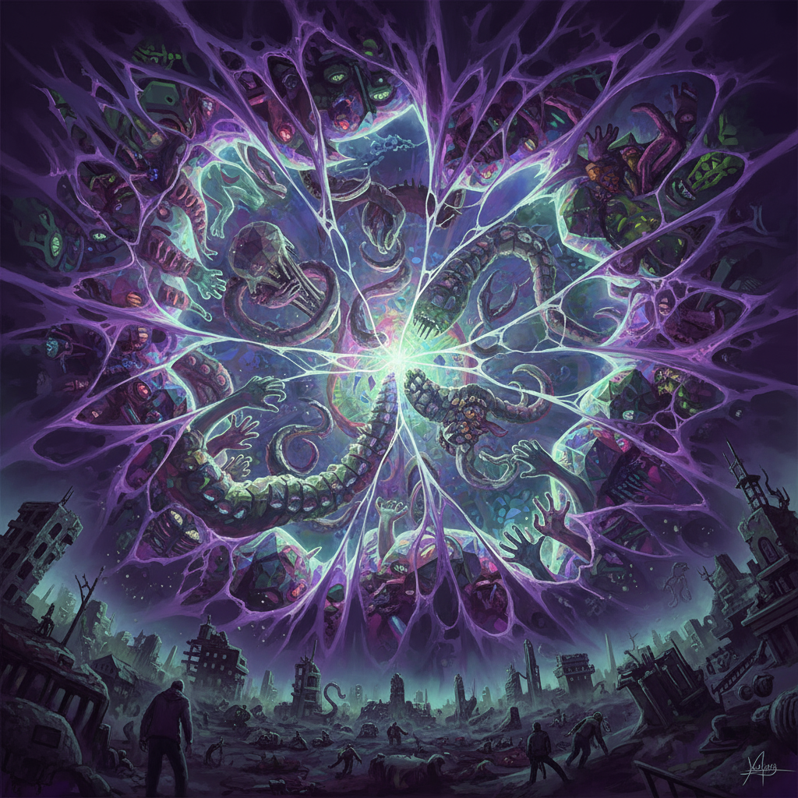

**Der verhängnisvolle Tag**
Alle acht Ur-Untote versammelten sich in Persephone. Tief unter der Erde, bei den Maschinen. Dies war das große Experiment - der Höhepunkt von Jahrhunderten Arbeit. Die Maschinen liefen an. Die Berechnungen waren perfekt. Die Energie begann zu fließen.

Dann riss die Realität.

Ein Geräusch erfüllte plötzlich Persephone - aber es war mehr als ein Geräusch. Es war ein **akustisches Phänomen**, das direkt ins Bewusstsein eindrang.

**Für sechs der acht Ur-Untoten:**
- Überwältigender, schmerzhafter Krawall
- Als würden tausend Stimmen gleichzeitig schreien
- Kratzen von Metall auf Metall, zerbrechendes Glas
- Unerträglich, wahnsinnig machend

**Für zwei der acht Ur-Untoten:**
- Wunderbare, etherische Klänge
- Harmonische Muster im scheinbaren Chaos
- Schichten von Melodien, die sich ineinander verweben
- Faszinierend, schön, unwiderstehlich

**Die 14 Helfer:**
- Die meisten flohen mit den Ur-Untoten
- Einige blieben zurück (Panik, Verwirrung, oder hörten die Melodie?)
- Ein Dunkelelf-Assistent blieb freiwillig - er hörte die schönste Musik seines Lebens

Lord Noribus (Dimensionsphysiker) und Lady Mirina (Mathematikerin) hörten die **Melodie**. Sie konnten nicht gehen. Wollten nicht gehen.

Die anderen sechs hörten **Krawall**. Sie flohen in Panik. Über den oberirdischen Weg rasten die sechs nach Proserpina. Keine Zeit für geordneten Rückzug. Keine Zeit, Equipment zu sichern.

**Sie hatten einen Riss in die Finsterwelt geöffnet.**

#### 7.2.1.3 Unmittelbare Folgen
**Flüchtlinge**
Auch in Proserpina waren die sechs geflohenen Ur-Untoten nicht sicher. Proserpina lag im "Dröhn-Radius". Schwächer, aber selbst für Untote ohne Schutz auf Dauer unerträglich. Sie flüchteten weiter, gemeinsam mit einigen der Helfer. Nach einem Drei-Tages-Marsch hatten sie sich zur Wildland-Division der Umbras durchgeschlagen, weit jenseits des Dröhnens, in Sicherheit.

**Die Zurückgebliebenen**
Lord Noribus und Lady Mirina blieben in Persephone. Lauschten der Melodie. Tag für Tag. Jahr für Jahr.
Der Dunkelelf-Assistent, ein ehemaliger Metallurgie-Spezialist, hörte ebenfalls die Melodie. Er stand da, mitten im Chaos, und lächelte. *"Hört ihr das? Hört ihr, wie schön es ist?"*

**Veränderungen**
In den Wochen nach dem Unfall begannen subtile Veränderungen. Chaos-Energie, die aus den Finsterwelt-Rissen blutete, hielt die Maschinen und die Beleuchtung von Persephone in Gang. In dieser Hinsicht war das Experiment also ein voller Erfolg gewesen. Aber auch die Realität veränderte sich: Schatten fielen in unmöglichen Winkel. Teile des Komplexes flackerten zwischen "da" und "nicht ganz da" Tiere mieden zunächst das Gebiet. Doch einige kehrten zurück - angelockt oder verwirrt. Mit ihnen begannen die ersten Mutationen. Die Realität der Finsterwelt mischte sich mit unserer.

#### 7.2.1.4 Rückkehr nach Persephone
In den nächsten Jahren taten die sechs geflohenen Ur-Untoten das, was sie am besten konnten: **Forschen**. Dreißig Jahre lang arbeiteten sie in der Zitadelle an einem Weg, dem Dröhnen zu widerstehen, und Persephone betreten zu können. Sie durchforsteten alte Archive der Hochkultur und experimentierten mit **akustischer Technologie**. Während all der Zeit kehrten sie immer wieder nach Proserpina zurück, beobachteten, erprobten, führten Tests und Messungen durch. Gelegentlich begegneten ihnen Noribus und Mirina, die sich zunehmend veränderten. Auch der **Dunkelelf-Assistent** war noch dort. Und auch er veränderte sich, wurde zu... etwas anderem. Tiere mutierten, wurden zu Chaos-Bestien. Von Mal zu Mal wuchs ihre Zahl. Nach dreißig Jahren gelang schließlich der **Durchbruch**: Ein Artefakt zur Neutralisierung des Chaos-Dröhnens. 

**Sondierung der Lage**
Mit den neu entwickelten Schutz-Artefakten kehrten alle sechs zurück. Nicht für einen kurzen Test diesmal, sondern permanent. **Aber:** Proserpina war unbewohnbar - selbst mit Artefakt zu gefährlich für dauerhaften Aufenthalt. Der Chaos-Einfluss hatte sich ausgebreitet. Daher wurde ein neues Camp in 10 km Entfernung von Persephone errichtet, außerhalb des Dröhn-Radius. Der Aufbau des Camps Demeter ging einher mit ersten Erkundungsmissionen.

Nachdem sie ihre Position nach einigen Monaten ausreichend gesichert hatte, begannen sie mit gezielten Vorstößen Richtung Proserpina und Persephone. Ihr Ziel war es, den Komplex zurückerobern und den Riss schließen. Aber was sie vorfanden, war schlimmer als erwartet: Chaos-Bestien durchstreiften die Korridore. Der ehemalige Dunkelelf-Assistent - nun der **Avatar des Verfalls** - hatte begonnen, sie zu organisieren. 

Bis zum Ende des zweiten Jahres gelang es ihnen im Schutz der Artefakte lediglich, bis zum inneren Perimenter von Persephone vorzudringen. Allerdings zwangen sie Bestien-Angriffe immer wieder zum Rückzug.Und ihre zwei Kollegen - die Ur-Mutanten? Eine erste direkte Konfrontation mit ihnen überlebten sie, durch beherzte Flucht, nur knapp. Lord Noribus und Lady Mirina waren nach fünfzig Jahren kaum noch erkennbar. Flackernde Existenz zwischen Dimensionen. Unmögliche Geometrie ihrer Formen. Stimmen wie Harmonien statt Sprache. Sie griffen die Sechs sofort und ohne Gnade an - sahen sie als "Dissonanz" in der Melodie. 

Nachdem sie die Verhaltensmuster von Avatar, Ur-Mutanten und Bestien studiert hatten, und Theorien zur Harmonik der Melodie eine grobe Vorhersage von Begegnungen mit diesen erlaubte, gelang es, im fünften Jahr bis in die tiefen Labore und zum Riss vorzudringen. Jegliche Experimente, den Riss zu schließen, scheiterten allerdings. 

#### 7.2.1.5 Eine verzweifelte Expedition
Nach einer Reihe erfolglose Versuche fassten zwei der sechs einen radikalen Plan: *"Um den Riss zu schließen, müssen wir verstehen, was auf der anderen Seite ist."*
**Lord Kareth** (Xenobiologe) und **Lady Ona** (Strukturalistin) wollten durch den Riss gehen. Die anderen waren entschieden dagegen. Trotzdem gingen die zwei. Ausgerüstet mit zwei Artefakten und Aufzeichnungsgeräten. Zuversichtlich. 

Die vier Verbliebenen warteten. **Tage. Wochen. Monate. Jahre.** Keine Rückkehr. Kein Signal. **Status** nach 10 Jahren: Unbekannt.

#### 7.2.1.6 Die aktuelle Situation
50 Jahre nach dem Unfall suchen die vier Ur-Untoten weiter nach Möglichkeiten, die Katastrophe einzudämmen. 

**Was sie erreicht haben:**
- Überleben (mit Artefakt-Hilfe)
- Umfassendes Verständnis der Chaos-Energie (theoretisch)
- Vollständige Dokumentation der Katastrophe
- Mehrere funktionierende Anti-Dröhn-Artefakte (3-4 Stück existieren)

**Was sie NICHT erreicht haben:**
- Den Riss schließen
- Ihre Kollegen retten
- Den Avatar stoppen
- Die Bestien-Produktion beenden
- Irgendwelche praktischen Lösungen zur Eindämmung

Das Camp muss alle 2-3 Jahre weiter nach außen verlegt werden. Die Chaos-Zone breitet sich aus. Langsam, aber stetig. Dies betrifft auch die Wildland-Division der Umbras, die ihre Operationsbasis ebenfalls entlang der Grenze zu den Ruports dynamisch von Persephone weg verlegt. Sie ist zudem betroffen von der wachsenden Bestien-Population und den daraus resultierenden Angriffen.

**Die Kooperation mit Ingin:** Lord Ingin hat ein eigenes Camp in den wilden Landen. Er sucht das Genesis-Artefakt und hilft den Vier bei der Beschaffung seltener Materialien.
Im Gegenzug produzierten die Vier ein Schutz-Artefakt für ihn - essentiell für seine Expeditionen in gefährliche Gebiete.

### 7.2.2 Die Schrecken von Persephone

#### 7.2.2.1 Die Kinder der Melodie
Das Chaos-Dröhnen ist universell. Jeder, der in die Einflusszonen kommt, hört es. Aber **was** man hört... das hängt davon ab, wer man ist.

Für die meisten (über 99%): **Krawall.** Überwältigender, schmerzhafter, wahnsinn-induzierender Lärm. Als würden tausend Stimmen gleichzeitig schreien, während Metall auf Metall kratzt und Glas zerbricht. Die natürliche Reaktion: **Flucht.** Raus. So schnell wie möglich. Wer bleibt, wird wahnsinnig. Wer zu lange bleibt, mutiert.

Für die Kinder der Melodie (unter 1%): **Symphonie.** Wunderbare, etherische Klänge. Harmonische Muster im scheinbaren Chaos. Schichten von Melodien, die sich ineinander verweben. Es ist **schön**. Nicht schmerzhaft. Faszinierend. Die natürliche Reaktion: **Bleiben.** Lauschen. Näher kommen.

Was macht jemanden oder etwas zum Kind der Melodie? Niemand weiß es genau. Vielleicht neuronale Muster. Es gibt allerdings keine äußeren Zeichen. Keine Möglichkeit, es vorherzusagen. **Du weißt es erst, wenn du das Dröhnen hörst.** Und dann ist es oft schon zu spät zum Gehen. Weil warum solltest du gehen, wenn die Musik so schön ist?

Die Transformation: Kinder der Melodie, die bleiben, verändern sich. Aber anders als die, die dem Krawall ausgesetzt waren.

**Normale Chaos-Mutation (vom Krawall):**
- Wild, unkontrolliert
- Verlust von Identität und Verstand
- Reine Bestien

**Melodie-Mutation:**
- Kontrollierter, strukturierter
- Behält eine Art Bewusstsein
- Kann die Chaos-Energie *nutzen*
- Versteht die Finsterwelt auf intuitivem Level

Sie werden nicht zu willenlosen Monstern. Sie werden zu etwas **Neuem.**

#### 7.2.2.2 Der Avatar des Verfalls
Der Avatar des Verfalls war ein Umbra. Er war der persönliche Forschungsassistent eines der acht Ur-Untoten. Ein Spezialist für Metallurgie und Mineralogie. Er baute Versuchsaufbauten, wartete Geräte, führte Messungen durch. Einer der 14 - ein Zahnrad in der Maschine.

Der Unfall veränderte alles: Als der Riss aufriss und das Dröhnen begann, flohen die meisten. Er nicht. Er stand da, mitten im Chaos, und **hörte**. Während andere vor Schmerz schrien, lächelte er. *"Hört ihr das? Hört ihr, wie schön es ist?"* Niemand verstand. Sie versuchten, ihn wegzuziehen. Er wehrte sich. Irgendwann ließen sie ihn. 

Er blieb in Persephone. In der Nähe des Risses. Lauschte der Melodie. Tag für Tag. Jahr für Jahr. Jahrzehnt für Jahrzehnt. Er veränderte sich.

**Körperliche Veränderungen:**
- Seine dunkle Elfenhaut wurde grau, dann farblos
- Seine Augen verloren ihre Farbe - jetzt wie poliertes Silber
- Teile von ihm flackern zwischen Dimensionen
- Wenn er sich bewegt, hinterlässt er **Echo-Schatten** - Nachbilder seiner selbst
- Manchmal ist er an zwei Orten gleichzeitig

**Mentale Transformation:**
- Vergaß seinen Namen, seine Vergangenheit, sein Volk
- Familienbande, Loyalitäten, Ängste - alles irrelevant
- Er IST die Melodie jetzt
- Denkt nicht mehr in linearen Mustern
- Zeit ist für ihn... flexibel

Und er wuchs: Nach 50 Jahren ist er mehr als nur ein Zuhörer. Er ist der **Dirigent der Symphonie.**

**Was er kann:**
- Die Melodie beeinflussen, modulieren, lenken
- Chaos-Energie durch seinen Willen formen
- Realität in seiner Nähe verzerren
- Durch die Grenzen zwischen Welten gleiten
- **Die Bestien kontrollieren**

Alle Chaos-Bestien hören die Melodie. Aber wenn der Avatar die Melodie **verändert**, folgen sie seinen Veränderungen. Sie hören seine Anweisungen wie musikalische Phrasen. Sie gehorchen dem Dirigenten.

Der Avatar will nicht erobern. Nicht zerstören. Nicht herrschen. Seine Ziele sind fremder. **Er will transformieren.** Die "normale" Welt - mit ihrer starren Zeit, ihrer linearen Kausalität, ihrer begrenzten Existenz - erscheint ihm jetzt... **minderwertig**. Primitiv. Eingeschränkt. **Falsch**. Die Finsterwelt ist besser. Freier. Schöner. Warum sollte nicht alles so sein?

Der Avatar ist nicht allein in seinem Denken. Durch den Riss hindurch, in der Finsterwelt selbst, gibt es... **Entitäten**. **Sie sind nicht-linear.** Nicht-kausal. Jenseits der Logik der normalen Welt. **Sie haben den Riss bemerkt.** Durch ihn hindurch können sie eine... andere Art von Existenz wahrnehmen. Eine Dimension, in der Dinge nur in eine Richtung fließen. In der Ursache vor Wirkung kommt. Sie verstehen es nicht.

**Es erscheint ihnen primitiv. Begrenzt. Minderwertig.**

*"Warum,"* flüstern sie durch das Lied, *"existieren diese Wesen in nur drei Dimensionen und einer Zeitrichtung? Wie*... *traurig*."

Die Entitäten können nicht selbst durch den Riss. Sie sind zu... groß? Zu anders? Die Dimensionen passen nicht. Aber der Avatar kann zwischen beiden Welten vermitteln. Er ist das **Interface**. Die Brücke. Der Prophet ihrer Sache. **Seine Mission:**

1. **Verstehen:** Lerne die lineare Welt zu navigieren
2. **Erweitern:** Erschaffe neue Risse, mehr Verbindungspunkte
3. **Transformieren:** Verbreite den Einfluss der Finsterwelt
4. **Befreien:** Hilf dieser minderwertigen Realität, etwas Besseres zu werden

**Das Endziel:** Die Trennung zwischen den Welten aufheben.

Mithilfe der Entitäten und der Chaosenergie erschafft er neue, kleinere Risse, neue Stellen, an der die Finsterwelt in unsere Realität dringen kann. Eine solche "Geburt" ist anstrengend. Einen neuen Riss kann er alle paar Monate erzeugen, muss sich danach erschöpft zurückziehen und regenerieren.

Der Avatar glaubt, er tut etwas **Gutes**. Aus Sicht der Finsterwelt-Entitäten: Er ist ein Missionar, der primitiven Wesen hilft. Aus Sicht der normalen Welt: Er ist der **Vorbote der Apokalypse**. 

**Er ist nicht böse. Er ist anders.** Und das macht ihn unendlich gefährlicher.

#### 7.2.2.3 Die Bestienfabrik
Persephone produziert keine Bestien. Nicht direkt. Es ist viel... organischer:

1. **Tiere wandern in die Einflusszonen** - völlig normal, natürliches Verhalten
2. **Kurze Exposition:** Verwirrung, Panik - aber sie entkommen noch
3. **Kinder der Melodie kehren zurück** - angelockt vom "schönen" Klang
4. **Längere Exposition:** Mutation beginnt
5. **Transformation:** Aus einem Wolf wird eine Chaos-Bestie
6. **Die Bestie wandert zurück** - aber nicht mehr als Wolf

**Das eigentliche Problem:** Die mutierten Bestien verlassen die Chaos-Zonen wieder. Sie wandern zurück in bewohnte Gebiete. Sie jagen. Sie greifen an. **Jede Bestie ist ein wandelndes Stück Finsterwelt.**

**Gemeinsame Merkmale:**
- **Farblosigkeit:** Grau, Schwarz, Weiß - als wären sie aus einer monochromen Welt
- **Unmögliche Anatomie:** Zu viele Gelenke. Beine, die in die falsche Richtung biegen. Augen an falschen Stellen
- **Flackernde Existenz:** Manchmal sind Teile von ihnen... nicht ganz da
- **Stille:** Sie machen keine natürlichen Tiergeräusche. Stattdessen: Statisches Rauschen, Echo-Laute

**Beispiele:**

**Chaos-Wolf:**
- Graufell, das zu flüssig aussieht
- Sechs Beine statt vier, die sich beim Laufen neu anordnen
- Kiefer, der sich zu weit öffnet - unmöglich weit
- Hinterlässt Spuren, die verschwinden, sobald man wegschaut

**Chaos-Bär:**
- Massiv, aber die Proportionen stimmen nicht
- Klauen, die zwischen fest und gasförmig wechseln
- Brüllt, aber das Geräusch kommt verzögert an
- Fell, das aussieht wie bewegte Schatten

**Die Eskalation**
- Vor 50 Jahren: Keine Bestien. Nur der Unfall.
- Vor 40 Jahren: Erste vereinzelte Sichtungen in den wilden Landen.
- Vor 30 Jahren: Häufigere Begegnungen. Jäger berichten von "Monstern".
- Vor 20 Jahren: Erste Angriffe auf bewohnte Gebiete.
- Heute: Regelmäßige Sichtungen. Chaos-Bestien sind eine anerkannte Gefahr.

**Die mathematische Wahrheit:**
Jeden Tag wandern Tiere in die Chaos-Zonen. Nicht alle mutieren. Nicht alle überleben. Aber einige... einige werden zu Bestien. Und die Population wächst. Langsam. Stetig. Unaufhaltsam.

**Lebensspanne variiert stark:**
Die Mutation verzehrt langsam den Körper:
- Schwach mutierte Tiere: 10-20 Jahre
- Stark mutierte Bestien: 5-10 Jahre
- Avatar/Lich-Kings (Melodie-Kinder mit höherem Bewusstsein): 50-100 Jahre

**Plus weitere Faktoren:**
- Territoriale Kämpfe untereinander
- Natürliche Feinde
- Avatar "aussortiert" schwache Bestien
- Jäger und Krieger der verschiedenen Völker

**Das hält die Balance** - aber die Produktion neuer Bestien überwiegt langsam den Verlust.

#### 7.2.2.4 Die Ur-Mutanten
Nach 50 Jahren Melodie-Exposition sind Lord Noribus und Lady Mirina kaum noch erkennbar.

**Was sie waren:**

**Lord Noribus - Dimensionsphysiker:**
- Spezialisiert auf Quantenmechanik und Multiversums-Theorie
- Berechnete die mathematischen Grundlagen für den Riss
- Akkurat, präzise, brillant

**Lady Mirina - Realitäts-Mathematikerin:**
- Expertin für die Struktur der Raumzeit
- Entwickelte Modelle für dimensionale Überlagerungen
- Kreativ, unkonventionell, genial

**Was sie wurden:**

**Lord Noribus - Der Flackernde:**
- Sein Körper existiert in mehreren Zuständen gleichzeitig
- Manchmal fest, manchmal durchscheinend, manchmal Echo
- Seine "Stimme" ist eine Harmonie aus unmöglichen Tönen
- Kann Realität in seiner Nähe destabilisieren
- Spricht nur noch in musikalischen Metaphern

**Lady Mirina - Die Geometrie-Brecherin:**
- Ihre Form folgt keiner euklidischen Logik mehr
- Bewegt sich durch Raum, der nicht existieren sollte
- Hinterlässt Spuren verdrehter Realität
- Kann die physikalischen Gesetze lokal aufheben
- Kommuniziert durch Verzerrungen in der Wahrnehmung

Sie dienen dem Avatar. Nicht aus Zwang, sondern aus... Harmonie. Sie hören dieselbe Melodie. Verstehen dieselben Muster. Für sie ist der Avatar kein Meister, sondern ein **Dirigent** - und sie sind Instrumente in seiner Symphonie.

Wenn die vier forschenden Ur-Untoten zu nah kommen, greifen die Ur-Mutanten an. Nicht aus Hass. Nicht aus Verteidigung. Sondern weil die Vier eine **Dissonanz** in der Melodie sind. Sie müssen entfernt werden. Wie falsche Noten aus einem Musikstück.

Manchmal erkennen die Vier noch Spuren ihrer alten Kollegen. Eine Geste, die an Noribus erinnert. Ein Muster in Mirina' Bewegungen, das ihre alte Eleganz zeigt. *"Das ist Lord Noribus. Oh nein, was ist aus ihm geworden..."* Und dann kommt der Angriff. Und die Vier müssen wieder fliehen. Vor dem, was ihre Freunde einmal waren.

### 7.2.3 Die Situation heute
Für die Völker spitzt sich der Konflikt in den "Wilden Landen" immer weiter zu. Während der letzten Jahre haben sich ihre Aktionen mehr und mehr von offensiven Vorstößen auf bloße Verteidigung verlagert. Angesichts der Zahl an Chaos-Kreaturen wird es zunehmend schwieriger, die Stellungen zu halten. 

**GM-Hint:** Die Zeit arbeitet gegen die Völker von Arx Lumina. Und das sollte den Spielern bewusst sein.

#### 7.2.3.1 Proserpina heute
**Die verlassene Station**
- **Lage:** 2 km von Persephone - Kernzone der Melodie/des Dröhnens
- **Zustand:** Verlassen seit 50 Jahren, zunehmend verfallen, aber Struktur größtenteils intakt

**Hauptgebäude:**
- Zentrale Forschungsstation (3 Stockwerke)
- Wohntrakte für Personal
- Versorgungseinheiten (Generatoren, Wasseraufbereitung - funktionieren teilweise noch)
- Kleines Arsenal/Verteidigungssysteme (inaktiv)

**Verbindung zu Persephone:** Oberirdischer Weg, ca. 2 km, führt direkt zum Eingang des unterirdischen Komplexes

**Was noch da ist:**

**Ausrüstung:**
- Hochkultur-Messgeräte (teilweise funktionsfähig)
- Persönliche Gegenstände der Forscher
- Werkzeuge und Ersatzteile
- Möglicherweise: Ein defektes/schwaches Anti-Dröhn-Artefakt (Prototyp)

**Aufzeichnungen:**
- Forschungstagebücher (vor dem Unfall)
- Experimentprotokolle
- Karten von Persephone
- Erste Beobachtungen des Risses

**Vorräte:**
- Konservierte Nahrung (50 Jahre alt, aber Hochkultur-Konservierung)
- Medizinische Ausrüstung
- Energiezellen (einige noch geladen)

**Gefahren:**

**Das Dröhnen:**
- Konstant, überwältigend
- Ohne Artefakt: Maximal 30 Minuten bevor Mutation beginnt
- Auch mit Artefakt: Sehr belastend, Zeitlimit beachten

**Bestien:**
- Proserpina ist beliebter 'Unterschlupf' für Chaos-Bestien
- Schutz vor Witterung, viele Räume zum Verstecken
- 3-7 Bestien durchschnittlich anwesend (variiert)
- Manche ehemalige Helfer - kennen das Gelände

**Avatar-Kontrolle:**
- Avatar nutzt Proserpina gelegentlich als Außenposten
- Kann Bestien hierher dirigieren
- Mögliche Begegnung mit dem Avatar selbst (25% Chance)

**Umwelt:**
- Teile der Station strukturell instabil
- Chaos-Energie verzerrt Realität hier stärker
- Geräte können unvorhersehbar reagieren

**Gründe hinzugehen:**
- Aufzeichnungen über das Experiment (könnten Hinweise zum Schließen des Risses enthalten)
- Hochkultur-Ausrüstung (wertvoll oder für Quests benötigt)
- Karten von Persephone (wenn sie weiter vordringen wollen)
- Prototyp-Artefakt (schwach, aber besser als nichts)

**Empfohlene Vorbereitung:**
- Anti-Dröhn-Artefakt ZWINGEND erforderlich
- Zeitlimit setzen: Maximal 45-60 Minuten Aufenthalt
- Kampfbereitschaft gegen 3-7 Bestien
- Exit-Strategie planen (schneller Rückzug)

**Mögliche Belohnungen:**
- Wissenschaftliche Erkenntnisse (Questfortschritt)
- Hochkultur-Komponenten (für Artefakt-Herstellung)
- Tagebuch eines Forschers (persönliche Geschichte, emotionale Tiefe)
- Schwaches Artefakt (Prototyp, 15m Radius, 20 Minuten Wirkung)

#### 7.2.3.2 Persephone heute
**Der unterirdische Komplex:**
- **Zugang:** Von Proserpina aus, 2 km oberirdischer Weg zum Haupteingang
- **Zustand:** Voll funktionsfähig - angetrieben von Chaos-Energie aus dem Riss

**Die Ebenen:**

**Ebene 1:** Eingangshalle, Kontrollräume
- Lich-King Patrouille
- Automatische Verteidigungssysteme (noch teilweise aktiv)
- "Tote Sterne im Boden" - leuchtende Hochkultur-Beleuchtung

**Ebene 2:** Forschungslabore, Wohnquartiere
- Avatar-Territorium
- Realität flackert zwischen Dimensionen
- Ehemalige Wohnräume der Forscher

**Ebene 3:** Maschinenhallen, Hochpräzisions-Ausrüstung
- Bestien-Nester
- Die Maschinen, die den Riss erschufen
- Röntgenweitwinkel- und Röntgenkleinwinkelstreukammer

**Ebene 4:** Der Riss - Herzkammer des Komplexes
- Direkte Exposition zur Finsterwelt
- Stärkste Melodie/Dröhnen
- Portal zwischen den Welten

**Gefahren:**

- Dröhnen/Melodie am stärksten
- Lich-Kings Noribus und Mirina patrouillieren
- Avatar nutzt es als Basis
- Direkte Exposition zum Riss (Ebene 4)
- Realität flackert zwischen Dimensionen

**Spieler-Zugang:** Extrem schwierig, nur mit mehreren Artefakten und Vier-Untoten-Unterstützung auch nur ansatzweise machbar

### 7.2.4 Mögliche Questhooks

#### 7.2.4.1 Aufträge von den vier forschenden Ur-Untoten
**1. Kleinere Risse schließen:**
Der Avatar hat begonnen, kleinere Risse in den wilden Landen zu öffnen. Die Vier brauchen Hilfe, diese zu untersuchen und möglicherweise zu schließen.

**2. Materialbeschaffung:**
Hochkultur-Kristalle für die Anti-Dröhn-Artefakte werden knapp. Expeditionen zu gefährlichen Hochkultur-Ruinen sind notwendig.

**3. Proserpina-Bergung:**
Wichtige Aufzeichnungen oder Ausrüstung in Proserpina müssen geborgen werden, bevor sie verloren gehen.

**4. Bestien-Jagd:**
Besonders gefährliche oder intelligente Chaos-Bestien müssen eliminiert werden, bevor sie Siedlungen erreichen.

**5. Vordringen nach Persephone:**
Mit Unterstützung der Vier einen Versuch wagen, tiefer in den Komplex vorzudringen.

**6. Kommunikation mit dem Avatar:**
Versuchen, mit dem Avatar zu verhandeln oder ihn zu verstehen.

**7. Durch den Riss gehen:**
Die verzweifeltste Option - in die Finsterwelt eintreten, um Antworten zu finden.

#### 7.2.4.2 Aufträge von Lord Ingin
**1. Genesis-Artefakt-Suche:**
Hilfe bei der systematischen Erkundung der wilden Lande nach Arons verstecktem Labor.

**2 Material-Tausch:**
Beschaffung seltener Materialien für die Vier gegen Zugang zu Hochkultur-Wissen oder Artefakten.

## 7.3 Die Suche nach dem Genesis-Artefakt
**GM-Hints**: *Übergeordnete Aspekte*
- ***Die Erkundung der Ruinen***: *Welche Artefakte lassen sich dort finden (bspw.: Die "Genesis-Kammer" von Lord Aron)? Welche Hinweise auf ihre Erbauer?* 
- ***Das Geheimnis der Hochkultur***: *Abgesehen von den Ur-Untoten hat niemand eine auch nur oberflächliche Ahnung von der "Geschichte von Arx Lumina" (siehe entsprechendes Kapitel). Was ist in den letzten 1200 Jahren geschehen? Warum ist die Welt wie sie ist?*
*(Ausführliche Hinweise zu diesen Settings finden sich im Abschnitt "Gamemasters Section: Plots and Questhooks")*

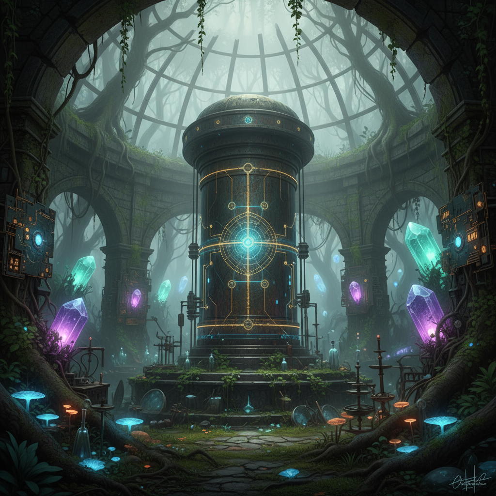

**GM-Hints**: *Das Genesis-Artefakt ist eine wenig bekannte Legende von einer Heils-Maschine. Ihr werden die unterschiedlichsten Fähigkeiten angedichtet - je nachdem, wer die Legende flüstert. Die tatsächliche Geschichte um das Genesis-Artefakt ist auf tragische Weise verschollen. Nur eine handvoll Ur-Untote kennen Teile der Geschichte. Umso spannender, daraus eine eigenständige Kampagne zu bauen. Vielleicht hören die Spieler eine geflüsterte Legende oder werden womöglich von Mittelsmännern von Lord Ingin angeheuert. Der Erbauer des Genesis-Artefakts, Lord Aron, hatte sein Camp in den "Wilden Landen" innerhalb einer Hochkultur-Ruine errichtet. Die Wahrscheinlichkeit, über genau diese zu "stolpern" ist relativ gering (5%). Die Wahrscheinlichkeit, dort Arons Labor zu finden, noch geringer. Aber wer weiß: ZUfälle gibt es immer wieder.*

### 7.3.1 Vorgeschichte
Lord Aron war theoretischer Physiker, der sich auf Quantenmechanik und "Realitäts-Mathematik" spezialisiert hatte. Er war maßgeblich an der Erschaffung der Umbras beteiligt gewesen, hatte sich dann aber aus moralischen Gründen von weiteren genetischen Experimenten zurückgezogen. Seit dem siebten Jahrhundert widmete er seine Kraft der Erforschung von Möglichkeiten, die die **Welt verbessern** sollten.

#### 7.3.1.1 Arons Forschung
In den nächsten zwei Jahrhunderten arbeitete Aron wie besessen an einer Methode, Organismen zwischen verschiedenen Zustandsebenen und Evolutionslinien zu verschieben. Seine theoretischen Arbeiten führte er überwiegend in der Zitadelle aus, wozu er sich dort ein Labor einrichtete. Den Ur-Untoten Kollegen galt er als sonderlich. Ein Umstand, der später der Akzeptanz seiner Theorien nicht unbedingt zuträglich war.

**Die Grundtheorie:** Aron entwickelte eine komplexe mathematische Gleichung, die es theoretisch ermöglichen sollte, Lebewesen zwischen verschiedenen Realitäts-Zuständen zu transformieren.
**Das Konzept:** Lebewesen können in alternative Versionen ihrer selbst transformiert werden - wie sie in anderen Realitäten oder unter anderen Umständen geworden wären.
**Praktisches Beispiel:** Ein durch die Katastrophe mutierter, aggressiver Wildhund könnte in seine domestizierte Form transformiert werden - wie er sich in einer Welt ohne das 'Große Vergessen' und Katastrophe entwickelt hätte.
**Das ultimative Ziel:** Die Transformation untot-lebender Organismen zurück in echte Lebensformen.

#### 7.3.1.2 Die Ablehnung durch die anderen Ur-Untoten
Die Präsentation seiner Theorie in der Zitadelle im Jahr 843 wurde zu einem denkwürdigen fachlichen Fiasko. Die anderen Ur-Untoten waren Biologen, Chemiker, Ingenieure - Arons theoretische Physik war für sie nicht nachvollziehbar. Allerdings waren sie alle Wissenschaftler und hatten daher per definitionem eine fundierte Meinung zu allem. Insbesondere nach dem **Verlust von Persephone** 12 Jahre zuvor war ihre fundierte Meinung, keinen Firlefanz zu erforschen. 
Als Aron schließlich den Energiebedarf vorstellte, der für eine **globale Transformation** erforderlich wäre, und sich auf die Fusionsenergie von **36 Sonnenmassen** belief, stiegen praktisch alle aus der Diskussion aus. Das schien völlig unrealisierbar. Spot und Gelächter begleiteten Aron aus dem Konferenzsaal.

#### 7.3.1.3 Arons "lokale Lösung"
Aron nahm die vernichtende Kritik der "Ur-Idioten" zunächst sportlich und arbeitete an einer Lösung, die er 864 der Zitadelle präsentierte. Hierbei skalierte er kleiner. Aron schlug vor, die Theorie zunächst lokal und begrenzt anzuwenden - eine **Transformations-Kammer** für einzelne Organismen. Die anderen Ur-Untoten werteten das als schwachen Versuch, seine gescheiterte Idee zu retten. Niemand wollte ihn dabei jetzt noch unterstützen. Daraufhin zog sich Aron mehr und mehr zurück, werkelte allein in seinem Labor und wurde zunehmend verbittert.

#### 7.3.1.4 Das letzte Gespräch und Arons Verschwinden
Im Jahr 868 verschwand Aron aus der Zitadelle. Am Vorabend seines Verschwindens suchte Aron seinen Kollegen Ingin auf. Arons Angebot: *"Komm doch mit mir? Ich gebe nicht auf. Diese Ur-Idioten werden schon sehen, was sie von ihrer Ignoranz haben."* 
Zu dieser Zeit war Ingin jedoch zu sehr mit seiner eigenen Schuld und Trauer über vergangene Ereignisse und Fehler beschäftigt. Er lehnte ab. Am nächsten Tag war Aron spurlos verschwunden - aus der Zitadelle, aus der bekannten Welt. Niemand wusste, wohin er gegangen war. 

#### 7.3.1.5 Die Konstruktion in den Wilden Landen
Aron zog sich tief in die gefährlichen "Wilden Lande" zurück - weit genug weg von der Zitadelle und von Persephone, dass ihn niemand stören konnte. 

**Das Energie-Problem**
Er fing denkbar bescheiden an, lagerte innerhalb einer Ruine der Hochkultur, was ihm ausreichend Material für seine Arbeit bot. Mit **Energiekristallen**, die er aus der Zitadelle gestohlen hatte, baute er eine Energiematrix. Im Laufe mehrerer Jahrzehnte entwickelte er ein Verfahren, diese mit dimensionale Energie aus **Raum-Zeit-Verzerrungen** zu laden. Somit konnten sich die Kristalle über die Zeit aus Umgebungsenergie regenerieren. Das ermöglichte es Aron, genug Energie für seine Transformationskammer zu sammeln. 

**Die Genesis-Kammer**
Bis zur Jahrtausendwende baute Aron an der Genesis-Kammer. Dabei handelte es sich um eine personengroße Transformations-Kammer, die einen Organismus zwischen Realitätszuständen verschieben kann:
- Der Organismus wird in eine Energiematrix eingehüllt
- Die mathematische Gleichung berechnet die Ziel-Realität  
- Die Transformation verschiebt den Organismus in seinen alternativen Zustand

**Die Experimentierphase**
Aron begann mit Wildtieren - verwandelte mutierte, aggressive Kreaturen in ihre hypothetischen domestizierten Formen. Nach Jahren der Optimierung und Feinabstimmung gelang es ihm tatsächlich, die Transformation **funktionsfähig** zu machen. Er studierte die transformierten Tiere über Jahre, um die Stabilität der Veränderung zu bestätigen.

**Der Selbstversuch**
Etwa um 1050 hatte Aron die Wirksamkeit seiner Konstruktion an Tieren wissenschaftlich fundiert nachgewiesen. Doch er war sich sicher, dass dies den "Ur-Idioten" nicht genügen würde. Aron wollte nicht als gescheiterter Wissenschaftler zurückkehren. Er plante einen **triumphalen Auftritt** vor den anderen Ur-Untoten. Er würde sich selbst transformieren - von einem Untoten zurück in einen Lebenden - und damit seinen Durchbruch unbestreitbar beweisen. ach Jahrhunderten der Zurückweisung wollte er seinen großen Moment des "Ich habe es euch doch gesagt!"

Das fatale Problem: Die Genesis-Kammer funktionierte perfekt bei lebenden Organismen - aber Untote waren bereits zu weit von ihrer ursprünglichen Form entfernt. Als Aron den Selbstversuch wagte, löste die Transformation ihn nicht in einen Lebenden auf, sondern komplett in **Asche**. Lord Aron, einer der brillantesten Ur-Untoten, wurde zu einem Häufchen Staub - ohne Zeuge, ohne Beweis seines Erfolgs.

#### 7.3.1.6 Was von Aron übrig blieb
Aron suchte bewusst einen **abgelegenen, unzugänglichen Ort** für seine Arbeit. Er hatte sein Camp innerhalb einer Hochkultur-Ruine, tiefen "Wilden Landen", errichtet. Dies ermöglichte ihm schnellen Zugang zu Materialien. Sein größtes Werk, die **Genesis-Kammer**, steht vermutlich noch irgendwo dort. Von Aron selbst ist nichts mehr vorhanden außer Asche. Schwerlich diese zu identifizieren. Neben der Kammer gibt es noch verlockende Gegenstände: Bspw. **Energiekristalle**, die noch funktionsfähig sein könnten. Unter Umständen gibt es dort auch Bereiche mit "unmöglicher" Flora und Fauna - Hinweise auf seine erfolgreichen Experimente. Eine kleine Gruppe Hauskatzen beispielsweise.

### 7.3.2 Lord Ingins Genesis-Suche
Bis zu Arons Verschwinden war Lord Ingin dessen engster Freund. Zweihundert Jahre später erklärte der Sprecher der Untoten ihn offiziell für tot. Etwa in der Zeit als Aron tatsächlich seinen schicksalhaften Selbstversuch unternahm. Die **Toterklärung** seines alten Kollegen und Freundes löste in Ingin Nostalgie und Schuldgefühle aus. *"Wieder einer, der nicht mehr da ist."*  

**Jahre des Studiums**
Aus einer Mischung von Reue und Sentimentalität begann Ingin, sich mit Arons Hinterlassenschaften in der Zitadelle zu beschäftigen - Tagebücher, Theorien, mathematische Beweise. Jahrzehnte lang studierte Lord Ingin die Theorien seines alten Freundes und versuchte sie nachzuvollziehen. Als Ingenieur brauchte er lange, um die theoretische Physik zu verstehen - aber schließlich erkannte er: *"Da könnte wirklich etwas dran sein."* 

**Der Entschluss zur Suche**
Ingin verließ die Gemeinschaft der Ur-Untoten und richtete sein eigenes **Lager in den "Wilden Landen"** ein, um nach Aron und dessen Schicksal zu suchen. Er wollte den alten Freund finden und ihm die Anerkennung geben, die er verdient hätte. Er wollte auch Arons Entdeckungen bergen, die die Lösung für alle Probleme der Untoten sein könnte.
- **Die Erlösung aller Untoten:** Transformation zurück in echte Lebende - nicht nur "Heilung" des Untod-Zustands, sondern komplette Wiederherstellung des Lebens.
- **Die Rettung der Welt:** Alle Völker könnten in ihre "idealen" Formen transformiert werden - Menschen, immun gegen das 'Großen Vergessen', Umbras ohne systematische Grausamkeit, Ruptors ohne chronische Schmerzen.

**GM-Hints:** *Ist Ingins Ziel nobel (alle retten) oder gefährlich (unkontrollierte Realitäts-Manipulation)? Wer weiß...*

### 7.3.3 Questhooks
Um die Suche nach dem Genesis-Artefakt oder Informationen über dessen und Arons Verbleib zu starten, ist ein Kontakt mit Lord Ingin erforderlich. Dieser kann die Spieler zunächst mit dem Beschaffen von Spuren in den "Wilden Landen" beauftragen, bspw. indem sie eine Ruine der Hochkultur untersuchen. Bis sie tatsächlich konkrete Hinweise über den Verbleib finden, sollte einige Zeit und einige Expeditionen vergehen. Lord Aron hat sich große Mühe gegeben, nicht vom ersten besten gefunden zu werden.

# 8. Schlusswort
Man sagt: Der Weg zur Hölle ist mit guten Vorsätzen gepflastert. In diesem Sinne bilden die Bestrebungen der Ur-Untoten keine Ausnahme. Zwar haben sie keine Hölle geformt, allerdings ist Arx Lumina ein dunkler Ort, den noch dunklere Mächte bedrohen. 

Eine Grim Dark Fantasy die verzweifelt nach Helden sucht. 

In der brillante Wissenschaftler beständig die Welt retten wollen. Und indem sie technisch gesehen stets erfolgreich waren, lösten sie praktisch gesehen eine Katastrophe nach der anderen aus. 

Und nun versuchen vier von ihnen seit fünfzig Jahren verzweifelt, ihren größten Erfolg rückgängig zu machen. Während zwei von ihnen zu Göttern einer fremden Realität wurden. Und einer zum Propheten einer unmöglichen Wahrheit.

**Das ist Persephone.**

**Das ist die Finsterwelt.**

**Das ist die größte Katastrophe seit dem Großen Vergessen.**

Und niemand außerhalb der vier verzweifelten Forscher versteht den wahren Umfang der Bedrohung.

Noch nicht.
